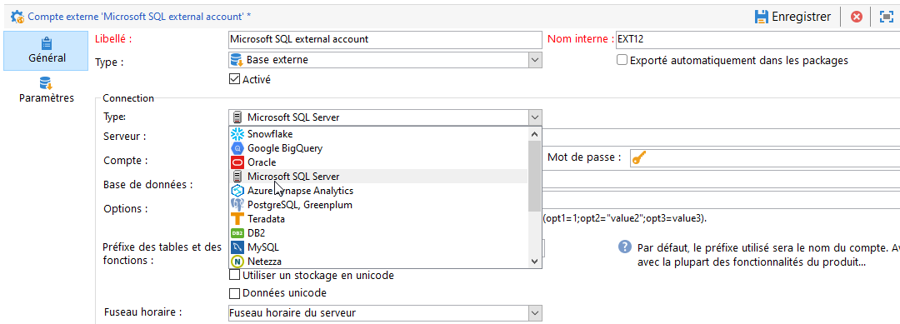

# Configurer l’accès à Microsoft SQL Server {#configure-fda-sql}


Utilisez l’option Campaign **Federated Data Access** (FDA) pour traiter les informations stockées dans une base de données Microsoft SQL Server externe. Suivez les étapes ci-dessous pour configurer l’accès à [!DNL Microsoft SQL Server].

1. Configurez [!DNL Microsoft SQL Server] sous [CentOS](#sql-centos).
1. Configurez [!DNL Microsoft SQL Server] sous [Linux](#sql-linux).
1. Configurez [!DNL Microsoft SQL Server] sous [Windows](#sql-windows).
1. Configuration du [compte externe](#sql-external) [!DNL Microsoft SQL Server] dans Campaign

## Microsoft SQL Server sous CentOS {#sql-centos}

>[!NOTE]
>
> [!DNL Microsoft SQL Server] est disponible sous CentOS 7 et 6.

Pour configurer [!DNL Microsoft SQL Server] sous CentOS, procédez comme suit :

1. Téléchargez et installez le pilote ODBC SQL avec la commande suivante :

   ```
   sudo su
   curl https://packages.microsoft.com/config/rhel/7/prod.repo > /etc/yum.repos.d/mssql-release.repo
   exit
   sudo yum remove unixODBC-utf16 unixODBC-utf16-devel #to avoid conflicts
   sudo ACCEPT_EULA=Y yum install msodbcsql
   ```

1. Dans Adobe Campaign, vous pouvez ensuite configurer votre compte externe [!DNL Microsoft SQL Server]. Pour plus d&#39;informations sur la configuration de votre compte externe, voir [cette section](#sql-external).

## Microsoft SQL Server sous Linux {#sql-linux}

>[!NOTE]
>
> Si vous exécutez une ancienne version d’Adobe Campaign (antérieure à la version 7.2.1), vous devez installer `unix ODBC drivers`.

1. Téléchargez le pilote ODBC MS à partir de [cette page](https://packages.microsoft.com/ubuntu/16.04/prod/pool/main/m/msodbcsql17/).

1. Exécutez la commande suivante en tant qu’utilisateur racine :

   ```
   # install the mssql odbc that was downloaded
   dpkg -i msodbcsql17_17.7.1.1-1_amd64.deb
   # accept the license terms
   ```

1. Dans Adobe Campaign, vous pouvez ensuite configurer votre compte externe [!DNL Microsoft SQL Server]. Pour plus d&#39;informations sur la configuration de votre compte externe, voir [cette section](#sql-external).

## Microsoft SQL Server sous Windows {#sql-windows}

Pour configurer [!DNL Microsoft SQL Server] sous Windows :

1. Sous Windows, cliquez sur **[!UICONTROL Panneau de configuration]** &#39;>&#39; **[!UICONTROL Système et sécurité]** &#39;>&#39; **[!UICONTROL Outils d’administration]**&#39;>&#39; **[!UICONTROL Sources de données ODBC (64 bits)]**.

1. Dans la nouvelle fenêtre **[!UICONTROL Sources de données ODBC (64 bits)]**, cliquez sur **[!UICONTROL Ajouter...]**

1. Vérifiez si SQL Server Native Client v11 est répertorié dans la fenêtre **[!UICONTROL Créer une source de données]**.

1. Si SQL Server Native Client n’est pas répertorié, vous pouvez le télécharger sur [cette page](https://www.microsoft.com/en-my/download/details.aspx?id=36434).

1. Dans Adobe Campaign, vous pouvez ensuite configurer votre compte externe [!DNL Microsoft SQL Server]. Pour plus d&#39;informations sur la configuration de votre compte externe, voir [cette section](#sql-external).

## Compte externe Microsoft SQL Server {#sql-external}

Vous devez créer un compte externe [!DNL Microsoft SQL Server] pour connecter votre instance Campaign à votre base de données [!DNL Microsoft SQL Server] externe.

1. Depuis l&#39;**[!UICONTROL Explorateur]** Campaign, cliquez sur **[!UICONTROL Administration]** &#39;>&#39; **[!UICONTROL Plateforme]** &#39;>&#39; **[!UICONTROL Comptes externes]**.

1. Cliquez sur **[!UICONTROL Nouveau]**.

1. Sélectionnez **[!UICONTROL Base de données externe]** en tant que **[!UICONTROL Type]** de compte externe.

1. Sous **[!UICONTROL Configuration]**, sélectionnez [!DNL Microsoft SQL Server] dans le menu déroulant **[!UICONTROL Type]**.

   

1. Configurez l’authentification de compte externe **[!UICONTROL Microsoft SQL Server]** :

   * **[!UICONTROL Serveur]** : URL du serveur [!DNL Microsoft SQL Server].

   * **[!UICONTROL Compte]** : nom de l’utilisateur.

   * **[!UICONTROL Mot de passe]** : mot de passe du compte d’utilisateur.

   * **[!UICONTROL Base de données]** : nom de la base de données (facultatif).

   * **[!UICONTROL Fuseau horaire]** : fuseau horaire défini dans [!DNL Microsoft SQL Server]. [En savoir plus](https://docs.microsoft.com/fr-fr/sql/t-sql/functions/current-timezone-transact-sql?view=sql-server-ver15)

1. Cliquez sur l’onglet **[!UICONTROL Paramètres]**, puis sur le bouton **[!UICONTROL Déployer les fonctions]** pour créer des fonctions.

   >[!NOTE]
   >
   >Pour que toutes les fonctions soient disponibles, vous devez créer les fonctions SQL Adobe Campaign dans la base de données distante. Pour plus d’informations, consultez cette [page](../../configuration/using/adding-additional-sql-functions.md).

1. Cliquez sur **[!UICONTROL Enregistrer]** lorsque la configuration est terminée.

Le connecteur prend en charge les options suivantes :

| Option | Description |
|---|---|
| Authentification | Type d’authentification pris en charge par le connecteur. Valeur actuelle prise en charge : ActiveDirectoryMSI. <br> Voir à ce sujet l’exemple 8 de la [documentation Microsoft](https://docs.microsoft.com/fr-fr/sql/connect/odbc/using-azure-active-directory?view=sql-server-ver15#example-connection-strings). |
| Chiffrer | Indique si les connexions utilisent le chiffrement TLS sur le réseau. Les valeurs possibles sont **oui/obligatoire (18.0 et versions ultérieures)**, **non/facultatif (18.0 et versions ultérieures)** et **strict (18.0 et versions ultérieures)**. La valeur par défaut est définie sur **oui** dans les versions 18.0 et ultérieures et **non** dans les versions précédentes. <br>Pour plus d’informations à ce propos, consultez la [documentation Microsoft](https://docs.microsoft.com/fr-fr/sql/connect/odbc/dsn-connection-string-attribute?view=azure-sqldw-latest#encrypt). |
| TrustServerCertificate | Active le chiffrement à l’aide d’un certificat de serveur autosigné, lorsqu’il est utilisé avec **Chiffrer**. <br>Valeurs acceptées : **oui** ou **non** (valeur par défaut, ce qui signifie que le certificat du serveur sera validé). |
