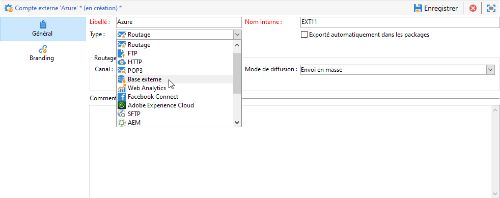
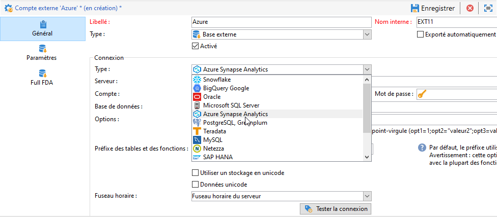
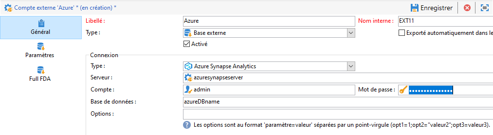
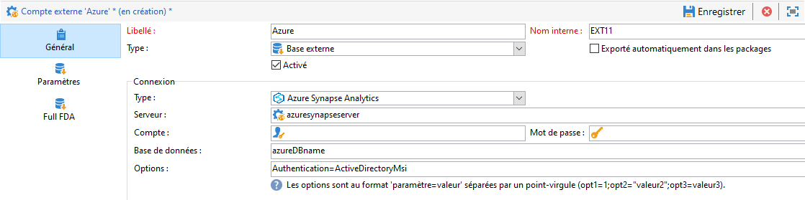

# Configuration de l&#39;accès à Azure Synapse {#configure-access-to-azure-synapse}


Utilisez l’option Campaign [Federated Data Access](../../installation/using/about-fda.md) (FDA) pour traiter les informations stockées dans des bases de données externes. Suivez les étapes ci-dessous pour configurer l’accès à **Microsoft Azure Synapse Analytics**.

1. Configuration d’Azure synapse sur [CentOS](#azure-centos), [Windows](#azure-windows) ou [Debian](#azure-debian)
1. Configuration du [compte externe](#azure-external) Azure Synapse dans Campaign

## Azure Synapse sous CentOS {#azure-centos}

>[!CAUTION]
>
>* Vous aurez besoin des privilèges racine pour installer un pilote ODBC.
>* Les pilotes ODBC Red Hat Enterprise fournis par Microsoft peuvent également être utilisés avec CentOS pour se connecter à SQL Server.
>* La version 13.0 fonctionnera avec Red Hat 6 et 7.

Pour configurer Azure Synapse sur CentOS, procédez comme suit :

1. Installez tout d’abord le pilote ODBC. Vous pouvez le trouver sur cette [page](https://www.microsoft.com/en-us/download/details.aspx?id=50420).

   >[!NOTE]
   >
   >Il s’agit uniquement de la version 13 du pilote ODBC.

   ```
   sudo su
   curl https://packages.microsoft.com/config/rhel/6/prod.repo > /etc/yum.repos.d/mssql-release.repo
   exit
   # Uninstall if already installed Unix ODBC driver
   sudo yum remove unixODBC-utf16 unixODBC-utf16-devel #to avoid conflicts
   
   sudo ACCEPT_EULA=Y yum install msodbcsql
   
   sudo ACCEPT_EULA=Y yum install mssql-tools
   echo 'export PATH="$PATH:/opt/mssql-tools/bin"' >> ~/.bash_profile
   echo 'export PATH="$PATH:/opt/mssql-tools/bin"' >> ~/.bashrc
   source ~/.bashrc
   
   # the Microsoft driver expects unixODBC to be here /usr/lib64/libodbc.so.1, so add soft links to the '.so.2' files
   cd /usr/lib64
   sudo ln -s libodbccr.so.2   libodbccr.so.1
   sudo ln -s libodbcinst.so.2 libodbcinst.so.1
   sudo ln -s libodbc.so.2     libodbc.so.1
   
   # Set the path for unixODBC
   export ODBCINI=/usr/local/etc/odbc.ini
   export ODBCSYSINI=/usr/local/etc
   source ~/.bashrc
   
   #Add a DSN information to /etc/odbc.ini
   sudo vi /etc/odbc.ini
   
   #Add the following:
   [Azure Synapse Analytics]
   Driver      = ODBC Driver 13 for SQL Server
   Description = Azure Synapse Analytics DSN
   Trace       = No
   Server      = [insert your server here]
   ```

1. Si nécessaire, vous pouvez installer les en-têtes de développement unixODBC en exécutant la commande suivante :

   ```
   sudo yum install unixODBC-devel
   ```

1. Après avoir installé les pilotes, vous pouvez tester et vérifier votre pilote ODBC, et interroger votre base de données, si nécessaire. Exécutez la commande suivante :

   ```
   /opt/mssql-tools/bin/sqlcmd -S yourServer -U yourUserName -P yourPassword -q "your query" # for example -q "select 1"
   ```

1. Dans Campaign , vous pouvez ensuite configurer votre compte externe [!DNL Azure Synapse]. Pour plus d’informations sur la configuration de votre compte externe, voir [cette section](#azure-external).

1. Comme Azure Synapse Analytics communique par le biais du port TCP 1433, vous devez l’ouvrir sur votre pare-feu. Utilisez la commande suivante :

   ```
   firewall-cmd --permanent --add-rich-rule='rule family="ipv4" source address="[server_ip_here]/32" port port="1433" protocol="tcp" accept'
   # you can ping your hostname and the ping command will translate the hostname to IP address which you can use here
   ```

   >[!NOTE]
   >
   >Pour autoriser la communication du côté d&#39;Azure Synapse Analytics, vous devrez peut-être ajouter votre adresse IP publique à la liste autorisée. Pour ce faire, voir la [documentation Azure](https://docs.microsoft.com/en-us/azure/sql-database/sql-database-firewall-configure#use-the-azure-portal-to-manage-server-level-ip-firewall-rules).

1. Dans le cas des iptables, exécutez la commande suivante :

   ```
   iptables -A OUTPUT -p tcp -d [server_hostname_here] --dport 1433 -j ACCEPT
   ```

## Azure Synapse sous Windows {#azure-windows}

>[!NOTE]
>
>Il s’agit uniquement de la version 13 du pilote ODBC, mais Adobe Campaign Classic peut également utiliser les pilotes SQL Server Native Client 11.0 et 10.0.

Pour configurer Azure Synapse sous Windows :

1. Installez tout d’abord le pilote ODBC Microsoft. Vous pouvez le trouver sur cette [page](https://www.microsoft.com/en-us/download/details.aspx?id=50420).

1. Choisissez les fichiers suivants à installer :

   ```
   your_language\your_architecture\msodbcsql.msi (i.e: English\X64\msodbcsql.msi)
   ```

1. Une fois votre pilote ODBC installé, vous pouvez le tester, si nécessaire. Pour plus d’informations à ce propos, consultez cette [page](https://docs.microsoft.com/en-us/sql/connect/odbc/windows/system-requirements-installation-and-driver-files?view=sql-server-ver15#installing-microsoft-odbc-driver-for-sql-server).

1. Dans Campaign Classic, vous pouvez ensuite configurer votre compte externe [!DNL Azure Synapse]. Pour plus d’informations sur la configuration de votre compte externe, voir [cette section](#azure-external).

1. Comme Azure Synapse Analytics communique par le biais du port TCP 1433, vous devez ouvrir ce port sur le pare-feu Windows Defender. Pour plus d’informations à ce propos, consultez la [documentation Windows](https://docs.microsoft.com/en-us/windows/security/threat-protection/windows-firewall/create-an-outbound-program-or-service-rule).

## Azure Synapse sous Debian {#azure-debian}

**Conditions préalables requises:**

* Vous aurez besoin des privilèges racine pour installer un pilote ODBC.
* Curl est nécessaire pour installer le package msodbcsql. Si vous ne l’avez pas installé, exécutez la commande suivante :

  ```
  sudo apt-get install curl
  ```

Pour configurer Azure Synapse sous Debian :

1. Installez tout d’abord le pilote ODBC Microsoft pour SQL Server. Utilisez les commandes suivantes pour installer le pilote ODBC 13.1 for SQL Server :

   ```
   sudo su
   curl https://packages.microsoft.com/keys/microsoft.asc | apt-key add -
   curl https://packages.microsoft.com/config/debian/8/prod.list > /etc/apt/sources.list.d/mssql-release.list
   exit
   sudo apt-get update
   sudo ACCEPT_EULA=Y apt-get install msodbcsql
   ```

1. Si vous obtenez l’erreur suivante **« The method driver /usr/lib/apt/methods/https could not be found »** lors de l’appel de la commande **sudo apt-get update**, exécutez la commande :

   ```
   sudo apt-get install apt-transport-https ca-certificates
   ```

1. Vous devez maintenant installer mssql-tools à l’aide des commandes suivantes. Les outils Mssq sont nécessaires pour exploiter l’utilitaire BCP (programme de copie en masse) et pour exécuter des requêtes.

   ```
   sudo ACCEPT_EULA=Y apt-get install mssql-tools
   echo 'export PATH="$PATH:/opt/mssql-tools/bin"' >> ~/.bash_profile
   echo 'export PATH="$PATH:/opt/mssql-tools/bin"' >> ~/.bashrc
   source ~/.bashrc
   ```

1. Si nécessaire, vous pouvez installer les en-têtes de développement unixODBC en exécutant la commande suivante :

   ```
   sudo yum install unixODBC-devel
   ```

1. Après avoir installé les pilotes, vous pouvez tester et vérifier votre pilote ODBC, et interroger votre base de données, si nécessaire. Exécutez la commande suivante :

   ```
   /opt/mssql-tools/bin/sqlcmd -S yourServer -U yourUserName -P yourPassword -q "your query" # for example -q "select 1"
   ```

1. Dans Campaign Classic, vous pouvez maintenant configurer votre compte externe [!DNL Azure Synapse]. Pour plus d’informations sur la configuration de votre compte externe, voir [cette section](#azure-external).

1. Pour configurer les iptables sous Debian afin d’assurer la connexion avec Azure Synapse Analytics, activez le port TCP 1433 sortant pour votre hostname à l’aide de la commande suivante :

   ```
   iptables -A OUTPUT -p tcp -d [server_hostname_here] --dport 1433 -j ACCEPT
   ```

   >[!NOTE]
   >
   >Pour autoriser la communication du côté d&#39;Azure Synapse Analytics, vous devrez peut-être ajouter votre adresse IP publique à la liste autorisée. Pour ce faire, voir la [documentation Azure](https://docs.microsoft.com/en-us/azure/sql-database/sql-database-firewall-configure#use-the-azure-portal-to-manage-server-level-ip-firewall-rules).

## Compte externe Azure Synapse {#azure-external}

Le compte externe [!DNL Azure Synapse] vous permet de connecter l’instance Campaign à la base de données externe Azure Synapse.

Pour créer votre compte externe [!DNL Azure Synapse], procédez comme suit :

1. Dans l’**[!UICONTROL Explorateur]** Campaign, cliquez sur **[!UICONTROL Administration]** &#39;>&#39; **[!UICONTROL Plateforme]** &#39;>&#39; **[!UICONTROL Comptes externes]**.

1. Cliquez sur **[!UICONTROL Nouveau]**.

1. Sélectionnez **[!UICONTROL Base de données externe]** en tant que **[!UICONTROL Type]** de compte externe.

   

1. Sous **[!UICONTROL Configuration]**, sélectionnez **[!UICONTROL Azure Synapse Analytics]** dans la liste déroulante **[!UICONTROL Type]**.

   

1. Configuration du compte externe [!DNL Azure Synapse] :

   * Pour l’authentification standard, vous devez indiquer les informations suivantes :

      * **[!UICONTROL Serveur]** : URL du serveur Azure Synapse

      * **[!UICONTROL Compte]** : nom de l&#39;utilisateur

      * **[!UICONTROL Mot de passe]** : mot de passe du compte utilisateur

      * **[!UICONTROL Base de données]** : nom de la base de données

     

   * Pour l’authentification d’identité gérée par le système, vous devez indiquer les informations suivantes :

      * **[!UICONTROL Serveur]** : URL du serveur Azure Synapse

      * **[!UICONTROL Base de données]** : nom de la base de données

      * **[!UICONTROL Options]** : ajoutez la syntaxe suivante `Authentication=ActiveDirectoryMsi`

     

1. Cliquez sur **[!UICONTROL Enregistrer]**.

Le connecteur prend en charge les options suivantes :

| Option | Description |
|---|---|
| Authentification | Type d’authentification pris en charge par le connecteur. Valeur actuelle prise en charge : ActiveDirectoryMSI. </br>Pour plus d’informations à ce sujet, consultez la [documentation SQL](https://docs.microsoft.com/fr-fr/sql/connect/odbc/using-azure-active-directory?view=sql-server-ver15#example-connection-strings) (exemple n° 8 de chaînes de connexion). |
