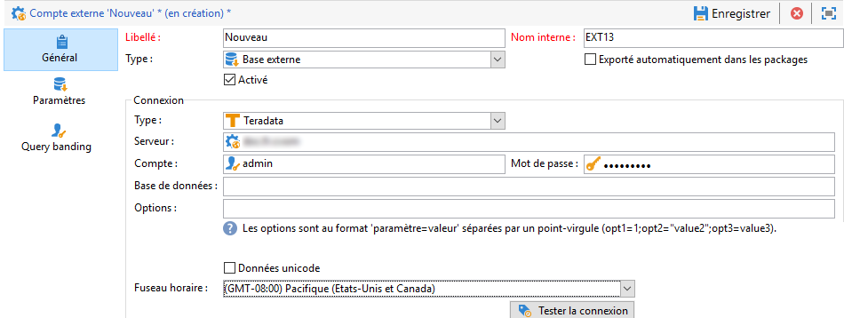
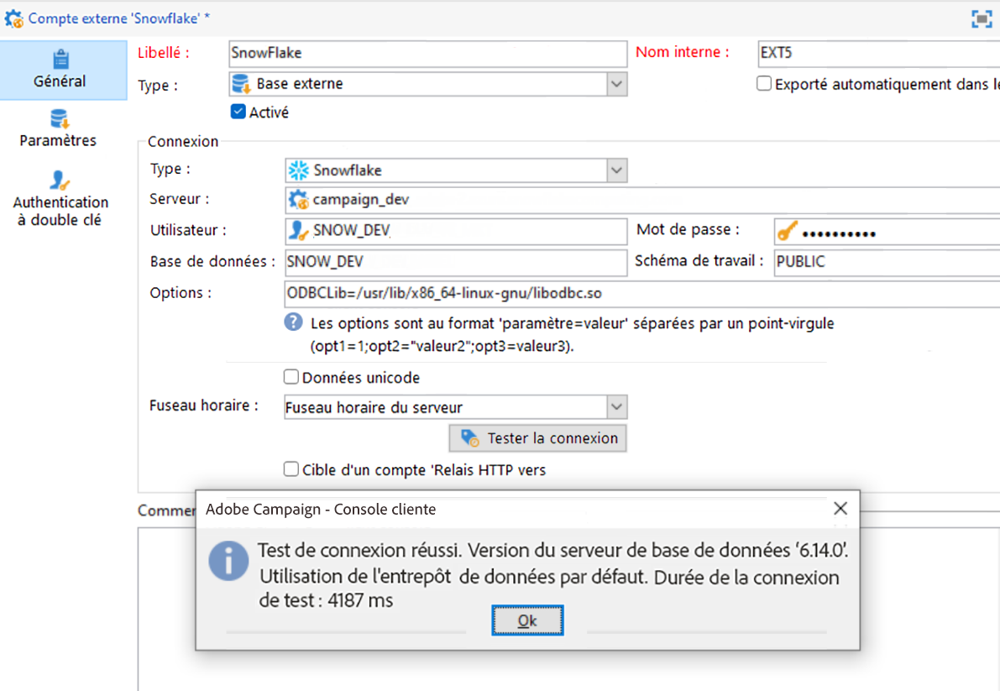
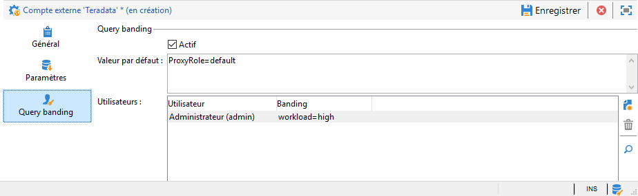

# Configurer l’accès à Teradata {#configure-access-to-teradata}


Utilisez l’option Campaign [Federated Data Access](../../installation/using/about-fda.md) (FDA) pour traiter les informations stockées dans des bases de données externes. Suivez les étapes ci-dessous pour configurer l’accès à Teradata.

1. Installation et configuration des [pilotes Teradata](#teradata-config)
1. Configuration du [compte externe](#teradata-external) Teradata dans Campaign
1. [Configuration supplémentaire](#teradata-additional-configurations) pour Teradata et le serveur Campaign

## Configuration de Teradata {#teradata-config}

Vous devez installer des pilotes pour que Teradata puisse établir une connexion à Campaign.

1. Installez le [pilote ODBC pour Teradata](https://downloads.teradata.com/download/connectivity/odbc-driver/linux).

   Il est constitué de trois packages pouvant être installés sur Red Hat (ou CentOS)/Suse dans l’ordre suivant :

   * TeraGSS
   * tdicu1510 (installez-le via setup_wrapper.sh)
   * tdodbc1510 (installez-le via setup_wrapper.sh)

1. Configurez le pilote ODBC. La configuration peut être réalisée dans les fichiers standard : **/etc/odbc.ini** pour les paramètres généraux et /etc/odbcinst.ini pour la déclaration des pilotes :

   * **/etc/odbc.ini**

      ```
      [ODBC]
      InstallDir=/etc/
      ```

      « InstallDir » correspond à l’emplacement du fichier **odbcinst.ini**.

   * **/etc/odbcinst.ini**

      ```
      [ODBC DRIVERS]
      teradata=Installed
      
      [teradata]
      Driver=/opt/teradata/client/17.10/lib64/tdataodbc_sb64.so
      APILevel=CORE
      ConnectFunctions=YYY
      DriverODBCVer=3.51
      SQLLevel=1
      ```

1. Définissez les variables d’environnement du serveur Adobe Campaign :

   * **LD_LIBRARY_PATH** : /opt/teradata/client/15.10/lib64 et /opt/teradata/client/15.10/odbc_64/lib.
   * **ODBCINI** : emplacement du fichier odbc.ini (par exemple /etc/odbc.ini).
   * **NLSPATH** : emplacement du fichier opermsgs.cat (/opt/teradata/client/15.10/msg/opermsgs.cat)

>[!NOTE]
>
>La connexion à une base de données externe Teradata dans FDA nécessite certaines étapes de configuration supplémentaires sur le serveur Adobe Campaign. [En savoir plus](#teradata-additional-configurations).

## Compte externe Teradata{#teradata-external}

Le compte externe Teradata vous permet de connecter votre instance Campaign à votre base de données externe Teradata.

1. Dans l’**[!UICONTROL Explorateur Campaign]**, cliquez sur **[!UICONTROL Administration]** / **[!UICONTROL Plateforme]** / **[!UICONTROL Comptes externes]**.

1. Cliquez sur **[!UICONTROL Nouveau]**, puis sélectionnez **[!UICONTROL Base de données externe]** comme **[!UICONTROL Type]**.

   

1. Pour configurer le compte externe **[!UICONTROL Teradata]**, vous devez indiquer les informations suivantes :

   * **[!UICONTROL Type]** : Choisissez le type **[!UICONTROL Teradata]**.

   * **[!UICONTROL Serveur]** : URL ou nom de votre serveur Teradata

   * **[!UICONTROL Compte]** : Nom du compte utilisé pour accéder à la base de données Teradata

   * **[!UICONTROL Mot de passe]** : Mot de passe utilisé pour se connecter à la base de données Teradata

   * **[!UICONTROL Base de données]** : nom de la base de données (facultatif)

   * **[!UICONTROL Options]** : Options à transmettre à l’aide de Teradata. Utilisez le format suivant : &#39;parameter=value&#39;. Utilisez un point-virgule comme séparateur entre les valeurs.

   * **[!UICONTROL Fuseau horaire]** : Fuseau horaire défini dans Teradata. [En savoir plus](#timezone)

Le connecteur prend en charge les options suivantes :

| Option | Description |
|---|---|
| TD_MAX_SESSIONS | Indique le nombre maximal de sessions de connexion que le transporteur parallèle Teradata peut acquérir pour une tâche d’opérateur. <br>Pour plus d’informations à ce sujet, consultez [cette page](https://documentation.sas.com/doc/en/pgmsascdc/9.4_3.5/ds2ref/p1naft0um1kn3vn1ubgkrjdf7c3a.html). |
| TimeZoneName | Nom du fuseau horaire du serveur. |
| CharacterSet | Utilisé pour configurer le jeu de caractères Teradata. <br>Pour plus d’informations à ce sujet, consultez [cette page](https://docs.teradata.com/r/ODBC-Driver-for-Teradata-User-Guide/May-2017/Configuration-of-odbc.ini-in-UNIX/Linux-and-Apple-OS-X/Teradata-DSN-Options#rub1478609534082__table_N102D3_N102B6_N102B3_N10001). |
| IANAAppCodePage | Page de code de l’application ODBC. <br>Pour plus d’informations à ce sujet, consultez [cette page](https://docs.teradata.com/r/ODBC-Driver-for-Teradata-User-Guide/May-2017/ODBC-Driver-for-Teradata-Application-Development/International-Character-Set-Support/Application-Code-Page) |

### Ajout de comptes externes ODBC supplémentaires {#add-external}

>[!NOTE]
>
> Cette option n’est pas disponible pour les builds antérieurs à la version 7.3.1.

Le pilote Teradata fournit sa propre bibliothèque ODBC, mais cette bibliothèque peut ne pas être compatible avec d’autres comptes externes ODBC.

Si vous souhaitez configurer un autre compte externe qui utilise également ODBC, par exemple Snowflake, vous devez ajouter une option ODBCLib définie sur le chemin d’accès de la bibliothèque ODBC par défaut (`/usr/lib/x86_64-linux-gnu/libodbc.so` sous Debian et `/usr/lib64/libodbc.so` sous RHEL/CentOS).



### Query banding

Si plusieurs utilisateurs Adobe Campaign se connectent au même compte externe FDA Teradata, l’onglet **[!UICONTROL Tranches de requête]** vous permet de définir une tranche de requête, c’est-à-dire un ensemble de paires clé/valeur, sur une session.



Lorsque cette option est configurée, chaque fois qu&#39;un utilisateur Campaign effectue une requête sur la base de données Teradata, Adobe Campaign envoie des métadonnées, composées d&#39;une liste de clés, associées à cet utilisateur. Ces données peuvent ensuite être utilisées par les administrateurs Teradata à des fins d’audit ou pour gérer les droits d’accès.

>[!NOTE]
>
>Pour plus d’informations sur le **[!UICONTROL Query banding]**, consultez la [documentation de Teradata](https://docs.teradata.com/reader/cY5B~oeEUFWjgN2kBnH3Vw/a5G1iz~ve68yTMa24kVjVw).

Pour configurer le query banding, procédez comme suit :

1. Utilisez l’option **[!UICONTROL Par défaut]** pour saisir un query band par défaut qui sera utilisé si un utilisateur n’a pas de query band associé. Si ce champ est vide, les utilisateurs sans query band ne pourront pas utiliser Teradata.

1. Utilisez le champ **[!UICONTROL Utilisateurs]** pour spécifier un query band pour chaque utilisateur. Vous pouvez ajouter autant de paires clé/valeur que nécessaire, par exemple priority=1;workload=high. Si aucun query band n’est affecté à l’utilisateur, le champ **[!UICONTROL Par défaut]** est appliqué.

1. Cochez la case **[!UICONTROL Actif]** pour activer cette fonction.

#### Résolution des problèmes liés au compte externe {#external-account-troubleshooting}

Si l’erreur suivante s’affiche lors du test de la connexion **TIM-030008 Date ’2’ : caractère(s) manquant(s) (iRc=-53)** assurez-vous que le pilote ODBC est correctement installé et que LD_LIBRARY_PATH (Linux) / PATH (Windows) est défini pour le serveur Campaign.

L’erreur **ODB-240000 ODBC : nom de source de données [Microsoft][ODBC Driver Manager] introuvable et aucun pilote par défaut spécifié.** survient avec Windows si vous utilisez un pilote 16.X. Adobe Campaign s’attend à ce que les données Teradata soient nommées ’{teradata}’ dans odbcinst.ini.

* À compter de Campaign 18.10, vous pouvez ajouter ODBCDriverName=&quot;Teradata Database ODBC Driver 16.10&quot; dans les options du compte externe. Le numéro de version peut changer, le nom exact peut être trouvé en exécutant odbcad32.exe et en accédant à l’onglet Pilotes.

* Si vous utilisez une ancienne version de Campaign, vous devrez copier la section Teradata d’odbcinst.ini créée par l&#39;installation du pilote dans une nouvelle section appelée Teradata. Regedit peut être utilisé dans ce cas. Si votre base est en latin1, vous devrez ajouter **APICharSize=1** dans les options.

## Configurations supplémentaires {#teradata-additional-configurations}

<!--
### Compatibility {#teradata-compatibility}

**Based in Unicode**

| Database version | Driver version |  Minimal Campaign version required |  Note |
|:-:|:-:|:-:|:-:|
| 15  |  15 |  Campaign Classic 17.9 | Under Linux: Queries with timestamp may fail (fixed in build 8937 for 18.4 and 8977 for 18.10) In debug mode, warnings relative to bad memory usage in the driver may occur. |
| 15  | 16  | Campaign Classic 17.9  | Recommended setup for a Teradata 15 database under Linux.  |
|  16 | 16  | Campaign Classic 18.10 |  Unicode characters with surrogate pairs are not fully handled. Using surrogate characters in data should work. Using surrogates in a filtering condition of a query will not work without this change. |
| 16  |  15 |  Campaign Classic 19.0 |  &nbsp; |

**Based in Latin1**

Versions previous to Adobe Campaign Classic 17.9 only supported Teradata Latin-1 database.

Starting from Adobe Campaign Classic 17.9, we now support by default Teradata database in Unicode.

Customers with a Latin-1 Teradata database migrating to a recent Campaign Classic release will have to add the parameter APICharSize=1 in the options of the external account.
-->

### Configuration utilisateur {#user-configuration}

Les droits suivants sont obligatoires sur la base de données externe : créer/déposer/exécuter des procédures personnalisées, créer/déposer/insérer/sélectionner des tables. Vous devrez peut-être également créer des fonctions de mode utilisateur si vous souhaitez utiliser les fonctions md5 et sha2 sur votre instance d’Adobe Campaign.

Assurez-vous de configurer le fuseau horaire approprié. Il doit correspondre à ce qui sera défini dans le compte externe créé dans l’instance d’Adobe Campaign.

Adobe Campaign ne définit pas de mode de protection (fallback) sur les objets qu’il va créer dans la base de données. Vous devrez peut-être définir une valeur par défaut pour l’utilisateur qu’Adobe Campaign utilisera pour se connecter à la base de données Teradata à l’aide de la requête suivante :

| désactiver le fallback par défaut |
| :-: |
| ```MODIFY USER $login$ AS NO FALLBACK;``` |

### Installation de MD5 {#md5-installation}

Si vous souhaitez utiliser les fonctions md5 dans votre instance d’Adobe Campaign, vous devez installer la fonction de mode utilisateur sur votre base de données Teradata à partir de cette [page](https://downloads.teradata.com/download/extensibility/md5-message-digest-udf) (md5_20080530.zip).

La fonction sha1 du fichier téléchargé se présente comme suit : 65cc0bb6935f72fcd84fef1ebcd64c00115dfd1e.

Pour installer md5 :

1. Décompressez le fichier md5_20080530.zip.

1. Accédez au répertoire md5/src.

1. Connectez-vous à votre base de données Teradata à l’aide de bteq.

1. Exécutez la commande bteq suivante :

   ```
   .run file = hash_md5.btq
   ```

### Installation SHA2 {#sha2-installation}

Si vous souhaitez utiliser les fonctions sha2 dans votre instance d’Adobe Campaign, vous devrez installer la fonction de mode utilisateur sur votre base de données Teradata à partir de cette [page](https://github.com/akuroda/teradata-udf-sha2/archive/v1.0.zip) (teradata-udf-sha2-1.0.zip).

La fonction sha1 du fichier téléchargé se présente comme suit : e87438d37424836358bd3902cf1adeb629349780.

Pour installer sha2 :

1. Décompressez le fichier teradata-udf-sha2-1.0.zip.

1. Accédez au répertoire teradata-udf-sha2-1.0/src.

1. Connectez-vous à votre base de données Teradata à l’aide de bteq.

1. Exécutez les deux commandes bteq suivantes :

   ```
   .run file = hash_sha256.sql
   .run file = hash_sha512.sql
   ```

### Installation de UDF_UTF16TO8  {#UDF-UTF16TO8-installation}

Si vous souhaitez utiliser les fonctions udf_utf16to8 dans votre instance d’Adobe Campaign, vous devez installer la fonction de mode utilisateur sur votre base de données Teradata à partir **de la boîte à outils Teradata Unicode** de cette [page](https://downloads.teradata.com/download/tools/unicode-tool-kit) (utk_release1.7.0.0.zip).

La fonction sha1 du fichier téléchargé se présente comme suit : e58235f434f52c71316a577cb48e20b97d24f470.

Pour installer udf_utf16to8 :

1. Décompressez le fichier utk_release1.7.0.0.zip.

1. Recherchez udf_utf16to8.o dans les fichiers extraits et accédez au répertoire qui contient le fichier. Il doit être nommé utk_release1.7.0.0/utk_release1.7.0.0/04 TranslationUDFs/01 Teradata UDFs/suselinux-x8664/udf_installation/.

1. Connectez-vous à votre base de données Teradata à l’aide de bteq.

1. Saisissez la commande bteq suivante :

   ```
   REPLACE FUNCTION udf_utf16to8 (
   inputString VARCHAR(8000) CHARACTER SET UNICODE
   ) RETURNS VARCHAR(16000) CHARACTER SET LATIN
   LANGUAGE C
   NO SQL
   EXTERNAL NAME 'CO!i18n103!udf_utf16to8.o!F!udf_utf16to8'
   PARAMETER STYLE SQL;
   
   -- Test: should return 410042
   SELECT CAST(Char2HexInt(UDF_UTF16to8(_UNICODE'004100000042'XC)) AS VARCHAR(100));
   ```

## Configuration du serveur Campaign pour Linux {#campaign-server-linux}

Les éléments suivants sont requis pour l’installation du pilote :

* Pilote ODBC Teradata disponible sur cette [page](https://downloads.teradata.com/download/connectivity/odbc-driver/linux)

* Outils et utilitaires de Teradata (utilisés pour le chargement en masse), disponibles sur cette [page](https://downloads.teradata.com/download/tools/teradata-tools-and-utilities-linux-installation-package-0)

Noms de fichiers et sha1 :

* tdodbc1620__linux_indep.16.20.00.00-1.tar.gz 121fdd978b56fe1304fc5cb7819741b0847f44fd

* TeradataToolsAndUtilitiesBase__linux_indep.16.20.01.00.tar.gz b 29d0af5ffd8dcf68a9dbbaa6f8639387b19c563

S’il n’existe aucun package pour votre distribution Linux, vous pouvez suivre la procédure d’installation de CentOS 7 (par exemple en utilisant docker), puis copier le contenu de /opt/teradata sur votre serveur Adobe Campaign.

### Installation du pilote ODBC {#odbc-installation}

Pour installer le pilote ODBC :

1. Extrayez le fichier tdodbc1620__linux_indep.16.20.00.00-1.tar.gz.

1. Accédez au répertoire tdodbc1620.

1. Vous devrez peut-être corriger le script de configuration :

   ```
   "sed -i s/16.10/16.20/ setup_wrapper.sh".
   ```

1. Exécutez setup_wrapper.sh.

### Installation des outils et utilitaires Teradata {#teradata-tools-installation}

Pour installer les outils :

1. Extrayez le fichier TeradataToolsAndUtilitiesBase__linux_indep.16.20.01.00.tar.gz.

1. Accédez au répertoire TeradataToolsAndUtilitiesBase/Linux/i386-x8664/tdicu.

1. Exécutez setup_wrapper.sh.

1. Accédez au répertoire TeradataToolsAndUtilitiesBase/Linux/i386-x8664/cliv2.

1. Exécutez setup_wrapper.sh.

1. Accédez au répertoire TeradataToolsAndUtilitiesBase/Linux/i386-x8664/tptbase.

1. Exécutez setup_wrapper.sh.

1. Un fichier libtelapi.so doit être disponible dans /opt/teradata/client/16.20/lib64.

## Configuration du serveur Campaign pour Windows {#campaign-server-windows}

Vous devez d’abord télécharger les outils et utilitaires Teradata pour Windows. Vous pouvez les télécharger à partir de cette [page](https://downloads.teradata.com/download/tools/teradata-tools-and-utilities-windows-installation-package)

Assurez-vous d’installer le pilote ODBC et la base de transport parallèle Teradata. Elle installera le fichier telapi.dll utilisé pour charger en masse la base de données Teradata.

Assurez-vous que le chemin d’accès du pilote et des utilitaires se trouve dans la variable PATH dont nlserver disposera pendant l’exécution. Par défaut, le chemin d’accès est C:\Program Files (x86)\Teradata\Client\15.10\bin sur Windows 32 bits or C:\Program Files\Teradata\Client\15.10\bin sur 64 bits).

## Time zone {#timezone}

Teradata utilise un nom de fuseau horaire qui n’est pas standard. Vous pouvez trouver la liste sur le [site Teradata](https://docs.teradata.com/reader/rgAb27O_xRmMVc_aQq2VGw/oGKvgl7gCeBMTGrp59BnwA). Adobe Campaign essaiera de convertir le fuseau horaire donné dans la configuration externe en un élément que Teradata comprend. Si aucune correspondance n’est trouvée, le fuseau horaire GMT+X (ou GMT-X) le plus proche sera trouvé pour la session et un avertissement sera ajouté au journal.

La conversion est effectuée via la lecture du fichier appelé teradata_timezones.txt qui doit se trouver dans le répertoire de données suivant : /usr/local/neolane/nl6/datakit sous Linux. Si vous modifiez ce fichier, veillez à contacter l’équipe d’Adobe Campaign pour apporter la modification au code source, sans quoi, ce fichier sera remplacé lors de la prochaine mise à jour de Campaign.

Le fuseau horaire utilisé pour la connexion est indiqué lors de l’exécution de nlserver avec le commutateur -verbose, par exemple :

```
15:04:04 >   ODB-240007 Teradata: will use 'Europe Central' as session time zone.
```

Si le fuseau horaire utilisé n’est pas correct, une option nommée « TimeZoneName » peut être ajoutée sur le compte externe. Dans ce cas, utilisez la valeur Teradata, par exemple « TimeZoneName=Europe Central ».

Lors de l’utilisation du chargement en masse, ou « chargement rapide » dans les documents Teradata, Campaign ne peut pas indiquer le fuseau horaire. Par conséquent, il est recommandé de définir le fuseau horaire par défaut de l’utilisateur que Campaign utilisera pour se connecter :

```
MODIFY USER $login$ AS TIME ZONE = 'Europe Central';
```
