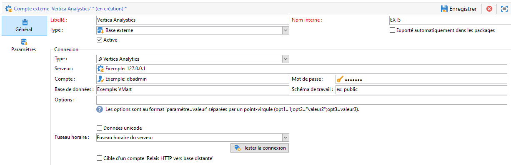

# Configurer l’accès à [!DNL Vertica Analytics] {#configure-fda-vertica}


Utilisez l&#39;option Campaign **Federated Data Access** (FDA) pour traiter les informations stockées dans une base de données externe. Suivez les étapes ci-dessous pour Configuration de l&#39;accès à [!DNL Vertica Analytics].

1. Configuration de [!DNL Vertica Analytics] sous [CentOS](#vertica-centos), [Windows](#vertica-windows) ou [Debian](#vertica-debian)
1. Configuration du [compte externe](#vertica-external) [!DNL Vertica Analytics] dans Campaign


## [!DNL Vertica Analytics] sous CentOS {#vertica-centos}

Pour effectuer la configuration de [!DNL Vertica Analytics] sur CentOS, procédez comme suit :

1. Téléchargez les pilotes ODBC pour [!DNL Vertica Analytics]. [Cliquez ici](https://www.vertica.com/download/vertica/client-drivers/) et téléchargez le dernier fichier RPM Linux.

1. Vous devez ensuite installer unixODBC avec la commande suivante :

   ```
   yum search unixODBC
   yum install unixODBC.x86_64
   ```

1. Si vous avez précédemment installé le serveur [!DNL Vertica Analytics], un pilote ODBC est déjà installé. Dans ce cas, mettez à jour le lecteur comme suit :

   ```
   #Switch to root
   sudo su
   
   #Install the package (add --force to update it)
   rpm -Uvh vertica-client-x.x.x-x.x86_64.rpm [--force]
   
   #Open odbcinst.ini
   vi /etc/odbcinst.ini
   
   #Add a section for Vertica Analytics and save
   [VerVertica Analyticstica]
   Description = Vertica Analytics ODBC Driver
   Driver = /opt/vertica/lib64/libverticaodbc.so
   
   #Open odbc.ini
   vi /etc/odbc.ini
   
   #Add your DSN in ODBC Data Sources section, for example:
   [ODBC Data Sources]
   VMart = "VMart database on Vertica Analytics"
   
   #Add a DSN definition section below, for example:
   [VMart]
   Description = Vmart Database
   Driver = Vertica Analytics
   Database = VMart
   Servername = # The name of the server where Vertica Analytics is installed. Use localhost if Vertica Analytics is installed on the same machine.
   UID = dbadmin
   PWD = <password>
   Port = 5433
   
   #Cleanup
   #Remove the ODBC package
   rm vertica-client-x.x.x-x.x86_64.rpm
   ```

1. Dans Adobe Campaign, vous pouvez ensuite configurer votre compte externe [!DNL Vertica Analytics]. Pour plus d&#39;informations sur la configuration de votre compte externe, voir [cette section](#vertica-external).

## [!DNL Vertica Analytics] sous Windows {#vertica-windows}

1. Téléchargez le pilote [ODBC pour Windows](https://www.vertica.com/download/vertica/client-drivers/). Pour installer le pilote pour Windows, vous devez activer .NET Framework 3.5, sinon l’assistant d’installation tentera de l’activer et de le télécharger automatiquement.

1. Configurez le pilote ODBC sous Windows. Pour plus d’informations, consultez [cette page](https://www.vertica.com/docs/9.2.x/HTML/Content/Authoring/ConnectingToVertica/ClientODBC/SettingUpADSN.htm)

1. Dans Adobe Campaign, vous pouvez ensuite configurer votre compte externe [!DNL Vertica Analytics]. Pour plus d&#39;informations sur la configuration de votre compte externe, voir [cette section](#vertical-external).

## [!DNL Vertica Analytics] sous Debian {#vertica-debian}

1. Téléchargez les pilotes ODBC pour [!DNL Vertica Analytics]. [Cliquez ici](https://sfc-repo.snowflakecomputing.com/odbc/linux/latest/index.html) pour lancer le téléchargement.

1. Vous devez ensuite installer unixODBC avec la commande suivante :

   ```
   apt-get install unixODBC
   ```

1. Si vous avez précédemment installé le serveur [!DNL Vertica Analytics], un pilote ODBC est déjà installé. Dans ce cas, mettez à jour le lecteur comme suit :

   ```
   #Switch to root
   sudo su
   
   #Move or copy the downloaded file and change to /root
   mv vertica_9.3..xx_odbc_x86_64_linux.tar.gz /
   cd /
   
   #Uncompress the file you downloaded
   tar vzxf vertica_9.3..xx_odbc_x86_64_linux.tar.gz
   
   #Remove the tar.gz since it is not needed anymore
   rm vertica_9.3..xx_odbc_x86_64_linux.tar.gz
   
   #Open odbcinst.ini
   vi /etc/odbcinst.ini
   
   #Add a section for Vertica Analytics and save
   [Vertica Analytics]
   Description = Vertica Analytics ODBC Driver
   Driver = /opt/vertica/lib64/libverticaodbc.so
   
   #Open odbc.ini
   vi /etc/odbc.ini
   
   #Add your DSN in ODBC Data Sources section, for example:
   [ODBC Data Sources]
   VMart = "VMart database on Vertica Analytics"
   
   #Add a DSN definition section below, for example:
   [VMart]
   Description = Vmart Database
   Driver = Vertica Analytics
   Database = VMart
   Servername = # The name of the server where Vertica Analytics is installed. Use localhost if Vertica Analytics is installed on the same machine.
   UID = dbadmin
   PWD = <password>
   Port = 5433
   ```

1. Dans Adobe Campaign, vous pouvez ensuite configurer votre compte externe [!DNL Vertica Analytics]. Pour plus d&#39;informations sur la configuration de votre compte externe, voir [cette section](#vertica-external).

## Compte externe [!DNL Vertica Analytics] {#vertica-external}

Vous devez créer un compte externe [!DNL Vertica Analytics] pour connecter votre instance Campaign à votre base de données [!DNL Vertica Analytics] externe.

1. Depuis l&#39;**[!UICONTROL Explorateur]** Campaign, cliquez sur **[!UICONTROL Administration]** &#39;>&#39; **[!UICONTROL Plateforme]** &#39;>&#39; **[!UICONTROL Comptes externes]**.

1. Cliquez sur **[!UICONTROL Nouveau]**.

1. Sélectionnez **[!UICONTROL Base de données externe]** en tant que **[!UICONTROL Type]** de compte externe.

1. Pour configurer le compte externe **[!UICONTROL Vertica Analytics]**, vous devez spécifier : 

   * **[!UICONTROL Type]**: [!DNL Vertica Analytics]

   * **[!UICONTROL Serveur]** : URL du serveur [!DNL Vertica Analytics]

   * **[!UICONTROL Compte]** : nom de l&#39;utilisateur

   * **[!UICONTROL Mot de passe]** : mot de passe du compte d’utilisateur

   * **[!UICONTROL Base de données]** : nom de la base de données

   

Le connecteur prend en charge les options suivantes :

| Option | Description |
|---|---|
| TimeZoneName | Vide par défaut. C&#39;est le fuseau horaire système du serveur applicatif Campaign Classic qui est utilisé. Il est possible d’utiliser cette option pour forcer le paramètre de session TIMEZONE. |

