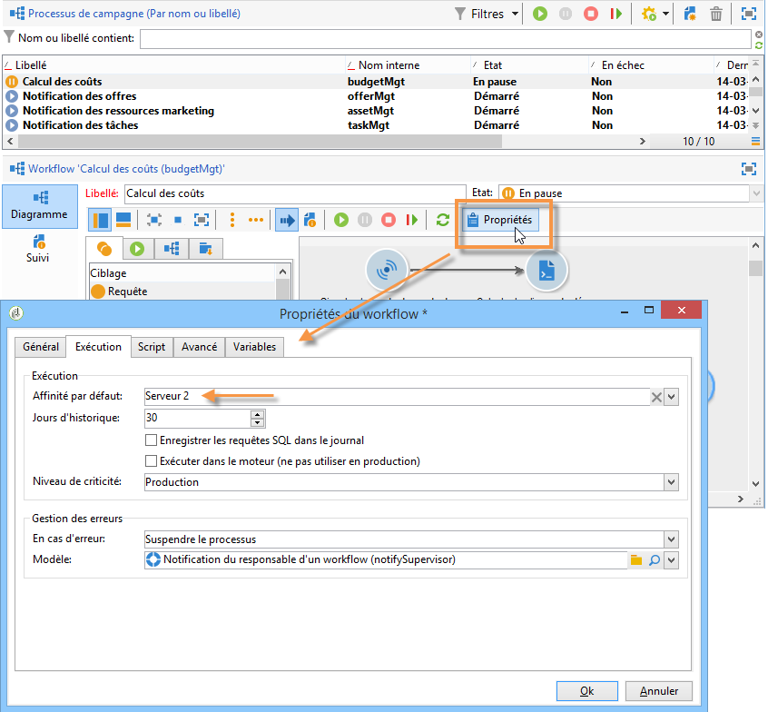
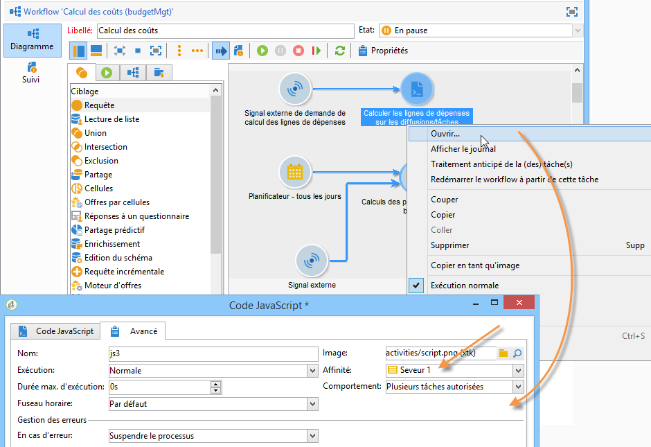

# Prise en main de la configuration du serveur Campaign{#gs-campaign-server-config}


Ce chapitre décrit les configurations côté serveur qui peuvent être exécutées en fonction de vos besoins et des spécificités de votre environnement.

## Restrictions

Ces procédures sont limitées aux déploiements **On-premise**/**hybrides** et nécessitent des autorisations d’administration.

Pour les déploiements **hébergés**, les paramètres côté serveur ne peuvent être configurés que par Adobe. Cependant, certains paramètres peuvent être configurés dans le [Panneau de contrôle de Campaign ](https://experienceleague.adobe.com/docs/control-panel/using/discover-control-panel/key-features.html?lang=fr), comme la gestion des listes d’adresses IP autorisées ou les autorisations d’URL. [En savoir plus](https://experienceleague.adobe.com/docs/control-panel/using/instances-settings/ip-allow-listing-instance-access.html?lang=fr).

Pour plus d’informations, consultez les sections suivantes :

* [Documentation relative au Panneau de contrôle](https://experienceleague.adobe.com/docs/control-panel/using/control-panel-home.html?lang=fr)
* [Modèles d&#39;hébergement](../../installation/using/hosting-models.md)
* [Matrice des fonctionnalités On-premise et hébergées de Campaign Classic](../../installation/using/capability-matrix.md)

## Fichiers de configuration

Les fichiers de configuration de Campaign Classic sont stockés dans le dossier **conf** du dossier d’installation d’Adobe Campaign. La configuration est répartie sur deux fichiers :

* **serverConf.xml** : configuration générale pour toutes les instances. Ce fichier regroupe les paramètres techniques du serveur Adobe Campaign : ces paramètres sont communs à toutes les instances. Vous trouverez ci-après la description de certains de ces paramètres. Les différents nœuds et paramètres sont répertoriés dans cette [section](../../installation/using/the-server-configuration-file.md).
* **config-`<instance>`.xml** (où **instance** est le nom de l’instance) : configuration spécifique de l’instance. Si vous partagez votre serveur entre plusieurs instances, entrez les paramètres propres à chaque instance dans le fichier correspondant.

## Périmètre de la configuration

Configurez ou adaptez le serveur Campaign en fonction de vos besoins et de votre configuration. Vous pouvez ainsi :

* Sécuriser l’[identifiant interne](#internal-identifier)
* Activer [les processus de Campaign](#enabling-processes)
* Configurer les [autorisations d’URL](url-permissions.md)
* Définir les [zones de sécurité](security-zones.md)
* Configurer les [paramètres Tomcat](configure-tomcat.md)
* Personnaliser les [paramètres de diffusion](configure-delivery-settings.md)
* Définir [la sécurité et les relais des pages dynamiques](#dynamic-page-security-and-relays)
* Limiter la liste des [commandes externes autorisées](#restricting-authorized-external-commands)
* Configurer un [tracking redondant](#redundant-tracking)
* Gérer la [haute disponibilité et les affinités de workflow](#high-availability-workflows-and-affinities)
* Configurer la gestion des fichiers - [En savoir plus](file-res-management.md)
   * Limiter le format des fichiers envoyés
   * Activer l’accès aux ressources publiques
   * Configurer la connexion au proxy
* [Redémarrage automatique des processus](#automatic-process-restart)


## Identifiant &#39;internal&#39; {#internal-identifier}

L&#39;identifiant **internal** est un login technique à utiliser lors de la phase d&#39;installation, pour les paramétrages techniques d&#39;administration et de maintenance. Ce login n&#39;est pas associé à une instance.

L&#39;opérateur connecté avec cet identifiant possède tous les droits, sur toutes les instances. Après une nouvelle installation, cet identifiant n&#39;a pas de mot de passe. Vous devez définir ce mot de passe manuellement.

Utilisez la commande suivante :

```
nlserver config -internalpassword
```

Les informations suivantes sont alors affichées. Saisissez et confirmez le nouveau mot de passe :

```
17:33:57 >   Application server for Adobe Campaign Classic (7.X YY.R build XXX@SHA1) of DD/MM/YYYY
Enter the current password.
Password:
Enter the new password.
Password: XXXX
Confirmation: XXXX
17:34:02 >   Password successfully changed for account 'internal' (authentication mode 'nl')
```

## Activation des processus {#enabling-processes}

L’activation (ou la désactivation) des processus Adobe Campaign se fait sur le serveur à partir des fichiers **config-default.xml** et **`config-<instance>.xml`**.

Pour appliquer les modifications dans ces fichiers, si le service Adobe Campaign est démarré, vous devez exécuter la commande **nlserver config -reload**.

On distingue deux types de processus : multi-instance et mono-instance.

* **multi-instance** : un seul processus est démarré pour toutes les instances, il s&#39;agit des processus **web**, **syslogd** et **trackinglogd**.

   L’activation peut être configurée à partir du fichier **config-default.xm**.

   Déclaration d&#39;un serveur Adobe Campaign pour l&#39;accès aux consoles clientes et pour la redirection (tracking) :

   ```
   vi nl6/conf/config-default.xml
   <web args="-tomcat" autoStart="true"/>  
   <!-- to start if the machine is also a redirection server -->  
   <trackinglogd autoStart="true"/>
   ```

   Dans cet exemple, le fichier est modifié à l’aide d’une commande **vi** sous Linux. Il peut être modifié à l’aide de n’importe quel éditeur **.txt** ou **.xml**.

* **mono-instance** : un processus est démarré par instance (modules : **mta**, **wfserver**, **inMail**, **sms** et **stat**).

   L&#39;activation est paramétrable à partir du fichier de configuration de l&#39;instance :

   ```
   config-<instance>.xml
   ```

   Déclaration d&#39;un serveur pour la diffusion, l&#39;exécution des instances de workflow et la récupération des mails rebond :

   ```
   <mta autoStart="true" statServerAddress="localhost"/>
   <wfserver autoStart="true"/>  
   <inMail autoStart="true"/>
   <stat autoStart="true"/>
   ```

**Enregistrement de données Campaign**

Vous pouvez configurer le répertoire de stockage (répertoire **var**) des données Adobe Campaign (logs, téléchargements, redirections, etc.). Pour cela, utilisez la variable système **XTK_VAR_DIR** :

* Sous Windows, indiquez la valeur suivante dans la variable système **XTK_VAR_DIR**.

   ```
   D:\log\AdobeCampaign
   ```

* Sous Linux, rendez-vous dans le fichier **customer.sh** et indiquez : **export XTK_VAR_DIR=/app/log/AdobeCampaign**.

   Pour plus d’informations à ce sujet, reportez-vous à la section [Personnalisation des paramètres](../../installation/using/installing-packages-with-linux.md#personalizing-parameters).


## Sécurité et relais des pages dynamiques {#dynamic-page-security-and-relays}

Par défaut, toutes les pages dynamiques sont automatiquement liées au serveur Tomcat **local** de la machine dont le module web a démarré. Cette configuration est saisie dans la section **`<url>`** de la configuration du relais de requête pour le fichier **ServerConf.xml**.

Vous pouvez relayer l’exécution de la page dynamique sur un serveur **distant** si le module Web n’est pas activé sur l’ordinateur. Pour ce faire, vous devez remplacer **localhost** par le nom de l’ordinateur distant pour JSP et JSSP, les applications web, les rapports et les chaînes.

Pour plus d’informations sur les différents paramètres disponibles, consultez le fichier de configuration **serverConf.xml**.

Pour les pages JSP, le paramétrage par défaut est le suivant :

```
<url relayHost="true" relayPath="true" targetUrl="http://localhost:8080" urlPath="*.jsp"/>
```

Adobe Campaign utilise les pages JSP suivantes :

* /nl/jsp/**soaprouter.jsp** : connexion des consoles clientes et services Web (API SOAP),
* /nl/jsp/**m.jsp** : pages miroir,
* /nl/jsp/**logon.jsp** : accès aux rapports par le Web et au déploiement de la console cliente,
* /nl/jsp/**s.jsp** : utilisation du marketing viral (parrainage et réseaux sociaux).

Les JSSP utilisées pour le canal des applications mobiles sont les suivantes :

* nms/mobile/1/registerIOS.jssp
* nms/mobile/1/registerAndroid.jssp

**Exemple:**

Vous pouvez empêcher la connexion des postes clients de l&#39;extérieur. Pour cela, il suffit de restreindre l&#39;exécution de **soaprouter.jsp** et de n&#39;autoriser que l&#39;exécution des pages miroirs, des liens viraux, des formulaires web et des ressources publiques.

Les paramètres sont les suivants :

```
<url IPMask="<IP_addresses>" deny=""     hostMask="" relayHost="true"  relayPath="true"  targetUrl="http://localhost:8080" timeout="" urlPath="*.jsp"/>
<url IPMask="<IP_addresses>" deny=""     hostMask="" relayHost="true"  relayPath="true"  targetUrl="http://localhost:8080" timeout="" urlPath="*.jssp"/> 
<url IPMask=""               deny=""     hostMask="" relayHost="true" relayPath="true" targetUrl="http://localhost:8080" timeout="" urlPath="m.jsp"/>
<url IPMask=""               deny=""     hostMask="" relayHost="true" relayPath="true" targetUrl="http://localhost:8080" timeout="" urlPath="s.jsp"/>
<url IPMask=""               deny=""     hostMask="" relayHost="true" relayPath="true" targetUrl="http://localhost:8080" timeout="" urlPath="webForm.jsp"/>
<url IPMask=""               deny=""     hostMask="" relayHost="true"  relayPath="true"  targetUrl="http://localhost:8080" timeout="" urlPath="/webApp/pub*"/>
<url IPMask=""               deny=""     hostMask="" relayHost="true"  relayPath="true"  targetUrl="http://localhost:8080" timeout="" urlPath="/jssp/pub*"/>
<url IPMask=""               deny=""     hostMask="" relayHost="true"  relayPath="true"  targetUrl="http://localhost:8080" timeout="" urlPath="/strings/pub*"/>
<url IPMask=""               deny=""     hostMask="" relayHost="true"  relayPath="true"  targetUrl="http://localhost:8080" timeout="" urlPath="/interaction/pub*"/>
<url IPMask=""               deny="true" hostMask="" relayHost="false" relayPath="false" targetUrl="http://localhost:8080" timeout="" urlPath="*.jsp"/>
<url IPMask=""               deny="true" hostMask="" relayHost="false" relayPath="false" targetUrl="http://localhost:8080" timeout="" urlPath="*.jssp"/>
```

Dans cet exemple, la valeur **`<IP_addresses>`** correspond à la liste des adresses IP (séparées par des virgules) ayant la autorisation d&#39;utiliser le module de relais pour ce masque.

>[!NOTE]
>
>Les valeurs doivent être adaptées selon votre configuration et vos contraintes réseau, en particulier si des paramétrages spécifiques ont été développés pour votre installation.

### Gérer les en-têtes HTTP {#managing-http-headers}

Par défaut, tous les en-têtes HTTP ne sont pas relayés. Vous pouvez ajouter des en-têtes spécifiques dans les réponses transmises par le relais. Pour cela :

1. Accédez au fichier **serverConf.xml**.
1. Dans le nœud **`<relay>`**, accédez à la liste des en-têtes HTTP relayés.
1. Ajoutez un élément **`<responseheader>`** comportant les attributs suivants :

   * **name** : nom de l&#39;en-tête
   * **value** : valeur de l&#39;en-tête.

   Par exemple :

   ```
   <responseHeader name="Strict-Transport-Security" value="max-age=16070400; includeSubDomains"/>
   ```

## Restreindre les commandes externes autorisées {#restricting-authorized-external-commands}

A partir du build 8780, les administrateurs techniques peuvent restreindre la liste des commandes externes autorisées pouvant être utilisées dans Adobe Campaign.

Pour ce faire, vous devez créer un fichier texte contenant la liste des commandes dont vous souhaitez empêcher l&#39;utilisation, par exemple :

```
ln
dd
openssl
curl
wget
python
python3
perl
ruby
sh
```

>[!IMPORTANT]
>
>Cette liste n&#39;est pas exhaustive.

Dans le nœud **exec** du fichier de configuration du serveur, vous devez référencer le fichier précédemment créé dans l&#39;attribut **blacklistFile**.

**Pour Linux uniquement** : dans le fichier de configuration du serveur, nous vous recommandons de spécifier un utilisateur dédié à l’exécution de commandes externes afin d’améliorer votre configuration de sécurité. Cet utilisateur est défini dans le nœud **exec** du fichier de configuration. Tous les paramètres disponibles dans le fichier **serverConf.xml** sont répertoriés dans cette [section](../../installation/using/the-server-configuration-file.md).

>[!NOTE]
>
>Si aucun utilisateur n’est spécifié, toutes les commandes sont exécutées dans le contexte utilisateur de l’instance Adobe Campaign. L’utilisateur doit être différent de celui qui exécute Adobe Campaign.

Par exemple :

```
<serverConf>
 <exec user="theUnixUser" blacklistFile="/pathtothefile/blacklist"/>
</serverConf>
```

Cet utilisateur doit être ajouté à la liste sudoer de l&#39;opérateur &#39;neolane&#39; Adobe Campaign.

>[!IMPORTANT]
>
>Vous ne devez pas utiliser de sudo personnalisé. Un sudo standard doit être installé sur le système.


## Tracking redondant {#redundant-tracking}

Lorsque plusieurs serveurs sont utilisés pour servir la redirection, ceux-ci devront pouvoir communiquer entre eux par des appels SOAP afin de partager les informations des URL à rediriger. Il se peut en effet qu&#39;au moment du démarrage de la diffusion tous les serveurs de redirection ne soient pas disponibles, et qu&#39;ils ne possèdent donc pas le même niveau d&#39;information.

>[!NOTE]
>
>Dans le cas d&#39;une architecture standard ou entreprise, le serveur applicatif principal doit être autorisé à télécharger des informations de tracking sur chaque machine.

Les URL des serveurs redondants doivent être renseignées dans la configuration de la redirection, via le fichier **serverConf.xml**.

**Exemple :**

```
<spareserver enabledIf="$(hostname)!='front_srv1'" id="1" url="http://front_srv1:8080" />
<spareserver enabledIf="$(hostname)!='front_srv2'" id="2" url="http://front_srv2:8080" />
```

La propriété **enableIf** est optionnelle (vide par défaut) et permet de n’activer la connexion que si le résultat est vrai. Ceci afin d’obtenir une configuration identique sur tous les serveurs de redirection.

Pour connaître le hostname de la machine, exécutez la commande suivante : **hostname -s**.


## Workflows en haute disponibilité et affinités {#high-availability-workflows-and-affinities}

Vous pouvez configurer plusieurs serveurs de workflow (wfserver) et les répartir sur plusieurs machines. Si vous optez pour une architecture de ce type, paramétrez le mode de connexion des répartiteurs de charge en fonction de l&#39;accès à Adobe Campaign.

Dans le cas d&#39;un accès depuis le web, choisissez le mode **load balancer** afin de limiter les temps de connexion.

Si l&#39;accès se fait depuis la console Adobe Campaign, préférez le mode **hash** ou **sticky ip**. Cela vous permet de maintenir la connexion entre le client riche et le serveur et d&#39;éviter qu&#39;une session utilisateur ne soit interrompue au cours d&#39;une opération d&#39;import ou d&#39;export par exemple.

Vous pouvez choisir de forcer l&#39;exécution d&#39;un workflow ou d&#39;une activité de workflow sur une machine particulière. Vous devez pour cela définir une ou plusieurs affinités au niveau du workflow ou de l&#39;activité concernée.

1. Créez la ou les affinités du workflow ou de l&#39;activité en la tapant dans le champ **[!UICONTROL Affinité]**.

   Vous pouvez choisir n’importe quel nom d’affinité, mais veillez à ne pas utiliser d’espaces ni de signes de ponctuation. Si vous utilisez des serveurs différents, spécifiez aussi des noms différents.

   

   

   La liste déroulante contient les affinités utilisées auparavant. La liste se complète au fur et à mesure avec les différentes valeurs saisies.

1. Ouvrez le fichier **nl6/conf/config-`<instance>.xml`**.
1. Modifiez la ligne correspondant au module **[!UICONTROL wfserver]** de la façon suivante :

   ```
   <wfserver autoStart="true" affinity="XXX,"/>
   ```

   Si vous définissez plusieurs affinités, elles doivent être séparées par une virgule sans espace :

   ```
   <wfserver autoStart="true" affinity="XXX,YYY,"/>
   ```

   La virgule qui suit le nom de l&#39;affinité est nécessaire afin que les workflows pour lesquels aucune affinité n&#39;est définie puissent s&#39;exécuter.

   Si vous souhaitez n&#39;exécuter que les workflows pour lesquels une affinité est définie, n&#39;ajoutez pas de virgule à la fin de la liste de vos affinités. Par exemple, modifiez la ligne de la façon suivante :

   ```
   <wfserver autoStart="true" affinity="XXX"/>
   ```

## Redémarrage automatique {#automatic-process-restart}

Par défaut, les différents processus Adobe Campaign redémarrent automatiquement à 6h (matin, heure du serveur) chaque jour.

Il est néanmoins possible de modifier ce paramétrage.

Pour cela, accédez au fichier **serverConf.xml**, situé dans le répertoire **conf** de votre installation.

Chaque processus paramétré dans ce fichier dispose d&#39;un attribut **processRestartTime**. Vous pouvez modifier la valeur de cet attribut afin d&#39;adapter l&#39;heure de redémarrage de chaque processus à vos besoins.

>[!IMPORTANT]
>
>Ne supprimez pas cet attribut. Tous les processus doivent être redémarrés chaque jour.
