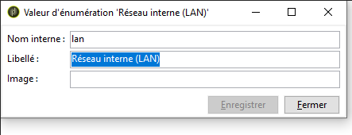
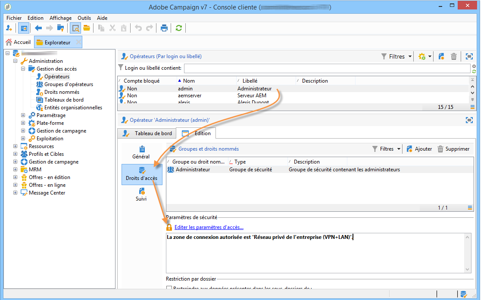
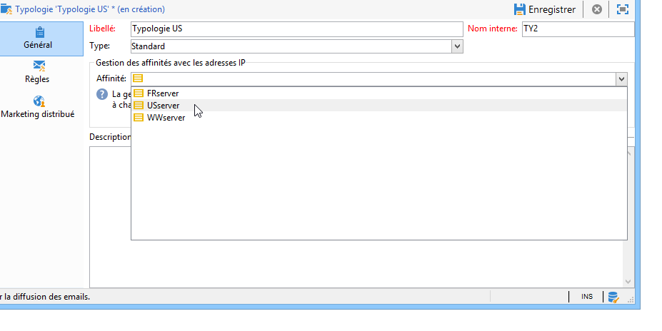

# Configuration du serveur Campaign{#configuring-campaign-server}

La section ci-dessous décrit les configurations côté serveur qui peuvent être exécutées en fonction de vos besoins et des spécificités de votre environnement.

Ces configurations doivent être exécutées par les administrateurs et uniquement pour les modèles d’hébergement **sur site** . Pour les déploiements **hébergés** , les paramètres côté serveur peuvent uniquement être configurés par Adobe. Cependant, certains paramètres peuvent être configurés dans le Panneau de configuration (par exemple, les autorisations d’accès aux listes blanches d’adresses IP ou d’URL).

Pour plus d’informations, reportez-vous aux sections suivantes :

* [Documentation du Panneau de configuration](https://docs.adobe.com/content/help/en/control-panel/using/control-panel-home.html)
* [Modèles d&#39;hébergement](../../installation/using/hosting-models.md)
* [Matrice des fonctionnalités sur site et hébergées de Campaign Classic](https://helpx.adobe.com/campaign/kb/acc-on-prem-vs-hosted.html)
* [Etapes de configuration des modèles hybrides et hébergés](https://docs.campaign.adobe.com/doc/AC/en/INS_Hybrid_and_Hosted_models_About_hybrid_and_hosted_models.html)

Les fichiers de configuration de Campaign Classic sont stockés dans le dossier **conf** du dossier d’installation d’Adobe Campaign. La configuration est répartie sur deux fichiers :

* **serverConf.xml** : configuration générale pour toutes les instances. Ce fichier regroupe les paramètres techniques du serveur Adobe Campaign : ces paramètres sont communs à toutes les instances. Vous trouverez ci-après la description de certains de ces paramètres. Les différents nœuds et paramètres sont répertoriés dans cette [section](../../installation/using/the-server-configuration-file.md).
* **config-`<instance>`.xml** (où **instance** est le nom de l’instance) : configuration spécifique de l’instance. Si vous partagez votre serveur entre plusieurs instances, entrez les paramètres propres à chaque instance dans le fichier correspondant.

## Définition des zones de sécurité {#defining-security-zones}

### A propos des zones de sécurité {#about-security-zones}

Chaque opérateur doit être associé à une zone pour se connecter à une instance et l&#39;adresse IP de l&#39;opérateur doit faire partie des adresses ou des plages d&#39;adresses définies dans la zone de sécurité. La configuration des zones de sécurité est effectuée dans le fichier de configuration du serveur Adobe Campaign.

Les opérateurs sont liés à une zone de sécurité depuis le profil dans la console (nœud **[!UICONTROL Administration > Gestion des accès > Opérateurs]**). Apprenez comment lier les zones aux opérateurs Campaign dans [cette section](#linking-a-security-zone-to-an-operator).

### Création des zones de sécurité {#creating-security-zones}

Une zone est définie par :

* une ou plusieurs plages d&#39;adresses IP (IPv4 et IPv6)
* un nom technique associé à chaque plage d&#39;adresses IP

Les zones de sécurité sont imbriquées. Chaque définition d&#39;une nouvelle zone à l&#39;intérieur d&#39;une autre réduit donc le nombre d&#39;opérateurs pouvant s&#39;y connecter tout en augmentant les droits attribués à chaque opérateur.

Les zones peuvent être définies lors de la configuration du serveur dans le fichier **serverConf.xml**. Tous les paramètres disponibles dans **serverConf.xml** sont répertoriés dans cette [section](../../installation/using/the-server-configuration-file.md).

Chaque zone définit des droits, comme par exemple :

* Connexion en HTTP plutôt qu&#39;HTTPS
* Affichage des erreurs (pile d&#39;erreurs Java, JavaScript, C++...)
* Prévisualisation des rapports et des webApps
* Authentification par login / password
* Connexion en mode non-sécurisé

>[!NOTE]
>
>**Chaque opérateur doit être associé à une zone.** Si l&#39;adresse IP de l&#39;opérateur appartient à la plage définie par la zone, l&#39;opérateur peut donc se connecter à l&#39;instance.\
>Il se peut que l&#39;adresse IP de l&#39;opérateur soit définie dans plusieurs zones. Dans ce cas, l&#39;opérateur reçoit **l&#39;union** des droits disponibles pour chacune des zones.

Le fichier **serverConf.xml** livré d&#39;usine contient trois zones : **public, vpn et lan**.

>[!NOTE]
>
>**La configuration livrée d&#39;usine est sécurisée.** Cependant, avant une migration depuis une version antérieure d&#39;Adobe Campaign, il peut être nécessaire de réduire temporairement la sécurité afin de migrer et de valider les nouvelles règles.

Exemple d&#39;une définition de zone dans le fichier **serverConf.xml** :

```
<securityZone allowDebug="false" allowHTTP="false" label="Public Network" name="public">
<subNetwork label="All addresses" mask="*" name="all"/>

<securityZone allowDebug="true" allowHTTP="false" label="Private Network (VPN)"
              name="vpn" showErrors="true">

  <securityZone allowDebug="true" allowEmptyPassword="true" allowHTTP="true"
                allowUserPassword="false" label="Private Network (LAN)" name="lan"
                sessionTokenOnly="true" showErrors="true">
    <subNetwork label="Lan 1" mask="192.168.0.0/16" name="lan1"/>
    <subNetwork label="Lan 2" mask="172.16.0.0/12" name="lan2"/>
    <subNetwork label="Lan 3" mask="10.0.0.0/8" name="lan3"/>
    <subNetwork label="Localhost" mask="127.0.0.1/16" name="locahost"/>
    <subNetwork label="Lan (IPv6)" mask="fc00::/7" name="lan6"/>
    <subNetwork label="Localhost (IPv6)" mask="::1/128" name="localhost6"/>
  </securityZone>

</securityZone>
</securityZone>
```

L&#39;ensemble des droits définissant une zone sont les suivants :

* **allowDebug** : permet à une webApp d&#39;être exécutée en mode &quot;debug&quot;
* **allowEmptyPassword** : autorise une connexion à une instance sans mot de passe
* **allowHTTP** : une session peut être créée sans utiliser le protocole HTTPS
* **allowUserPassword**: le jeton de session peut avoir le formulaire &quot;`<login>/<password>`&quot; suivant
* **sessionTokenOnly** : le jeton de sécurité n&#39;est pas nécessaire dans l&#39;URL de connexion
* **showErrors** : les erreurs côté serveur sont remontées et affichées

>[!CAUTION]
>
>Dans la définition d&#39;une zone, chaque attribut recevant la valeur **true** réduit la sécurité.

Dans le cas de Message Center, quand il y a plusieurs instances d&#39;exécution, vous devez créer une zone de sécurité supplémentaire avec l&#39;attribut **sessionTokenOnly** défini sur **true**, dans laquelle seules les adresses IP nécessaires doivent être ajoutées. Le paramétrage des instances est présenté dans [ce document](../../message-center/using/creating-a-shared-connection.md).

### Bonnes pratiques pour les zones de sécurité {#best-practices-for-security-zones}

Dans la définition de la zone de sécurité **lan**, il est possible de rajouter un masque d&#39;adresse IP définissant un accès technique. Cet ajout permettra d&#39;accéder à toutes les instances hébergées sur le serveur.

```
<securityZone allowDebug="true" allowEmptyPassword="false" allowHTTP="true"
                    allowUserPassword="false" label="Private Network (LAN)" name="lan"
                    sessionTokenOnly="true" showErrors="true">
        <subNetwork label="Lan 1" mask="192.168.0.0/16" name="lan1"/>
        <subNetwork label="Lan 2" mask="172.16.0.0/12" name="lan2"/>
        <subNetwork label="Lan 3" mask="10.0.0.0/8" name="lan3"/>
        <subNetwork label="Localhost" mask="127.0.0.1/16" name="locahost"/>
        <subNetwork label="Lan (IPv6)" mask="fc00::/7" name="lan6"/>
        <subNetwork label="Localhost (IPv6)" mask="::1/128" name="localhost6"/>
  
        <!-- Customer internal IPs -->
        <subNetwork id="internalNetwork" mask="a.b.c.d/xx"/>

      </securityZone>
```

Il est recommandé de définir des plages d&#39;adresses IP directement dans le fichier de configuration dédié à l&#39;instance pour les opérateurs accédant uniquement à une instance particulière.

Dans le **`config-<instance>.xml`** fichier :

```
  <securityZone name="public">
   ...
    <securityZone name="vpn">
      <subNetwork id="cus1" mask="a.b.c.d/xx"/>
```

### Sous-réseaux et proxys dans une zone de sécurité {#sub-networks-and-proxies-in-a-security-zone}

Le paramètre **proxy** peut être utilisé dans un élément **subNetwork** afin de définir l&#39;utilisation d&#39;un proxy dans une zone de sécurité.

Lorsqu&#39;un proxy est référencé et qu&#39;une connexion entre via ce proxy (visible via l&#39;entête HTTP X-Forwarded-For), la zone vérifiée est celle des clients du proxy et non celle du proxy.

>[!CAUTION]
>
>Si un proxy est configuré et qu&#39;il est possible de passer outre ce dernier (ou s&#39;il n&#39;existe pas), l&#39;adresse IP qui sera testée pourra être falsifiée.
>
>De plus, les relais sont désormais gérés comme des proxys. Vous devez donc ajouter l&#39;adresse IP 127.0.0.1 à la liste des proxys dans votre paramétrage des zones de sécurité.
>
>Par exemple: &quot; `<subnetwork label="Lan 1" mask="192.168.0.0/16" name="lan1" proxy="127.0.0.1,10.100.2.135" />`&quot;.

Plusieurs cas peuvent exister :

* Un sous-réseau est directement référencé dans la zone de sécurité et aucun proxy n&#39;est configuré : les utilisateurs du sous-réseau peuvent se connecter directement au serveur Adobe Campaign.

   

* Un proxy est défini pour un sous-réseau dans la zone de sécurité : les utilisateurs provenant de ce sous-réseau peuvent accéder au serveur Adobe Campaign en passant par ce proxy.

   

* Un proxy est inclus dans un sous-réseau de la zone de sécurité : les utilisateurs passant par ce proxy, indépendamment de leur provenance, peuvent accéder au serveur Adobe Campaign.

   

Les adresses IP des serveurs proxy susceptibles d’accéder au serveur Adobe Campaign doivent être saisies dans le sous-réseau **`<subnetwork>`** concerné et le sous-réseau de premier niveau **`<subnetwork name="all"/>`**. Par exemple, ici pour un proxy dont l’adresse IP est 10.131.146.102 :

```
<securityZone allowDebug="false" allowHTTP="false" label="Public Network" 
                      name="public">
    <subNetwork label="All addresses" mask="*" name="all"
                      proxy="10.131.146.102,127.0.0.1, ::1"/>

    <securityZone allowDebug="true" allowHTTP="false" label="Private Network (VPN)" 
                      name="vpn" showErrors="true">
        <securityZone allowDebug="true" allowEmptyPassword="false" allowHTTP="true" 
                      allowUserPassword="false" label="Private Network (LAN)" 
                      name="lan" sessionTokenOnly="true" showErrors="true">
            <subNetwork label="Lan proxy" mask="10.131.193.182" name="lan3" 
                      proxy="10.131.146.102,127.0.0.1, ::1"/>
            <subNetwork label="Lan 1" mask="192.168.0.0/16" name="lan1" 
                      proxy="127.0.0.1, ::1"/>

        </securityZone>
    </securityZone>
</securityZone>
```

### Liaison d’une zone de sécurité à un opérateur {#linking-a-security-zone-to-an-operator}

Une fois les zones définies, chaque opérateur doit être associé à l&#39;une d&#39;entre elles pour pouvoir se connecter à une instance et l&#39;adresse IP de l&#39;opérateur doit faire partie des adresses ou des plages d&#39;adresses référencées dans la zone.

La configuration technique des zones est effectuée dans le fichier de configuration du serveur Campaign : **serverConf.xml**.

Au préalable, vous devez configurer l&#39;énumération d&#39;usine **[!UICONTROL Zone de sécurité]** pour associer un libellé au nom interne de la zone défini dans le fichier **serverConf.xml**.

Ce paramétrage est effectué dans l&#39;explorateur Campaign :

1. Cliquez sur le nœud **[!UICONTROL Administration > Plate-Forme > Enumérations]**.
1. Sélectionnez l&#39;énumération système **[!UICONTROL Zone de sécurité (securityZone)]**.

   

1. Pour chaque zone de sécurité définie dans le fichier de configuration du serveur, cliquez sur le bouton **[!UICONTROL Ajouter]**.
1. Dans le champ Nom **** interne, saisissez le nom de la zone définie dans le fichier **serverConf.xml** . Il correspond à l’attribut **@name** de l’ `<securityzone>` élément. Dans le champ **Libellé**, rentrez le libellé associé au nom interne.

   

1. Cliquez sur OK et enregistrez les modifications.

Une fois les zones définies et l&#39;énumération **[!UICONTROL Zone de sécurité]** configurée, vous devez associer chaque opérateur à une zone :

1. Cliquez sur le nœud **[!UICONTROL Administration > Gestion des accès > Opérateurs]**.
1. Sélectionnez l&#39;opérateur auquel vous voulez associer une zone de sécurité et cliquez sur l&#39;onglet **[!UICONTROL Edition]**.
1. Dans l&#39;onglet **[!UICONTROL Droits d&#39;accès]**, cliquez sur le lien **[!UICONTROL Editer les paramètres d&#39;accès...]**.

   

1. Sélectionnez une zone dans la liste déroulante **[!UICONTROL Zone autorisée pour la connexion]**

   

1. Cliquez sur **[!UICONTROL OK]** et enregistrez les modifications pour appliquer ces modifications.

## Configurer Tomcat {#configuring-tomcat}

### Port par défaut pour Tomcat {#default-port-for-tomcat}

Lorsque le port d’écoute 8080 du serveur Tomcat est déjà occupé par une autre application requise pour votre configuration, vous devez remplacer le port 8080 par un port gratuit (8090 par exemple). Pour le modifier, modifiez le fichier **server.xml** enregistré dans le répertoire **/tomcat-7/conf** du dossier d’installation d’Adobe Campaign.

Modifiez ensuite le port des pages de relais JSP. Pour ce faire, modifiez le fichier **serverConf.xml** enregistré dans le répertoire **/conf** du répertoire d’installation d’Adobe Campaign. Tous les paramètres disponibles dans le fichier **serverConf.xml** sont répertoriés dans cette [section](../../installation/using/the-server-configuration-file.md).

```
<serverConf>
   ...
   <web controlPort="8005" httpPort="8090"...
   <url ... targetUrl="http://localhost:8090"...
```

### Mapping d&#39;un dossier sous Tomcat {#mapping-a-folder-in-tomcat}

To define customer specific settings, you can create a **user_contexts.xml** file in the **/tomcat-7/conf** folder, which also contains the **contexts.xml** file.

Ce fichier contiendra des informations du type :

```
 <Context path='/foo' docBase='../customers/foo'   crossContext='true' debug='0' reloadable='true' trusted='false'/>
```

Au besoin, cette opération doit être reproduite côté serveur.

## Personnalisation des paramètres de diffusion {#personalizing-delivery-parameters}

Les paramètres de diffusion sont définis dans le fichier de configuration **serverConf.xml**. Tous les paramètres disponibles dans **serverConf.xml** sont répertoriés dans cette [section](../../installation/using/the-server-configuration-file.md).

La configuration générale du serveur et les commandes sont détaillées dans la configuration [du serveur](../../installation/using/campaign-server-configuration.md)Campaign.

En complément, vous pouvez procéder aux paramétrages suivants, selon vos besoins et votre configuration.

### Relais SMTP {#smtp-relay}

Le module MTA agit comme un agent de transfert de mails natif pour la diffusion par le protocole SMTP (port 25).

Il est cependant possible de le remplacer par un serveur de messagerie relais si la politique de sécurité l&#39;impose. Le cas échéant, le débit global sera le relais (si le débit du serveur relais est inférieur à celui d&#39;Adobe Campaign).

Dans ce cas, ces paramètres sont définis en configurant le serveur SMTP dans la **`<relay>`** section. Vous devez spécifier l’adresse IP (ou l’hôte) du serveur SMTP utilisé pour transférer le courrier et son port associé (25 par défaut).

```
<relay address="192.0.0.3" port="25"/>
```

>[!CAUTION]
>
>Ce mode de fonctionnement implique des limitations importantes sur les diffusions puisqu&#39;il peut réduire considérablement le débit en raison des performances propres au serveur relais (latence, bande passante...). De plus, la capacité de qualifier les erreurs de diffusion synchrones (détectées par l&#39;analyse du trafic SMTP) sera limitée et aucun envoi ne sera possible si le serveur relais n&#39;est pas disponible.

### Processus MTA child {#mta-child-processes}

Il est possible de contrôler la population de processus enfants (maxSpareServers par défaut 2) afin d’optimiser les performances de diffusion en fonction de la puissance CPU des serveurs et des ressources réseau disponibles. Cette configuration doit être effectuée dans la **`<master>`** section de la configuration MTA sur chaque ordinateur individuel.

```
<master dataBasePoolPeriodSec="30" dataBaseRetryDelaySec="60" maxSpareServers="2" minSpareServers="0" startSpareServers="0">
```

Reportez-vous également à la section Optimisation [de l’envoi des](../../installation/using/email-deliverability.md#email-sending-optimization)courriels.

### Gérer le trafic SMTP sortant avec les affinités {#managing-outbound-smtp-traffic-with-affinities}

>[!CAUTION]
>
>La configuration des affinités doit être cohérente d’un serveur à l’autre. Nous vous recommandons de contacter Adobe pour obtenir une configuration d’affinité, car les modifications de configuration doivent être répliquées sur tous les serveurs d’applications exécutant la MTA.

Vous pouvez améliorer le trafic SMTP sortant grâce à des affinités avec les adresses IP.

Pour cela, les étapes sont les suivantes :

1. Enter the affinities in the **`<ipaffinity>`** section of the **serverConf.xml** file.

   Vous pouvez définir plusieurs noms pour une même affinité : ces noms doivent être séparés les uns des autres par le caractère **;**.

   Exemple :

   ```
    IPAffinity name="mid.Server;WWserver;local.Server">
             <IP address="XX.XXX.XX.XX" heloHost="myserver.us.campaign.net" publicId="123" excludeDomains="neo.*" weight="5"/
   ```

   To view the relevant parameters, refer to the **serverConf.xml** file.

1. Pour permettre la sélection de l&#39;affinité dans les listes déroulantes, vous devez ajouter le ou les noms des affinités dans l&#39;énumération **IPAffinity**.

   

   >[!NOTE]
   >
   >Les énumérations sont présentées dans [ce document](../../platform/using/managing-enumerations.md).

   Il est ensuite possible de sélectionner l&#39;affinité à utiliser, comme ci-dessous au niveau des typologies :

   

   >[!NOTE]
   >
   >Vous pouvez également vous référer à la configuration [du serveur de](../../installation/using/email-deliverability.md#delivery-server-configuration)diffusion.

## Autorisations d’URL {#url-permissions}

La liste par défaut des URL pouvant être appelées par des codes JavaScript (workflows, etc.) de vos instances Campaign Classic est limitée. Il s’agit des URL qui permettent à vos instances de fonctionner correctement.

Par défaut, les instances ne sont pas autorisées à se connecter à des URL externes. Toutefois, il est possible d’ajouter des URL externes à la liste des URL autorisées, de sorte que votre instance puisse se connecter à ces URL. Vous pouvez ainsi connecter vos instances Campaign à des systèmes externes, comme des serveurs SFTP ou des sites web, afin d’activer le transfert de fichiers et/ou de données.

Une fois qu’une URL est ajoutée, elle est référencée dans le fichier de configuration de l’instance (serverConf.xml).

Vous pouvez gérer les autorisations d’URL en fonction du modèle d’hébergement :

* **Hybrid** ou **Sur site**: ajoutez les URL à autoriser dans le fichier **** serverConf.xml. Des informations détaillées sont disponibles dans la section ci-dessous.
* **Hébergé**: ajoutez les URL à autoriser via le **Panneau** de configuration. Pour plus d’informations, consultez la [documentation dédiée](https://docs.adobe.com/content/help/en/control-panel/using/instances-settings/url-permissions.html).

Avec les modèles d’hébergement **Hybrid** et **On-premise** , l’administrateur doit référencer une nouvelle **urlPermission** dans le fichier **serverConf.xml.** Tous les paramètres disponibles dans le fichier **serverConf.xml** sont répertoriés dans cette [section](../../installation/using/the-server-configuration-file.md).

Il existe trois modes de protection des connexions :

* **Blocking** (Blocant) : toutes les URL qui ne figurent pas en whiteliste sont bloquées et un message d&#39;erreur s&#39;affiche. Il s&#39;agit du mode par défaut après un postupgrade.
* **Permissive** (Permissif) : toutes les URL qui ne figurent pas en whiteliste sont autorisées.
* **Warning** (Avertissement) : toutes les URL qui ne figurent pas en whiteliste sont autorisées, mais l&#39;interpréteur JS émet un avertissement pour que l&#39;administrateur puisse les collecter. Ce mode ajoute des messages d&#39;avertissement JST-310027.

```
<urlPermission action="warn" debugTrace="true">
  <url dnsSuffix="abc.company1.com" urlRegEx=".*" />
  <url dnsSuffix="def.partnerA_company1.com" urlRegEx=".*" />
  <url dnsSuffix="xyz.partnerB_company1.com" urlRegEx=".*" />
</urlPermission>
```

>[!CAUTION]
>
>Par défaut, les clients des nouveaux clients utilisent le **mode bloquant**. S&#39;ils veulent autoriser une nouvelle URL, ils doivent contacter leur administrateur pour la mettre en whiteliste.
>
>Les clients existants provenant d&#39;une migration peuvent utiliser le **mode d&#39;avertissement** pendant un certain temps. En attendant, ils doivent analyser le trafic sortant avant d&#39;autoriser les URL. Une fois la liste des URL autorisées définie, ils doivent contacter leur administrateur pour mettre en whiteliste les URL et activer le **mode de blocage**.

## Sécurité et relais des pages dynamiques {#dynamic-page-security-and-relays}

Par défaut, toutes les pages dynamiques sont automatiquement liées au serveur Tomcat **local** de l&#39;ordinateur sur lequel le module Web a démarré. Cette configuration est saisie dans la **`<url>`** section de la configuration du relais de requête pour le fichier **ServerConf.xml** . Tous les paramètres disponibles dans le fichier **serverConf.xml** sont répertoriés dans cette [section](../../installation/using/the-server-configuration-file.md).

Vous pouvez également relayer l&#39;exécution de la page dynamique sur un serveur **distant**, dans le cas où le module Web n&#39;est pas activé sur la machine. Pour cela, vous devez remplacer la valeur **localhost** par le nom de la machine distante pour les pages JSP et JSSP, les applications Web, les rapports et les chaînes.

For more on the various parameters available, refer to the **serverConf.xml** configuration file.

Pour les pages JSP, le paramétrage par défaut est le suivant :

```
<url relayHost="true" relayPath="true" targetUrl="http://localhost:8080" urlPath="*.jsp"/>
```

Adobe Campaign utilise les pages JSP suivantes :

* /nl/jsp/**soaprouter.jsp** : connexion des consoles clientes et services Web (API SOAP),
* /nl/jsp/**m.jsp** : pages miroir,
* /nl/jsp/**logon.jsp** : accès aux rapports par le Web et au déploiement de la console cliente,
* /nl/jsp/**s.jsp** : utilisation du marketing viral (parrainage et réseaux sociaux).

Les JSSP utilisées pour Mobile App Channel sont les suivantes :

* nms/mobile/1/registerIOS.jssp
* nms/mobile/1/registerAndroid.jssp

**Exemple :**

Vous pouvez empêcher la connexion des postes clients de l&#39;extérieur. Pour cela, il suffit de restreindre l&#39;exécution de **soaprouter.jsp** et de n&#39;autoriser que l&#39;exécution des pages miroirs, des liens viraux, des formulaires web et des ressources publiques.

Les paramètres sont les suivants :

```
<url IPMask="<IP_addresses>" deny=""     hostMask="" relayHost="true"  relayPath="true"  targetUrl="http://localhost:8080" timeout="" urlPath="*.jsp"/>
<url IPMask="<IP_addresses>" deny=""     hostMask="" relayHost="true"  relayPath="true"  targetUrl="http://localhost:8080" timeout="" urlPath="*.jssp"/> 
<url IPMask=""               deny=""     hostMask="" relayHost="true" relayPath="true" targetUrl="http://localhost:8080" timeout="" urlPath="m.jsp"/>
<url IPMask=""               deny=""     hostMask="" relayHost="true" relayPath="true" targetUrl="http://localhost:8080" timeout="" urlPath="s.jsp"/>
<url IPMask=""               deny=""     hostMask="" relayHost="true" relayPath="true" targetUrl="http://localhost:8080" timeout="" urlPath="webForm.jsp"/>
<url IPMask=""               deny=""     hostMask="" relayHost="true"  relayPath="true"  targetUrl="http://localhost:8080" timeout="" urlPath="/webApp/pub*"/>
<url IPMask=""               deny=""     hostMask="" relayHost="true"  relayPath="true"  targetUrl="http://localhost:8080" timeout="" urlPath="/jssp/pub*"/>
<url IPMask=""               deny=""     hostMask="" relayHost="true"  relayPath="true"  targetUrl="http://localhost:8080" timeout="" urlPath="/strings/pub*"/>
<url IPMask=""               deny=""     hostMask="" relayHost="true"  relayPath="true"  targetUrl="http://localhost:8080" timeout="" urlPath="/interaction/pub*"/>
<url IPMask=""               deny="true" hostMask="" relayHost="false" relayPath="false" targetUrl="http://localhost:8080" timeout="" urlPath="*.jsp"/>
<url IPMask=""               deny="true" hostMask="" relayHost="false" relayPath="false" targetUrl="http://localhost:8080" timeout="" urlPath="*.jssp"/>
```

In this example, the **`<IP_addresses>`** value coincides with the list of IP addresses (separated by comas) authorized to use the relay module for this mask.

>[!NOTE]
>
>Les valeurs doivent être adaptées selon votre configuration et vos contraintes réseau, en particulier si des paramétrages spécifiques ont été développés pour votre installation.

## Restreindre les commandes externes autorisées {#restricting-authorized-external-commands}

>[!NOTE]
>
>La configuration ci-après est requise uniquement pour les installations on-premise.

A partir du build 8780, les administrateurs techniques peuvent restreindre la liste des commandes externes autorisées pouvant être utilisées dans Adobe Campaign.

Pour ce faire, vous devez créer un fichier texte contenant la liste des commandes dont vous souhaitez empêcher l&#39;utilisation, par exemple :

```
ln
dd
openssl
curl
wget
python
python3
perl
ruby
sh
```

>[!CAUTION]
>
>Cette liste n&#39;est pas exhaustive.

Dans le nœud **exec** du fichier de configuration du serveur, vous devez référencer le fichier précédemment créé dans l&#39;attribut **blacklistFile**.

**Pour Linux uniquement**: dans le fichier de configuration du serveur, nous vous recommandons de spécifier un utilisateur dédié à l&#39;exécution de commandes externes afin d&#39;améliorer votre configuration de sécurité. Cet utilisateur est défini dans le noeud **exec** du fichier de configuration. Tous les paramètres disponibles dans le fichier **serverConf.xml** sont répertoriés dans cette [section](../../installation/using/the-server-configuration-file.md).

>[!NOTE]
>
>Si aucun utilisateur n’est spécifié, toutes les commandes sont exécutées dans le contexte utilisateur de l’instance Adobe Campaign. L’utilisateur doit être différent de celui qui exécute Adobe Campaign.

Par exemple :

```
<serverConf>
 <exec user="theUnixUser" blacklistFile="/pathtothefile/blacklist"/>
</serverConf>
```

Cet utilisateur doit être ajouté à la liste sudoer de l&#39;opérateur &#39;neolane&#39; Adobe Campaign.

>[!CAUTION]
>
>Vous ne devez pas utiliser de sudo personnalisé. Un sudo standard doit être installé sur le système.

## Gestion des en-têtes HTTP (HTTP Headers){#managing-http-headers}

Par défaut, tous les en-têtes HTTP ne sont pas relayés. Vous pouvez ajouter des en-tête spécifiques dans les réponses transmises par le relais. Pour cela :

1. Accédez au fichier **serverConf.xml**. Tous les paramètres disponibles dans **serverConf.xml** sont répertoriés dans cette [section](../../installation/using/the-server-configuration-file.md).
1. In the **`<relay>`** node, go to the list of relayed HTTP headers.
1. Add a **`<responseheader>`** element with the following attributes:

   * **name** : nom de l&#39;en-tête
   * **value** : valeur de l&#39;en-tête.
   Par exemple :

   ```
   <responseHeader name="Strict-Transport-Security" value="max-age=16070400; includeSubDomains"/>
   ```

## Tracking redondant {#redundant-tracking}

Lorsque plusieurs serveurs sont utilisés pour servir la redirection, ceux-ci devront pouvoir communiquer entre eux par des appels SOAP afin de partager les informations des URL à rediriger. Il se peut en effet qu&#39;au moment du démarrage de la diffusion tous les serveurs de redirection ne soient pas disponibles, et qu&#39;ils ne possèdent donc pas le même niveau d&#39;information.

>[!NOTE]
>
>Dans le cas d&#39;une architecture standard ou entreprise, le serveur applicatif principal doit être autorisé à télécharger des informations de tracking sur chaque machine.

The URLs of the redundant servers must be specified in the redirection configuration, via the **serverConf.xml** file. Tous les paramètres disponibles dans le fichier **serverConf.xml** sont répertoriés dans cette [section](../../installation/using/the-server-configuration-file.md).

**Exemple :**

```
<spareserver enabledIf="$(hostname)!='front_srv1'" id="1" url="http://front_srv1:8080" />
<spareserver enabledIf="$(hostname)!='front_srv2'" id="2" url="http://front_srv2:8080" />
```

La propriété **enableIf** est optionnelle (vide par défaut) et permet de n&#39;activer la connexion que si le résultat est vrai ; ceci afin d&#39;obtenir une configuration identique sur tous les serveurs de redirection.

Pour connaître le hostname de la machine, exécutez la commande suivante : **hostname -s**.

## Gestion des ressources publiques {#managing-public-resources}

Les ressources publiques sont présentées dans [Gestion des ressources](../../installation/using/deploying-an-instance.md#managing-public-resources)publiques.

They are stored in the **/var/res/instance** directory of the Adobe Campaign installation directory.

L&#39;URL correspondante est la suivante : **http://serveur/res/instance** où **instance** est le nom de l&#39;instance de tracking.

Vous pouvez spécifier un autre répertoire en ajoutant un noeud au fichier **conf-`<instance>`.xml** pour configurer le stockage sur le serveur. Cela signifie ajouter les lignes suivantes :

```
<serverconf>
  <shared>
    <dataStore hosts="media*" lang="fra">
      <virtualDir name="images" path="/var/www/images"/>
     <virtualDir name="publicFileRes" path="$(XTK_INSTALL_DIR)/var/res/$(INSTANCE_NAME)/"/>
    </dataStore>
  </shared>
</serverconf>
```

Dans ce cas, la nouvelle URL des ressources publiques indiquée dans la section supérieure de la fenêtre de l&#39;assistant de déploiement doit pointer sur ce dossier.

## Workflows en haute disponibilité et affinités {#high-availability-workflows-and-affinities}

Vous pouvez configurer plusieurs serveurs de workflow (wfserver) et les répartir sur plusieurs machines. Si vous optez pour une architecture de ce type, paramétrez le mode de connexion des répartiteurs de charge en fonction de l&#39;accès à Adobe Campaign.

Dans le cas d&#39;un accès depuis le web, choisissez le mode **load balancer** afin de limiter les temps de connexion.

Si l&#39;accès se fait depuis la console Adobe Campaign, préférez le mode **hash** ou **sticky ip**. Cela vous permet de maintenir la connexion entre le client riche et le serveur et d&#39;éviter qu&#39;une session utilisateur ne soit interrompue au cours d&#39;une opération d&#39;import ou d&#39;export par exemple.

Vous pouvez choisir de forcer l&#39;exécution d&#39;un workflow ou d&#39;une activité de workflow sur une machine particulière. Vous devez pour cela définir une ou plusieurs affinités au niveau du workflow ou de l&#39;activité concernée.

1. Créez la ou les affinités du workflow ou de l&#39;activité en la tapant dans le champ **[!UICONTROL Affinité]**.

   Vous pouvez choisir librement le nom des affinités. Cela dit, évitez les espaces ou les signes de ponctuation. Si vous utilisez des serveurs différents, indiquez des noms différents.

   

   

   La liste déroulante contient les affinités utilisées auparavant. La liste se complète au fur et à mesure avec les différentes valeurs saisies.

1. Open the **nl6/conf/config-`<instance>.xml`**file.
1. Modifiez la ligne correspondant au module **[!UICONTROL wfserver]** de la façon suivante :

   ```
   <wfserver autoStart="true" affinity="XXX,"/>
   ```

   Si vous définissez plusieurs affinités, elles doivent être séparées par une virgule sans espace :

   ```
   <wfserver autoStart="true" affinity="XXX,YYY,"/>
   ```

   La virgule qui suit le nom de l&#39;affinité est nécessaire afin que les workflows pour lesquels aucune affinité n&#39;est définie puissent s&#39;exécuter.

   Si vous souhaitez n&#39;exécuter que les workflows pour lesquels une affinité est définie, n&#39;ajoutez pas de virgule à la fin de la liste de vos affinités. Par exemple, modifiez la ligne de la façon suivante :

   ```
   <wfserver autoStart="true" affinity="XXX"/>
   ```

## Redémarrage automatique des processus {#automatic-process-restart}

Par défaut, les différents processus Adobe Campaign redémarrent automatiquement à 6h (matin, heure du serveur) chaque jour.

Il est néanmoins possible de modifier ce paramétrage.

Pour cela, accédez au fichier **serverConf.xml** dans le répertoire **conf** de votre installation. Tous les paramètres disponibles dans **serverConf.xml** sont répertoriés dans cette [section](../../installation/using/the-server-configuration-file.md).

Chaque processus paramétré dans ce fichier dispose d&#39;un attribut **processRestartTime**. Vous pouvez modifier la valeur de cet attribut afin d&#39;adapter l&#39;heure de redémarrage de chaque processus à vos besoins.

>[!CAUTION]
>
>Ne supprimez pas cet attribut. Tous les processus doivent être redémarrés chaque jour.

## Limitation des fichiers téléchargeables {#limiting-uploadable-files}

Un nouvel attribut **uploadWhiteList** permet de restreindre les types de fichiers qu&#39;il est possible de télécharger sur le serveur Adobe Campaign.

Cet attribut est disponible au niveau de l&#39;élément **dataStore** du fichier **serverConf.xml.** Tous les paramètres disponibles dans le fichier **serverConf.xml** sont répertoriés dans cette [section](../../installation/using/the-server-configuration-file.md).

La valeur par défaut de cet attribut est **.+** et permet de télécharger n&#39;importe quel type de fichier.

Pour limiter les possibilités à certains formats, vous devez remplacer la valeur de l&#39;attribut par une expression régulière java valide. Vous pouvez entrer plusieurs valeurs en les séparant par une virgule.

Par exemple : **uploadWhiteList=&quot;.*.png,.*.jpg&quot;** vous permet de télécharger des formats PNG et JPG sur le serveur. Aucun autre format ne sera accepté.

>[!CAUTION]
>
>Sous Internet Explorer, le chemin complet des fichiers doit être vérifié par l&#39;expression régulière.

## Paramétrage de la connexion au proxy {#proxy-connection-configuration}

Si vous devez connecter le serveur Campaign à l&#39;extérieur par le biais d&#39;un proxy (à l&#39;aide d&#39;une activité de workflow de transfert de fichier, par exemple), vous devez configurer la section proxyConfig de serverConf à l&#39;aide d&#39;une commande. Les connexions proxy suivantes sont possibles : HTTP, HTTPS, FTP, SFTP. Tous les paramètres disponibles dans le fichier **serverConf.xml** sont répertoriés dans cette [section](../../installation/using/the-server-configuration-file.md).

>[!NOTE]
>
>Les proxys SOCKS ne sont pas pris en charge.

Utilisez la commande suivante :

```
nlserver config -setproxy:[protocol]/[serverIP]:[port]/[login][:‘https’|'http’]
```

les paramètres de protocole peuvent être &quot;http&quot;, &quot;https&quot; ou &quot;ftp&quot;.

Si vous définissez le protocole FTP sur le même port que le trafic HTTP/HTTPS, vous pouvez utiliser ce qui suit :

```
nlserver config -setproxy:http/198.51.100.0:8080/user
```

Les options &quot;http&quot; et &quot;https&quot; ne sont utilisées que lorsque le paramètre de protocole est &quot;ftp&quot; et indiquent si le tunneling sur le port spécifié sera effectué via HTTPS ou via HTTP.

Si vous utilisez des ports différents pour le trafic FTP/SFTP et HTTP/HTTPS sur le serveur proxy, vous devez définir le paramètre de protocole &quot;ftp&quot;.


Par exemple :

```
nlserver config -setproxy:ftp/198.51.100.0:8080/user:’http’
```

Puis saisissez le mot de passe.

Les connexions HTTP sont définies dans le paramètre proxyHTTP :

```
<proxyConfig enabled=“1” override=“localhost*” useSingleProxy=“0”>
<proxyHTTP address=“198.51.100.0" login=“user” password=“*******” port=“8080”/>
</proxyConfig>
```

Les connexions HTTPS sont définies dans le paramètre proxyHTTPS :

```
<proxyConfig enabled=“1" override=“localhost*” useSingleProxy=“0">
<proxyHTTPS address=“198.51.100.0” login=“user” password=“******” port=“8080"/>
</proxyConfig>
```

Les connexions FTP/FTPS sont définies dans le paramètre proxyFTP :

```
<proxyConfig enabled=“1" override=“localhost*” useSingleProxy=“0">
<proxyFTP address=“198.51.100.0” login=“user” password=“******” port=“5555" https=”true”/>
</proxyConfig>
```

Si vous utilisez le même proxy pour plusieurs types de connexions, seul le paramètre proxyHTTP sera défini avec useSingleProxy défini sur &quot;1&quot; ou &quot;true&quot;.

Si des connexions internes doivent passer à travers le proxy, ajoutez-les dans le paramètre override.

Si vous souhaitez désactiver temporairement la connexion au proxy, définissez le paramètre enabled sur &quot;false&quot; ou &quot;0&quot;.
