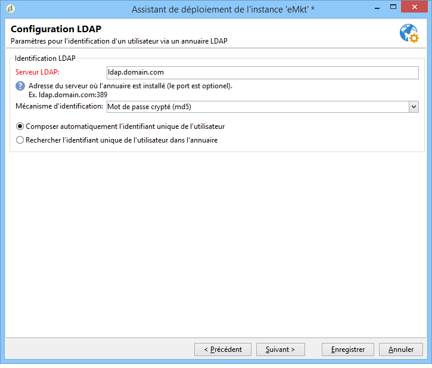
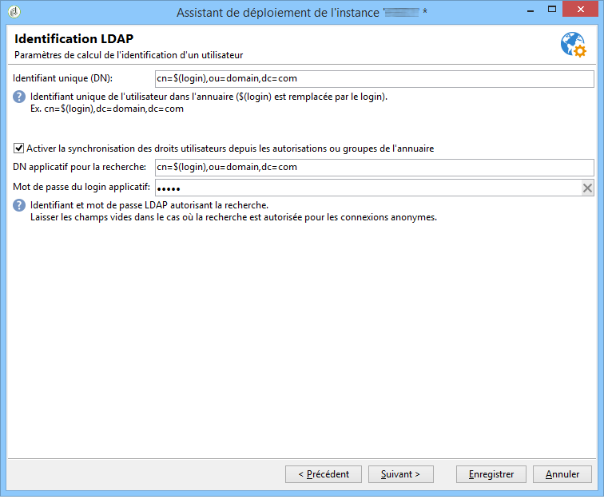
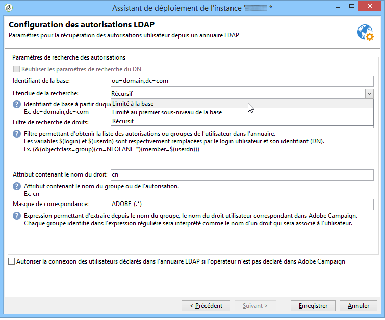
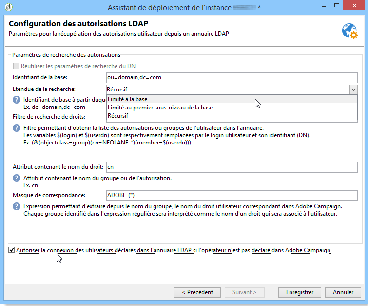
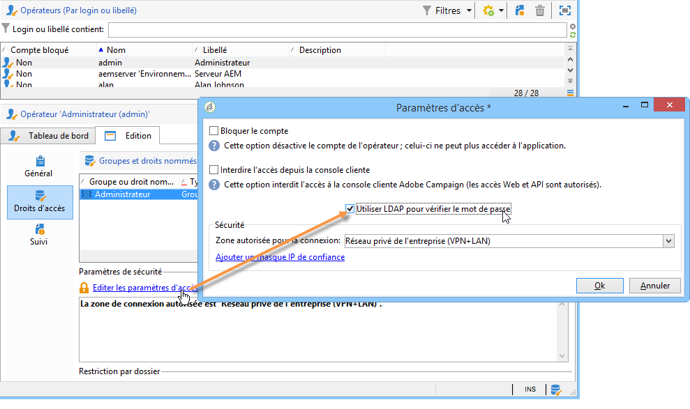

# Connexion par LDAP{#connecting-through-ldap}

## Configuration Campaign et LDAP {#configuring-campaign-and-ldap}

>[!NOTE]
>
>La configuration LDAP est uniquement possible pour les installations de type on-premise ou hybride.

La configuration LDAP est réalisée dans l&#39;assistant de déploiement. L&#39;option **[!UICONTROL Intégration LDAP]** doit être sélectionnée dans la première étape de configuration. Pour plus d&#39;informations, consultez la section [Assistant de déploiement](../../installation/using/deploying-an-instance.md#deployment-wizard).

La fenêtre correspondante permet de configurer l&#39;identification des utilisateurs Adobe Campaign via l&#39;annuaire LDAP spécifié.

* Indiquez l&#39;adresse du serveur LDAP dans le champ **[!UICONTROL Serveur LDAP]**. Vous pouvez ajouter le numéro de port. Par défaut, le port utilisé est le 389.
* Sélectionnez dans la liste déroulante le mécanisme d&#39;authentification des utilisateurs :

   * Mot de passe crypté (**md5**)

      Mode par défaut.

   * Mot de passe en clair + SSL (**TLS**)

      Toute la procédure d&#39;authentification (mot de passe compris) est chiffrée. Le port sécurisé 636 ne doit pas être utilisé dans ce mode : Adobe Campaign passe automatiquement en mode sécurisé.

      Lorsque vous utilisez ce mode d&#39;authentification, sous Linux, le certificat est vérifié par la bibliothèque client openLDAP. Nous vous recommandons d&#39;utiliser un certificat SSL valide afin que la procédure d&#39;authentification soit chiffrée. Dans le cas contraire, les informations seront passées en clair.

      Le certificat est également vérifié sous Windows.

   * Windows NT LAN Manager (**NTLM**)

      Authentification propriétaire Windows. Le champ **[!UICONTROL Identifiant unique]** est utilisé pour le nom de domaine seulement.

   * Distributed Password Authentication (**DPA**)

      Authentification propriétaire Windows. Le champ **[!UICONTROL Identifiant unique]** n&#39;est utilisé que pour le nom de domaine (domaine.com).

   * Mot de passe en clair (plain text)

      Aucun chiffrement (utiliser en test uniquement).

* Choisissez le mode d&#39;identification des utilisateurs : **[!UICONTROL Composer automatiquement l&#39;identifiant unique de l&#39;utilisateur]** (voir l&#39;étape [Calcul de l&#39;identifiant unique](#distinguished-name-calculation)) ou **[!UICONTROL Rechercher l&#39;identifiant unique de l&#39;utilisateur dans l&#39;annuaire]** (voir l&#39;étape [Recherche des identifiants](#searching-for-identifiers)).

## Compatibilité {#compatibility}

Les systèmes compatibles dépendent du mécanisme d&#39;authentification sélectionné. Le tableau suivant liste les compatibilités en fonction du système d&#39;exploitation du serveur Adobe Campaign et du type de serveur LDAP utilisé.

<table> 
 <thead> 
  <tr> 
   <th> </th> 
   <th> OpenLDAP  </th> 
   <th> Active Directory  </th> 
  </tr> 
 </thead> 
 <tbody> 
  <tr> 
   <td> md5  </td> 
   <td> Windows, Linux  </td> 
   <td> Linux  </td> 
  </tr> 
  <tr> 
   <td> TLS  </td> 
   <td> Linux  </td> 
   <td> Windows, Linux  </td> 
  </tr> 
  <tr> 
   <td> NTLM &amp; DPA  </td> 
   <td> </td> 
   <td> Windows  </td> 
  </tr> 
  <tr> 
   <td> plain text  </td> 
   <td> Windows, Linux  </td> 
   <td> Windows, Linux  </td> 
  </tr> 
 </tbody> 
</table>

## Calcul de l&#39;identifiant unique {#distinguished-name-calculation}

Si vous choisissez de calculer l&#39;identifiant unique (DN), l&#39;étape suivante de l&#39;assistant de déploiement permet de paramétrer le mode de calcul.

* Indiquez l&#39;identifiant unique de l&#39;utilisateur dans l&#39;annuaire (Distinguished Name - DN) dans le champ **[!UICONTROL Identifiant unique (DN)]**.

   **[!UICONTROL (login)]** sera remplacé par l&#39;identifiant de l&#39;opérateur Adobe Campaign.

   >[!CAUTION]
   >
   >Le paramètre **[!UICONTROL dc]** doit être en minuscules.

* Sélectionnez l&#39;option **[!UICONTROL Activer la synchronisation des droits utilisateurs depuis les autorisations ou groupes de l&#39;annuaire]** afin de synchroniser l&#39;association entre les groupes et les utilisateurs dans l&#39;annuaire LDAP et l&#39;association entre les groupes et les utilisateurs dans Adobe Campaign.

   Lorsque vous sélectionnez cette option, les champs **[!UICONTROL DN applicatif pour la recherche]** et **[!UICONTROL Mot de passe du login applicatif]** sont actifs.

   Si vous renseignez ces deux champs. Adobe Campaign se connectera alors au serveur LDAP avec son propre login et mot de passe. S&#39;ils sont vides, Adobe Campaign se connectera au serveur de manière anonyme.

## Recherche des identifiants {#searching-for-identifiers}

Si vous choisissez de faire une recherche sur l&#39;identifiant, l&#39;assistant de déploiement permet de paramétrer la recherche.

* Dans les champs **[!UICONTROL DN applicatif pour la recherche]** et **[!UICONTROL Mot de passe du login applicatif]** indiquez l&#39;identifiant et le mot de passe avec lesquels Adobe Campaign se connectera pour rechercher l&#39;identifiant. S&#39;ils sont vides, Adobe Campaign se connectera au serveur de manière anonyme.
* Les champs **[!UICONTROL Identifiant de la base]** et **[!UICONTROL Etendue de la recherche]** permettent de déterminer le sous-ensemble de l&#39;annuaire LDAP à partir duquel s&#39;effectuera la recherche.

   Sélectionnez le mode voulu dans la liste déroulante :

   

   1. **[!UICONTROL Récursif (mode par défaut)]**.

      La recherche s&#39;effectue sur toute l&#39;arborescence de l&#39;annuaire LDAP, à partir d&#39;un niveau donné.

   1. **[!UICONTROL Limité à la base]**.

      La recherche s&#39;effectue sur tous les attributs de l&#39;arborescence.

   1. **[!UICONTROL Limité au premier sous-niveau de la base]**.

      La recherche s&#39;effectue sur tous les attributs de l&#39;arborescence et le premier sous-niveau de l&#39;attribut.

* Le champ **[!UICONTROL Filtre]** vous donne la possibilité de spécifier un élément pour affiner l&#39;étendue de la recherche.

## Configuration des autorisations LDAP {#configuring-ldap-authorizations}

Cette fenêtre est proposée lorsque vous sélectionnez l&#39;option **[!UICONTROL Activer la synchronisation des droits utilisateurs depuis les autorisations ou groupes de l&#39;annuaire]**.

Vous devez fournir plusieurs paramètres pour retrouver le ou les groupes auxquels appartient l&#39;utilisateur et les autorisations dont il dispose par extension, à savoir :

* le champ **[!UICONTROL Identifiant de la base]**,
* le champ **[!UICONTROL Etendue de la recherche]**,

   >[!NOTE]
   >
   >Si vous avez choisi de rechercher l&#39;identifiant de l&#39;utilisateur, vous pouvez sélectionner **[!UICONTROL Réutiliser les paramètres de recherche du DN]** afin de reporter les valeurs choisies pour l&#39;identifiant de la base et l&#39;étendue de la recherche dans la fenêtre précédente.

* le champ **[!UICONTROL Filtre de recherche de droits]**, basé sur le login et l&#39;identifiant unique de l&#39;utilisateur,
* le champ **[!UICONTROL Attribut contenant le nom du groupe ou de l&#39;autorisation]** concernant l&#39;utilisateur,
* le champ **[!UICONTROL Masque de correspondance]** permettant d&#39;extraire le nom d&#39;un groupe dans Adobe Campaign et les droits qui lui sont associés. La recherche sur le nom se fait avec des expressions régulières.
* Sélectionnez **[!UICONTROL Autoriser la connexion des utilisateurs déclarés dans l&#39;annuaire LDAP si l&#39;opérateur n&#39;est pas déclaré dans Adobe Campaign]** afin que l&#39;utilisateur se voit attribuer automatiquement des droits d&#39;accès lors de sa connexion.

Cliquez sur **[!UICONTROL Enregistrer]** pour terminer la configuration de l&#39;instance.

## Gestion des opérateurs {#managing-operators}

Une fois le paramétrage validé, vous devez définir quels opérateurs Adobe Campaign seront gérés via l&#39;annuaire LDAP.

Pour utiliser l&#39;annuaire LDAP pour l&#39;authentification d&#39;un opérateur, éditez le profil de l&#39;opérateur et cliquez sur le lien **[!UICONTROL Editer les paramètres d&#39;accès]**. Sélectionnez l&#39;option **[!UICONTROL Utiliser LDAP pour vérifier le mot de passe]** : le champ **[!UICONTROL Mot de passe]** sera alors grisé pour cet opérateur.

## Cas pratiques {#use-cases}

Cette section propose quelques cas pratiques simples afin de réaliser les paramétrages les mieux adaptés à vos besoins.

1. Un utilisateur existe dans l&#39;annuaire LDAP mais n&#39;a pas été créé dans Adobe Campaign.

   Adobe Campaign peut être configuré afin que l&#39;utilisateur accède à la plateforme en utilisant son authentification LDAP. Pour cela, Adobe Campaign doit pouvoir contrôler la validité du couple identifiant/mot de passe dans l&#39;annuaire LDAP. L&#39;opérateur pourra ainsi être créé à la volée dans Adobe Campaign : pour cela, cochez l&#39;option **[!UICONTROL Autoriser la connexion des utilisateurs déclarés dans l&#39;annuaire LDAP si l&#39;opérateur n&#39;est pas déclaré dans Adobe Campaign]**. Dans ce cas, la synchronisation des groupes doit également être paramétrée : l&#39;option **[!UICONTROL Activer la synchronisation des droits utilisateurs depuis les autorisations ou groupes de l&#39;annuaire]** doit être sélectionnée.

1. Un utilisateur existe dans Adobe Campaign mais n&#39;a pas été créé dans l&#39;annuaire LDAP.

   Il ne pourra alors pas se connecter à Adobe Campaign.

1. Un groupe n&#39;existe pas dans Adobe Campaign mais seulement dans l&#39;annuaire LDAP.

   Ce groupe ne sera pas créé dans Adobe Campaign. Vous devez créer le groupe et synchroniser les groupes afin de permettre la correspondance via l&#39;option **[!UICONTROL Activer la synchronisation des droits utilisateurs depuis les autorisations ou groupes de l&#39;annuaire]**.

1. Des groupes existent dans Adobe Campaign et l&#39;utilisation de l&#39;annuaire LDAP est activée a posteriori : les groupes d&#39;utilisateurs côté Adobe Campaign ne sont pas remplacés automatiquement par le contenu des groupes LDAP. De même, si un groupe n&#39;existe que dans Adobe Campaign, aucun utilisateur LDAP ne peut y être ajouté avant que le groupe ne soit créé et synchronisé côté LDAP.

   Les groupes ne sont jamais créés à la volée, ni côté Adobe Campaign, ni côté LDAP. Ils doivent être créés unitairement à la fois dans Adobe Campaign et dans l&#39;annuaire LDAP.

   Les noms des groupes dans l&#39;annuaire LDAP doivent correspondre aux noms des groupes Adobe Campaign. Leur masque d&#39;association est défini dans la dernière étape de configuration de l&#39;assistant de déploiement : Adobe Campaign_(.&#42;), par exemple.
