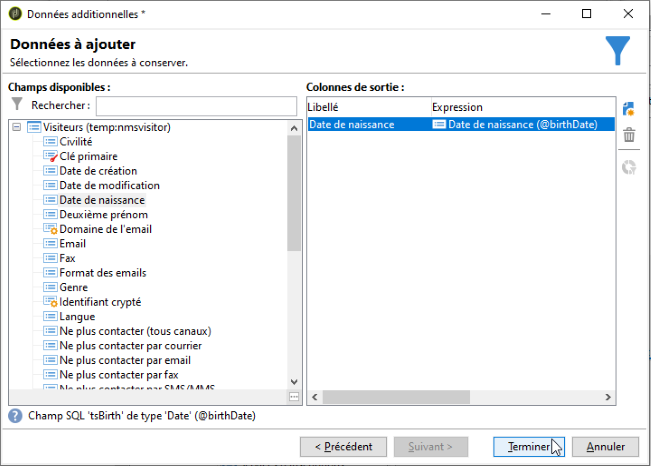

# Connexion à la base de données {#connecting-to-the-database}

Pour permettre la connexion à la base de données externe, vous devez indiquer les paramètres de connexion, c&#39;est-à-dire la source de données visée et le nom de la table dont les données doivent être chargées.

>[!CAUTION]
>
>L&#39;utilisateur Adobe Campaign doit disposer d&#39;un minimum de droits sur la base externe et le serveur applicatif Adobe Campaign pour exploiter les données d&#39;une base externe. Voir à ce sujet la section [Droits d’accès à la base externe](../../installation/using/remote-database-access-rights.md).
>
>Pour éviter tout dysfonctionnement, les opérateurs qui accèdent à des données distantes communes doivent évoluer dans des espaces de travail disjoints.

## Créer une connexion partagée {#creating-a-shared-connection}

Pour activer une connexion à une base de données externe partagée, tant que cette connexion est active, la base de données est accessible via Adobe Campaign.

1. Le paramétrage doit être défini préalablement via le nœud **[!UICONTROL Administration > Plateforme > Comptes externes]**.
1. Cliquez sur le lien **[!UICONTROL Nouveau]** et sélectionnez le type **[!UICONTROL Base de données externe]**.
1. Définissez les paramètres **[!UICONTROL Connexion]** de la base de données externe.

   Pour les connexions à une base de données de type **ODBC**, le champ **[!UICONTROL Serveur]** doit contenir le nom de la source de données ODBC, et non le nom du serveur. De plus, certains paramétrages supplémentaires peuvent être nécessaires en fonction des bases de données utilisées. Pour plus d&#39;informations, consultez la section [Configurations spécifiques par type de base de données](../../installation/using/configure-fda.md).

1. Une fois les paramètres renseignés, cliquez sur le bouton **[!UICONTROL Tester la connexion]** pour les valider.

   

1. Si nécessaire, désélectionnez l&#39;option **[!UICONTROL Activé]** pour désactiver l&#39;accès à cette base de données sans supprimer son paramétrage.
1. Pour permettre à Adobe Campaign d&#39;accéder à cette base, vous devez déployer les fonctions SQL. Cliquez sur l&#39;onglet **[!UICONTROL Paramètres]** puis sur le bouton **[!UICONTROL Déployer les fonctions]**.

   

Vous pouvez définir des tablespaces de travail spécifiques pour les tables et pour les index dans l&#39;onglet **[!UICONTROL Paramètres]**.

## Créer une connexion ponctuelle {#creating-a-temporary-connection}

Vous pouvez définir directement une connexion à une base de données externe à partir des activités de workflow. Dans ce cas, il s&#39;agira d&#39;une base externe locale, réservée à une utilisation dans le cadre du workflow courant : elle ne sera pas enregistrée dans les comptes externes. Ce type de connexion ponctuelle peut être créée dans différentes activités du workflow, notamment l&#39;activité de **[!UICONTROL Requête]**, l&#39;activité de **[!UICONTROL Chargement (SGBD)]**, l&#39;activité d&#39;**[!UICONTROL Enrichissement]** ou l&#39;activité de **[!UICONTROL Partage]**.

>[!CAUTION]
>
>Ce type de paramétrage n&#39;est pas recommandé mais peut être utilisé ponctuellement pour collecter des données. Toutefois, privilégiez la création d&#39;un compte externe, comme présenté dans la section [Créer une connexion partagée](#creating-a-shared-connection).

Par exemple, dans l&#39;activité de requête, les étapes sont les suivantes pour créer une connexion ponctuelle à une base externe :

1. Cliquez sur le lien **[!UICONTROL Ajouter des données...]** et sélectionnez l&#39;option **[!UICONTROL Données externes]**.
1. Choisissez l&#39;option **[!UICONTROL En définissant localement la source de données]**.

   

1. Sélectionnez le moteur de la base de données cible dans la liste déroulante. Saisissez le nom du server et renseignez les paramètres d&#39;authentification.

   Indiquez également le nom de la base externe.

   

   Cliquez sur le bouton **[!UICONTROL Suivant]**.

1. Sélectionnez la table où sont stockées les données.

   Vous pouvez saisir le nom de la table directement dans le champ correspondant ou cliquer sur l’icône d’édition pour accéder à la liste des tables de la base de données.

   

1. Cliquez sur le bouton **[!UICONTROL Ajouter]** pour définir un ou plusieurs champs de réconciliation entre les données de la base de données externe et les données de la base de données d’Adobe Campaign. Les icônes **[!UICONTROL Modifier l’expression]** du **[!UICONTROL Champ distant]** et du **[!UICONTROL Champ local]** permettent d’accéder à la liste des champs de chacune des tables.

   

1. Au besoin, indiquez une condition de filtrage et le mode de tri des données.
1. Sélectionnez les données supplémentaires à collecter dans la base de données externe. Pour ce faire, double-cliquez sur le ou les champs que vous souhaitez ajouter afin de les afficher dans les **[!UICONTROL colonnes de sortie]**.

   

   Cliquez sur le bouton **[!UICONTROL Terminer]** pour valider ce paramétrage.

## Connexion sécurisée {#secure-connection}

>[!NOTE]
>
>La connexion sécurisée est uniquement disponible pour PostgreSQL.

Vous pouvez sécuriser l&#39;accès à une base externe lors du paramétrage d&#39;un compte externe FDA.

Pour cela, ajoutez &quot;**:ssl**&quot; à la suite de l&#39;adresse du serveur et du port utilisé. Par exemple : **192.168.0.52:4501:ssl**.

Les données seront ainsi envoyées via le protocole sécurisé SSL.

## Configurations supplémentaires {#additional-configurations}

Au besoin, vous pouvez créer le schéma nécessaire à l&#39;exploitation des données contenues dans une base externe. De même, Adobe Campaign permet de définir un mapping sur les données d&#39;une table externe. Ces paramétrages sont généraux et ne s&#39;appliquent pas exclusivement au contexte des workflows.

>[!NOTE]
>
>Pour plus d&#39;informations sur la création de schémas dans Adobe Campaign et la définition d&#39;un nouveau mapping des données, consultez [cette page](../../configuration/using/about-schema-edition.md).
