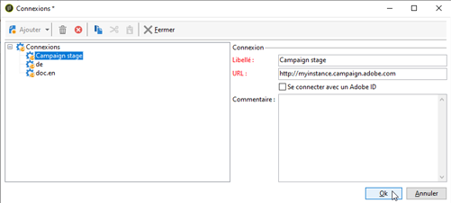

# Création et connexion à une instance{#creating-an-instance-and-logging-on}

Pour créer une nouvelle instance ainsi que la base de données Adobe Campaign, la procédure est la suivante :

1. Créer la connexion,
1. S&#39;y connecter pour créer l&#39;instance associée,
1. Créer et paramétrer la base de données.

>[!NOTE]
>
>Seul l&#39;identifiant **interne** peut effectuer ces opérations. Pour plus d’informations à ce sujet, consultez [cette section](../../installation/using/configuring-campaign-server.md#internal-identifier).

Lorsque la console Adobe Campaign est démarrée, vous accédez à une page de connexion.

Pour créer une instance, procédez comme suit :

1. Cliquez sur le lien situé dans le coin supérieur droit des champs d&#39;informations d&#39;identification pour accéder à la fenêtre de configuration de la connexion. Ce lien peut être **[!UICONTROL Nouveau...]** ou le nom d&#39;une instance existante.

   

1. Cliquez sur le menu **[!UICONTROL Ajouter > Connexion]** et saisissez le libellé et l&#39;URL du serveur applicatif Adobe Campaign.

   

1. Définissez une connexion vers votre serveur applicatif Adobe Campaign à partir d&#39;une URL. Utilisez soit un DNS ou un alias de la machine, soit votre adresse IP.

   Par exemple, vous pouvez utiliser une URL de type `https://<machine>.<domain>.com`.

   >[!CAUTION]
   >
   >Seuls les caractères `[a-z]`, `[A-Z]`, `[0-9]`, le tiret (-) et le point sont autorisés dans l&#39;URL de connexion. 

1. Cliquez sur **[!UICONTROL OK]** pour valider ce paramétrage : vous pouvez alors démarrer le processus de création de l&#39;instance.
1. Dans la fenêtre **[!UICONTROL Paramètres de connexion]**, saisissez le nom d’utilisation **interne** et son mot de passe associé afin de vous connecter au serveur applicatif Adobe Campaign. Une fois la connexion effectuée, vous accédez à l’assistant de création d’instance pour déclarer une nouvelle instance.
1. Dans le champ **[!UICONTROL Nom]**, saisissez le **nom de l&#39;instance**. Ce nom étant utilisé pour générer un fichier de configuration **config-`<instance>`.xml** et dans les paramètres de ligne de commande pour identifier l&#39;instance, veillez à choisir un nom court sans caractères spéciaux. Par exemple : **eMarketing**.

   

   Le nom de l&#39;instance accolé au nom de domaine ne doit pas dépasser 40 caractères. Ceci permet de limiter la taille des en-têtes &quot;Message-ID&quot; et d&#39;éviter qu&#39;un message ne soit considéré comme un spam, par exemple par un outil comme SpamAssassin.

1. Dans les champs **[!UICONTROL Masques DNS]**, saisissez la **liste des masques DNS** auxquels l&#39;instance doit être attachée. Le serveur Adobe Campaign utilise le nom d&#39;hôte (hostname) qui apparaît dans les requêtes HTTP pour déterminer quelle instance atteindre.

   Le nom d&#39;hôte (hostname) est contenu entre la chaîne **https://** et la première barre oblique **/** de l&#39;adresse du serveur.

   Vous pouvez définir ici une liste de valeurs séparées par des virgules.

   Les caractères ? et &#42; peuvent être utilisés comme caractères génériques pour remplacer un ou plusieurs caractères (DNS, port, etc.). Par exemple, la valeur **demo&#42;** fonctionne avec « https://demo », ainsi qu’avec « https://demo:8080 » ou encore « https://demo2 ».

   Les noms utilisés doivent être définis dans votre DNS. Vous pouvez également indiquer la correspondance entre un nom DNS et une adresse IP dans le fichier **c:/windows/system32/drivers/etc/hosts** sous Windows et dans le fichier **/etc/hosts** sous Linux. Pour vous connecter à l&#39;instance choisie, vous devez donc modifier les paramètres de connexion afin d&#39;utiliser ce nom DNS.

   Le serveur doit être identifié par ce nom, notamment pour le chargement des images dans les e-mails.

   De plus, le serveur doit pouvoir se connecter à lui-même avec ce nom, si possible via une adresse de bouclage (loopback) - 127.0.0.1 -, notamment pour permettre l’export des rapports au format PDF.

1. Dans la liste déroulante **[!UICONTROL Langue]**, sélectionnez la **langue de l’instance** : anglais (US), anglais (UK), français ou japonais.

   Les différences entre l’anglais américain (US) et l’anglais britannique (UK) sont présentées dans la [documentation de Campaign v8 (console)](https://experienceleague.adobe.com/fr/docs/campaign/campaign-v8/new/campaign-ui).

   >[!CAUTION]
   >
   >La langue de l&#39;instance ne peut plus être modifiée après cette étape. Les instances d&#39;Adobe Campaign ne sont pas multilingues : vous ne pouvez pas passer d&#39;une langue à une autre.

1. Cliquez sur **[!UICONTROL Ok]** pour valider la déclaration de l&#39;instance. Vous devez alors vous reconnecter pour procéder à la déclaration de la base de données.

   >[!NOTE]
   >
   >Il est possible de créer l&#39;instance à partir de la ligne de commande. Pour plus d&#39;informations, consultez la section [Lignes de commande](../../installation/using/command-lines.md).
