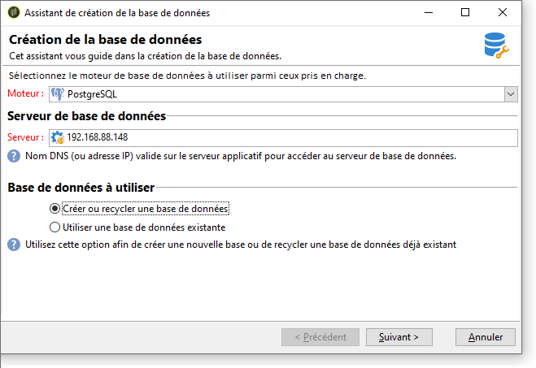
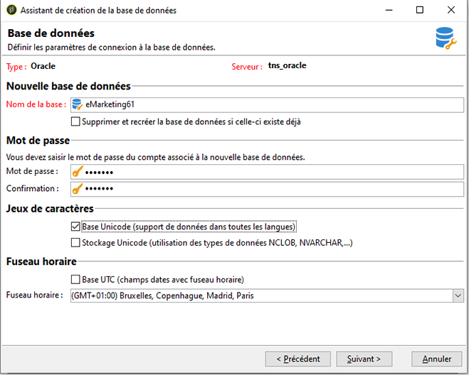

# Création et paramétrage de la base de données{#creating-and-configuring-the-database}

Lors de la création de la base de données, Adobe Campaign propose deux options distinctes :

1. Créer ou recycler une base de données : choisissez cette option lorsque vous souhaitez créer une base de données ou réutiliser une base existante. Voir [1er cas : créer/recycler une base](#case-1--creating-recycling-a-database).
1. Utiliser une base existante : choisissez cette option lorsque une base vide a déjà été créée par votre administrateur et que vous souhaitez l’utiliser, ou pour étendre la structure d’une base de données existante. Voir [2e cas : utiliser une base existante](#case-2--using-an-existing-database).

Les étapes de paramétrage sont présentés ci-après.

>[!CAUTION]
>
>Les noms de la base de données, des utilisateurs ou des schémas ne doivent pas commencer par un chiffre, ni utiliser de caractères spéciaux.
>
>Seul l’identifiant **interne** peut effectuer ces opérations. Pour plus d’informations à ce sujet, consultez [cette section](../../installation/using/configuring-campaign-server.md#internal-identifier).

## 1er cas : créer/recycler une base {#case-1--creating-recycling-a-database}

Les étapes pour créer une base de données ou recycler une base existante sont présentées ci-après. Certains paramétrages dépendent du moteur de base de données utilisé.

Ces étapes sont les suivantes :

* [Etape 1 - Sélection du moteur de base de données](#step-1---selecting-the-database-engine),
* [Etape 2 - Connexion au serveur](#step-2---connecting-to-the-server),
* [Etape 3 - Connexion et caractéristiques de la base de données](#step-3---connection-and-characteristics-of-the-database),
* [Etape 4 - Packages à installer](#step-4---packages-to-install),
* [Etape 5 - Etapes de la création](#step-5---creation-steps),
* [Etape 6 - Lancement de la création de la base](#step-6---creating-the-database).

### Etape 1 - Sélection du moteur de base de données {#step-1---selecting-the-database-engine}

Sélectionnez le moteur de base de données parmi ceux proposés dans la liste déroulante.


Les bases de données prises en charge sont répertoriées dans la [matrice de compatibilité](../../rn/using/compatibility-matrix.md) de Campaign.

Identifiez le serveur et sélectionnez le type d&#39;opération à réaliser. Ici : **[!UICONTROL Créer ou recycler une base de données]**.


Selon le moteur de base sélectionné, les informations d&#39;identification du serveur diffèrent.

* Pour un moteur **Oracle**, renseignez le **nom TNS** qui a été défini sur le serveur applicatif.
* Pour un **PostgreSQL** , vous devez indiquer le nom DNS (ou l’adresse IP) défini sur le serveur applicatif pour accéder au serveur de base de données.
* Pour un **Serveur Microsoft SQL**, vous devez définir : le nom DNS (ou l&#39;adresse IP) défini sur le serveur applicatif pour accéder au serveur de base de données : **DNS** ou **DNS`\<instance>`** (mode instance),

  >[!CAUTION]
  >
  > Depuis la version 20.3, l&#39;authentification Windows NT est désactivée. **[!UICONTROL L&#39;authentification SQL Server]** est désormais le seul mode d&#39;authentification disponible pour Microsoft SQL Server. [En savoir plus](../../rn/using/deprecated-features.md)

  

### Etape 2 - Connexion au serveur {#step-2---connecting-to-the-server}

Dans la fenêtre **[!UICONTROL Accès au serveur]**, définissez les paramètres de connexion au serveur de la base de données.


Pour cela, saisissez le nom et le mot de passe d&#39;un **compte système d&#39;administration** qui possède les autorisations nécessaires pour créer des bases, soit :

* **system** pour une base Oracle,
* **sa** pour une base Microsoft SQL Server,
* **postgres** pour une base PostgreSQL,

### Etape 3 - Connexion et caractéristiques de la base de données {#step-3---connection-and-characteristics-of-the-database}

L&#39;étape suivante permet de configurer les paramètres de connexion à la base de données.



Vous devez définir les paramètres suivants :

* Indiquez le nom de la base de données à créer.
* Saisissez le mot de passe du compte associé à cette base.
* Indiquez si la base doit être Unicode ou non.

  L&#39;option **[!UICONTROL Base Unicode]** permet de stocker tous les types de caractères en Unicode, quelle que soit la langue.

  >[!NOTE]
  >
  >Pour une base Oracle, l&#39;option **[!UICONTROL Stockage Unicode]** permet d&#39;utiliser des champs de type **NCLOB**, **NVARCHAR**, etc.
  > 
  >Si vous ne sélectionnez pas cette option, le jeu de caractères (charset) de la base Oracle doit permettre le stockage des données dans toutes les langues (AL32UTF8 est recommandé).

* Choisissez le fuseau horaire de la base de données et indiquez éventuellement si la base doit être en UTC, lorsque cette option est disponible.

  Voir à ce sujet la section [Gestion des fuseaux horaires](../../installation/using/time-zone-management.md).

### Etape 4 - Packages à installer {#step-4---packages-to-install}

Sélectionnez les packages que vous souhaitez installer.

Consultez votre accord de licence afin de vérifier les options et solutions que vous avez acquises, par exemple &quot;Interaction&quot; ou &quot;Social Marketing&quot;.


### Etape 5 - Etapes de la création {#step-5---creation-steps}

La fenêtre **[!UICONTROL Etapes de la création]** offre notamment la possibilité de vérifier et éditer le script SQL utilisé pour créer les tables.


* Pour une base Oracle, Microsoft SQL Server ou PostgreSQL, l&#39;administrateur de bases de données peut par ailleurs déterminer ici des **paramètres de stockage** à utiliser lors de la création des objets base de données.

  Ces paramètres reçoivent les noms exacts des tablespaces (avertissement : respecte la casse). Ils sont respectivement stockés dans le nœud **[!UICONTROL Administration > Plateforme > Options]** dans les options suivantes (voir [cette section](../../installation/using/configuring-campaign-options.md#database)) :

   * **WdbcOptions_TableSpaceUser**: tables utilisateur basées sur un schéma
   * **WdbcOptions_TableSpaceIndex**: index des tables utilisateur basées sur un schéma
   * **WdbcOptions_TableSpaceWork**: tables de travail sans schéma
   * **WdbcOptions_TableSpaceWorkIndex**: index des tables de travail sans schéma

* Pour une base Oracle, l&#39;utilisateur Adobe Campaign doit avoir accès aux librairies Oracle, typiquement en étant membre du groupe **oinstall**.
* L&#39;option **[!UICONTROL Fixer ou changer le mot de passe administrateur]** permet de renseigner le mot de passe associé à l&#39;opérateur Adobe Campaign ayant les droits administrateur.

  Il est vivement recommandé de définir le mot de passe du compte administrateur Adobe Campaign afin de ne pas créer de faille de sécurité.

### Etape 6 - Lancement de la création de la base {#step-6---creating-the-database}

La dernière étape de l&#39;assistant permet de lancer la création de la base de données. Pour cela, cliquez sur le bouton **[!UICONTROL Démarrer]**.


Une fois la création de la base de données terminée, vous pourrez vous reconnecter afin de finaliser le paramétrage de l&#39;instance.

Vous devez à présent lancer l’assistant de déploiement pour terminer la configuration de l’instance. Voir [Assistant de déploiement](../../installation/using/deploying-an-instance.md#deployment-wizard).

Les paramètres de connexion à la base de données associés à l’instance sont regroupés dans le fichier **`/conf/config-<instance>.xml`** enregistré dans le répertoire d’installation d’Adobe Campaign.

Exemple de configuration Microsoft SQL Server sur la base base61 associée au compte « campaign » avec son mot de passe chiffré :

```
<dbcnx encrypted="1" login="campaign:myBase" password="myPassword" provider="DB" server="dbServer"/>
```

## 2e cas : utiliser une base existante {#case-2--using-an-existing-database}

La base de données, ainsi que l&#39;utilisateur doivent avoir été créés par l&#39;administrateur de base de données et les droits d&#39;accès correctement configurés.

Par exemple, pour une base Oracle, les droits minimum requis sont : GRANT CONNECT, RESOURCE et UNLIMITED TABLESPACE.

Pour utiliser une base existante, les étapes de configuration sont les suivantes :

* [Etape 1 - Choix du moteur de base de données](#step-1---choosing-the-database-engine),
* [Etape 2 - Paramètres de connexion à la base de données](#step-2---database-connection-settings),
* [Etape 3 - Packages à installer](#step-3---packages-to-install),
* [Etape 4 - Etapes de la création](#step-4---creation-steps),
* [Etape 5 - Lancement de la création de la base](#step-5---creating-the-database).

### Etape 1 - Choix du moteur de base de données {#step-1---choosing-the-database-engine}

Sélectionnez le moteur de base de données parmi ceux proposés dans la liste déroulante.


Identifiez le serveur et sélectionnez le type d&#39;opération à réaliser. Ici : **[!UICONTROL Utiliser une base de données existante]**.


Selon le moteur de base sélectionné, les informations d&#39;identification du serveur diffèrent.

* Pour un moteur **Oracle**, renseignez le **nom TNS** qui a été défini sur le serveur applicatif.
* Pour un **PostgreSQL** , vous devez indiquer le nom DNS (ou l’adresse IP) défini sur le serveur applicatif pour accéder au serveur de base de données.
* Pour un moteur **Microsoft SQL Server**, vous devez définir :

   1. le nom DNS (ou l&#39;adresse IP) défini sur le serveur applicatif pour accéder au serveur de base de données,
   1. le mode de sécurité pour l’accès à Microsoft SQL Server : **[!UICONTROL Authentification SQL Server]** ou **[!UICONTROL Authentification Windows NT]**.

      

### Etape 2 - Paramètres de connexion à la base de données {#step-2---database-connection-settings}

Dans la fenêtre **[!UICONTROL Base de données]**, définissez les paramètres de connexion à la base de données.


Vous devez définir les paramètres suivants :

* Saisissez le nom de la base de données à utiliser,
* Saisissez le nom et le mot de passe du compte associé à cette base,

  >[!NOTE]
  >
  >Assurez-vous que le nom du schéma et le nom d’utilisateur correspondent. La méthode recommandée pour créer une base de données est la console cliente de Campaign.
  >Pour une base Oracle, il n&#39;est pas nécessaire de saisir le nom du compte.

* Indiquez si la base doit être Unicode ou non.

### Etape 3 - Packages à installer {#step-3---packages-to-install}

Sélectionnez les packages que vous souhaitez installer.

Consultez votre accord de licence afin de vérifier les options et solutions que vous avez acquises, par exemple l&#39;option &quot;Gestion de contenu&quot; ou la solution &quot;Gestion des ressources marketing&quot;.


### Etape 4 - Etapes de la création {#step-4---creation-steps}

La fenêtre **[!UICONTROL Etapes de la création]** offre notamment la possibilité de vérifier et éditer le script SQL utilisé pour créer les tables.


* Pour une base Oracle, Microsoft SQL Server, PostgreSQL, l&#39;administrateur de bases de données peut par ailleurs déterminer ici des **paramètres de stockage** à utiliser lors de la création des objets base de données.
* Pour une base Oracle, l&#39;utilisateur Adobe Campaign doit avoir accès aux librairies Oracle, typiquement en étant membre du groupe **oinstall**.
* L&#39;option **[!UICONTROL Fixer ou changer le mot de passe administrateur]** permet de renseigner le mot de passe associé à l&#39;opérateur Adobe Campaign ayant les droits administrateur.

  Il est vivement recommandé de définir le mot de passe du compte administrateur Adobe Campaign afin de ne pas créer de faille de sécurité.

### Etape 5 - Lancement de la création de la base {#step-5---creating-the-database}

La dernière étape de l&#39;assistant permet de lancer la création de la base de données. Pour cela, cliquez sur le bouton **[!UICONTROL Démarrer]**.


Une fois la création de la base de données terminée, vous pourrez vous reconnecter afin de finaliser le paramétrage de l&#39;instance.

Vous devez à présent lancer l’assistant de déploiement pour terminer la configuration de l’instance. Voir [Assistant de déploiement](../../installation/using/deploying-an-instance.md#deployment-wizard).

Les paramètres de connexion à la base de données associés à l’instance sont regroupés dans le fichier **`/conf/config-<instance>.xml`** enregistré dans le répertoire d’installation d’Adobe Campaign.

Exemple de configuration Microsoft SQL Server sur la base base61 associée au compte « campaign » avec son mot de passe chiffré :

```
<dbcnx encrypted="1" login="campaign:myBase" password="myPassword" provider="DB" server="dbServer"/>
```
