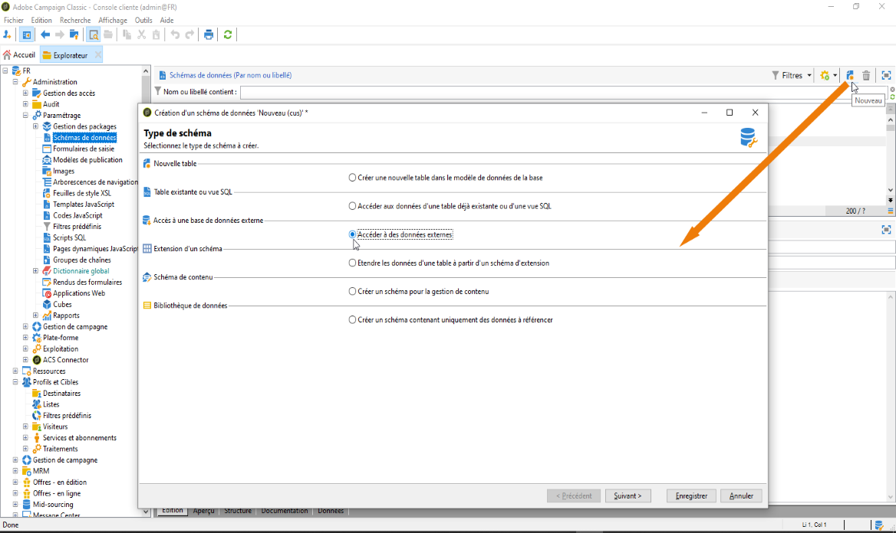
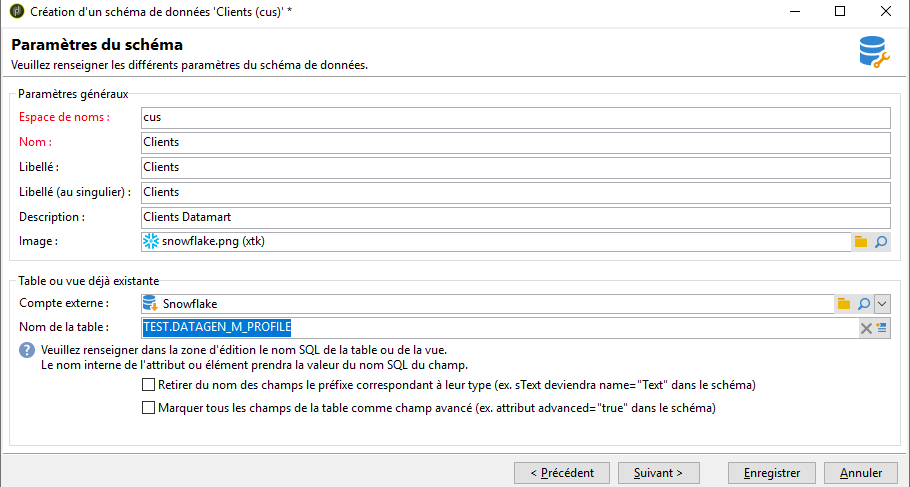
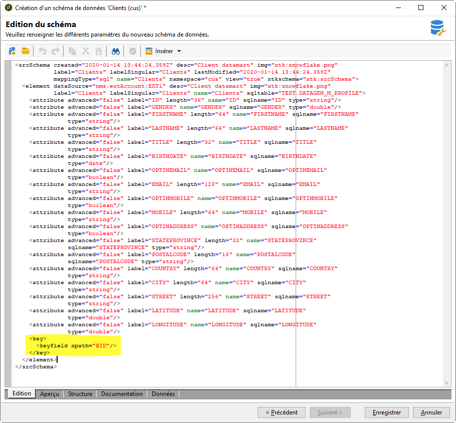

# Créer le schéma des données {#creating-the-data-schema}

Pour créer un schéma sur une base de données externe :

1. Cliquez sur le bouton **[!UICONTROL Nouveau]** au-dessus de la liste des schémas de données et sélectionnez **[!UICONTROL Accéder à des données externes]**.

   

1. Saisissez un **[!UICONTROL Espace de noms]** et un **[!UICONTROL Nom]** pour le schéma, puis sélectionnez le **[!UICONTROL Compte externe]** qui permettra la connexion à la base de données. Cela permet d’accéder à la liste des tables disponibles dans la base externe.

   

1. Dans le champ **[!UICONTROL Nom de la table]**, choisissez la table contenant les données à collecter.

   Snowflake vous permet de sélectionner vos vues ici si l’utilisateur de la base de données a reçu les privilèges appropriés. Notez que lorsque vous utilisez des vues, Adobe Campaign ne peut pas générer automatiquement le schéma XML. Vous devez donc le créer vous-même. Pour plus d’informations sur les vues, consultez la [documentation Snowflake](https://docs.snowflake.com/fr/user-guide/views-introduction.html).

   

1. Cliquez sur **[!UICONTROL OK]** pour confirmer. Adobe Campaign détecte automatiquement la structure de la table sélectionnée et génère le schéma logique. Veuillez noter qu&#39;Adobe Campaign ne génère pas de liens.

1. Cliquez sur **[!UICONTROL Enregistrer]** pour en valider la création.

   >[!CAUTION]
   >
   >Avec Snowflake, une clé primaire est obligatoire.

   

Les index sont crées automatiquement lors d&#39;un mapping de table (mapping standard ou FDA).
