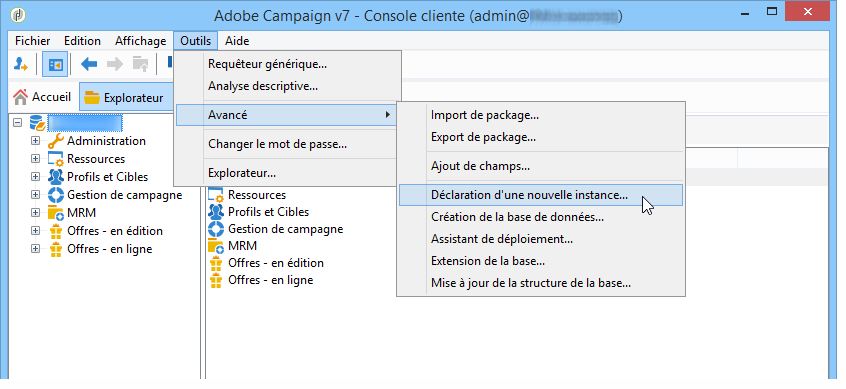

# Création de nouvelles instances{#creating-new-instances}

Une fois Adobe Campaign installé et l&#39;instance créée, vous pouvez ajouter une nouvelle instance à partir de la console. Ce mode de création est proposé notamment pour créer des instances de tracking, sans accès console.

Pour cela, connectez-vous à une base de données existante puis respectez les étapes suivantes :

1. Déclarez une nouvelle instance

   Utilisez le menu **[!UICONTROL Outils > Avancé > Déclaration d&#39;une nouvelle instance...]** pour lancer l&#39;assistant.

   

   Spécifiez les paramètres de la nouvelle instance. Pour plus d&#39;informations, consultez la section [Création et connexion à une instance](../../installation/using/creating-an-instance-and-logging-on.md).
