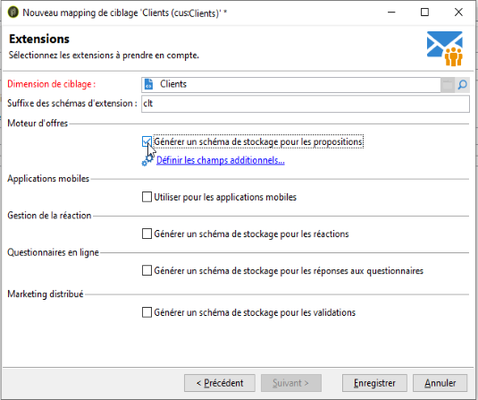

# Définition du mapping des données externe {#defining-data-mapping}

Adobe Campaign permet de définir un mapping sur les données d&#39;une table externe.

Pour cela, une fois que le schéma de la table externe a été créé, vous devez créer un nouveau mapping de diffusion afin d&#39;utiliser les données contenues dans cette table en tant que cible des actions de diffusions.

Pour cela, les étapes sont les suivantes :

1. Créez un nouveau mapping de diffusion et sélectionnez la dimension de ciblage, par exemple le schéma que vous venez de créer.

   

1. Indiquez les champs où sont stockées les informations nécessaires à la diffusion (nom, prénom, email, adresse postale, etc.).

   

1. Indiquez les paramètres relatifs au stockage des informations, et notamment le suffixe des schémas d&#39;extension, afin de les identifier facilement.

   

   Vous pouvez choisir de stocker ou non les exclusions (**excludelog**), avec les messages (**broadlog**) ou dans une table distincte.

   Vous pouvez également gérer ou non le tracking pour ce mapping de diffusion (**trackinglog**).

1. Sélectionnez ensuite les extensions qui seront prises en compte. Le type d&#39;extension dépend des paramètres et options de votre plateforme (consultez votre contrat de licence).

   

   Cliquez sur le bouton **[!UICONTROL Enregistrer]** pour lancer la création du mapping de diffusion : toutes les tables liées sont créées automatiquement, selon les paramètres sélectionnés.
