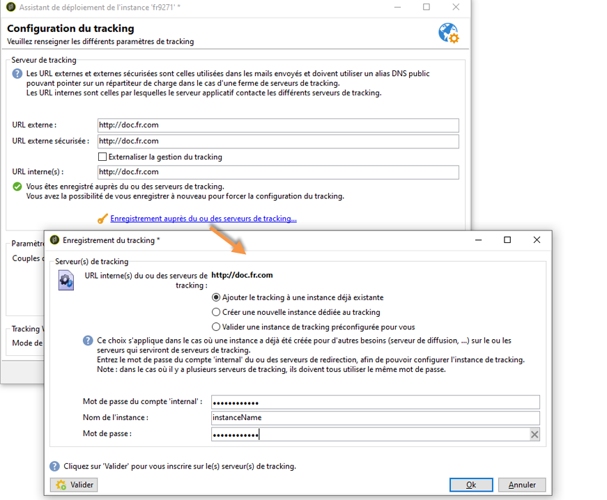
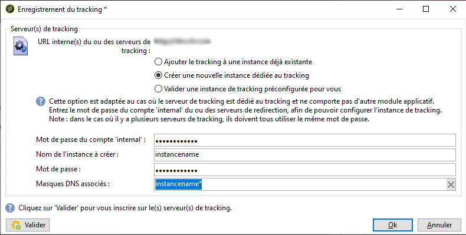

# Déploiement d’une instance{#deploying-an-instance}

>[!NOTE]
>
>Pour les déploiements hébergés par Adobe, les configurations côté serveur ne peuvent être effectuées que par Adobe. Pour en savoir plus sur les différents déploiements, consultez la section [Modèles d’hébergement](../../installation/using/hosting-models.md) ou [cette page](../../installation/using/capability-matrix.md).

## Assistant de déploiement {#deployment-assistant}

L’assistant graphique accessible à partir de la console cliente Adobe Campaign permet de définir les paramètres de l’instance sur laquelle vous allez vous connecter.

Pour démarrer l’assistant de déploiement, sélectionnez **Outils > Avancé > Assistant de déploiement**.


Les étapes de configuration sont les suivantes :

1. [Paramètres généraux](#general-parameters)
1. [Paramètres du canal email](#email-channel-parameters)
1. [Gestion des mails rebonds](#managing-bounced-emails)
1. [Paramétrage du tracking](#tracking-configuration)
1. [Paramètres du canal mobile](#mobile-channel-parameters)
1. [Options régionales](#regional-settings)
1. [Accès depuis Internet](#access-from-the-internet)
1. [Gestion des ressources publiques](#managing-public-resources)
1. [Purge des données](#purging-data)

## Paramètres généraux {#general-parameters}

La première étape de l’assistant de déploiement permet de renseigner les informations générales relatives à l’instance.


### Informations générales {#general-information}

La section inférieure de la fenêtre permet de sélectionner les options à activer.

* **[!UICONTROL Identifiant client pour la facturation]** : il peut s’agir par exemple du nom de l’instance et du numéro de version.
* **[!UICONTROL Nom usuel du client]** : saisissez le nom de votre société. Cette information est notamment utilisée notamment dans les liens de désabonnement.
* **[!UICONTROL Espace de noms]** : saisissez ici un identifiant court, en minuscules. L&#39;objectif est de distinguer votre configuration spécifique de la configuration d&#39;usine en cas de mise à niveau. L’espace de noms par défaut est **cus** - pour customer (client).

### Options techniques {#technical-options}

La section inférieure de la fenêtre permet de sélectionner les options à activer.

Les options disponibles sont les suivantes :

* **[!UICONTROL Canal e-mail]** : pour activer la diffusion par e-mail. Voir [Paramètres du canal email](#email-channel-parameters).
* **[!UICONTROL Tracking]** : pour activer le tracking de la population cible (ouvertures et clics). Voir [Paramétrage du tracking](#tracking-configuration).
* **[!UICONTROL Gestion des e-mails rebonds]** : pour définir le compte POP utilisé pour récupérer les e-mails entrants. Voir [Gestion des emails rebonds](#managing-bounced-emails).
* **[!UICONTROL Intégration LDAP]** : pour configurer l’identification d’un utilisateur via un annuaire LDAP. Voir [Connexion par LDAP](../../installation/using/connecting-through-ldap.md).

## Paramètres du canal email {#email-channel-parameters}

L’étape suivante permet de définir les informations qui seront affichées dans l’en-tête des e-mails.

Ces paramètres peuvent être surchargés dans les modèles de diffusion et, unitairement au niveau de chaque diffusion (sous réserve que les utilisateurs possèdent les droits appropriés).

### Paramètres des emails envoyés {#parameters-for-delivered-emails}


Indiquez les paramètres suivants :

* **[!UICONTROL Nom expéditeur]** : saisissez le nom de l’expéditeur.
* **[!UICONTROL Adresse expéditeur]** : saisissez l’adresse e-mail de l’expéditeur. Lors de l’envoi d’e-mails à partir d’Adobe Campaign, la boîte aux lettres **Adresse expéditeur** n’est pas surveillée et les utilisateurs et utilisatrices marketing ne peuvent pas y accéder. Adobe Campaign ne permet pas non plus de répondre automatiquement aux e-mails reçus dans cette boîte aux lettres, ni de les transférer automatiquement. En savoir plus sur les bonnes pratiques de délivrabilité dans [cette documentation](https://experienceleague.adobe.com/docs/deliverability-learn/deliverability-best-practice-guide/additional-resources/campaign/ac-starting-new-platform.html?lang=fr){_blank}.

* **[!UICONTROL Nom de l’adresse de réponse]** : saisissez le nom utilisé lorsque le destinataire clique sur le bouton **[!UICONTROL Répondre]**.
* **[!UICONTROL Adresse de réponse]** : saisissez l’adresse e-mail à utiliser lorsque le ou la destinataire clique sur le bouton **[!UICONTROL Répondre]** de son logiciel de messagerie. Le champ **Adresse de réponse** est utile si vous souhaitez que le ou la destinataire réponde à une adresse différente de celle de l’**Adresse expéditeur**. Cette adresse e-mail doit être valide, associée à une boîte aux lettres surveillée et hébergée par le client ou la cliente.  Il peut s’agir d’une boîte aux lettres d’assistance, par exemple `customer-care@customer.com`, où les e-mails sont lus et reçoivent une réponse.

* **[!UICONTROL Adresse d&#39;erreur]** : saisissez l’adresse e-mail des messages comportant une erreur. Il s’agit d’une adresse technique utilisée pour gérer les rebonds, notamment les e-mails reçus par le serveur Adobe Campaign si les adresses cible n’existent pas. Cette adresse e-mail doit être valide, associée à une boîte aux lettres surveillée et hébergée par le client ou la cliente. Il peut s’agir d’une boîte pour les e-mails rebonds, par exemple `errors@customer.com`. Cette adresse peut être modifiée au niveau d’une diffusion ou dans les modèles de diffusion, à partir de l’onglet **SMTP** des propriétés de la diffusion/du modèle de diffusion. En savoir plus dans la [documentation de Campaign v8](https://experienceleague.adobe.com/docs/campaign/campaign-v8/send/emails/email-parameters.html?lang=fr#managing-bounce-emails){target="_blank"}.

En complément, vous pouvez indiquer les **masques** autorisés pour l’adresse d’expédition et l’adresse d’erreur. Au besoin, ces masques doivent être séparés les uns des autres par une virgule. Ce paramétrage est facultatif. Lorsque ces champs sont renseignés, Adobe Campaign contrôle, au moment de l’envoi (ou au moment de l’analyse, lorsque l’adresse ne contient pas d’éléments variables), que les adresses renseignées dans la diffusion sont valables. Ce fonctionnement permet d’éviter l’utilisation d’adresses qui pourraient entraîner des problèmes de délivrabilité. Les adresses d’expédition doivent être configurées sur le serveur d’envoi.

>[!NOTE]
>
>* Ces paramètres sont enregistrés dans les options de la plateforme Campaign. [En savoir plus](../../installation/using/configuring-campaign-options.md).
> 
>* Pour les configurations multi-branding, vous pouvez adapter l’adresse d’erreur et remplacer cette configuration à partir du compte externe de routage des e-mails. [En savoir plus](../../installation/using/external-accounts.md#email-routing-external-account).
>


### Caractères autorisés dans les adresses {#characters-authorized-in-addresses}

<!--This window enables you to define, for all email campaigns, the delivery and address-quality management options.-->

Dans la base de données Adobe Campaign, toute adresse e-mail doit être composée comme suit : `x@y.z`. Les caractères **x**, **y** et **z** ne doivent pas être vides, ni contenir de caractères non autorisés.

Vous pouvez ici définir la liste des caractères autorisés (’data policy’) dans le champ email de la base de données. Les caractères absents de la liste seront interdits, et donc refusés lors d’une saisie dans la base, mais aussi lors d’un import ou à la validation d’un formulaire Web.

Deux listes sont proposées : **Européens uniquement** ou **US uniquement**. Elles peuvent être complétées par d’autres caractères, au besoin.

### Paramètres de diffusion {#delivery-parameters}

Le lien **Paramètres avancés...** permet d’accéder aux options de diffusion, aux paramètres liés aux reprises et aux mises en quarantaines.


Cette fenêtre permet de définir, pour toutes les campagnes par e-mail, les options de diffusion et de gestion de la qualité des adresses.

Les options disponibles sont les suivantes :

* **[!UICONTROL Durée de diffusion des messages]** : durée maximum au-delà de laquelle la diffusion des messages est arrêtée (par défaut, 5 jours).
* **[!UICONTROL Durée de validité des ressources en ligne]** : durée pendant laquelle seront conservées toutes les informations relatives au profil du ou de la destinataire afin de générer les pages miroir.
* **[!UICONTROL Exclure les destinataires qui ne souhaitent plus être contactés]** : lorsque cette option est sélectionnée, les destinataires sur liste bloquée ne seront pas contactés.
* **[!UICONTROL Ignorer automatiquement les doublons]** : lorsque cette option est sélectionnée, la diffusion ne sera pas effectuée sur les adresses e-mail en double.

>[!NOTE]
>
>Pour les installations hébergées ou hybrides, si vous avez effectué une mise à niveau vers le [MTA amélioré](../../delivery/using/sending-with-enhanced-mta.md), la **[!UICONTROL Durée de diffusion des messages]** ne sera utilisée que si elle est définie sur **3,5 jours ou moins**. Si vous définissez une valeur supérieure à 3,5 jours, elle ne sera pas prise en compte.

### Paramètres de reprise {#retry-parameters}

Les informations relatives aux reprises sont indiquées dans les champs **Période des reprises** et **Nombre de reprises** : lorsqu’un destinataire est inatteignable, par exemple si sa boîte mail est pleine, le programme réessayera par défaut de le contacter 5 fois, espacées d’au moins une heure (pendant la durée maximum de diffusion des messages). Ces valeurs peuvent être adaptées selon vos besoins.

>[!NOTE]
>
>Pour les installations hébergées ou hybrides, si vous avez effectué la mise à niveau vers le [MTA amélioré](../../delivery/using/sending-with-enhanced-mta.md), les paramètres de reprise ne sont plus utilisés. Les reprises des soft bounces et l’intervalle qui les sépare sont déterminés par le MTA amélioré en fonction du type et de la gravité des réponses des rebonds provenant du domaine de messagerie du message.

### Paramètres de mise en quarantaine {#quarantine-parameters}

Les options de configuration pour les mises en quarantaines sont les suivantes :

* **[!UICONTROL Durée entre deux erreurs significatives]** : saisissez une valeur (par défaut &quot;1j&quot; : 1 jour) pour définir le temps d&#39;attente de l&#39;application avant d&#39;incrémenter le compteur d&#39;erreurs lors d&#39;un échec,
* **[!UICONTROL Nombre maximum d’erreurs avant mise en quarantaine]** : une fois atteinte la valeur renseignée ici, l’email est passé en quarantaine (par défaut &quot;5&quot; : l’adresse sera mise en quarantaine à la sixième erreur). Cela signifie que ce contact sera automatiquement exclu des prochaines diffusions.

## Gestion des mails rebonds {#managing-bounced-emails}

Les mails rebonds sont essentiels pour qualifier les erreurs suite à une diffusion. Ces erreurs seront réparties dans les NP@I une fois que les règles auront déterminé la cause de non aboutissement du message.

Cette étape n’est proposée que lorsque les options **Canal email** et **Gestion des emails rebonds** sont sélectionnées à la première étape de l’assistant de déploiement. Pour plus d&#39;informations, consultez la section [Paramètres généraux](#general-parameters).

Dans cette étape, vous pouvez définir les paramètres de gestion des mails rebonds.


### Compte POP de relevé des mails entrants {#pop-account-used-to-retrieve-incoming-mails}

Indiquez les paramètres de connexion au compte de relevé des mails entrants.

* **[!UICONTROL Libellé]** : nom regroupant les paramètres ci-dessous,
* **[!UICONTROL Serveur]** : serveur utilisé pour relever les mails rebonds (emails entrants),
* **[!UICONTROL Sécurité]** : au besoin, sélectionnez la valeur **[!UICONTROL SSL]** dans la liste déroulante,
* **[!UICONTROL Port]** : port du serveur (en général 110),
* **[!UICONTROL Compte]** : nom du compte dédié aux rebonds,
* **[!UICONTROL Mot de passe]** : mot de passe associé au compte.

Une fois les paramètres POP renseignés, cliquez sur **Test** afin de vérifier que ces paramètres sont corrects.

### Mails rebonds non traités {#unprocessed-bounce-mails}

Les mails rebonds sont traités de façon automatique par Adobe Campaign, en appliquant les règles répertoriées dans le nœud **Administration > Gestion de campagne > Gestion des NP@I > Qualification des logs de diffusion**. Voir à ce sujet [Gestion des mails rebonds](../../delivery/using/understanding-delivery-failures.md#bounce-mail-management).

Les mails rebonds non traités ne sont pas affichés dans l’interface Adobe Campaign. Ils sont supprimés automatiquement à moins qu’ils ne soient transférés à une boîte de tierce partie au moyen des champs suivants :

* **[!UICONTROL Adresse de transfert]** : remplissez ce champ pour transférer vers une adresse tierce tous les messages d’erreurs (traitées ou non) collectés par la plateforme Adobe Campaign.
* **[!UICONTROL Adresse pour les erreurs]** : remplissez ce champ pour transférer vers une adresse tierce uniquement les messages d’erreurs que le processus inMail n’a pas été en mesure de qualifier.
* **[!UICONTROL Serveur SMTP]** : serveur utilisé pour envoyer les mails rebonds non traités.

>[!IMPORTANT]
>
>Pour transférer les mails rebonds non traités, Adobe vous recommande de remplir seulement le champ **[!UICONTROL Adresse pour les erreurs]**. Veillez cependant à ce que l’adresse utilisée soit vérifiée régulièrement, car cela pourrait induire une charge importante sur votre serveur de messagerie. Contactez votre chargé de compte pour plus d’informations.

## Paramétrage du tracking {#tracking-configuration}

Dans l’étape suivante, procédez à la configuration du tracking pour l’instance. L’instance doit être déclarée et enregistrée auprès du ou des serveurs de tracking.

Cette étape n’est proposée que lorsque les options **Canal email** et **Tracking** sont sélectionnées à la première étape de l’assistant de déploiement. Voir [Paramètres généraux](#general-parameters).

La configuration du tracking web (mode de tracking, création et insertion des balises...) est détaillée dans [ce document](../../configuration/using/about-web-tracking.md).

### Principe de fonctionnement {#operating-principle}

Lorsque vous activez le tracking sur une instance, les URL présentes dans les diffusions sont transformées lors de l’envoi afin de permettre d’en assurer le suivi.

* Les informations concernant les URL externes (sécurisées ou non) saisies dans cette étape de l&#39;assistant de déploiement sont utilisées pour construire la nouvelle URL. En plus de ces informations, le lien ainsi transformé contient : l&#39;identifiant de la diffusion, l&#39;identifiant du destinataire et l&#39;identifiant de l&#39;URL.

  Les informations de tracking sont collectées par Adobe Campaign sur le ou les serveurs de tracking afin d&#39;alimenter le profil des destinataires ainsi que les données liées à la diffusion (onglets **[!UICONTROL Tracking]**).

  Les informations concernant les URL internes ne sont utilisées que par le serveur applicatif Adobe Campaign afin de contacter le ou les serveurs de tracking.

  Voir à ce sujet la section [Serveur de tracking](#tracking-server).

* Une fois les URL configurées, il est nécessaire d’activer le tracking. Pour cela, l’instance doit être enregistrée auprès du ou des serveurs de tracking.

  Pour plus d’informations, consultez [Enregistrement du tracking](#saving-tracking).

### Serveur de tracking {#tracking-server}


Pour garantir l&#39;efficacité du tracking sur cette instance, les informations suivantes doivent être affichées :
<!--With Mid-sourcing architecture, you can externalize tracking management. To do this:-->

* **[!UICONTROL URL externe]** et/ou **[!UICONTROL URL externe sécurisée]** : saisir l&#39;URL de redirection à utiliser dans les emails à envoyer.
* **[!UICONTROL URL interne(s)]** : URL utilisée(s) uniquement par le serveur Adobe Campaign afin de contacter le(s) serveur(s) de tracking pour la collecte des logs et le téléchargement des URL. Il n&#39;est pas nécessaire de l&#39;associer à l&#39;instance.

  Si vous ne renseignez pas d’URL, par défaut l’URL de tracking sera utilisée.

Dans le cadre d&#39;une architecture en Mid-Sourcing, vous pouvez externaliser la gestion du tracking. Pour cela :

1. Sélectionnez l&#39;option **[!UICONTROL Externaliser la gestion du tracking]** : vous pourrez ainsi utiliser un serveur de mid-sourcing comme serveur de tracking.
1. Renseignez les champs **[!UICONTROL Compte externe]** et **[!UICONTROL Nom de l’instance]** pour pouvoir vous connecter au serveur de mid-sourcing.

   Pour plus d’informations, consultez la section [Serveur de mid-sourcing](../../installation/using/mid-sourcing-server.md).

1. Cliquez sur le bouton **[!UICONTROL Activer l’instance de tracking]** pour valider la connexion au serveur.

   

### Enregistrement du tracking {#saving-tracking}

Une fois les URL renseignées, vous devez procéder à l’enregistrement du serveur de tracking.

Cliquez sur le lien **Enregistrement auprès du ou des serveurs de tracking** et sélectionnez une des options proposées.



Trois types d&#39;architecture sont possibles pour la mise en place du tracking :

1. **Ajouter le tracking à une instance déjà existante**

   Ce choix s’applique dans le cas où une instance a déjà été créée pour d’autres besoins (serveur de diffusion, etc.) sur le ou les serveurs qui serviront de serveurs de tracking.

   

   Saisissez le mot de passe du compte **internal** du ou des serveurs de redirection, afin de pouvoir configurer l’instance de tracking.

   >[!NOTE]
   >
   >Si plusieurs serveurs de tracking sont paramétrés, leurs nom et mot de passe doivent être les mêmes.

   Renseigner le nom de l’instance et son mot de passe.

1. **Créer une nouvelle instance dédiée au tracking**

   Cette option est adaptée dans le cas où les instances de tracking sont réservées au tracking et ne comportent aucun autre module applicatif.

   

   Saisissez le mot de passe du compte **internal** du ou des serveurs de redirection, afin de pouvoir configurer l’instance de tracking.

   >[!NOTE]
   >
   >Si plusieurs serveurs de tracking sont paramétrés, ils doivent tous utiliser le même mot de passe.

   Renseignez le nom de l’instance et son mot de passe ainsi que les masques DNS qui lui sont associés, par exemple **[!UICONTROL Campaign*]**.

1. **Valider une instance de tracking préconfigurée pour vous**

   Cette option est utilisée lorsque vous ne disposez pas du mot de passe du compte **internal** ; dans ce cas, un compte de tracking a été préconfiguré pour vous sur le ou les serveurs de redirection. Entrez le mot de passe du compte de tracking du ou des serveurs de redirection, afin de pouvoir valider l&#39;instance de tracking.

   

   Renseignez le nom de l’instance à valider et son mot de passe.

Cliquez sur **Valider** pour lancer la procédure d’enregistrement auprès des serveurs de tracking.

De retour à la fenêtre précédente, un message confirme l&#39;enregistrement auprès du serveur de tracking :


Dans un contexte standard d’installation, les paramètres relatifs à la recherche des URL **ne doivent pas être modifiés**. Pour tout autre cas, contactez Adobe.

## Paramètres du canal mobile {#mobile-channel-parameters}

L’étape suivante permet de définir les paramètres par défaut lors des diffusions vers les mobiles (SMS et WAP Push).

>[!NOTE]
>
>Le canal mobile est une option : l’étape suivante n’apparaît que si elle a été acquise. Consultez votre contrat de licence.


### Compte par défaut pour la diffusion des SMS {#default-account-for-sms-delivery}

Renseignez les informations suivantes :

* **[!UICONTROL Libellé]** : indiquez un nom pour ce compte SMS/ Wap Push. Il peut contenir par exemple le nom de votre prestataire.
* Pour les champs **[!UICONTROL Serveur]**, **[!UICONTROL Port]**, **[!UICONTROL Compte]**, **[!UICONTROL Mot de passe]**, **[!UICONTROL Connecteur]**, **[!UICONTROL Point d’entrée envoi]**, **[!UICONTROL Point d’entrée rcp]**, **[!UICONTROL Point d’entrée notif]**, contactez votre prestataire afin d’obtenir les paramètres nécessaires.

### Paramètres des SMS envoyés {#parameters-of-sms-sent}

Dans la liste déroulante **Priorité**, sélectionnez la valeur &quot;normale&quot;, &quot;haute&quot; ou &quot;urgente&quot; afin de l’appliquer aux messages qui seront diffusés.

### Paramètres avancés {#advanced-parameters}

Le lien **Paramètres avancés...** permet d’accéder aux options de reprise et de mise en quarantaines.


Les informations relatives aux reprises sont indiquées dans les champs **Période des reprises** et **Nombre de reprises** : lorsqu&#39;un mobile est inatteignable, le programme réessayera par défaut de le contacter 5 fois, espacées d&#39;au moins 15 minutes (pendant la durée maximum de diffusion des messages). Ces valeurs peuvent être adaptées selon vos besoins.

Les options de configuration pour les mises en quarantaines sont les suivantes :

* **[!UICONTROL Durée entre deux erreurs significatives]** : saisissez une valeur (par défaut &quot;1j&quot; : 1 jour) pour définir le temps d&#39;attente de l&#39;application avant d&#39;incrémenter le compteur d&#39;erreurs lors d&#39;un échec.
* **[!UICONTROL Nombre maximum d’erreurs avant mise en quarantaine]** : une fois atteinte la valeur renseignée ici, le numéro de mobile est passé en quarantaine (par défaut &quot;5&quot; : le numéro sera mis en quarantaine à la sixième erreur). Cela signifie que ce contact sera automatiquement exclu des prochaines diffusions.

## Options régionales {#regional-settings}

Cette étape permet d’indiquer des préférences relatives aux politiques de données (data policy).


* **[!UICONTROL Interpréter les numéros comme internationaux]** : si cette option est sélectionnée, l&#39;application appliquera le format international aux numéros de téléphone (le préfixe du pays est alors obligatoire car le nombre de chiffres ne sera pas vérifié avant d&#39;appliquer le formatage). Si cette case n&#39;est pas cochée, vous devez préfixer vous-même le numéro de téléphone international avec &quot;+&quot; ou &quot;00&quot;.
* **[!UICONTROL Stocker tous les numéros au format international]** : cette option ne concerne que les numéros de téléphone **français** importés ou édités. On définit ici si l’on préfère utiliser un format de numéro à 10 chiffres (ex : 01 41 98 35 35) ou un format international (ex : +33 1 41 98 35 35)

## Accès depuis Internet {#access-from-the-internet}

>[!IMPORTANT]
>
>Pour des raisons de confidentialité, nous vous recommandons d’utiliser HTTPS pour toutes les ressources externes.

Cette étape permet de définir les URL d&#39;accès aux pages Adobe Campaign exposées sur Internet.

Vous devez également y indiquer les options de publication liées aux formulaires Web.


### Serveurs exposés sur le Web {#servers-exposed-on-the-web}

Renseignez dans cette page les URL des serveurs pour :

1. Accéder au serveur applicatif exposé sur Internet : formulaires d&#39;inscription / de désinscription, extranet, etc.
1. Accéder au serveur applicatif pour les ressources non exposées sur le Web : formulaires, intranet, pages de validation.
1. Accéder aux pages miroir renseignées des diffusions.

   Une page miroir est une page dynamique qui affiche le contenu de l’e-mail. Elle est accessible à partir d’un lien inséré dans le message envoyé au destinataire et peut contenir des éléments personnalisés. La page miroir permet au destinataire de lire le message dans un navigateur Internet plutôt que dans le logiciel de messagerie, quel que soit le format de diffusion (texte ou HTML). Toutefois, les pages miroir ne sont générées que pour une diffusion donnée si le contenu HTML requis a été défini.

Adobe Campaign offre la possibilité de différencier ces trois URL afin de mieux répartir la charge sur plusieurs plateformes.


>[!NOTE]
>
>* Ces paramètres sont enregistrés dans les options de la plateforme Campaign. [En savoir plus](../../installation/using/configuring-campaign-options.md).
>* Pour les configurations multi-marques, vous pouvez adapter l’URL de la page miroir et remplacer cette configuration à partir du compte externe de routage des e-mail. [En savoir plus](../../installation/using/configuring-campaign-options.md).


## Gestion des ressources publiques {#managing-public-resources}

>[!IMPORTANT]
>
>Pour des raisons de confidentialité, nous vous recommandons d’utiliser HTTPS pour toutes les ressources externes.

Pour être visibles depuis l’extérieur, les images utilisées dans les emails et les ressources publiques associées aux opérations doivent être présentes sur un serveur accessible de l’extérieur. Elles pourront ainsi être disponibles pour les destinataires ou les opérateurs externes.


Dans cette étape, vous devez renseigner :

1. Nouvelle URL des ressources publiques. Pour plus d’informations, consultez la section [URL des ressources publiques](#public-resources-url).
1. Mode de détection des images dans une diffusion. Pour plus d’informations, consultez la section [Détection des images d’une diffusion](#delivery-image-detection).
1. Options de publication. Pour plus d’informations, consultez la section [Modes de publication](#publication-modes).

Les ressources publiques sont accessibles à partir du noeud **Administration > Ressources > On-line > Ressources publiques** de l’arborescence Adobe Campaign. Elles sont regroupées dans une bibliothèque et peuvent être incluses dans les emails mais aussi utilisées au niveau des opérations ou des tâches, ainsi que pour la gestion de contenu.


### URL des ressources publiques {#public-resources-url}

Le premier champ permet de saisir le début de l’URL des ressources lorsqu’elles sont chargées. Les ressources sont alors accessibles via cette nouvelle URL.

Dans une diffusion, vous pouvez utiliser des images stockées dans la bibliothèque de ressources publiques ou toute autre image locale ou stockée sur un serveur.

* Pour les images des e-mails, l’URL **https://** serveur **/res/img**.

  Cette valeur peut être surchargée au niveau de chaque diffusion.

* Pour les ressources publiques, l’URL **https://** serveur **/res/** instance ****où&#x200B;**instance**est le nom de l’instance de tracking.

### Détection des images d’une diffusion {#delivery-image-detection}

Dans une diffusion, vous pouvez utiliser des images stockées dans la bibliothèque de ressources publiques ou toute autre image locale ou stockée sur un serveur.

Le champ **Masques des URL** permet d’indiquer la liste des masques des URL qui seront ignorées lors du chargement automatique des images. Par exemple, si vous utilisez des images qui sont stockées sur un site accessible depuis l’extérieur, notamment sur votre site internet, vous pouvez saisir dans ce champ l’URL d’accès au site.


Vous pouvez saisir plusieurs masques, séparés les uns des autres par une virgule.

* Pour plus d’informations sur l’utilisation et la gestion des images dans les e-mails, consultez la [documentation de Campaign v8](https://experienceleague.adobe.com/docs/campaign/campaign-v8/send/emails/defining-the-email-content.html?lang=fr#adding-images){target="_blank"}.
* Dans l’assistant de diffusion, les images appelées depuis ces URL auront le statut « Ignoré ».

### Modes de publication {#publication-modes}

La section inférieure de l’assistant permet de sélectionner les options de publication des ressources publiques et des images.

Les modes de publication suivants sont disponibles :

* Serveur(s) de tracking

  Les ressources seront automatiquement copiées vers les différents serveurs de tracking. Ils sont configurés à l’étape [Paramétrage du tracking](#tracking-configuration).

* Autre(s) serveur(s) Adobe Campaign

  Vous pouvez utiliser un ou plusieurs autres serveurs Adobe Campaign où seront copiées les ressources.

  Côté serveur, pour utiliser un serveur Adobe Campaign dédié, vous devez créer une nouvelle instance avec la commande suivante :

  ```
  nlserver config -addtrackinginstance:<trackingA>/<trackingA*>
  ```

  Puis saisissez le mot de passe.

  Les paramètres du ou des serveurs dédiés sont indiqués dans les champs **[!UICONTROL URL médias]**, **[!UICONTROL Nom de l’instance]** et **[!UICONTROL Mot de passe]**.

  

* Script de publication manuelle (seulement pour les ressources publiques)

  

  Vous pouvez publier les ressources via un script :

   * Vous devez créer ce script : son contenu dépend de votre configuration.
   * Le script sera appelé via la commande suivante :

     ```
     [INSTALL]/copyToFrontal.vbs "$(XTK_INSTALL_DIR)\var\<instance>\upload\" "img1,img2,img3"
     ```

     où `[INSTALL]` est le chemin d’accès au dossier d’installation d’Adobe Campaign.

   * Sous Unix, assurez-vous que ce script soit exécutable.

Pour les images, il doit les copier depuis le dossier &quot;images&quot; renseigné via l’option **NmsDelivery_ImageSubDirectory** vers un ou plusieurs serveurs frontaux. Ces serveurs vont stocker les images afin de les rendre accessibles via la nouvelle URL configurée.

En cas de publication sur un serveur Adobe Campaign, et non via un script de publication manuelle, les images d’une diffusion sont stockées, par défaut, dans le `$(XTK_INSTALL_DIR)/var/res/img/ directory`. L’URL correspondante est la suivante : **`https://server/res/img`**.

`XTK_INSTALL_DIR)/var/res/$(INSTANCE_NAME)`. L’URL correspondante est la suivante : **`https://server/res/instance`** où instance est le nom de l’instance de tracking.

>[!NOTE]
>
>Il est possible de modifier le répertoire de stockage des ressources publiques. Pour plus d’informations, reportez-vous à la section [Gestion des ressources publiques](#managing-public-resources).

### Synchronisation des ressources publiques {#synchronizing-public-resources}

Cette fonctionnalité permet de **synchroniser des ressources publiques** sur plusieurs spare-serveurs.

Si une ressource publique n’est pas présente sur le serveur de tracking ou si la ressource renvoie une erreur 404, le serveur de tracking va essayer de trouver la ressource sur un des spare-serveurs.

Vous devez déclarer et configurer les spare-serveurs dans le fichier **serverConf.xml** du serveur Marketing. Tous les paramètres disponibles dans le fichier **serverConf.xml** sont répertoriés dans cette [section](../../installation/using/the-server-configuration-file.md).

**Déclaration**

```
<redirection>
<spareServer enabledIf="" id="" url=""/>
</redirection>
```

**Configuration**

Pour chaque ressource publique qui doit être synchronisée, il faut ajouter un attribut statut à l’élément `<url>` dans la partie `<relay>`.

L&#39;attribut status peut prendre trois valeurs :

* spare : la ressource publique est synchronisée

* normal : comportement existant (sans synchronisation)

* liste bloquée : l’URL est ajoutée à la liste bloquée si elle renvoie une erreur 404. La durée (en secondes) de l’URL se trouvant dans la liste bloquée est définie par un attribut **timeout** dont la valeur par défaut est de 60 s.

La configuration d’usine de la synchronisation est :

```
(extracted from the serverConf.xml file)

<redirection P3PCompactPolicy="CAO DSP COR CURa DEVa TAIa OUR BUS IND UNI COM NAV"
databaseId="" defLogCount="30" expirationURL="" maxJobsInCache="100"
startRedirection="true" startRedirectionInModule="true" trackWebVisitors="false" trackingPassword="">
<spareServer enabledIf="" id="1" url=""/>
</redirection>

....


<relay debugRelay="false" forbiddenCharsInAuthority="?#.@/:" forbiddenCharsInPath="?#/"
           modDir="index.html" startRelay="false" startRelayInModule="true" timeout="60">
   <url IPMask="" deny="" hostMask="" relayHost="true" relayPath="true" status="normal" targetUrl="https://localhost:8080" timeout="" urlPath="/view/*"/>
      <url IPMask="" deny="" hostMask="" relayHost="true" relayPath="true" status="blacklist" targetUrl="https://localhost:8080" timeout="" urlPath="*.jsp"/>
      <url IPMask="" deny="" hostMask="" relayHost="true" relayPath="true" status="blacklist" targetUrl="https://localhost:8080" timeout="" urlPath="*.jssp"/>
      <url IPMask="" deny="" hostMask="" relayHost="true" relayPath="true" status="blacklist" targetUrl="https://localhost:8080" timeout="" urlPath="/webApp/*"/>
      <url IPMask="" deny="" hostMask="" relayHost="true" relayPath="true" status="blacklist" targetUrl="https://localhost:8080" timeout="" urlPath="/report/*"/>
      <url IPMask="" deny="" hostMask="" relayHost="true" relayPath="true" status="blacklist" targetUrl="https://localhost:8080" timeout="" urlPath="/jssp/*"/>
      <url IPMask="" deny="" hostMask="" relayHost="true" relayPath="true" status="normal" targetUrl="https://localhost:8080" timeout="" urlPath="/strings/*"/>
      <url IPMask="" deny="" hostMask="" relayHost="true" relayPath="true" status="normal" targetUrl="https://localhost:8080" timeout="" urlPath="/interaction/*"/>
      <url IPMask="" deny="" hostMask="" relayHost="true" relayPath="true" status="normal" targetUrl="https://localhost:8080" timeout="" urlPath="/barcode/*"/>

      <url IPMask="" deny="" hostMask="" relayHost="false" relayPath="false" status="spare" targetUrl="" timeout="" urlPath="/favicon.*"/>
      <url IPMask="" deny="" hostMask="" relayHost="false" relayPath="false" status="spare" targetUrl="" timeout="" urlPath="/*.html"/>
      <url IPMask="" deny="" hostMask="" relayHost="false" relayPath="false" status="spare" targetUrl="" timeout="" urlPath="/*.png"/>
      <url IPMask="" deny="" hostMask="" relayHost="false" relayPath="false" status="spare" targetUrl="" timeout="" urlPath="/*.jpg"/>

 </relay>
```

## Purge des données {#purging-data}

La dernière étape de l’assistant de déploiement permet de paramétrer la purge automatique des données obsolètes de la base. Les valeurs sont exprimées en jours.


Les données sont supprimées automatiquement par le workflow Nettoyage de la base (cleanup). Le fonctionnement et le paramétrage de ce workflow, ainsi que le détail des éléments supprimés, sont présentés dans ce [document](../../production/using/database-cleanup-workflow.md).
