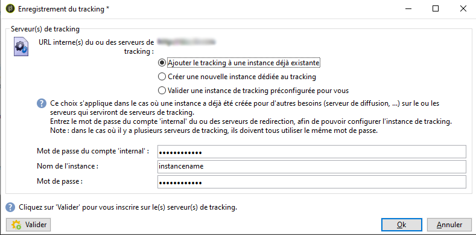
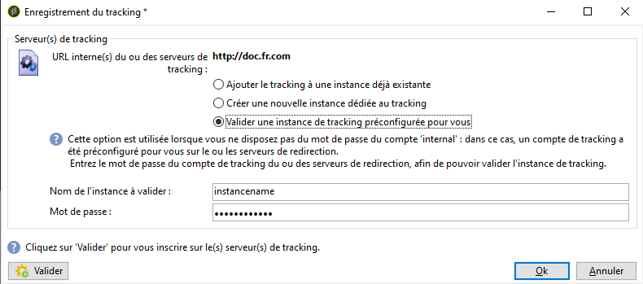

# Déploiement d&#39;une instance{#deploying-an-instance}

>[!NOTE]
>
>Les paramétrages côté serveur ne peuvent être réalisés que par Adobe pour les déploiements hébergés par Adobe. Pour plus d&#39;informations sur les différents déploiements, reportez-vous à la section [Modèles d&#39;hébergement](../../installation/using/hosting-models.md) ou à [cet article](https://helpx.adobe.com/campaign/kb/acc-on-prem-vs-hosted.html).

## L&#39;assistant de déploiement {#deployment-wizard}

Un assistant graphique accessible à partir de la console cliente Adobe Campaign permet de renseigner les paramètres de l&#39;instance sur laquelle vous allez vous connecter.

Pour démarrer l&#39;assistant de déploiement, sélectionnez **Outils > Avancé > Assistant de déploiement**.


Les étapes de paramétrage sont les suivantes :

1. [Paramètres généraux](#general-parameters)
1. [Paramètres du canal email](#email-channel-parameters)
1. [Gestion des mails rebonds](#managing-bounced-emails)
1. [Paramétrage du tracking](#tracking-configuration)
1. [Paramètres du canal mobile](#mobile-channel-parameters)
1. [Options régionales](#regional-settings)
1. [Accès depuis Internet](#access-from-the-internet)
1. [Gestion des ressources publiques](#managing-public-resources)
1. [Purge des données](#purging-data)

## Paramètres généraux {#general-parameters}

La première étape de l&#39;assistant de déploiement permet de renseigner les informations générales relatives à l&#39;instance.


### Informations générales {#general-information}

La section inférieure de la fenêtre permet de sélectionner les options à activer.

* **[!UICONTROL Customer identifier used in billing]** : il peut s’agir du nom de l’instance et du numéro de version.
* **[!UICONTROL Common name of the customer]** : Entrez une chaîne de caractères avec le nom de votre société. Ces informations peuvent être utilisées dans les liens de désabonnement.
* **[!UICONTROL Namespace]** : Entrez un identifiant court en minuscules. L&#39;objectif est de faire la distinction entre votre configuration spécifique et la configuration d&#39;usine en cas de mise à niveau. L’espace de noms par défaut est **cus** - pour le client.

### Options techniques {#technical-options}

La section inférieure de la fenêtre permet de sélectionner les options à activer.

Les options disponibles sont les suivantes :

* **[!UICONTROL Email channel]** : pour activer la remise des e-mails. Reportez-vous aux paramètres [de canal de](#email-channel-parameters)courriel.
* **[!UICONTROL Tracking]** : Pour activer le suivi de la population cible (ouvre et clique). Reportez-vous à la configuration [du](#tracking-configuration)suivi.
* **[!UICONTROL Managing bounced emails]** : Pour définir le compte POP utilisé pour récupérer le courrier électronique entrant. Reportez-vous à [Gestion des courriers électroniques](#managing-bounced-emails)rebondis.
* **[!UICONTROL LDAP integration]** : Pour configurer l’authentification des utilisateurs via un annuaire LDAP. Reportez-vous à [Connexion via LDAP](../../installation/using/connecting-through-ldap.md).

## Paramètres du canal email {#email-channel-parameters}

L&#39;étape suivante permet de définir les informations qui seront affichées dans l&#39;en-tête des emails.

Ces paramètres peuvent être surchargés dans les modèles de diffusion et, unitairement au niveau de chaque diffusion (sous réserve que les utilisateurs possèdent les droits appropriés).

### Paramètres des emails envoyés {#parameters-for-delivered-emails}


Indiquez les paramètres suivants :

* **[!UICONTROL Sender name]** : Nom de l&#39;expéditeur,
* **[!UICONTROL Sender address]** : L&#39;adresse de l&#39;expéditeur,
* **[!UICONTROL Reply address text]** : Nom, personnalisable, qui sera utilisé lorsque le destinataire clique sur le **[!UICONTROL Reply]** bouton dans son logiciel client de messagerie,
* **[!UICONTROL Reply address]** : adresse électronique à utiliser lorsque le destinataire clique sur le **[!UICONTROL Reply]** bouton dans son logiciel client de messagerie,
* **[!UICONTROL Error address]** : Adresse électronique des messages contenant des erreurs. Il s’agit de l’adresse technique utilisée pour traiter le courrier de rebonds, y compris les courriers électroniques reçus par le serveur Adobe Campaign en raison d’adresses cibles inexistantes.

En complément, vous pouvez indiquer les **masques** autorisés pour l&#39;adresse expéditeur et l&#39;adresse d&#39;erreur. Au besoin, ces masques doivent être séparés les uns des autres par une virgule. Ce paramétrage est facultatif. Lorsque ces champs sont renseignés, Adobe Campaign contrôle, au moment de l&#39;envoi (ou au moment de l&#39;analyse, lorsque l&#39;adresse ne contient pas d&#39;éléments variables), que les adresses renseignées dans la diffusion sont valables. Ce fonctionnement permet d&#39;éviter l&#39;utilisation d&#39;adresses qui pourraient poser des problème de délivrabilité. Les adresses d&#39;expédition doivent être configurées sur le serveur d&#39;envoi.

### Caractères autorisés dans les adresses {#characters-authorized-in-addresses}

<!--This window enables you to define, for all email campaigns, the delivery and address-quality management options.-->

Dans la base Adobe Campaign, toute adresse email doit être composée comme suit : `x@y.z`. Les caractères **x**, **y** et **z** ne doivent pas être vides, ni contenir des caractères non autorisés.

Vous pouvez ici définir la liste des caractères autorisés (&#39;data policy&#39;) dans le champ email de la base de données. Les caractères absents de la liste seront interdits, et donc refusés lors d&#39;une saisie dans la base, mais aussi lors d&#39;un import ou à la validation d&#39;un formulaire Web.

Deux listes sont proposées : **Européens uniquement** ou **US uniquement**. Elles peuvent être complétées par d&#39;autres caractères, au besoin.

### Paramètres de la diffusion {#delivery-parameters}

Le lien **Paramètres avancés...** permet d&#39;accéder aux options de diffusion, aux paramètres liés aux reprises et aux mises en quarantaines.


Cette fenêtre permet de définir, pour toutes les campagnes email, les options de diffusion et de gestion de la qualité des adresses.

Les options disponibles sont les suivantes :

* **[!UICONTROL Delivery duration of messages]** : Au-delà de ce délai, la livraison est arrêtée (par défaut, 5 jours),
* **[!UICONTROL Online resources validity duration]** : Heure pendant laquelle les informations du profil du destinataire sont conservées afin de générer des pages miroir,
* **[!UICONTROL Exclude recipients who no longer wish to be contacted]** : Lorsque cette option est sélectionnée, les destinataires placés sur liste noire ne sont pas contactés,
* **[!UICONTROL Automatically ignore doubles]** : Lorsque cette option est sélectionnée, la remise ne sera pas effectuée aux adresses en double.

### Paramètres de reprise {#retry-parameters}

Les informations relatives aux reprises sont indiquées dans les champs **Période des reprises** et **Nombre de reprises** : lorsqu&#39;un destinataire est inatteignable, par exemple si sa boîte mail est pleine, le programme réessayera par défaut de le contacter 5 fois, espacées d&#39;au moins une heure (pendant la durée maximum de diffusion des messages). Ces valeurs peuvent être adaptées selon vos besoins.

### Paramètres de mise en quarantaine {#quarantine-parameters}

Les options de configuration pour les mises en quarantaines sont les suivantes :

* **[!UICONTROL Duration between two significant errors]** : saisissez une valeur (&quot;1d&quot;) par défaut : 1 jour) pour définir le temps d’attente de l’application avant d’incrémenter le compteur d’erreurs en cas d’échec,
* **[!UICONTROL Maximum number of errors before quarantine]** : une fois cette valeur atteinte, l’adresse électronique est mise en quarantaine (par défaut, &quot;5&quot; : l&#39;adresse sera mise en quarantaine à la sixième erreur). Cela signifie que ce contact sera automatiquement exclu des prochaines diffusions.

## Gestion des mails rebonds {#managing-bounced-emails}

Les mails rebonds sont essentiels pour qualifier les erreurs suite à une diffusion. Ces erreurs seront réparties dans les NP@I une fois que les règles auront déterminé la cause de non aboutissement du message.

This step is only available if the **Email channel** and **Bounce mail** management options are selected in the first stage of the deployment wizard. Reportez-vous aux paramètres [](#general-parameters)généraux.

Dans cette étape, vous pouvez définir les paramètres de gestion des mails rebonds.


### Compte POP de relevé des mails entrants {#pop-account-used-to-retrieve-incoming-mails}

Indiquez les paramètres de connexion au compte de relevé des mails entrants.

* **[!UICONTROL Label]** : Nom contenant tous les paramètres indiqués ci-dessous,
* **[!UICONTROL Server]** : Serveur utilisé pour récupérer le courrier de rebonds (courrier entrant),
* **[!UICONTROL Security]** : Si nécessaire, sélectionnez **[!UICONTROL SSL]** dans la liste déroulante,
* **[!UICONTROL Port]** : port serveur (généralement 110),
* **[!UICONTROL Account]** : Nom du compte utilisé pour le courrier de rebonds,
* **[!UICONTROL Password]** : Mot de passe associé au compte.

Une fois les paramètres POP renseignés, cliquez sur **Test** afin de vérifier que ces paramètres sont corrects.

### Mails rebonds non traités {#unprocessed-bounce-mails}

Les mails rebonds sont traités de façon automatique par Adobe Campaign, en appliquant les règles répertoriées dans le nœud **Administration > Gestion de campagne > Gestion des NP@I > Qualification des logs de diffusion**. Voir à ce sujet [Gestion des mails rebonds](../../delivery/using/understanding-delivery-failures.md#bounce-mail-management).

Les mails rebonds non traités ne sont pas affichés dans l’interface Adobe Campaign. Ils sont supprimés automatiquement à moins qu’ils ne soient transférés à une boîte de tierce partie au moyen des champs suivants :

* **[!UICONTROL Forwarding address]** : Renseignez ce champ pour transférer à une adresse tierce tous les messages d’erreur (traités ou non traités) collectés par la plateforme Adobe Campaign.
* **[!UICONTROL Address for errors]** : Renseignez ce champ pour transférer à une adresse tierce uniquement les messages d&#39;erreur que le processus inMail n&#39;a pas pu qualifier.
* **[!UICONTROL SMTP server]** : Serveur utilisé pour envoyer les courriers électroniques de rebonds non traités.

>[!CAUTION]
>
>Pour transférer des courriers électroniques de rebonds non traités, Adobe recommande de ne renseigner que le **[!UICONTROL Address for errors]** champ. Toutefois, assurez-vous que l&#39;adresse utilisée est vérifiée régulièrement, car cela pourrait entraîner une charge importante sur votre serveur de messagerie. Contactez le gestionnaire de votre compte pour plus d’informations.

## Paramétrage du tracking {#tracking-configuration}

Dans l&#39;étape suivante, procédez à la configuration du tracking pour l&#39;instance. L&#39;instance doit être déclarée et enregistrée auprès du ou des serveurs de tracking.

This step is only offered when the **Email channel** and **Tracking** options are selected in the first page of the deployment wizard. Reportez-vous aux paramètres [](#general-parameters)généraux.

La configuration du tracking web (mode de tracking, création et insertion des balises...) est détaillée dans [ce document](../../configuration/using/about-web-tracking.md).

### Principe de fonctionnement {#operating-principle}

Lorsque vous activez le tracking sur une instance, les URL présentes dans les diffusions sont transformées lors de l&#39;envoi afin de permettre d&#39;en assurer le suivi.

* Les informations concernant les URL externes (sécurisées ou non) saisies dans cette étape de l&#39;assistant de déploiement sont utilisées pour construire la nouvelle URL. En plus de ces informations, le lien ainsi transformé contient : l&#39;identifiant de la diffusion, l&#39;identifiant du destinataire et l&#39;identifiant de l&#39;URL.

   Les informations de sont collectées par Adobe Campaign sur le ou les serveurs de tracking afin d&#39;alimenter le profil des destinataires ainsi que les données liées à la diffusion (onglets **[!UICONTROL Tracking]** Tracking).

   Les informations concernant les URL internes ne sont utilisées que par le serveur applicatif Adobe Campaign afin de contacter le ou les serveurs de tracking.

   For more on this, refer to [Tracking server](#tracking-server).

* Une fois les URL configurées, il est nécessaire d&#39;activer le tracking. Pour cela, l&#39;instance doit être enregistrée auprès du ou des serveurs de tracking.

   For more on this, refer to [Saving tracking](#saving-tracking).

### Serveur de tracking {#tracking-server}


Pour permettre le bon fonctionnement du tracking sur cette instance, les informations suivantes doivent être paramétrées :
<!--With Mid-sourcing architecture, you can externalize tracking management. To do this:-->

* **[!UICONTROL External URL]** et/ou **[!UICONTROL Secure external URL]** : Entrez l&#39;URL de redirection à utiliser dans le courrier électronique à envoyer.
* **[!UICONTROL Internal URL(s)]** : URL utilisées uniquement par le serveur Adobe Campaign pour contacter le ou les serveurs de suivi afin de collecter les journaux et de télécharger les URL. Il n’est pas nécessaire de l’associer à l’instance.

   Si vous ne renseignez pas d&#39;URL, par défaut l&#39;URL de tracking sera utilisée.

Dans le cadre d&#39;une architecture en Mid-Sourcing, vous pouvez externaliser la gestion du tracking. Pour cela :

1. Select the option **[!UICONTROL Externalize tracking management]** : this lets you use a mid-sourcing server as a tracking server.
1. Populate the **[!UICONTROL External account]** and **[!UICONTROL Instance name]** fields to be able to connect to the mid-sourcing server.

   Pour plus d’informations, reportez-vous à la section Serveur [de sources](../../installation/using/mid-sourcing-server.md)intermédiaires.

1. Cliquez sur le **[!UICONTROL Enable the tracking instance]** bouton pour approuver la connexion au serveur.

   

### Enregistrement du tracking {#saving-tracking}

Une fois les URL renseignées, vous devez procéder à l&#39;enregistrement du serveur de tracking.

Cliquez sur le lien **Enregistrement auprès du ou des serveurs de tracking** et sélectionnez une des options proposées.


Trois types d&#39;architecture sont possibles pour la mise en place du tracking :

1. **Ajouter le tracking à une instance déjà existante**

   Ce choix s&#39;applique dans le cas où une instance a déjà été créée pour d&#39;autres besoins (serveur de diffusion, etc.) sur le ou les serveurs qui serviront de serveurs de tracking.

   

   Saisissez le mot de passe du compte **internal** du ou des serveurs de redirection, afin de pouvoir configurer l&#39;instance de tracking.

   >[!NOTE]
   >
   >Si plusieurs serveurs de tracking sont paramétrés, leurs nom et mot de passe doivent être les mêmes.

   Renseigner le nom de l&#39;instance et son mot de passe.

1. **Créer une nouvelle instance dédiée au tracking**

   Cette option est adaptée dans le cas où les instances de tracking sont réservées au tracking et ne comportent aucun autre module applicatif.

   

   Saisissez le mot de passe du compte **internal** du ou des serveurs de redirection, afin de pouvoir configurer l&#39;instance de tracking.

   >[!NOTE]
   >
   >Si plusieurs serveurs de tracking sont paramétrés, ils doivent tous utiliser le même mot de passe.

   Renseignez le nom de l&#39;instance et son mot de passe ainsi que les masques DNS qui lui sont associés, par exemple **[!UICONTROL Campaign*]**.

1. **Valider une instance de tracking préconfigurée pour vous**

   Cette option est utilisée lorsque vous ne disposez pas du mot de passe du compte **internal** ; dans ce cas, un compte de tracking a été préconfiguré pour vous sur le ou les serveurs de redirection. Entrez le mot de passe du compte de tracking du ou des serveurs de redirection, afin de pouvoir valider l&#39;instance de tracking.

   

   Renseignez le nom de l&#39;instance à valider et son mot de passe.

Cliquez sur **Valider** pour lancer la procédure d&#39;enregistrement auprès des serveurs de tracking.

De retour à la fenêtre précédente, un message confirme l&#39;enregistrement auprès du serveur de tracking :


Dans un contexte standard d&#39;installation, les paramètres relatifs à la recherche des URL **ne doivent pas être modifiés**. Pour tout autre cas, contactez Adobe.

## Paramètres du canal mobile {#mobile-channel-parameters}

L&#39;étape suivante permet de définir les paramètres par défaut lors des diffusions vers les mobiles (SMS et WAP Push).

>[!NOTE]
>
>Le canal mobile est une option : l&#39;étape suivante n&#39;apparaît que si elle a été acquise. Consultez votre contrat de licence.


### Compte par défaut pour le routage des SMS {#default-account-for-sms-delivery}

Renseignez les informations suivantes :

* **[!UICONTROL Label]** : Entrez un nom pour ce compte SMS/Wap Push. Par exemple, vous pouvez utiliser le nom de votre routeur.
* Pour les champs **[!UICONTROL Server]**, **[!UICONTROL Port]**, **[!UICONTROL Account]**, **[!UICONTROL Password]**, **[!UICONTROL Connector]**, **[!UICONTROL Send Endpoint]**, **[!UICONTROL Reception Endpoint]**,  : Contactez votre fournisseur de services pour connaître les paramètres requis.**[!UICONTROL Notification Endpoint]**

### Paramètres des SMS envoyés {#parameters-of-sms-sent}

Dans la liste déroulante **Priorité**, sélectionnez la valeur &quot;normale&quot;, &quot;haute&quot; ou &quot;urgente&quot; afin de l&#39;appliquer aux messages qui seront diffusés.

### Paramètres avancés {#advanced-parameters}

Le lien **Paramètres avancés...** permet d&#39;accéder aux options de reprise et de mise en quarantaines.


Les informations relatives aux reprises sont indiquées dans les champs **Période des reprises** et **Nombre de reprises** : lorsqu&#39;un mobile est inatteignable, le programme réessayera par défaut de le contacter 5 fois, espacées d&#39;au moins 15 minutes (pendant la durée maximum de diffusion des messages). Ces valeurs peuvent être adaptées selon vos besoins.

Les options de configuration pour les mises en quarantaines sont les suivantes :

* **[!UICONTROL Time between two significant errors]** : Entrez une valeur par défaut (par défaut &quot;1d&quot;) : day) pour définir le temps d’attente de l’application avant d’incrémenter le compteur d’erreurs en cas d’échec.
* **[!UICONTROL Maximum number of errors before quarantine]** : Une fois cette valeur atteinte, le numéro de mobile est mis en quarantaine (par défaut, &quot;5&quot; : le nombre sera mis en quarantaine à la sixième erreur). Cela signifie que le contact sera automatiquement exclu des livraisons futures.

## Options régionales {#regional-settings}

Cette étape permet d&#39;indiquer des préférences relatives aux contraintes sur les données (data policy).


* **[!UICONTROL Consider all phone numbers as international ones]** : Lorsque cette option est sélectionnée, l’application applique le format international aux numéros de téléphone (le préfixe du pays est alors obligatoire car le nombre de chiffres ne sera pas vérifié avant l’application de la mise en forme). Si cette option n’est pas sélectionnée, vous devez préfixer vous-même le numéro de téléphone international par &quot;+&quot; ou &quot;00&quot;.
* **[!UICONTROL Store all phone numbers using the international format]** : Cette option concerne uniquement les numéros de téléphone **nationaux** importés ou modifiés. Indiquez si vous souhaitez utiliser un format national (par exemple, 425 555 0150) ou international (par ex. +1 425 555 0150)

## Accès depuis Internet {#access-from-the-internet}

>[!CAUTION]
>
>Pour des raisons de confidentialité, nous vous recommandons d&#39;utiliser HTTPS pour toutes les ressources externes.

Cette étape permet de définir les URL d&#39;accès aux pages Adobe Campaign exposées sur Internet.

Vous devez également y indiquer les options de publication liées aux formulaires Web.


### Serveurs exposés sur le Web {#servers-exposed-on-the-web}

Renseignez dans cette page les URL des serveurs pour :

1. Accéder au serveur applicatif exposé sur Internet : formulaires d&#39;inscription / de désinscription, extranet, etc.
1. Accéder au serveur applicatif pour les ressources non exposées sur le Web : formulaires, intranet, pages de validation.
1. Accéder aux pages miroir renseignées des diffusions.

   Une page miroir est une page dynamique qui affiche le contenu de l&#39;email. Elle est accessible via un lien inséré dans le message adressé au destinataire et peut contenir des éléments de personnalisation, s&#39;ils ont été définis. La page miroir permet au destinataire de lire correctement l&#39;email dans son navigateur Internet plutôt que dans son outil de messagerie, quel que soit son format de réception (texte ou HTML). Toutefois, pour chaque action de diffusion, les pages miroir ne sont générées que si un contenu HTML a été défini.

Adobe Campaign offre la possibilité de différencier ces trois URL afin de mieux répartir la charge sur plusieurs plateformes.

## Gestion des ressources publiques {#managing-public-resources}

>[!CAUTION]
>
>Pour des raisons de confidentialité, nous vous recommandons d&#39;utiliser HTTPS pour toutes les ressources externes.

Pour être visibles depuis l&#39;extérieur, les images utilisées dans les emails et les ressources publiques associées aux opérations doivent être présentes sur un serveur accessible de l&#39;extérieur. Elles pourront ainsi être disponibles pour les destinataires ou les opérateurs externes.


Dans cette étape, vous devez renseigner :

1. Nouvelle URL de ressource publique. Pour plus d’informations, consultez la section URL [des ressources](#public-resources-url) publiques.
1. Mode de détection des images dans une diffusion. Pour plus d’informations, reportez-vous à la section Détection [des images de](#delivery-image-detection) diffusion.
1. Options de publication. For more information, refer to the [Publication modes](#publication-modes) section.

Les ressources publiques sont accessibles à partir du noeud **Administration > Ressources > On-line > Ressources publiques** de l&#39;arborescence Adobe Campaign. Elles sont regroupées dans une bibliothèque et peuvent être incluses dans les emails mais aussi utilisées au niveau des opérations ou des tâches, ainsi que pour la gestion de contenu.


### URL des ressources publiques {#public-resources-url}

Le premier champ permet de saisir le début de l&#39;URL des ressources lorsqu&#39;elles sont mises en ligne. Les ressources sont alors accessibles via cette nouvelle URL.

Dans une diffusion, vous pouvez utiliser des images stockées dans la bibliothèque de ressources publiques ou toute autre image locale ou stockée sur un serveur.

* Pour les images des emails, l&#39;URL **https://** serveur **/res/img**.

   Cette valeur peut être surchargée au niveau de chaque diffusion.

* Pour les ressources publiques, l’URL **https://** serveur **/res/** instance ****où&#x200B;**instance**est le nom de l’instance de tracking.

### Détection des images d&#39;une diffusion {#delivery-image-detection}

Dans une diffusion, vous pouvez utiliser des images stockées dans la bibliothèque de ressources publiques ou toute autre image locale ou stockée sur un serveur.

Le champ **Masques des URL** permet d&#39;indiquer la liste des masques des URL qui seront ignorées lors de la mise en ligne automatique des images. Par exemple, si vous utilisez des images qui sont stockées sur un site accessible depuis l&#39;extérieur, notamment sur votre site internet, vous pouvez saisir dans ce champ l&#39;URL d&#39;accès au site.


Vous pouvez saisir plusieurs masques, séparés les uns des autres par une virgule.

* Le mode d&#39;utilisation et la gestion des images dans les emails sont présentés dans [cette section](../../delivery/using/defining-the-email-content.md#adding-images).
* Dans l&#39;assistant de diffusion, les images appelées depuis ces URL auront le statut &quot;Ignoré&quot;.

### Modes de publication {#publication-modes}

La section inférieure de l&#39;assistant permet de sélectionner les options de publication des ressources publiques et des images. Ces options sont également disponibles pour les formulaires web et les questionnaires.

Les modes de publication suivants sont disponibles :

* Serveur(s) de tracking

   Les ressources seront automatiquement copiées sur les différents serveurs de suivi. Ils sont configurés dans l’étape Configuration [du](#tracking-configuration)suivi.

* Autre(s) serveur(s) Adobe Campaign

   Vous pouvez utiliser un ou plusieurs autres serveurs Adobe Campaign où seront copiées les ressources.

   Côté serveur, pour utiliser un serveur Adobe Campaign dédié, vous devez créer une nouvelle instance avec la commande suivante :

   ```
   nlserver config -addtrackinginstance:<trackingA>/<trackingA*>
   ```

   Puis saisissez le mot de passe.

   Les paramètres des serveurs dédiés sont indiqués dans les **[!UICONTROL Media URL(s)]**, **[!UICONTROL Password]** et **[!UICONTROL Instance name]** champs.

   

* Script de publication manuelle (seulement pour les ressources publiques)

   

   Vous pouvez publier les ressources via un script :

   * Vous devez créer ce script : son contenu dépend de votre configuration.
   * Le script sera appelé via la commande suivante :

      ```
      [INSTALL]/copyToFrontal.vbs "$(XTK_INSTALL_DIR)\var\<instance>\upload\" "img1,img2,img3"
      ```

      where `[INSTALL]` is the access path to the Adobe Campaign installation folder.

   * Sous Unix, assurez-vous que ce script soit exécutable.

Pour les images, il doit les copier depuis le dossier &quot;images&quot; renseigné via l&#39;option **NmsDelivery_ImageSubDirectory** vers un ou plusieurs serveurs frontaux. Ces serveurs vont stocker les images afin de les rendre accessibles via la nouvelle URL configurée.

In the event of publication on an Adobe Campaign server without a manual publication script, by default, the images of a delivery are stored in the `$(XTK_INSTALL_DIR)/var/res/img/ directory`. The corresponding URL is the following: **`https://server/res/img`**.

`XTK_INSTALL_DIR)/var/res/$(INSTANCE_NAME)`. The corresponding URL is as follows: **`https://server/res/instance`** where instance is the name of the tracking instance.

>[!NOTE]
>
>Il est possible de modifier le répertoire de stockage des ressources publiques. Pour plus d’informations à ce sujet, reportez-vous à [Gestion des ressources](#managing-public-resources)publiques.

### Synchronisation des ressources publiques {#synchronizing-public-resources}

Cette fonctionnalité permet de **synchroniser des ressources publiques** sur plusieurs spare-serveurs.

Si une ressource publique n&#39;est pas présente sur le serveur de tracking ou si la ressource renvoie une erreur 404, le serveur de tracking va essayer de trouver la ressource sur un des spare-serveurs.

Vous devez déclarer et configurer les spare-serveurs dans le fichier **serverConf.xml** du serveur Marketing. Tous les paramètres disponibles dans **serverConf.xml** sont répertoriés dans cette [section](../../installation/using/the-server-configuration-file.md).

**Déclaration**

```
<redirection>
<spareServer enabledIf="" id="" url=""/>
</redirection>
```

**Configuration**

For each public resource that has to be synchronized, you have to add a status attribute to the `<url>` element in the `<relay>` part:

L&#39;attribut status peut prendre trois valeurs :

* spare : la ressource publique est synchronisée

* normal : comportement existant (sans synchronisation)

* blacklist : l&#39;url est blacklistée si elle renvoie une erreur 404. La durée (en secondes) du blacklistage est définie par un attribut **timeout** dont la valeur par défaut est de 60s.

La configuration d&#39;usine de la synchronisation est :

```
(extracted from the serverConf.xml file)

<redirection P3PCompactPolicy="CAO DSP COR CURa DEVa TAIa OUR BUS IND UNI COM NAV"
databaseId="" defLogCount="30" expirationURL="" maxJobsInCache="100"
startRedirection="true" startRedirectionInModule="true" trackWebVisitors="false" trackingPassword="">
<spareServer enabledIf="" id="1" url=""/>
</redirection>

....


<relay debugRelay="false" forbiddenCharsInAuthority="?#.@/:" forbiddenCharsInPath="?#/"
           modDir="index.html" startRelay="false" startRelayInModule="true" timeout="60">
   <url IPMask="" deny="" hostMask="" relayHost="true" relayPath="true" status="normal" targetUrl="https://localhost:8080" timeout="" urlPath="/view/*"/>
      <url IPMask="" deny="" hostMask="" relayHost="true" relayPath="true" status="blacklist" targetUrl="https://localhost:8080" timeout="" urlPath="*.jsp"/>
      <url IPMask="" deny="" hostMask="" relayHost="true" relayPath="true" status="blacklist" targetUrl="https://localhost:8080" timeout="" urlPath="*.jssp"/>
      <url IPMask="" deny="" hostMask="" relayHost="true" relayPath="true" status="blacklist" targetUrl="https://localhost:8080" timeout="" urlPath="/webApp/*"/>
      <url IPMask="" deny="" hostMask="" relayHost="true" relayPath="true" status="blacklist" targetUrl="https://localhost:8080" timeout="" urlPath="/report/*"/>
      <url IPMask="" deny="" hostMask="" relayHost="true" relayPath="true" status="blacklist" targetUrl="https://localhost:8080" timeout="" urlPath="/jssp/*"/>
      <url IPMask="" deny="" hostMask="" relayHost="true" relayPath="true" status="normal" targetUrl="https://localhost:8080" timeout="" urlPath="/strings/*"/>
      <url IPMask="" deny="" hostMask="" relayHost="true" relayPath="true" status="normal" targetUrl="https://localhost:8080" timeout="" urlPath="/interaction/*"/>
      <url IPMask="" deny="" hostMask="" relayHost="true" relayPath="true" status="normal" targetUrl="https://localhost:8080" timeout="" urlPath="/barcode/*"/>

      <url IPMask="" deny="" hostMask="" relayHost="false" relayPath="false" status="spare" targetUrl="" timeout="" urlPath="/favicon.*"/>
      <url IPMask="" deny="" hostMask="" relayHost="false" relayPath="false" status="spare" targetUrl="" timeout="" urlPath="/*.html"/>
      <url IPMask="" deny="" hostMask="" relayHost="false" relayPath="false" status="spare" targetUrl="" timeout="" urlPath="/*.png"/>
      <url IPMask="" deny="" hostMask="" relayHost="false" relayPath="false" status="spare" targetUrl="" timeout="" urlPath="/*.jpg"/>

 </relay>
```

## Purge des données {#purging-data}

La dernière étape de l&#39;assistant de déploiement permet de paramétrer la purge automatique des données obsolètes de la base. Les valeurs sont exprimées en jours.


Data is deleted automatically via the Database cleanup workflow. For more on how to configure and operate this workflow and details on the deleted items, refer to this [document](../../production/using/database-cleanup-workflow.md).
