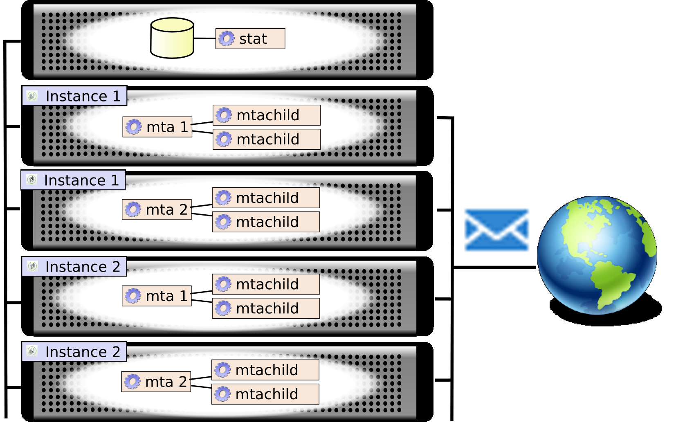
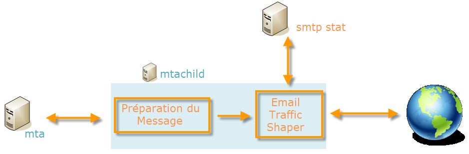
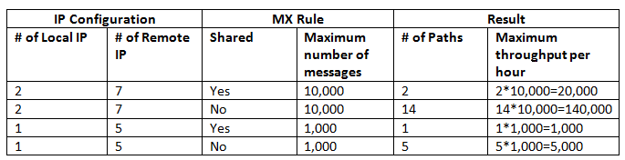
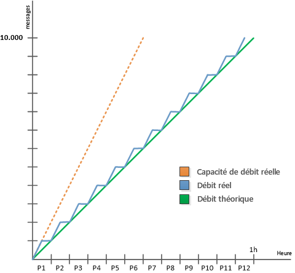
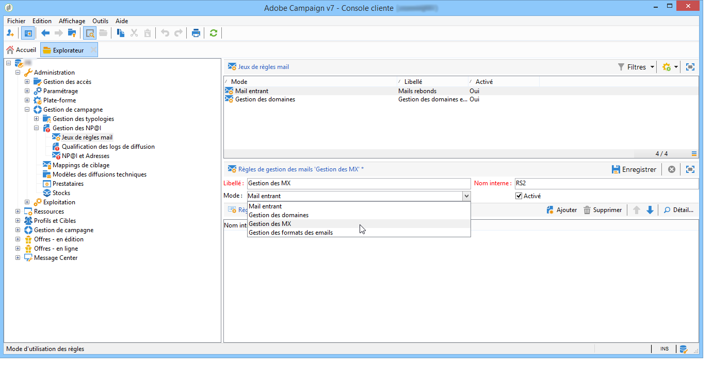
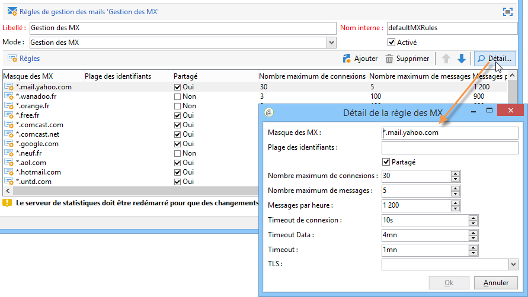
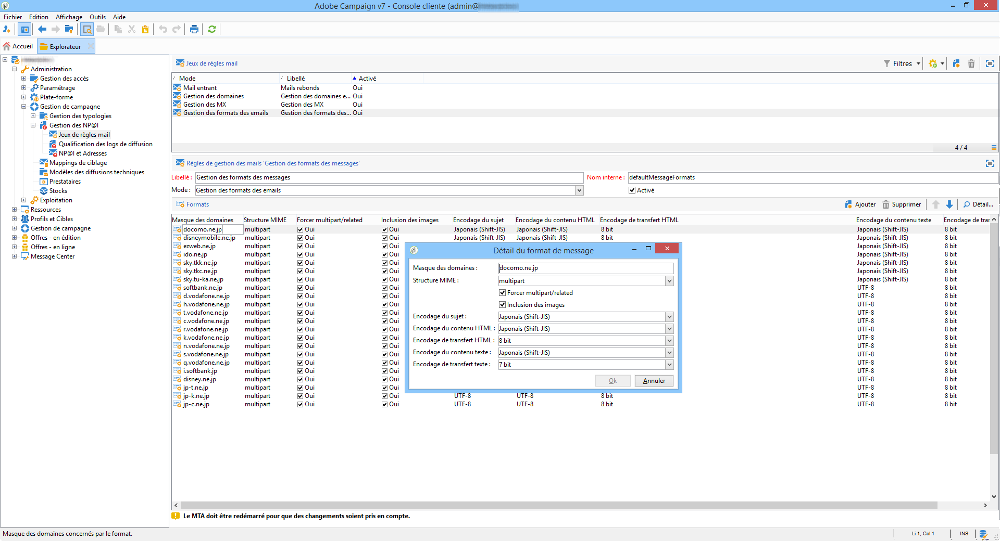

# Configurations techniques des emails{#email-deliverability}


## Vue d&#39;ensemble {#overview}

La section ci-après présente les paramétrages nécessaires pour contrôler le débit des instances Adobe Campaign pour l’envoi d’emails.

>[!NOTE]
>
>Pour les déploiements hébergés par Adobe, certaines configurations peuvent uniquement être effectuées par Adobe, comme l&#39;accès aux fichiers de configuration de serveur et d’instance. Pour en savoir plus sur les différents déploiements, consultez la section [Modèles d&#39;hébergement](../../installation/using/hosting-models.md) ou [cette page](../../installation/using/capability-matrix.md).

Pour en savoir plus sur les bonnes pratiques et les concepts relatifs à la délivrabilité avec Adobe Campaign, voir cette [section](../../delivery/using/about-deliverability.md).

Pour un examen plus approfondi de ce qu’est la délivrabilité, y compris les recommandations techniques concernant l’envoi et la réception efficaces d’emails par une plateforme d’Adobe, consultez le [Guide des bonnes pratiques relatives à la délivrabilité d’Adobe](https://experienceleague.adobe.com/docs/deliverability-learn/deliverability-best-practice-guide/introduction.html?lang=fr).

## Principe de fonctionnement {#operating-principle}

Le débit d&#39;une ou de plusieurs instances Adobe Campaign peut être contrôlé afin de limiter le nombre d&#39;e-mails envoyés en fonction du domaine. Par exemple, vous pouvez limiter la sortie à 20 000 messages par heure pour les adresses **yahoo.com**, tout en configurant 100 000 messages par heure pour tous les autres domaines.

Le débit des messages doit être contrôlé pour chacune des adresses IP utilisées par les serveurs de diffusion (**mta**) pour l&#39;envoi des emails. Plusieurs **mta** repartis sur plusieurs machines et appartenant à différentes instances Adobe Campaign peuvent partager les mêmes adresses IP pour l&#39;envoi d&#39;emails : il est donc nécessaire qu&#39;un processus coordonne l&#39;utilisation de ces adresses IP.

Il s’agit de la fonction du module **stat** : il fédère toutes les demandes d’ouvertures de connexions et d’envois de messages vers les serveurs de messagerie pour un ensemble d’adresses IP. Le serveur de statistiques maintient ainsi le compte des diffusion et peut activer ou désactiver les envois dans le temps en fonction des quotas définis.



* Le serveur de statistiques (**stat**) est associé à une base Adobe Campaign pour charger sa configuration.
* Les serveurs de diffusions (**mta**) sont configurés pour contacter via UDP un serveur de statistiques qui n&#39;appartient pas nécessairement à leur propre instance.

### Serveurs de diffusion {#delivery-servers}

Le module **mta** distribue les messages à ses modules enfants **mtachild**. Chaque **mtachild** prépare les messages, puis demande l&#39;autorisation au serveur de statistiques avant de les envoyer.

Les étapes sont les suivantes :

1. Le **mta** sélectionne les messages éligibles pour l&#39;envoi et les assigne à un **mtachild** disponible.
1. Le **mtachild** charge toutes les informations nécessaires pour construire le message (contenu, éléments de personnalisation, pièces jointes, images, etc.) et transmet le message au gestionnaire d’envoi (**Email Traffic Shaper**).
1. Lorsque le gestionnaire d&#39;envoi a reçu l&#39;autorisation du serveur de statistiques (**smtp stat**), le message est envoyé au destinataire.



### Statistiques et limitations des serveurs de messagerie {#email-server-statistics-and-limitations}

Le serveur de statistiques maintient les statistiques suivantes pour chaque serveur de messagerie vers lequel des messages sont envoyés :

* Nombre de connexions ouvertes en instantané,
* Nombre de messages envoyés dans l&#39;heure précédente,
* Taux de connexions réussies/refusées,
* Taux de connexions vers des serveurs injoignables.

Parallèlement, le module charge une liste de limitations pour certains serveurs de messagerie :

* Nombre maximum de connexions simultanées,
* Nombre maximum de messages par heure,
* Nombre maximum de messages par connexion.

### Gestion des adresses IP {#managing-ip-addresses}

Le serveur de statistiques peut fédérer plusieurs instances ou plusieurs machines si elles partagent les mêmes adresses IP publiques. Il n&#39;est donc pas rattaché à une instance particulière, mais il doit néanmoins en contacter une pour récupérer les limitations par domaine.

Les statistiques de diffusion sont conservées pour chaque MX cible et pour chaque IP source. Par exemple, si le domaine ciblé possède 5 MX et la plateforme peut utiliser 3 adresses IP différentes, le serveur pourra gérer jusqu&#39;à 15 séries d&#39;indicateurs pour ce domaine.

L&#39;adresse IP source correspond à l&#39;adresse IP publique, c&#39;est-à-dire à l&#39;adresse telle qu&#39;elle est envoyée par le serveur de messagerie distant. Cette adresse IP peut différer de celle de la machine qui héberge le **mta**, si un routeur NAT est fourni. C’est pourquoi le serveur de statistiques utilise un identifiant qui correspond à l’adresse IP publique (**publicId**). L&#39;association entre l&#39;adresse locale et cet identifiant est déclarée dans le fichier de configuration **serverConf.xml**. Tous les paramètres disponibles dans le fichier **serverConf.xml** sont répertoriés dans cette [section](../../installation/using/the-server-configuration-file.md).

## Contrôle de la sortie de diffusion {#delivery-output-controlling}

Pour diffuser les messages vers les serveurs de messagerie, le composant **Email Traffic Shaper** fait une demande d&#39;ouverture de connexion auprès du serveur de statistiques. Une fois la demande acceptée, la connexion est ouverte.

Avant l&#39;envoi des messages, le module demande des « jetons » au serveur.Généralement, il s&#39;agit d&#39;un lot minimum de 10 jetons, afin de réduire le nombre de requêtes auprès du serveur.

Le serveur conserve en mémoire toutes les statistiques de connexion et d&#39;envoi. En cas de redémarrage, les informations sont provisoirement perdues : chacun des clients conserve localement une copie de ses statistiques d&#39;envoi et les retourne régulièrement au serveur (toutes les 2 minutes). Le serveur peut alors ré-agréger les données.

Les sections suivantes décrivent le traitement d&#39;un message par le composant **Email Traffic Shaper**.

### Diffusion d&#39;un message {#message-delivery}

Lorsqu&#39;un message est envoyé, 3 résultats sont possibles :

1. **Success** : le message est envoyé avec succès. Le message est mis à jour.
1. **Message Failed** : le serveur contacté refuse le message pour le destinataire spécifié. Ce résultat correspond aux codes retour entre 550 et 599, mais certaines exceptions peuvent être définies.
1. **Échec de la session** (à partir de la version 5.11) : si le **mta** reçoit une réponse pour ce message, celui-ci est abandonné (voir la section [Abandon d’un message](#message-abandonment)). Le message est envoyé vers un autre chemin ou mis en attente si aucun autre chemin n’est disponible (voir la section [Mise en attente d’un message](#message-pending)).

   >[!NOTE]
   >
   >Un **chemin** désigne une connexion entre le **mta** Adobe Campaign et le **mta** cible. Le **mta** Adobe Campaign peut choisir parmi plusieurs adresses IP de départ et plusieurs adresses IP de domaine cible.

### Abandon d&#39;un message {#message-abandonment}

Lorsqu&#39;un message est abandonné, il est retourné au **mta** et n&#39;est plus géré par le **mtachild**.

Le **mta** décide de l&#39;action à suivre pour ce message (reprise, abandon, mise en quarantaine, etc.) en fonction du code réponse et des règles.

### Mise en attente d&#39;un message {#message-pending}

Un message est mis en attente lorsqu’il arrive dans la file active mais qu’il n’existe actuellement aucun chemin disponible.

Un chemin est généralement marqué non disponible pour une durée variable après une erreur de connexion. La durée d&#39;indisponibilité d&#39;un chemin dépend de la fréquence et de l&#39;ancienneté des erreurs.

## Configuration du serveur de statistiques {#statistics-server-configuration}

Le serveur de statistiques peut être utilisé par plusieurs instances : il doit être configuré indépendamment des instances qui vont l&#39;utiliser.

Vous devez d’abord définir la base de données Adobe Campaign qui hébergera la configuration.

### Configuration de démarrage {#start-configuration}

Par défaut, le module **stat** est démarré pour chaque instance. Lorsque les instances sont regroupées sur le même ordinateur ou lorsque les instances partagent la même adresse IP, un seul serveur de statistiques est utilisé : les autres doivent être désactivés.

### Définition du port du serveur {#definition-of-the-server-port}

Par défaut, le serveur de statistiques écoute sur le port 7777. Ce port peut être modifié dans le fichier **serverConf.xml**. Tous les paramètres disponibles dans le fichier **serverConf.xml** sont répertoriés dans cette [section](../../installation/using/the-server-configuration-file.md).

```
<stat port="1234"/>
```

## Configuration des MX {#mx-configuration}

>[!IMPORTANT]
>
>Pour les installations hébergées ou hybrides, si vous avez effectué la mise à niveau vers le [MTA amélioré](../../delivery/using/sending-with-enhanced-mta.md), les règles de débit de diffusion avec **[!UICONTROL Gestion des MX]** ne sont plus utilisées. Le MTA amélioré utilise ses propres règles MX. Il peut ainsi personnaliser le débit par domaine en fonction de votre réputation, basée sur l&#39;historique des emails et les commentaires en temps réel provenant des domaines auxquels vous adressez des emails.

### À propos des règles MX {#about-mx-rules}

>[!NOTE]
>
>Cette section ainsi que les sections ci-dessous ne s’appliquent qu’aux installations On-Premise et aux installations hébergées/hybrides utilisant l’ancien MTA de Campaign.

Les règles MX (Mail eXchanger) correspondent aux règles de gestion de communication entre un serveur expéditeur et un serveur destinataire.

Ces règles sont rechargées automatiquement tous les matins à 6h00 (heure du serveur) afin de fournir régulièrement l’instance du client.

Selon les capacités matérielles et la politique interne, un FAI acceptera un nombre prédéfini de connexions et de messages par heure. Ces variables peuvent être modifiées de manière automatique par le système du FAI en fonction de la réputation de l&#39;IP et du domaine de l&#39;expéditeur. Adobe Campaign, via sa plateforme délivrabilité, gère plus de 150 règles spécifiques par FAI, avec, en complément, une règle générique pour les autres domaines.

Le nombre maximum de connexions ne dépend pas exclusivement du nombre d&#39;adresses IP publiques utilisées par le MTA.

Par exemple, si vous autorisez cinq connexions dans les règles MX et que vous avez configuré deux adresses IP publiques, vous pouvez penser que vous ne pouvez pas avoir plus de dix connexions ouvertes simultanément sur ce domaine. En vérité, le nombre maximum de connexions se réfère à un chemin qui est une combinaison de l&#39;une de nos IP MTA publiques et d&#39;une IP MTA du client.

Dans l&#39;exemple ci-dessous, l&#39;utilisateur dispose de deux adresses IP publiques et configurées, et le domaine est yahoo.com.

```
user:~ user$ host -t mx yahoo.com
                yahoo.com mail is handled by 1 mta5.am0.yahoodns.net.
                yahoo.com mail is handled by 1 mta6.am0.yahoodns.net.
                yahoo.com mail is handled by 1 mta7.am0.yahoodns.net.
```

Les enregistrements MX pour yahoo.com informent l&#39;utilisateur que yahoo.com possède trois MX. Pour se connecter au MX client, le MTA demande son adresse IP au DNS.

```
user:~ user$ host -t a mta5.am0.yahoodns.net
                mta5.am0.yahoodns.net has address 98.136.216.26
                mta5.am0.yahoodns.net has address 98.136.217.202
                mta5.am0.yahoodns.net has address 98.138.112.38
                mta5.am0.yahoodns.net has address 66.196.118.37
                mta5.am0.yahoodns.net has address 63.250.192.46
                mta5.am0.yahoodns.net has address 66.196.118.240
                mta5.am0.yahoodns.net has address 98.136.217.203
                mta5.am0.yahoodns.net has address 98.138.112.35
```

Pour cet enregistrement, l’utilisateur peut contacter 8 adresses IP des homologues. Comme l’utilisateur dispose de 2 adresses IP publiques, il obtient 8 x 2 = 16 combinaisons pour atteindre les serveurs de messagerie yahoo.com. Chacune de ces combinaisons est appelée un chemin d’accès.

Le deuxième enregistrement MX apparaît comme ceci :

```
user:~ user$ host -t a mta6.am0.yahoodns.net
                mta6.am0.yahoodns.net has address 98.138.112.38
                mta6.am0.yahoodns.net has address 98.136.216.26
                mta6.am0.yahoodns.net has address 63.250.192.46
                mta6.am0.yahoodns.net has address 66.196.118.35
                mta6.am0.yahoodns.net has address 98.136.217.203
                mta6.am0.yahoodns.net has address 98.138.112.32
                mta6.am0.yahoodns.net has address 98.138.112.37
                mta6.am0.yahoodns.net has address 66.196.118.33
```

4 de ces 8 adresses IP sont déjà utilisées dans le mta5 (98.136.216.26, 98.138.112.38, 63.250.192.46 et 98.136.217.203). Cet enregistrement permet à l&#39;utilisateur d&#39;utiliser quatre nouvelles adresses IP. Le troisième enregistrement MX aussi.

Au total, l&#39;utilisateur dispose de seize adresses distantes. Avec ses deux adresses IP publiques, il obtient un total de trente-deux chemins pour accéder aux serveurs email de yahoo.com.

>[!NOTE]
>
>Si deux enregistrement MX référencent la même adresse IP, un seul chemin sera pris en compte, et non deux.

Ci-dessous, quelques exemples sur l&#39;utilisation des règles MX :



Dans l&#39;exemple ci-dessous, l&#39;utilisateur possède une limitation de 10 000 messages par heure pour un nom de domaine particulier, mais la capacité de débit du MTA est supérieure à cette limite.

Dans ce cas, le trafic est divisé en 12 périodes de 5 minutes pour chaque heure, et la limitation réelle est de 833 messages par période.

Ces messages seront délivrés aussi vite que possible.



### Configurer la gestion des MX {#configuring-mx-management}

Les règles à respecter pour les MX sont définies dans le document **[!UICONTROL Gestion des MX]** du nœud **[!UICONTROL Administration > Gestion de campagne > Gestion des NP@I > Jeux de règles mail]** de l’arborescence.

Si le document **[!UICONTROL Gestion des MX]** n’existe pas dans le nœud, vous pouvez le créer manuellement. Pour cela :

1. Créez un nouveau jeu de règles mail.
1. Sélectionnez le mode **[!UICONTROL Gestion des MX]**.

   

1. Saisissez la valeur **defaultMXRules** dans le champ **[!UICONTROL Nom interne]**.

Le serveur de statistiques doit être redémarré pour que les modifications soient prises en compte.

Pour recharger la configuration sans redémarrer le serveur de statistiques, utilisez la commande suivante sur la machine hébergeant le serveur :`nlserver stat -reload`

>[!NOTE]
>
>Cette ligne de commande est préférée à **nlserver restart**. Elle empêche la perte des statistiques collectées avant le redémarrage et permet déviter des pics dutilisation qui pourraient aller à lencontre des quotas définis dans les règles MX.

### Configuration des règles MX {#configuring-mx-rules}

Le document **[!UICONTROL Gestion des MX]** répertorie tous les domaines liés à une règle MX.

Ces règles sont appliquées dans l&#39;ordre : la première règle dont le masque de MX est compatible avec le MX ciblé est appliquée.

Les paramètres disponibles pour chacune des règles sont les suivants :

* **[!UICONTROL Masque des MX]** : domaine auquel s’applique la règle. Chaque règle définit un masque d&#39;adresse pour le MX. Tout MX dont le nom correspond à ce masque est donc éligible. Le masque peut contenir les caractères génériques « &#42; » et « ? ».

  Par exemple, les adresses :

   * a.mx.yahoo.com
   * b.mx.yahoo.com
   * c.mx.yahoo.com

  sont compatibles avec les masques :

   * &#42;.yahoo.com
   * ?.mx.yahoo.com

  Par exemple, pour l&#39;adresse email foobar@gmail.com, le domaine est gmail.com et l&#39;enregistrement MX est :

  ```
  gmail.com mail exchanger = 20 alt2.gmail-smtp-in.l.google.com.
  gmail.com mail exchanger = 10 alt1.gmail-smtp-in.l.google.com.
  gmail.com mail exchanger = 40 alt4.gmail-smtp-in.l.google.com.
  gmail.com mail exchanger = 5  gmail-smtp-in.l.google.com.
  gmail.com mail exchanger = 30 alt3.gmail-smtp-in.l.google.com.
  ```

  Dans ce cas, la règle MX `*.google.com` sera utilisée. Comme vous pouvez le constater, le masque de règle MX ne correspond pas nécessairement au domaine de l’email. Les règles MX appliquées aux adresses email gmail.com seront celles qui comportent le masque `*.google.com`.

* **[!UICONTROL Plage des identifiants]** : cette option permet d&#39;indiquer les plages d&#39;identifiants (publicId) pour lesquelles la règle s&#39;applique. Vous pouvez indiquer :

   * Un nombre : la règle ne s&#39;appliquera qu&#39;à ce publicId,
   * Une plage de nombres (**nombre1-nombre2**) la règle s&#39;appliquera à tous les publicId compris entre ces deux nombres.

  >[!NOTE]
  >
  >Lorsque ce champ est vide, la règle s&#39;applique à tous les identifiants.

  Une ID Publique est l&#39;identifiant interne d&#39;une adresse IP publique utilisée par un ou plusieurs MTA. Ces ID sont définies dans les serveurs MTA dans le fichier **config-instance.xml**.

  

* **[!UICONTROL Partagé]** : définit le paramétrage des propriétés pour la règle MX. Si Oui, les paramètres sont tous partagés sur toutes les IP disponibles de l’instance. Si Non, les règles MX sont définies pour chaque IP. Le nombre maximum de messages est multiplié par le nombre d’IP disponibles.
* **[!UICONTROL Nombre maximum de connexions]** : nombre maximum de connexions simultanées au domaine de l’expéditeur.
* **[!UICONTROL Nombre maximum de messages]** : nombre maximum de messages qui peuvent être envoyés sur une connexion. Au-delà, la connexion est fermée puis une nouvelle est rouverte.
* **[!UICONTROL Messages par heure]** : nombre maximum de messages pouvant être envoyés en une heure au domaine de l’expéditeur.
* **[!UICONTROL Timeout de connexion]** : délai maximum pour tenter de se connecter à un domaine.

  >[!NOTE]
  >
  >Le système d&#39;exploitation Windows peut émettre un **timeout** avant cette limite. Cette limite dépend de la version de Windows.

* **[!UICONTROL Timeout Data]** : durée maximale d&#39;attente d&#39;une réponse du serveur après l&#39;envoi du contenu du message (section DATA du protocole SMTP).
* **[!UICONTROL Timeout]** : durée maximale d&#39;attente de réponse pour les autres échanges avec le serveur SMTP.
* **[!UICONTROL TLS]** : le protocole TLS, qui permet de chiffrer la diffusion des e-mails, peut être activé de manière sélective. Pour chaque masque de MX, les options suivantes sont disponibles :

   * **[!UICONTROL Configuration par défaut]** : c&#39;est la configuration générale indiquée dans le fichier de configuration serverConf.xml qui est appliquée.

     >[!IMPORTANT]
     >
     >Il n&#39;est pas recommandé de modifier le paramétrage par défaut.

   * **[!UICONTROL Désactivé]** : les messages sont systématiquement envoyés sans chiffrement.
   * **[!UICONTROL Opportuniste]** : la diffusion des messages est chiffrée si le serveur de réception (SMTP) est capable de gérer le protocole TLS.

Exemple de paramétrage :



>[!NOTE]
>
>Pour plus d’informations sur l’utilisation des serveurs MX avec Adobe Campaign, voir [cette section](../../installation/using/using-mx-servers.md).

### Gestion des formats des emails {#managing-email-formats}

Il est possible de définir le format des messages envoyés, de sorte que l&#39;affichage du contenu s&#39;adapte automatiquement en fonction du domaine de l&#39;adresse de chaque destinataire.

Pour cela, accédez au document **[!UICONTROL Gestion des formats des emails]** du dossier **[!UICONTROL Administration]** > **[!UICONTROL Gestion de campagne]** > **[!UICONTROL Gestion de NP@I]** > **[!UICONTROL Jeux de règles mail]** de l&#39;arborescence.

Ce document contient notamment une liste de domaines prédéfinis correspondant aux formats japonais gérés par Adobe Campaign. Pour plus d’informations, consultez la [documentation de Campaign v8](https://experienceleague.adobe.com/docs/campaign/campaign-v8/send/emails/sending-emails-on-japanese-mobiles.html?lang=fr){target="_blank"}.



Le paramètre **Structure MIME** (Multipurpose Internet Mail Extensions) permet de définir la structure du message qui sera transmise aux différents clients de messagerie. Trois options sont disponibles :

* **multipart** : envoi du message au format texte et HTML. Si le format HTML n&#39;est pas accepté, le message pourra tout de même s&#39;afficher au format texte.

  Par défaut, la structure multipart est de type **multipart/alternative**, mais devient automatiquement **multipart/related** lorsque qu&#39;on ajoute une image au message. Certains fournisseurs exigeant le format **multipart/related** par défaut, l&#39;option **[!UICONTROL Forcer multipart/related]** permet d&#39;imposer ce format même si aucune image n&#39;est jointe.

* **html** : envoi du message au format HTML uniquement. Si le format HTML n&#39;est pas accepté, le message ne s&#39;affichera pas.
* **text** : envoi du message au format texte uniquement. L&#39;avantage des messages au format texte est leur taille très réduite.

Si l&#39;option **[!UICONTROL Inclusion des images]** est activée, celles-ci s&#39;affichent directement dans le corps de l&#39;email. Les images sont alors téléchargées et les liens URL remplacés par leur contenu.

Cette option est notamment utilisée par le marché japonais pour les emails au format **Deco-mail**, **Decore Mail** ou **Decoration Mail**. Pour plus d’informations, consultez la [documentation de Campaign v8](https://experienceleague.adobe.com/docs/campaign/campaign-v8/send/emails/sending-emails-on-japanese-mobiles.html?lang=fr){target="_blank"}.

>[!IMPORTANT]
>
>L&#39;insertion des images dans un email augmente considérablement la taille de ce dernier.

## Configuration des serveurs de diffusions {#delivery-server-configuration}

### Synchronisation des horloges {#clock-synchronization}

Les horloges de l&#39;ensemble des serveurs composant la plateforme Adobe Campaign (y compris la base de données), doivent être synchronisées et les systèmes doivent être dans le même fuseau horaire.

### Coordonnées du serveur de statistiques {#coordinates-of-the-statistics-server}

L&#39;adresse du serveur de statistiques doit être indiquée au niveau du **mta**.

La propriété **statServerAddress** de l&#39;élément **mta** de la configuration permet de spécifier l&#39;adresse et le numéro de port à utiliser.

```
<mta statServerAddress="emailStatServer:7777">
   [...]
 </mta>
```

Pour utiliser le serveur de statistiques se trouvant sur la même machine, il faut au minimum renseigner le nom de la machine à la valeur **localhost**:

```
 <mta statServerAddress="localhost">
```

>[!IMPORTANT]
>
>Si ce champ n&#39;est pas renseigné, le **mta** ne démarrera pas.

### Liste des adresses IP à utiliser {#list-of-ip-addresses-to-use}

La configuration relative à la gestion du trafic se situe dans l&#39;élément **mta/child/smtp** du fichier de configuration.

Pour chacun des éléments **IPAffinity**, vous devez déclarer les adresses IP de la machine qui peuvent être utilisées.

Exemple :

```
<IPAffinity localDomain="<domain>" name="default">
  <IP address="192.168.0.11" publicId="1" weight="5"/>
  <IP address="192.168.0.12" heloHost="revdns1.campaign.com" publicId="2" weight="5"/>
  <IP address="192.168.0.13" publicId="3" weight="1"/>
</IPAffinity>
```

Les paramètres sont les suivants :

* **address** : il s&#39;agit de l&#39;adresse IP de la machine hôte du MTA à utiliser.
* **heloHost** : cet identifiant représente l&#39;adresse IP telle qu&#39;elle sera vue par le serveur SMTP.

* **publicId** : cette information est utile lorsqu&#39;une adresse IP est partagée par plusieurs **mta** Adobe Campaign derrière un routeur NAT. Le serveur de statistiques utilise cet identifiant pour mémoriser les statistiques de connexions et d&#39;envois entre ce point de départ et le serveur cible.
* **weight** : permet de définir la fréquence relative d&#39;utilisation de l&#39;adresse. Par défaut, toutes les adresses ont un poids égal à 1.

>[!NOTE]
>
>Dans le fichier serverConf.xml, vous devez vérifier qu’une adresse IP correspond à un seul hôte helohost, avec un identifiant unique (public_id). Elle ne peut pas être mappée à plusieurs hôtes helohost, car cela pourrait entraîner des problèmes de contrôle de flux de diffusion.

Dans l&#39;exemple précédent, en condition normale, les adresses seront utilisées selon la répartition suivante :

    * &quot;1&quot;: 5 / (5+5+1) = 45 %
    * &quot;2&quot;: 5 / (5+5+1) = 45 %
    * &quot;3&quot;: 1 / (5+5+1) = 10 %

Si, par exemple, la première adresse est inutilisable vers un MX donné, les messages seront envoyés en utilisant la répartition suivante :

    * &quot;2&quot;: 5 / (5+1) = 83 %
    * &quot;3&quot;: 1 / (5+1) = 17 %

* **includeDomains** : permet de réserver cette adresse IP aux e-mails appartenant à un domaine particulier. Liste de masques pouvant contenir un ou plusieurs caractères génériques (« &#42; »). Si l&#39;attribut n&#39;est pas renseigné, tous les domaines peuvent utiliser cette adresse IP.

  Exemple : **includeDomains=&quot;wanadoo.com,orange.com,yahoo.&#42;&quot;**

* **excludeDomains** : exclut une liste de domaines de cette adresse IP. Ce filtre est appliqué après le filtre **includeDomains**.

  

## Optimisation de l&#39;envoi d&#39;emails {#email-sending-optimization}

L&#39;architecture interne du **mta** Adobe Campaign a un impact sur le paramétrage pour optimiser la diffusion d&#39;emails. Voici quelques conseils pour améliorer les diffusions.

### Ajuster le paramètre maxWaitingMessages {#adjust-the-maxwaitingmessages-parameter}

Le paramètre **maxWaitingMessages** indique le nombre maximum de messages préparés à l&#39;avance par le **mtachild**. Les messages ne sont décomptés de cette liste que lorsqu&#39;ils sont effectivement envoyés ou abandonnés.

Ce paramètre est très important et particulièrement critique si les messages ne sont pas triés par domaine.

Lorsque le seuil maximum du paramètre **maxWorkingSetMb** (256) est atteint, le serveur de diffusion n&#39;envoie plus de messages. Les performances diminueront très fortement jusqu&#39;à ce que le **mtachild** redémarre. Pour pallier à ce problème, vous pouvez soit augmenter le plafond du paramètre **maxWorkingSetMb**, soit diminuer celui du paramètre **maxWaitingMessages**.

Le paramètre **maxWorkingSetMb** se calcule empiriquement en multipliant le nombre maximum de messages par la taille moyenne d&#39;un message, le tout multiplié par 2,5. Par exemple, si un message a une taille de 50 ko en moyenne, et que le paramètre **maxWaitingMessages** a pour valeur 1000, la mémoire consommée sera d&#39;environ 125 Mo.

### Ajuster le nombre de mtachild {#adjust-the-number-of-mtachild}

Le nombre d&#39;enfants ne doit pas dépasser le nombre de processeurs de la machine (environ 1 000 sessions). L&#39;ordre du millier de sessions semble une bonne valeur. **** Il faut alors augmenter le nombre de messages par **enfant** (**maxMsgPerChild**) pour avoir une durée de vie suffisante.
