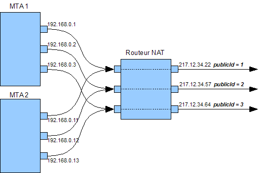

# Configurations techniques des courriers électroniques{#email-deliverability}

## Présentation {#overview}

La section suivante présente une vue d’ensemble de la configuration requise pour contrôler la sortie des instances Adobe Campaign lors de la diffusion des courriers électroniques.

>[!NOTE]
>
>Some configurations can only be performed by Adobe for deployments hosted by Adobe, for example, to access the server and instance configuration files. To learn more about the different deployments, refer to the [Hosting models](../../installation/using/hosting-models.md) section or to [this article](https://helpx.adobe.com/campaign/kb/acc-on-prem-vs-hosted.html).

Pour en savoir plus sur les concepts et les meilleures pratiques en matière de délivrabilité, consultez cette [section](../../delivery/using/about-deliverability.md).

All technical recommendations concerning the efficient sending and receiving of emails by an Adobe Campaign platform are available in this [section](../../delivery/using/technical-recommendations.md).

## Principe de fonctionnement {#operating-principle}

Le débit d&#39;une ou plusieurs instances Adobe Campaign peut être contrôlé afin de limiter le nombre d&#39;emails envoyés en fonction des domaines. Par exemple, il est possible de limiter le débit des adresses en **yahoo.com** à 20.000 messages par heure et à 100.000 messages par heure pour les autres domaines.

Le débit des messages doit être contrôlé pour chacune des adresses IP utilisées par les serveurs de diffusion (**mta**) pour l&#39;envoi des emails. Plusieurs **mta** repartis sur plusieurs machines et appartenant à différentes instances Adobe Campaign peuvent partager les mêmes adresses IP pour l&#39;envoi d&#39;emails : il est donc nécessaire qu&#39;un processus coordonne l&#39;utilisation de ces adresses IP.

C&#39;est la fonction du module **stat** : il fédère toutes les demandes d&#39;ouvertures de connexions et d&#39;envois de messages vers les serveurs de messagerie pour un ensemble d&#39;adresses IP. Le serveur de statistiques maintient ainsi le compte des envois et peut autoriser ou refuser les envois dans le temps en fonction des quotas définis.


* Le serveur de statistiques (**stat**) est associé à une base Adobe Campaign pour charger sa configuration.
* Les serveurs de diffusions (**mta**) sont configurés pour contacter via UDP un serveur de statistiques qui n&#39;appartient pas nécessairement à leur propre instance.

### Serveurs de diffusion {#delivery-servers}

Le module **mta** distribue les messages à ses modules fils **mtachild**. Chaque **mtachild** prépare les messages, puis demande l&#39;autorisation au serveur de statistiques avant de les envoyer.

Les étapes sont les suivantes :

1. Le **mta** sélectionne les messages éligibles pour l&#39;envoi et les assigne à un **mtachild** disponible.
1. Le **mtachild** charge toutes les informations nécessaires pour construire le message (contenu, éléments de personnalisation, attachements, images, etc.) et transmet le message au gestionnaire d&#39;envoi (**Email Traffic Shaper**).
1. Lorsque le gestionnaire d&#39;envoi a reçu l&#39;autorisation du serveur de statistiques (**smtp stat**), le message est envoyé au destinataire.


### Statistiques et limitations des serveurs de messagerie {#email-server-statistics-and-limitations}

Le serveur de statistiques maintient les statistiques suivantes pour chaque serveur de messagerie vers lequel des messages sont envoyés :

* Nombre de connexions ouvertes en instantané,
* Nombre de messages envoyés dans l&#39;heure précédente,
* Taux de connexions réussies/refusées,
* Taux de connexions vers des serveurs injoignables.

Parallèlement, le module charge une liste de limitations pour certains serveurs de messagerie :

* Nombre maximum de connexions simultanées,
* Nombre maximum de messages par heure,
* Nombre maximum de messages par connexion.

### Gestion des adresses IP {#managing-ip-addresses}

Le serveur de statistiques peut fédérer plusieurs instances ou plusieurs machines si elles partagent les mêmes adresses IP publiques. Il n&#39;est donc pas rattaché à une instance particulière, mais il doit néanmoins en contacter une pour récupérer les limitations par domaine.

Les statistiques d&#39;envoi sont conservées pour chaque MX cible et pour chaque IP source. Par exemple, si le domaine ciblé possède 5 MX et la plateforme peut utiliser 3 adresses IP différentes, le serveur pourra gérer jusqu&#39;à 15 séries d&#39;indicateurs pour ce domaine.

The source IP address matches the public IP address, i.e. the address as it is seen by the remote email server. This IP address can be different from the address of the machine which hosts the **mta**, if an NAT router is provided. This is why the statistics server uses an identifier which matches the public IP (**publicId**). L’association entre l’adresse locale et cet identifiant est déclarée dans le fichier de configuration **serverConf.xml** . Tous les paramètres disponibles dans le fichier **serverConf.xml** sont répertoriés dans cette [section](../../installation/using/the-server-configuration-file.md).

## Contrôle de la sortie de diffusion {#delivery-output-controlling}

Pour diffuser les messages vers les serveurs de messagerie, le composant **Email Traffic Shaper** fait une demande d&#39;ouverture de connexion auprès du serveur de statistiques. Une fois la demande acceptée, la connexion est ouverte.

Avant l&#39;envoi des messages, le module demande des &#39;jetons&#39; au serveur. Généralement, il s&#39;agit d&#39;un lot minimum de 10 jetons, afin de réduire le nombre de requêtes auprès du serveur.

Le serveur conserve en mémoire toutes les statistiques de connexion et d&#39;envoi. En cas de redémarrage, les informations sont provisoirement perdues : chacun des clients conserve localement une copie de ses statistiques d&#39;envoi et les retourne régulièrement au serveur (toutes les 2 minutes). Le serveur peut alors ré-agréger les données.

Les sections suivantes décrivent le traitement d&#39;un message par le composant **Email Traffic Shaper**.

### Envoi d&#39;un message {#message-delivery}

Lorsqu&#39;un message est envoyé, 3 résultats sont possibles :

1. **Success** : le message est envoyé avec succès. Le message est mis à jour.
1. **Message Failed** : le serveur contacté refuse le message pour le destinataire spécifié. Ce résultat correspond aux codes retour entre 550 et 599, mais certaines exceptions peuvent être définies.
1. **Échec** de la session (pour la version 5.11 ultérieure) : si le **message** reçoit une réponse pour ce message, le message est abandonné (voir abandon [du](#message-abandonment)message). Le message est envoyé vers un autre chemin ou défini sur En attente si aucun autre chemin n’est disponible (voir [Message en attente](#message-pending)).

   >[!NOTE]
   >
   >Un **chemin** désigne une connexion entre le **mta** Adobe Campaign et le **mta** destination, le **mta** Adobe Campaign pouvant choisir parmi plusieurs IP de départ et plusieurs adresses IP du domaine destination.

### Abandon d&#39;un message {#message-abandonment}

Lorsqu&#39;un message est abandonné, il est retourné au **mta** et n&#39;est plus géré par le **mtachild**.

Le **mta** décide de l&#39;action à suivre pour ce message (reprise, abandon, mise en quarantaine, etc.) en fonction du code réponse et des règles.

### Mise en attente d&#39;un message {#message-pending}

Un message est mis en attente lorsqu&#39;il arrive dans la file active mais qu&#39;il n&#39;y a actuellement aucun chemin disponible.

Un chemin est généralement marqué non disponible pour une durée variable après une erreur de connexion. La durée d&#39;indisponibilité d&#39;un chemin dépend de la fréquence et de l&#39;ancienneté des erreurs.

## Configuration du serveur de statistiques {#statistics-server-configuration}

Le serveur de statistiques peut être utilisé par plusieurs instances : il doit être configuré indépendamment des instances qui vont l&#39;utiliser.

Vous devez d&#39;abord définir la base de données Adobe Campaign qui hébergera la configuration.

### Configuration de démarrage {#start-configuration}

Par défaut, le module **stat** est démarré pour chacune des instances. Lorsque les instances sont mutualisées sur une même machine, ou lorsque les instances partagent les mêmes adresses IP, un seul serveur de statistiques doit être utilisé : les autres doivent être désactivés.

### Définition du port du serveur {#definition-of-the-server-port}

Par défaut, le serveur de statistiques écoute sur le port 7777. Ce port peut être modifié dans le fichier **serverConf.xml** . Tous les paramètres disponibles dans le fichier **serverConf.xml** sont répertoriés dans cette [section](../../installation/using/the-server-configuration-file.md).

```
<stat port="1234"/>
```

## Configuration des MX {#mx-configuration}

### A propos des règles MX {#about-mx-rules}

Les règles MX (Mail eXchanger) correspondent aux règles de gestion de communication entre un serveur expéditeur et un serveur destinataire.

>[!IMPORTANT]
>
>Pour les installations hébergées ou hybrides, si vous avez effectué la mise à niveau vers la MTA améliorée, les règles de débit de **[!UICONTROL MX management]** diffusion ne sont plus utilisées. La MTA améliorée utilise ses propres règles MX qui lui permettent de personnaliser votre débit par domaine en fonction de votre propre réputation de courriel historique et des commentaires en temps réel provenant des domaines où vous envoyez des courriers électroniques.
>
>Pour plus d’informations sur la MTA améliorée d’Adobe Campaign, reportez-vous à ce [document](https://helpx.adobe.com/campaign/kb/campaign-enhanced-mta.html).

Ces règles sont rechargées automatiquement tous les matins à 6h00 (heure du serveur) afin de fournir régulièrement l’instance du client.

Selon les capacités matérielles et la politique interne, un FAI acceptera un nombre prédéfini de connexions et de messages par heure. Ces variables peuvent être modifiées de manière automatique par le système du FAI en fonction de la réputation de l&#39;IP et du domaine de l&#39;expéditeur. Adobe Campaign, via sa plateforme délivrabilité, gère plus de 150 règles spécifiques par FAI, avec, en complément, une règle générique pour les autres domaines.

Le nombre maximum de connexions ne dépend pas exclusivement du nombre d&#39;adresses IP publiques utilisées par le MTA.

Par exemple, si vous autorisez cinq connexions dans les règles MX et que vous avez configuré deux adresses IP publiques, vous pouvez penser que vous ne pouvez pas avoir plus de dix connexions ouvertes simultanément sur ce domaine. En vérité, le nombre maximum de connexions se réfère à un chemin qui est une combinaison de l&#39;une de nos IP MTA publiques et d&#39;une IP MTA du client.

Dans l&#39;exemple ci-dessous, l&#39;utilisateur dispose de deux adresses IP publiques et configurées, et le domaine est yahoo.com.

```
user:~ user$ host -t mx yahoo.com
                yahoo.com mail is handled by 1 mta5.am0.yahoodns.net.
                yahoo.com mail is handled by 1 mta6.am0.yahoodns.net.
                yahoo.com mail is handled by 1 mta7.am0.yahoodns.net.
```

Les enregistrements MX pour yahoo.com informent l&#39;utilisateur que yahoo.com possède trois MX. Pour se connecter au MX client, le MTA demande son adresse IP au DNS.

```
user:~ user$ host -t a mta5.am0.yahoodns.net
                mta5.am0.yahoodns.net has address 98.136.216.26
                mta5.am0.yahoodns.net has address 98.136.217.202
                mta5.am0.yahoodns.net has address 98.138.112.38
                mta5.am0.yahoodns.net has address 66.196.118.37
                mta5.am0.yahoodns.net has address 63.250.192.46
                mta5.am0.yahoodns.net has address 66.196.118.240
                mta5.am0.yahoodns.net has address 98.136.217.203
                mta5.am0.yahoodns.net has address 98.138.112.35
```

Pour cet enregistrement MX, l&#39;utilisateur peut contacter huit adresses IP. Comme il dispose de deux adresses IP publiques, il a seize (8*2) combinaisons pour accéder aux serveurs email de yahoo.com. Chacune de ces combinaisons s&#39;appelle un chemin.

Le deuxième enregistrement MX apparaît comme ceci :

```
user:~ user$ host -t a mta6.am0.yahoodns.net
                mta6.am0.yahoodns.net has address 98.138.112.38
                mta6.am0.yahoodns.net has address 98.136.216.26
                mta6.am0.yahoodns.net has address 63.250.192.46
                mta6.am0.yahoodns.net has address 66.196.118.35
                mta6.am0.yahoodns.net has address 98.136.217.203
                mta6.am0.yahoodns.net has address 98.138.112.32
                mta6.am0.yahoodns.net has address 98.138.112.37
                mta6.am0.yahoodns.net has address 66.196.118.33
```

Quatre de ces huit adresses IP sont déjà utilisées en mta5 (98.136.216.26, 98.138.112.38, 63.250.192.46 et 98.136.217.203). Cet enregistrement permet à l&#39;utilisateur d&#39;utiliser quatre nouvelles adresses IP. Le troisième enregistrement MX aussi.

Au total, l&#39;utilisateur dispose de seize adresses distantes. Avec ses deux adresses IP publiques, il obtient un total de trente-deux chemins pour accéder aux serveurs email de yahoo.com.

>[!NOTE]
>
>Si deux enregistrement MX référencent la même adresse IP, un seul chemin sera pris en compte, et non deux.

Ci-dessous, quelques exemples sur l&#39;utilisation des règles MX:


Dans l&#39;exemple ci-dessous, l&#39;utilisateur possède une limitation de 10 000 messages par heure pour un nom de domaine particulier, mais la capacité de débit du MTA est supérieure à cette limite.

Dans ce cas, le trafic est divisé en 12 périodes de 5 minutes pour chaque heure, et la limitation réelle est de 833 messages par période.

Ces messages seront délivrés aussi vite que possible.


### Configurer la gestion des MX {#configuring-mx-management}

Les règles à respecter pour MX sont définies dans le **[!UICONTROL MX management]** document du **[!UICONTROL Administration > Campaign Management > Non deliverables Management > Mail rule sets]** noeud de l’arborescence.

Si le **[!UICONTROL MX management]** document n’existe pas dans le noeud, vous pouvez le créer manuellement. Pour cela :

1. Créez un nouveau jeu de règles mail.
1. Sélectionnez le **[!UICONTROL MX management]** mode.

   

1. Entrez **defaultMXRules** dans le **[!UICONTROL Internal name]** champ.

Le serveur de statistiques doit être redémarré pour que les modifications soient prises en compte.

To reload the configuration without restarting the statistics server, use the following command on the machine which hosts the server: `nlserver stat -reload`

>[!NOTE]
>
>Cette ligne de commande est préférée à **nlserver restart**. Elle empêche la perte des statistiques collectées avant le redémarrage et permet d&#39;éviter des pics d&#39;utilisation qui pourraient aller à l&#39;encontre des quotas définis dans les règles MX.

### Configuration des règles MX {#configuring-mx-rules}

Le **[!UICONTROL MX management]** document répertorie tous les domaines liés à une règle MX.

Ces règles sont appliquées dans l&#39;ordre : la première règle dont le masque de MX est compatible avec le MX ciblé est appliquée.

Les paramètres disponibles pour chaque règle sont les suivants :

* **[!UICONTROL MX mask]**: domaine sur lequel la règle est appliquée. Chaque règle fixe un masque d&#39;adresse du MX. Tout MX dont le nom correspond à ce masque est éligible. Le masque peut contenir les caractères génériques &quot;*&quot; et &quot;?&quot;.

   Par exemple, les adresses :

   * a.mx.yahoo.com
   * b.mx.yahoo.com
   * c.mx.yahoo.com
   sont compatibles avec les masques :

   * *.yahoo.com
   * ?.mx.yahoo.com
   Par exemple, pour l&#39;adresse email foobar@gmail.com, le domaine est gmail.com et l&#39;enregistrement MX est :

   ```
   gmail.com mail exchanger = 20 alt2.gmail-smtp-in.l.google.com.
   gmail.com mail exchanger = 10 alt1.gmail-smtp-in.l.google.com.
   gmail.com mail exchanger = 40 alt4.gmail-smtp-in.l.google.com.
   gmail.com mail exchanger = 5  gmail-smtp-in.l.google.com.
   gmail.com mail exchanger = 30 alt3.gmail-smtp-in.l.google.com.
   ```

   Dans ce cas, la règle MX `*.google.com` sera utilisée. Comme vous pouvez le constater, le masque de règle MX ne correspond pas nécessairement au domaine dans le courrier. Les règles MX appliquées aux adresses électroniques de gmail.com seront celles qui comportent le masque `*.google.com`.

* **[!UICONTROL Range of identifiers]**: cette option vous permet d’indiquer les plages d’identifiants (publicID) pour lesquelles la règle s’applique. Vous pouvez indiquer :

   * Un nombre : la règle ne s&#39;appliquera qu&#39;à ce publicId,
   * Une plage de nombres (**nombre1-nombre2**) la règle s&#39;appliquera à tous les publicId compris entre ces deux nombres.
   >[!NOTE]
   >
   >Lorsque ce champ est vide, la règle s&#39;applique à tous les identifiants.

   Une ID Publique est l&#39;identifiant interne d&#39;une adresse IP publique utilisée par un ou plusieurs MTA. Ces ID sont définies dans les serveurs MTA dans le fichier **config-instance.xml**.

   

* **[!UICONTROL Shared]**: définit la portée des propriétés de cette règle MX. Si cette option est cochée, tous les paramètres sont partagés sur toutes les adresses IP disponibles sur l’instance. Lorsque cette option est désactivée, les règles MX sont définies pour chaque IP. Le nombre maximal de messages est multiplié par le nombre d’adresses IP disponibles.
* **[!UICONTROL Maximum number of connections]**: nombre maximal de connexions simultanées au domaine de l’expéditeur.
* **[!UICONTROL Maximum number of messages]**: nombre maximal de messages pouvant être envoyés sur une connexion. Lorsque les messages dépassent ce nombre, la connexion est fermée et une nouvelle connexion est ouverte.
* **[!UICONTROL Messages per hour]**: nombre maximal de messages pouvant être envoyés en une heure au domaine de l’expéditeur.
* **[!UICONTROL Connection time out]**: délai de connexion à un domaine.

   >[!NOTE]
   >
   >Le système d&#39;exploitation Windows peut émettre un **timeout** avant cette limite. Cette limite dépend de la version de Windows.

* **[!UICONTROL Timeout Data]** : durée maximale d&#39;attente d&#39;une réponse du serveur après l&#39;envoi du contenu du message (section DATA du protocole SMTP).
* **[!UICONTROL Timeout]** : durée maximale d&#39;attente de réponse pour les autres échanges avec le serveur SMTP.
* **[!UICONTROL TLS]**: Le protocole TLS, qui vous permet de chiffrer les remises de courrier électronique, peut être activé de manière sélective. Pour chaque masque MX, les options suivantes sont disponibles :

   * **[!UICONTROL Default configuration]**: Il s’agit de la configuration générale spécifiée dans le fichier de configuration serverConf.xml appliqué.

      >[!CAUTION]
      >
      >Il n&#39;est pas recommandé de modifier le paramétrage par défaut.

   * **[!UICONTROL Disabled]** : Les messages sont systématiquement envoyés sans chiffrement.
   * **[!UICONTROL Opportunistic]** : La diffusion des messages est chiffrée si le serveur de réception (SMTP) peut générer le protocole TLS.

Exemple de paramétrage :


### Gestion des formats des emails {#managing-email-formats}

Il est possible de définir le format des messages envoyés, de sorte que l&#39;affichage du contenu s&#39;adapte automatiquement en fonction du domaine de l&#39;adresse de chaque destinataire.

Pour ce faire, accédez au **[!UICONTROL Management of email formats]** document qui se trouve sous **[!UICONTROL Administration]** > **[!UICONTROL Campaign management]** > **[!UICONTROL Non deliverables management]** > **[!UICONTROL Mail rule sets]**.

Ce document contient notamment une liste de domaines prédéfinis correspondant aux formats japonais gérés par Adobe Campaign. Pour plus d&#39;informations, consultez [ce document](../../delivery/using/defining-the-email-content.md#sending-emails-on-japanese-mobiles).


Le paramètre **Structure MIME** (Multipurpose Internet Mail Extensions) permet de définir la structure du message qui sera transmise aux différents clients de messagerie. Trois options sont disponibles :

* **multipart** : envoi du message au format texte et HTML. Si le format HTML n&#39;est pas accepté, le message pourra tout de même s&#39;afficher au format texte.

   Par défaut, la structure en plusieurs parties est **multipartie/alternative**, mais elle devient automatiquement **multipartie/associée** lorsqu’une image est ajoutée au message. Certains fournisseurs s’attendent à ce que le format **multipartie/associé** soit appliqué par défaut, l’ **[!UICONTROL Force multipart/related]** option impose ce format même si aucune image n’est jointe.

* **html** : envoi du message au format HTML uniquement. Si le format HTML n&#39;est pas accepté, le message ne s&#39;affichera pas.
* **text** : envoi du message au format texte uniquement. L&#39;avantage des messages au format texte est leur taille très réduite.

Si l’ **[!UICONTROL Image inclusion]** option est activée, elles s’affichent directement dans le corps du courrier électronique. Les images seront ensuite téléchargées et les liens URL seront remplacés par leur contenu.

Cette option est notamment utilisée par le marché japonais pour les emails au format **Deco-mail**, **Decore Mail** ou **Decoration Mail**. Pour plus d&#39;informations, consultez [ce document](../../delivery/using/defining-the-email-content.md#sending-emails-on-japanese-mobiles).

>[!CAUTION]
>
>L&#39;insertion des images dans un email augmente considérablement la taille de ce dernier.

## Configuration des serveurs de diffusions {#delivery-server-configuration}

### Synchronisation des horloges {#clock-synchronization}

Les horloges de l&#39;ensemble des serveurs composant la plateforme Adobe Campaign (y compris la base de données), doivent être synchronisées et les systèmes doivent être dans le même fuseau horaire.

### Coordonnées du serveur de statistiques {#coordinates-of-the-statistics-server}

L&#39;adresse du serveur de statistiques doit être indiquée au niveau du **mta**.

La propriété **statServerAddress** de l&#39;élément **mta** de la configuration permet de spécifier l&#39;adresse et le numéro de port à utiliser.

```
<mta statServerAddress="emailStatServer:7777">
   [...]
 </mta>
```

Pour utiliser le serveur de statistiques se trouvant sur la même machine, il faut au minimum renseigner le nom de la machine à la valeur **localhost**:

```
 <mta statServerAddress="localhost">
```

>[!CAUTION]
>
>Si ce champ n&#39;est pas renseigné, le **mta** ne démarrera pas.

### Liste des adresses IP à utiliser {#list-of-ip-addresses-to-use}

La configuration relative à la gestion du trafic se situe dans l&#39;élément **mta/child/smtp** du fichier de configuration.

Pour chacun des éléments **IPAffinity**, vous devez déclarer les adresses IP de la machine qui peuvent être utilisées.

Exemple :

```
<IPAffinity localDomain="<domain>" name="default">
  <IP address="192.168.0.11" publicId="1" weight="5"/>
  <IP address="192.168.0.12" heloHost="revdns1.campaign.com" publicId="2" weight="5"/>
  <IP address="192.168.0.13" publicId="3" weight="1"/>
</IPAffinity>
```

Les paramètres sont les suivants :

* **address** : il s&#39;agit de l&#39;adresse IP de la machine hôte du MTA à utiliser.
* **heloHost** : cet identifiant représente l&#39;adresse IP telle qu&#39;elle sera vue par le serveur SMTP.

* **publicId** : cette information est utile lorsqu&#39;une adresse IP est partagée par plusieurs **mta** Adobe Campaign derrière un routeur NAT. Le serveur de statistiques utilise cet identifiant pour mémoriser les statistiques de connexions et d&#39;envois entre ce point de départ et le serveur cible.
* **weight** : permet de définir la fréquence relative d&#39;utilisation de l&#39;adresse. Par défaut, toutes les adresses ont un poids égal à 1.

>[!NOTE]
>
>Dans le fichier serverConf.xml, vous devez vérifier qu’une adresse IP correspond à un hôte unique avec un identifiant unique (public_id). Il ne peut pas être mappé à plusieurs hôtes hélas, ce qui peut entraîner des problèmes de ralentissement de la diffusion.

Dans l&#39;exemple précédent, en condition normale, les adresses seront utilisées selon la répartition suivante :

    * &quot;1&quot;: 5 / (5+5+1) = 45%
    * &quot;2&quot;: 5 / (5+5+1) = 45%
    * &quot;3&quot;: 1 / (5+5+1) = 10%

Si, par exemple, la première adresse est inutilisable vers un MX donné, les messages seront envoyés en utilisant la répartition suivante :

    * &quot;2&quot;: 5 / (5+1) = 83%
    * &quot;3&quot;: 1 / (5+1) = 17%

* **includeDomains** : permet de réserver cette adresse IP aux emails appartenant à un domaine particulier. C&#39;est une liste de masques pouvant contenir un ou plusieurs jokers &#39;*&#39;. Si l&#39;attribut n&#39;est pas renseigné, tous les domaines peuvent utiliser cette adresse IP.

   Exemple : **includeDomains=&quot;wanadoo.com,orange.com,yahoo.*&quot;**

* **excludeDomains** : exclut une liste de domaines de cette adresse IP. Ce filtre est applique après le filtre **includeDomains**.

   

## Optimisation de l&#39;envoi d&#39;emails {#email-sending-optimization}

L&#39;architecture interne du **mta** Adobe Campaign a un impact sur le paramétrage pour optimiser l&#39;envoi d&#39;emails. Voici quelques conseils pour améliorer les envois.

### Ajuster le paramètre maxWaitingMessages {#adjust-the-maxwaitingmessages-parameter}

Le paramètre **maxWaitingMessages** indique le nombre maximum de messages préparés à l&#39;avance par le **mtachild**. Les messages ne sont décomptés de cette liste que lorsqu&#39;ils sont effectivement envoyés ou abandonnés.

Ce paramètre est très important et particulièrement critique si les messages ne sont pas triés par domaine.

Lorsque le seuil maximum du paramètre **maxWorkingSetMb** (256) est atteint, le serveur de diffusion n&#39;envoie plus de messages. Les performances diminueront très fortement jusqu&#39;à ce que le **mtachild** redémarre. Pour pallier à ce problème, vous pouvez soit augmenter le plafond du paramètre **maxWorkingSetMb**, soit diminuer celui du paramètre **maxWaitingMessages**.

Le paramètre **maxWorkingSetMb** se calcule empiriquement en multipliant le nombre maximum de messages par la taille moyenne d&#39;un message, le tout multiplié par 2,5. Par exemple, si un message a une taille de 50 ko en moyenne, et que le paramètre **maxWaitingMessages** a pour valeur 1000, la mémoire consommée sera d&#39;environ 125 Mo.

### Ajuster le nombre de mtachild {#adjust-the-number-of-mtachild}

Le nombre de child ne devrait pas excéder le nombre de processeurs de la machine. Nous vous recommandons de ne pas dépasser 8 **mtachild**. L&#39;ordre du millier de sessions semble une bonne valeur. Il faut alors augmenter le nombre de messages par **child** (**maxMsgPerChild**) pour avoir une durée de vie suffisante.
