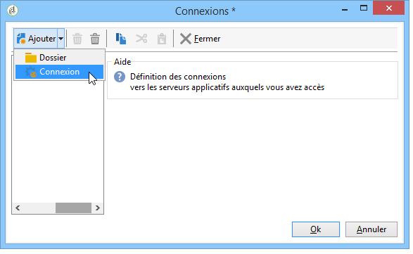

# Déploiement Entreprise{#enterprise-deployment}


Il s&#39;agit de la configuration la plus complète. Elle étend la configuration standard pour une sécurité accrue et une disponibilité supérieure :

* serveurs de redirection dédiés, derrière un répartiteur de charge agissant au niveau HTTP ou au niveau TCP, pour une montée en charge et une grande disponibilité,
* deux serveurs applicatifs, pour un meilleur débit et des capacités de fail-over (fonctionnement même en cas de panne d&#39;un serveur), isolés dans le LAN.

La communication générale entre les serveurs et les processus est réalisée conformément au schéma suivant :


Le débit attendu dans ce type de configuration peut être supérieur à 100 000 mails par heure avec le paramétrage et la bande-passante adéquats.

## Fonctionnalités {#features}

### Avantages {#advantages}

* Optimisation de la sécurité : seuls les services qui ont besoin d&#39;être exposés à l&#39;extérieur sont installés sur la machine de la DMZ.
* Haute disponibilité plus aisée à garantir : seule la machine visible de l&#39;extérieur doit être gérée pour la haute disponibilité.

### Inconvénients {#disadvantages}

Coûts du matériel et d&#39;administration plus élevés.

### Matériel recommandé {#recommended-equipment}

* Serveurs applicatifs : processeur quad-core à 2 GHz, 4 Go de mémoire, disque en RAID 1 Soft 80 Go SATA.
* Serveurs de redirection : processeur quad-core à 2 GHz, 4 Go de mémoire, disque en RAID 1 Soft 80 Go SATA.

>[!NOTE]
>
>Il est possible de réutiliser un répartiteur de charge déjà déployé pour répartir le trafic vers les serveurs de redirection.

## Etapes d&#39;installation et de configuration {#installation-and-configuration-steps}

### Conditions préalables requises {#prerequisites}

* JDK sur les deux serveurs applicatifs,
* Serveur Web (IIS, Apache) sur les deux frontaux,
* Accès à un serveur de base de données sur les deux serveurs applicatifs,
* Boîte pour les mails rebonds accessible en POP3,
* Création de deux alias DNS sur le répartiteur de charge :

   * un premier alias exposé au grand public pour le tracking et pointant vers le répartiteur de charge sur une adresse IP virtuelle (VIP) qui est ensuite distribuée sur les deux serveurs frontaux,
   * un deuxième alias exposé aux utilisateurs métiers pour l&#39;accès console et pointant vers un répartiteur de charge sur une adresse IP virtuelle (VIP) qui est ensuite distribuée sur les deux serveurs applicatifs.

* Configuration du firewall pour l&#39;ouverture des ports SMTP (25), DNS (53), HTTP (80), HTTPS (443), SQL (1521 pour Oracle, 5432 pour PostgreSQL, etc.). Voir à ce sujet la section [Accès à la base de données](../../installation/using/network-configuration.md#database-access).

>[!CAUTION]
>
>Si vos serveurs applicatifs pointent sur une instance de base de données unique, après l&#39;importation d&#39;un package standard sur une instance, le schéma contenu dans le package n&#39;est pas chargé sur l&#39;autre instance.
>  
>Si vos serveurs applicatifs pointent sur une instance de base de données unique, après changement du schéma sur une instance, le schéma n&#39;est pas chargé sur l&#39;autre instance.
>
>Pour résoudre ces problèmes, vous devez redémarrer le processus ‘web@default‘ sur la deuxième instance où l&#39;erreur est survenue.

### Installer et configurer le serveur applicatif n° 1 {#installing-and-configuring-the-application-server-1}

Dans les exemples présentés ci-dessous, les paramètres de l&#39;instance sont les suivants :

* Nom de l&#39;instance : demo
* Masque DNS : tracking.campaign.net&#42;, console.campaign.net&#42; (le serveur applicatif gère les URL pour la connexion des consoles clientes et les rapports, ainsi que les URL des pages miroir et de désinscription).
* Langue : française
* Base de données : campaign:demo@dbsrv

Les étapes d&#39;installation du premier serveur sont les suivantes :

1. Respectez la procédure d&#39;installation du serveur Adobe Campaign : package **nlserver** sous Linux ou **setup.exe** sous Windows.

   Voir à ce propos [Prérequis pour l&#39;installation de Campaign sous Linux](../../installation/using/prerequisites-of-campaign-installation-in-linux.md) (Linux) et [Prérequis pour l&#39;installation de Campaign sous Windows](../../installation/using/prerequisites-of-campaign-installation-in-windows.md) (Windows).

1. Une fois l&#39;installation du serveur Adobe Campaign terminée, démarrez le serveur applicatif (web) avec la commande **nlserver web -tomcat** (le module web permet de lancer Tomcat en mode serveur web autonome en écoute sur le port 8080) et vérifiez que Tomcat démarre correctement :

   ```
   12:08:18 >   Application server for Adobe Campaign Classic (7.X YY.R build XXX@SHA1) of DD/MM/YYYY
   12:08:18 >   Starting Web server module (pid=28505, tid=-1225184768)...
   12:08:18 >   Tomcat started
   12:08:18 >   Server started
   ```


   >[!NOTE]
   >
   >La première exécution du module Web permet de créer les fichiers **config-default.xml** et **serverConf.xml** dans le répertoire **conf**, sous le répertoire d’installation. Tous les paramètres disponibles dans le fichier **serverConf.xml** sont répertoriés dans cette [section](../../installation/using/the-server-configuration-file.md).

   Appuyez sur **Ctrl+C** pour arrêter le serveur.

   Voir à ce propos les sections suivantes :

   * Pour Linux : [Premier démarrage du serveur](../../installation/using/installing-packages-with-linux.md#first-start-up-of-the-server)
   * Pour Windows : [Premier démarrage du serveur](../../installation/using/installing-the-server.md#first-start-up-of-the-server)

1. Changez le mot de passe **internal** à partir de la commande :

   ```
   nlserver config -internalpassword
   ```

   Pour plus d’informations à ce sujet, consultez [cette section](../../installation/using/configuring-campaign-server.md#internal-identifier).

1. Créez l’instance de **démonstration** avec les masques DNS pour le suivi (ici, **tracking.campaign.net**) et l’accès aux consoles client (ici, **console.campaign.net**). Vous avez le choix entre les deux méthodes suivantes :

   * Créer l&#39;instance via la console :

     

     Voir à ce sujet la section [Création d’une instance et connexion](../../installation/using/creating-an-instance-and-logging-on.md).

     ou

   * Créer l&#39;instance en ligne de commande :

     ```
     nlserver config -addinstance:demo/tracking.campaign.net*,console.campaign.net*
     ```

     Voir à ce sujet la section [Création d’une instance](../../installation/using/command-lines.md#creating-an-instance).

1. Editez le fichier **config-demo.xml** (nouvellement créé à partir de la commande précédente et présent à côté du fichier **config-default.xml**), vérifiez que les processus **mta** (diffusion), **wfserver** (workflow), **inMail** (mails rebonds) et **stat** (statistiques) sont activés, puis configurez l’adresse du serveur de statistiques **app** :

   ```
   <?xml version='1.0'?>
   <serverconf>  
     <shared>    
       <!-- add lang="eng" to dataStore to force English for the instance -->    
       <dataStore hosts="tracking.campaign.net*,console.campaign.net*">      
         <mapping logical="*" physical="default"/>    
       </dataStore>  </shared>  
       <mta autoStart="true" statServerAddress="app">
       <wfserver autoStart="true"/>  
       <inMail autoStart="true"/>  
       <sms autoStart="false"/>  
       <listProtect autoStart="false"/>
   </serverconf>
   ```

   Pour plus d’informations à ce sujet, consultez [cette section](../../installation/using/configuring-campaign-server.md#enabling-processes).

1. Editez le fichier **serverConf.xml** et renseignez le domaine de diffusion puis indiquez les adresses IP (ou host) des serveurs DNS utilisés pour répondre aux requêtes DNS de type MX par le module MTA.

   ```
   <dnsConfig localDomain="campaign.com" nameServers="192.0.0.1, 192.0.0.2"/>
   ```

   >[!NOTE]
   >
   >Le paramètre **nameServers** n&#39;est utile que sous Windows.

   Pour en savoir plus, consultez [Paramétrage du serveur Campaign](../../installation/using/configuring-campaign-server.md).

1. Copiez le programme de configuration de la console client **setup-client-7.XX**, **YYYY.exe** dans le dossier **/datakit/nl/eng/jsp**. [En savoir plus](../../installation/using/client-console-availability-for-windows.md).

1. Démarrez le serveur Adobe Campaign (**net start nlserver6** sous Windows, **/etc/init.d/nlserver6 start** sous Linux) et exécutez à nouveau la commande **nlserver pdump** afin de vérifier la présence de tous les modules activés.

   >[!NOTE]
   >
   >À compter de la version 20.1, nous vous recommandons d’utiliser plutôt la commande suivante (pour Linux) : **systemctl start nlserver**


   ```
   12:09:54 >   Application server for Adobe Campaign Classic (7.X YY.R build XXX@SHA1) of DD/MM/YYYY
   syslogd@default (7611) - 9.2 MB
   stat@demo (5988) - 1.5 MB
   inMail@demo (7830) - 11.9 MB
   watchdog (27369) - 3.1 MB
   mta@demo (7831) - 15.6 MB
   wfserver@demo (7832) - 11.5 MB
   web@default (28671) - 40.5 MB
   ```

   Cette commande permet aussi de connaître la version et le numéro de build du serveur Adobe Campaign installé sur la machine.

1. Testez le module **nlserver web** à partir de l&#39;URL : [https://console.campaign.net/nl/jsp/logon.jsp](https://tracking.campaign.net/r/test).

   Cette URL permet d’accéder à la page de téléchargement du programme d’installation client. [En savoir plus](../../installation/using/client-console-availability-for-windows.md).

   Saisissez le nom d’utilisateur **interne** et son mot de passe associé à partir de la page de contrôle d’accès.

   

### Installer et configurer le serveur applicatif n° 2 {#installing-and-configuring-the-application-server-2}

Les étapes sont les suivantes :

1. Installez le serveur Adobe Campaign.
1. Copiez les fichiers de l&#39;instance créée sur le serveur applicatif n° 1

   Le nom d&#39;instance du serveur applicatif n°1 doit être conservé.

1. Remplacez le mot de passe **internal** par celui du serveur applicatif N°1.
1. Rattachez la base de données sur l&#39;instance :

   ```
   nlserver config -setdblogin:PostgreSQL:campaign:demo@dbsrv -instance:demo
   ```

1. Editez le fichier **config-demo.xml** (nouvellement créé à partir de la commande précédente et présent à côté du fichier **config-default.xml**), vérifiez que les processus **mta** (diffusion), **wfserver** (workflow), **inMail** (mails rebonds) et **stat** (statistiques) sont activés, puis configurez l’adresse du serveur de statistiques **app** :

   ```
   <?xml version='1.0'?>
   <serverconf>  
     <shared>    
       <!-- add lang="eng" to dataStore to force English for the instance -->    
       <dataStore hosts="tracking.campaign.net*,console.campaign.net*">      
         <mapping logical="*" physical="default"/>    
       </dataStore>  </shared>  
       <mta autoStart="true" statServerAddress="app">
       <wfserver autoStart="true"/>  
       <inMail autoStart="true"/>  
       <sms autoStart="false"/>  
       <listProtect autoStart="false"/>
   </serverconf>
   ```

   Pour plus d’informations à ce sujet, consultez [cette section](../../installation/using/configuring-campaign-server.md#enabling-processes).

1. Editez le fichier **serverConf.xml** et renseignez la configuration DNS du module MTA :

   ```
   <dnsConfig localDomain="campaign.com" nameServers="192.0.0.1, 192.0.0.2"/>
   ```

   >[!NOTE]
   >
   >Le paramètre **nameServers** n&#39;est utile que sous Windows.

   Pour en savoir plus, consultez [Paramétrage du serveur Campaign](../../installation/using/configuring-campaign-server.md).

1. Démarrez les serveurs Adobe Campaign.

   Voir à ce propos les sections suivantes :

   * Pour Linux : [Premier démarrage du serveur](../../installation/using/installing-packages-with-linux.md#first-start-up-of-the-server)
   * Pour Windows : [Premier démarrage du serveur](../../installation/using/installing-the-server.md#first-start-up-of-the-server)

### Installer et configurer les serveurs frontaux {#installing-and-configuring-the-frontal-servers}

Les procédures d&#39;installation et de paramétrage sont identiques sur les deux machines.

Les étapes sont les suivantes :

1. Installez le serveur Adobe Campaign,
1. Respectez la procédure d&#39;intégration du serveur Web (IIS, Apache) décrite dans les sections suivantes :

   * Pour Linux : [Intégration à un serveur web pour Linux](../../installation/using/integration-into-a-web-server-for-linux.md),
   * Pour Windows : [Intégration à un serveur web pour Windows](../../installation/using/integration-into-a-web-server-for-windows.md).

1. Copiez les fichiers **config-demo.xml** et **serverConf.xml** créés lors de l&#39;installation, puis, dans le fichier **config-demo.xml**, activez le processus **trackinglogd** et désactivez les processus **mta**, **inmail**, **wfserver** et **stat**.
1. Editez le fichier **serverConf.xml** et renseignez les serveurs de tracking redondants dans les paramètres de la redirection :

   ```
   <spareServer enabledIf="$(hostname)!='front_srv1'" id="1" url="https://front_srv1:8080"/>
   <spareServer enabledIf="$(hostname)!='front_srv2'" id="2" url="https://front_srv2:8080"/>
   ```

1. Démarrez le site web et testez la redirection à partir de l&#39;URL : [https://tracking.campaign.net/r/test](https://tracking.campaign.net/r/test)

   Le navigateur doit afficher les messages suivants (en fonction de l&#39;URL redirigée par le répartiteur de charge) :

   ```
   <redir status="OK" date="AAAA/MM/JJ HH:MM:SS" build="XXXX" host="tracking.campaign.net" localHost="front_srv1"/>
   ```

   ou

   ```
   <redir status="OK" date="AAAA/MM/JJ HH:MM:SS" build="XXXX" host="tracking.campaign.net" localHost="front_srv2"/>
   ```

   Voir à ce propos les sections suivantes :

   * Pour Linux : [Lancement du serveur Web et test de la configuration](../../installation/using/integration-into-a-web-server-for-linux.md#launching-the-web-server-and-testing-the-configuration).
   * Pour Windows : [Lancement du serveur Web et test de la configuration](../../installation/using/integration-into-a-web-server-for-windows.md#launching-the-web-server-and-testing-the-configuration).

1. Démarrer le serveur Adobe Campaign.
