# Comptes externes{#external-accounts}

Un ensemble de comptes externes prédéfinis est livré avec Adobe Campaign. Pour établir des connexions avec des systèmes externes, vous pouvez créer des comptes externes.

Les comptes externes sont utilisés par les processus techniques comme les workflows techniques ou de campagne. Par exemple, lors de la configuration d&#39;un transfert de fichier dans un workflow ou d&#39;un échange de données avec une autre application (Adobe Target, Experience Manager, etc.), vous devez sélectionner un compte externe.

## Créer un compte externe {#creating-an-external-account}

Pour créer un compte externe, procédez comme suit : Les paramètres détaillés dépendent du type de compte externe.

1. Dans l&#39;**[!UICONTROL Explorateur]** Campaign, sélectionnez **[!UICONTROL Administration]** &#39;>&#39; **[!UICONTROL Plateforme]** &#39;>&#39; **[!UICONTROL Comptes externes]**.

   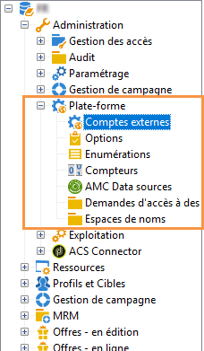

1. Cliquez sur le bouton **[!UICONTROL Nouveau]**.

   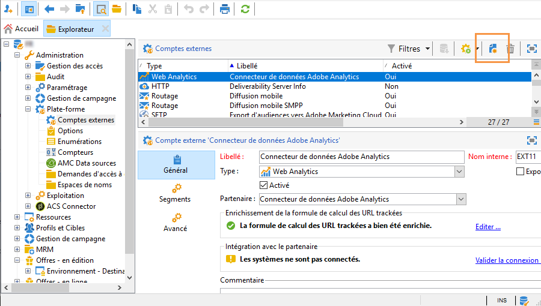

1. Définissez un **[!UICONTROL Libellé]** et un **[!UICONTROL Nom interne]**.
1. Sélectionnez le **[!UICONTROL Type]** de compte externe que vous voulez créer.
1. Configurez l’accès au compte en spécifiant les informations d’identification en fonction du type de compte externe choisi.

   Les informations nécessaires sont généralement fournies par le fournisseur du serveur auquel vous vous connectez.

1. Cochez l&#39;option **[!UICONTROL Activé]** pour activer la connexion.
1. Cliquez sur **[!UICONTROL Enregistrer]**.

Le compte externe est créé et ajouté à la liste des comptes externes.

## Comptes externes spécifiques à Campaign

### Mails rebonds {#bounce-mails-external-account}

Le compte externe **Mails rebonds** spécifie le compte externe POP3 à utiliser pour se connecter au service de messagerie. Pour plus d&#39;informations sur ce compte externe, consultez cette [page](../../workflow/using/inbound-emails.md).

Tous les serveurs configurés pour l&#39;accès POP3 peuvent être utilisés pour recevoir les retours d&#39;email.

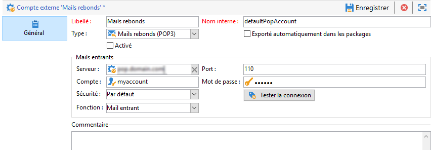

Pour configurer le compte externe **[!UICONTROL Mails rebonds (defaultPopAccount)]** :

* **[!UICONTROL Serveur]**

  URL du serveur POP3.

* **[!UICONTROL Port]**

  Numéro de port de la connexion POP3. Le port par défaut est 110.

* **[!UICONTROL Compte]**

  Nom de l&#39;utilisateur.

* **[!UICONTROL Mot de passe]**

  Mot de passe du compte d’utilisateur.

* **[!UICONTROL Chiffrement]**

  Type de chiffrement choisi entre **[!UICONTROL Par défaut]**, **[!UICONTROL POP3 + STARTTLS]**, **[!UICONTROL POP3]** ou **[!UICONTROL POP3S]**.

* **[!UICONTROL Fonction]**

  E-mail entrant ou routeur SOAP

>[!IMPORTANT]
>
>Avant de configurer votre compte externe POP3 à l’aide de Microsoft OAuth 2.0, vous devez enregistrer votre application sur le portail Azure. Pour plus d’informations, consultez [cette page](https://docs.microsoft.com/fr-fr/azure/active-directory/develop/quickstart-register-app).

Pour configurer un environnement externe POP3 à l’aide de **Microsoft OAuth 2.0**, cochez la case **[!UICONTROL Microsoft OAuth 2.0]** et renseignez les champs suivants :

* **[!UICONTROL Client Azure]**

  L’ID Azure (ou l’ID de répertoire (client)) se trouve dans le menu déroulant **Essentiels** de la présentation de votre application dans le portail Azure.

* **[!UICONTROL Identifiant de client Azure]**

  L’ID client (ou l’ID d’application (client)) se trouve dans le menu déroulant **Essentiels** de la présentation de votre application dans le portail Azure.

* **[!UICONTROL Secret client Azure]**

  L’ID de secret client se trouve dans la variable **Secrets client** du menu **Certificats et secrets** de votre application dans le portail Azure.

* **[!UICONTROL URL de redirection Azure]**

  L’URL de redirection se trouve dans le menu **Authentification** de votre application dans le portail Azure. Elle doit se terminer par la syntaxe suivante : `nl/jsp/oauth.jsp`, par exemple `https://redirect.adobe.net/nl/jsp/oauth.jsp`.

Après avoir saisi les différentes informations d’identification, vous pouvez cliquer sur **[!UICONTROL Configurer la connexion]** pour terminer la configuration de votre compte externe.

### Routage {#routing-external-account}

Le compte externe **[!UICONTROL Routage]** vous permet de configurer chaque canal disponible dans Adobe Campaign en fonction des packages installés.

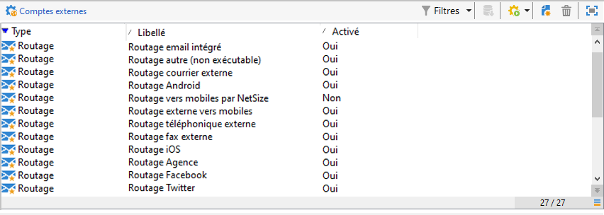

Les canaux suivants peuvent être configurés :

* [Email](#email-routing-external-account)
* [Mobile (SMS)](../../delivery/using/sms-set-up.md#creating-an-smpp-external-account)
* [Phone](../../delivery/using/communication-channels.md#other-channels)
* [Canal Courrier](../../delivery/using/about-direct-mail-channel.md)
* [Agence](../../delivery/using/communication-channels.md#other-channels)
* [X (anciennement Twitter)](../../social/using/about-social-marketing.md)
* [Canal iOS](../../delivery/using/configuring-the-mobile-application.md)
* [Canal Android](../../delivery/using/configuring-the-mobile-application-android.md)

### Routage des e-mails {#email-routing-external-account}

Le compte externe de routage des e-mails fourni par défaut est adapté à votre configuration.

En tant que société cliente on-premise/hybride, vous pouvez créer de nouveaux comptes externes de routage ou mettre à jour des paramètres, comme décrit ci-dessous. Cette configuration est réservée à des personnes expertes et peut avoir un impact sur votre délivrabilité. Pour toute question, contactez l’Assistance clientèle Adobe ou votre représentant/représentante Adobe.

* Vous pouvez utiliser un routage **en midsourcing** ou **externe**, ou encore un type de routage de diffusion **en masse**.

* Pour les modes de diffusion **en masse** et **en midsourcing**, vous pouvez définir vos paramètres de branding dans l’onglet **branding**. Ces paramètres servent à remplacer les [paramètres par défaut](../../installation/using/deploying-an-instance.md#email-channel-parameters) de l’**URL de la page miroir** et l’**adresse d’erreur** par des paramètres spécifiques à votre marque.

  

* Pour configurer un compte externe en midsourcing, reportez-vous à [cette section](mid-sourcing-server.md).

### Instance d&#39;exécution  {#execution-instance-external-account}

Si vous possédez une architecture répartie, vous devez spécifier les instances d’exécution liées à l’instance de pilotage et les connecter. Les modèles de messages transactionnels sont déployés sur l’instance d’exécution.

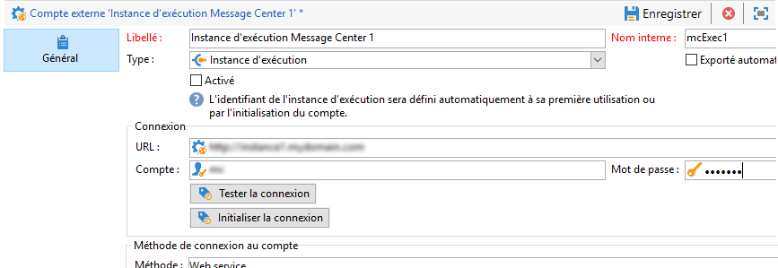

* **[!UICONTROL URL]**

  URL du serveur sur lequel est installée l&#39;instance d&#39;exécution.

* **[!UICONTROL Compte]**

  Nom du compte qui doit correspondre à l&#39;Agent Message Center tel qu&#39;il a été défini dans le dossier de l&#39;opérateur.

* **[!UICONTROL Mot de passe]**

  Mot de passe du compte tel qu&#39;il a été défini dans le dossier de l&#39;opérateur.

Pour plus d&#39;informations sur cette configuration, consultez [cette page](../../message-center/using/configuring-instances.md#control-instance).

## Accès aux comptes externes de systèmes externes

### FTP {#ftp-external-account}

Le compte externe FTP vous permet de configurer et de tester l’accès à un serveur en dehors d’Adobe Campaign. Pour configurer des connexions à des systèmes externes tels que des serveurs FTP 898 utilisés pour les transferts de fichiers, vous pouvez créer vos propres comptes externes. Pour en savoir plus à ce sujet, consultez cette [page](../../workflow/using/file-transfer.md).

Pour ce faire, spécifiez dans ce compte externe l&#39;adresse et les informations d’identification utilisées pour établir la connexion au serveur FTP.

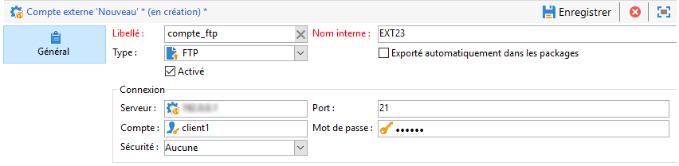

* **[!UICONTROL Serveur]**

  Nom du serveur FTP.

* **[!UICONTROL Port]**

  Numéro de port de connexion FTP. Le port par défaut est 21.

* **[!UICONTROL Compte]**

  Nom de l&#39;utilisateur.

* **[!UICONTROL Mot de passe]**

  Mot de passe du compte d’utilisateur.

* **[!UICONTROL Chiffrement]**

  Type de chiffrement choisi entre **[!UICONTROL Aucun]** et **[!UICONTROL SSL]**.

Pour savoir où trouver ces informations d’identification, consultez [cette page](https://help.dreamhost.com/hc/en-us/articles/115000675027-FTP-overview-and-credentials).

### SFTP {#sftp-external-account}

Le compte externe SFTP vous permet de configurer et de tester l’accès à un serveur en dehors d’Adobe Campaign. Pour configurer des connexions à des systèmes externes tels que des serveurs SFTP utilisés pour les transferts de fichiers, vous pouvez créer vos propres comptes externes. Pour en savoir plus à ce sujet, consultez cette [page](../../workflow/using/file-transfer.md).

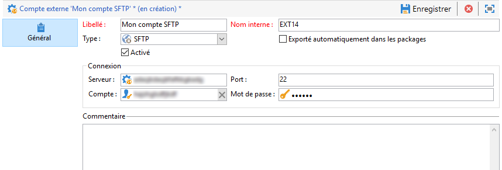

* **[!UICONTROL Serveur]**

  URL du serveur SFTP.

* **[!UICONTROL Port]**

  Numéro de port de connexion FTP. Le port par défaut est 22.

* **[!UICONTROL Compte]**

  Nom du compte utilisé pour se connecter au serveur SFTP.

* **[!UICONTROL Mot de passe]**

  Mot de passe utilisé pour se connecter au serveur SFTP.

<!--To add SSH keys on Windows:

1. Create the **HOME** environment variable with value set as the installation directory.

2. Add your private key to the `/$HOME/.ssh/id_rsa` folder.

3. Restart the Adobe Campaign services.
-->

### Base de données externe (FDA) {#external-database-external-account}

Utilisez le compte externe de type **Base de données externe** pour vous connecter à une base de données externe. En savoir plus sur l&#39;option Federated Data Access (FDA) dans [cette section](../../installation/using/about-fda.md).

Les bases de données externes compatibles avec Campaign sont répertoriées dans la [matrice de compatibilité](../../rn/using/compatibility-matrix.md)

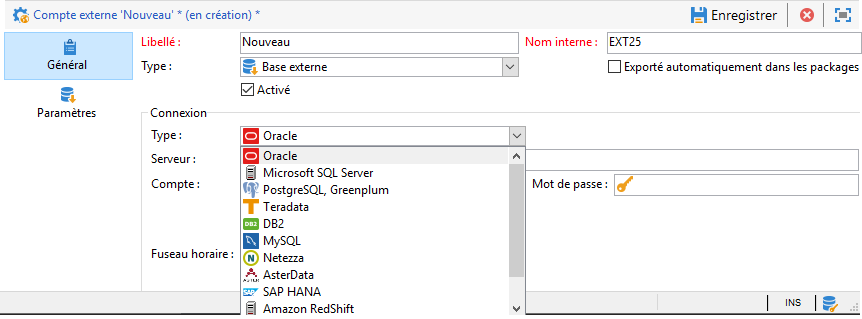

Les paramètres de configuration du compte externe dépendent du moteur de base de données. En savoir plus dans les sections suivantes :

* Configurer l’accès à [Vertica Analytics](../../installation/using/configure-fda-vertica.md)
* Configuration de l&#39;accès à [Snowflake](../../installation/using/configure-fda-snowflake.md)
* Configuration de l&#39;accès à [BigQuery Google](../../installation/using/configure-fda-google-big-query.md)
* Configuration de l&#39;accès à [Azure Synapse](../../installation/using/configure-fda-synapse.md)
* Configuration de l&#39;accès à [Hadoop](../../installation/using/configure-fda-hadoop.md)
* Configuration de l&#39;accès à [Oracle](../../installation/using/configure-fda-oracle.md)
* Configuration de l&#39;accès à [Netezza](../../installation/using/configure-fda-netezza.md)
* Configuration de l&#39;accès à [SAP HANA](../../installation/using/configure-fda-sap-hana.md)
* Configuration de l&#39;accès à [Snowflake](../../installation/using/configure-fda-snowflake.md)
* Configuration de l&#39;accès à [Sybase IQ](../../installation/using/configure-fda-sybase.md)
* Configuration de l&#39;accès à [Teradata](../../installation/using/configure-fda-teradata.md)


## Comptes externes d’intégration de solutions Adobe

### Adobe Experience Cloud {#adobe-experience-cloud-external-account}

Pour vous connecter à la console Adobe Campaign à l’aide d’un Adobe ID, vous devez configurer le compte externe **[!UICONTROL Adobe Experience Cloud (MAC)]**.

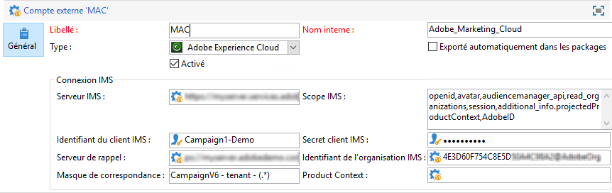

* **[!UICONTROL Serveurs IMS]**

  URL de votre serveur IMS. Assurez-vous que les instances de test et de production pointent sur le même point de terminaison de production IMS.

* **[!UICONTROL Scope IMS]**

  Les périmètres définis ici doivent être un sous-ensemble de ceux provisionnés par IMS.

* **[!UICONTROL Identifiant du client IMS]**

  ID de votre client IMS.

* **[!UICONTROL Secret client IMS]**

  Informations d’identification de votre secret client IMS.

* **[!UICONTROL Serveur de rappel]**

  URL d’accès à votre instance Adobe Campaign.

* **[!UICONTROL Identifiant de l&#39;organisation IMS]**

  Identifiant de votre organisation. Pour trouver l’identifiant de votre organisation, reportez-vous [cette page](https://experienceleague.adobe.com/docs/core-services/interface/administration/organizations.html?lang=fr){_blank}.

* **[!UICONTROL Masque de correspondance]**

  Syntaxe qui permettra la synchronisation des noms de configuration dans Enterprise Dashboard avec les groupes dans Adobe Campaign.

* **[!UICONTROL Serveur]**

  URL de votre instance Adobe Experience Cloud.

* **[!UICONTROL Tenant]**

  Nom de votre tenant Adobe Experience Cloud.

Pour plus d&#39;informations sur cette configuration, consultez [cette page](../../integrations/using/configuring-ims.md).

## Web Analytics {#web-analytics-external-account}

Le compte externe **[!UICONTROL Web Analytics]** vous permet de transférer des données d’Adobe Analytics vers Adobe Campaign sous la forme de segments. Réciproquement, il envoie des indicateurs et des attributs de campagnes par e-mail diffusés par le connecteur Adobe Campaign à Adobe Analytics.

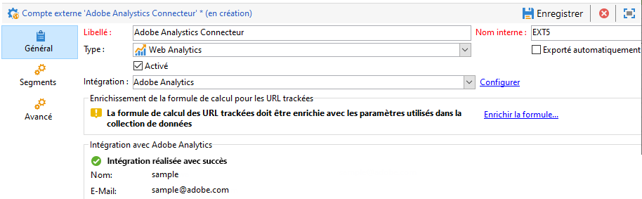

Pour ce compte externe, la formule de calcul pour les URL trackées doit être enrichie, et la connexion entre les deux solutions doit être validée. Pour en savoir plus à ce sujet, consultez cette [page](../../integrations/using/gs-aa.md).

### Adobe Experience Manager {#adobe-experience-manager-external-account}

Le compte externe **[!UICONTROL AEM (instance AEM)]** vous permet de gérer le contenu de vos diffusions email, ainsi que vos formulaires directement dans Adobe Experience Manager.

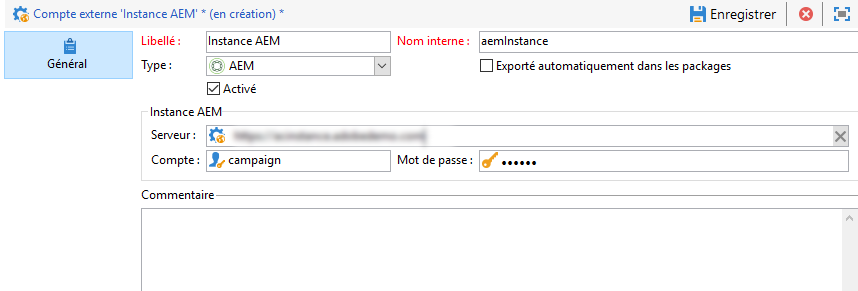

* **[!UICONTROL Serveur]**

  URL du serveur Adobe Experience Manager.

* **[!UICONTROL Port]**

  Nom du compte utilisé pour se connecter à l&#39;instance de création Adobe Experience Manager.

* **[!UICONTROL Mot de passe]**

  Mot de passe utilisé pour se connecter à l&#39;instance de création Adobe Experience Manager.

Voir à ce propos cette [section](../../integrations/using/about-adobe-experience-manager.md).

## Comptes externes du connecteur CRM

### Microsoft Dynamics CRM {#microsoft-dynamics-crm-external-account}

>[!NOTE]
>
> Les types de déploiement **[!UICONTROL On-premise]** et **[!UICONTROL Office 365]** sont désormais obsolètes. [En savoir plus](../../rn/using/deprecated-features.md).

Le compte externe **[!UICONTROL Microsoft Dynamics CRM]** vous permet d&#39;importer et d&#39;exporter des données Microsoft Dynamics vers Adobe Campaign.

Pour en savoir plus sur Campaign - Connecteur Microsoft Dynamics CRM dans cette [page](../../platform/using/crm-ms-dynamics.md).

Avec le type de déploiement **[!UICONTROL Web API]** et l’authentification **[!UICONTROL Mots de passe]**, vous devez fournir les détails suivants :

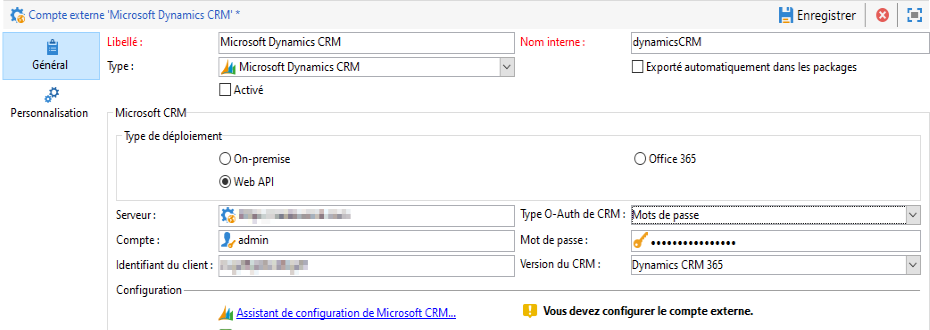

* **[!UICONTROL Compte]**

  Compte utilisé pour se connecter à Microsoft CRM.

* **[!UICONTROL Serveur]**

  URL de votre serveur Microsoft CRM.

  Pour trouver votre **[!UICONTROL URL de serveur]** Microsoft CRM, accédez à votre compte Microsoft Dynamics CRM, puis cliquez sur **Dynamics 365** et sélectionnez votre application. Vous pouvez ensuite trouver votre **[!UICONTROL URL de serveur]** dans la barre d’adresse de votre navigateur, par exemple : `https://myserver.crm.dynamics.com/`.

* **[!UICONTROL Identifiant du client]**

  ID du client qui se trouve sur le portail de gestion Microsoft Azure au niveau de la catégorie **[!UICONTROL Mettre à jour votre code]**, dans le champ **[!UICONTROL ID du client]**.

* **[!UICONTROL Version CRM]**

  Sélectionnez la version du CRM **[!UICONTROL Dynamics CRM 365]**.

Avec le type de déploiement **[!UICONTROL API web]** et l’authentification **[!UICONTROL Certificat]**, vous devez fournir les détails suivants :

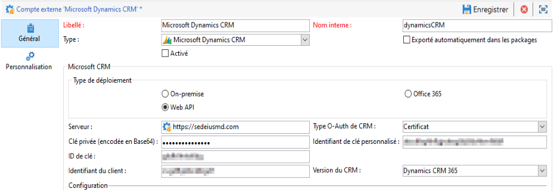

* **[!UICONTROL Serveur]**

  URL de votre serveur Microsoft CRM.

  Pour trouver votre **[!UICONTROL URL de serveur]** Microsoft CRM, accédez à votre compte Microsoft Dynamics CRM, puis cliquez sur **Dynamics 365** et sélectionnez votre application. Vous pouvez ensuite trouver votre **[!UICONTROL URL de serveur]** dans la barre d’adresse de votre navigateur, par exemple : `https://myserver.crm.dynamics.com/`.

* **[!UICONTROL Clé privée (encodée en Base64)]**

  Notez que la clé privée doit être chiffrée en Base64.

  Pour cela, vous pouvez utiliser l&#39;aide d&#39;un encodeur Base64 ou utiliser la ligne de commande `base64 -w0 private.key` sous Linux.

* **[!UICONTROL Identifiant de clé personnalisé]**

* **[!UICONTROL ID de clé]**

* **[!UICONTROL Identifiant du client]**

  ID du client qui se trouve sur le portail de gestion Microsoft Azure au niveau de la catégorie **[!UICONTROL Mettre à jour votre code]**, dans le champ **[!UICONTROL ID du client]**.

* **[!UICONTROL Version CRM]**

  Version du CRM parmi **[!UICONTROL Dynamics CRM 2007]**, **[!UICONTROL Dynamics CRM 2015]** et **[!UICONTROL Dynamics CRM 2016]**.

Pour plus d&#39;informations sur cette configuration, consultez [cette page](../../platform/using/crm-connectors.md).

### CRM Salesforce.com   {#salesforce-crm-external-account}

Le compte externe **[!UICONTROL Salesforce CRM]** vous permet d’importer et d’exporter des données Salesforce vers Adobe Campaign.

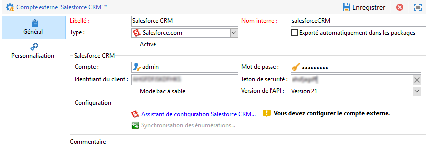

Pour configurer le compte externe Salesforce CRM afin de l’utiliser avec Adobe Campaign, vous devez fournir les détails suivants :

* **[!UICONTROL Compte]**

  Compte utilisé pour se connecter à Salesforce CRM.

* **[!UICONTROL Mot de passe]**

  Mot de passe utilisé pour se connecter à Salesforce CRM.

* **[!UICONTROL Identifiant du client]**

  Pour savoir où trouver votre identifiant du client, consultez [cette page](https://help.salesforce.com/articleView?id=000205876&amp;type=1).

* **[!UICONTROL Jeton de sécurité]**

  Pour savoir où trouver votre jeton de sécurité, consultez [cette page](https://help.salesforce.com/articleView?id=000205876&amp;type=1).

* **[!UICONTROL Version de l&#39;API]**

  Sélectionnez la version de l’API.

Pour ce compte externe, vous devez configurer votre Salesforce CRM à l&#39;aide de l&#39;assistant de configuration.

Pour plus d&#39;informations sur cette configuration, consultez [cette page](../../platform/using/crm-connectors.md).

## Transfert de données vers des comptes externes

### Amazon Simple Storage Service (S3) {#amazon-simple-storage-service--s3--external-account}

Le connecteur Amazon Simple Storage Service (S3) peut être utilisé pour importer ou exporter des données vers Adobe Campaign. Il peut être configuré dans une activité de workflow. Pour en savoir plus à ce sujet, consultez cette [page](../../workflow/using/file-transfer.md).

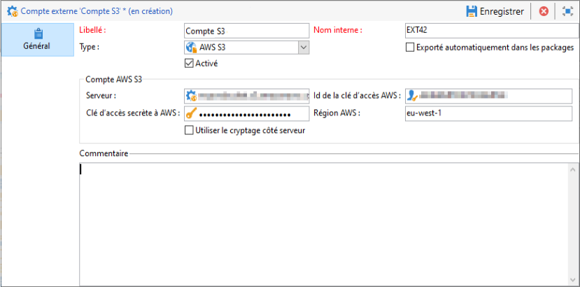

Lors de la configuration de ce nouveau compte externe, vous devez indiquer les informations suivantes :

* **[!UICONTROL Serveur du compte AWS S3]**

  URL du serveur qui doit être renseignée de la manière suivante :

  ```
  <S3bucket name>.s3.amazonaws.com/<s3object path>
  ```

* **[!UICONTROL ID de la clé d&#39;accès AWS]**

  Pour savoir où trouver votre ID de la clé d&#39;accès AWS, consultez [cette page](https://docs.aws.amazon.com/general/latest/gr/aws-sec-cred-types.html#access-keys-and-secret-access-keys) .

* **[!UICONTROL Clé d&#39;accès secrète à AWS]**

  Pour savoir où trouver votre clé d&#39;accès secrète à AWS, consultez [cette page](https://aws.amazon.com/fr/blogs/security/wheres-my-secret-access-key/).

* **[!UICONTROL Région AWS]**

  Pour en savoir plus sur la région AWS, consultez cette [page](https://aws.amazon.com/fr/about-aws/global-infrastructure/regions_az/).

* La case à cocher **[!UICONTROL Utiliser le chiffrement coté serveur]** vous permet de stocker votre fichier en mode chiffré dans S3.

Pour savoir où trouver l’ID de la clé d’accès et la clé d’accès secrète, consultez la [documentation](https://docs.aws.amazon.com/general/latest/gr/aws-sec-cred-types.html#access-keys-and-secret-access-keys) d’Amazon Web Services.

### Stockage Azure Blob {#azure-blob-external-account}

Le **compte externe de stockage Blob Azure** peut être utilisé pour importer ou exporter des données vers Adobe Campaign à l’aide d’une activité de workflow **[!UICONTROL Transfert de fichier]**. Pour plus d’informations à ce sujet, consultez cette [section](../../workflow/using/file-transfer.md).

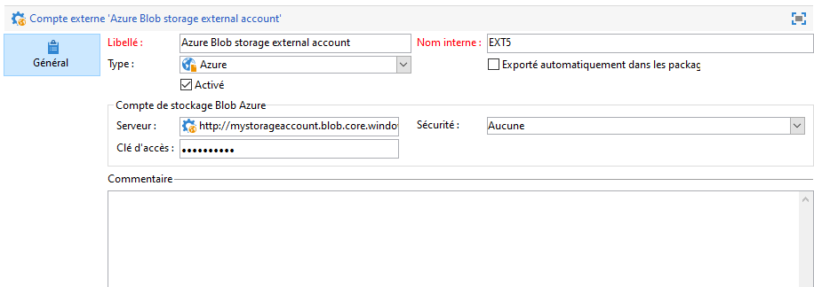

Pour configurer le **[!UICONTROL compte externe Azure]** afin de l’utiliser avec Adobe Campaign, vous devez fournir les détails suivants :

* **[!UICONTROL Serveur]**

  URL de votre serveur de stockage Azure Blob.

* **[!UICONTROL Chiffrement]**

  Type de chiffrement choisi entre **[!UICONTROL Aucun]** et **[!UICONTROL SSL]**.

* **[!UICONTROL Clé d’accès]**

  Pour savoir où trouver votre **** clé d’accès[, consultez cette page](https://docs.microsoft.com/fr-fr/azure/storage/common/storage-account-keys-manage?tabs=azure-portal).
