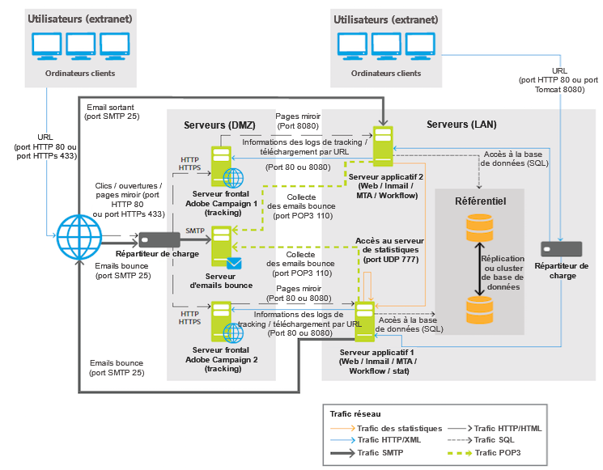

# Architecture générale{#general-architecture}

Un déploiement classique de la solution Adobe Campaign comprend les composants suivants :

* **Environnement client personnalisé**

  Interface graphique intuitive dans laquelle les utilisateurs peuvent communiquer et suivre les offres marketing, créer des campagnes, passer en revue et gérer toutes les activités, programmes et plans marketing, notamment les emails, les workflows et les landing pages, créer et gérer les profils des clients et définir les types d&#39;audiences.

* **Environnement de développement**

  Logiciel côté serveur qui exécute les campagnes marketing par le biais des canaux de communication sélectionnés, notamment e-mail, SMS, notification push, courrier, web ou social, en fonction des règles et des workflows définis dans l&#39;interface utilisateur.

* **Conteneurs de base de données**

  Reposant sur la technologie de base de données relationnelle, la base de données Adobe Campaign stocke toutes les informations sur les clients, les composants de campagne, les offres et les workflows, ainsi que les résultats de campagne dans des conteneurs de base de données client.

Adobe Campaign repose sur une architecture orientée service (SOA) composée de plusieurs modules fonctionnels. Ces modules peuvent être déployés sur une ou plusieurs machines, en un ou plusieurs exemplaires, afin de respecter les contraintes de tenue en charge, de disponibilité et d&#39;isolation des services. Les configurations de déploiement possibles sont donc multiples, depuis une machine unique centralisant tous les services nécessaires, jusqu&#39;à des configurations comprenant de multiples serveurs dédiés, éventuellement sur des sites différents.

>[!NOTE]
>
>En tant qu’éditeur de solutions, nous vous indiquons ci-dessous des infrastructures matérielles et logicielles de nature à être compatibles avec notre offre. Les recommandations matérielles présentes dans ce document sont données à titre d’information sur la base de notre expérience. Elles ne sauraient engager la responsabilité d’Adobe. Elles dépendent également des règles métier et des pratiques de votre entreprise, du niveau de criticité et des performances attendues du projet.

>[!CAUTION]
>
>Sauf mention contraire explicite, l’installation, les mises à jour et la maintenance sur tous les composants d’une plateforme Adobe Campaign sont de la responsabilité des administrateurs des ordinateurs qui les hébergent. Cela inclut l’implémentation des conditions préalables pour les applications Adobe Campaign et la conformité à la [matrice de compatibilité](../../rn/using/compatibility-matrix.md) de Campaign entre les composants.

## Couche de présentation {#presentation-layer}

L&#39;accès à l&#39;application peut se faire de différentes manières, en fonction des besoins des utilisateurs : client riche, client léger et intégration via les API.

* **Client riche** : l&#39;interface utilisateur principale de l&#39;application est un client riche, c&#39;est-à-dire une application native (Windows) qui communique avec le serveur d&#39;application Adobe Campaign uniquement à l&#39;aide de protocoles Internet standard (SOAP, HTTP, etc.). Cette console présente les avantages d&#39;une bonne ergonomie et d&#39;une grande productivité, avec une faible consommation en bande passante (utilisation d&#39;un cache local) et dans le cadre d&#39;un déploiement très simple. En effet, cette console se déploie depuis un navigateur, se met automatiquement à jour et ne nécessite aucune configuration réseau spécifique, car elle ne génère que du trafic HTTP(S).
* **Client léger** : certaines parties de l’application sont directement accessibles via un simple navigateur web, par le biais d’une interface utilisateur en HTML, notamment le module de reporting, les phases de validation des diffusions, les fonctionnalités du module de Marketing Distribué (central/local), le monitoring de l’instance, etc. Ce mode de fonctionnement permet d’inclure des fonctions Adobe Campaign dans un intranet ou un extranet.
* **Intégration par les API** : dans certains cas, le système est directement piloté par d&#39;autres applications qui utilisent les API Web Services exposées par le biais du protocole SOAP.

## Couche de logique applicative {#logical-application-layer}

Adobe Campaign est une plateforme unique comprenant différentes applications qui se combinent pour créer une architecture ouverte et évolutive. La plateforme Adobe Campaign est écrite sur une couche d’application flexible. Elle est facilement configurable pour répondre aux besoins de votre entreprise. Cela permet de répondre aux besoins croissants de l’entreprise d’un point de vue fonctionnel et technique. L’architecture distribuée assure une évolutivité linéaire du système, capable de passer de milliers de messages à des millions.

Adobe Campaign repose sur différents processus exécutés côté serveur qui fonctionnent ensemble.

Les principaux processus sont les suivants :

**Serveur applicatif** (nlserver web)

Ce processus expose toutes les fonctionnalités d&#39;Adobe Campaign via des API Web Services (SOAP - HTTP + XML). De plus, il est capable de générer dynamiquement les pages Web utilisées par l&#39;accès HTML à l&#39;application (reporting, formulaires Web, etc.). Pour cela, ce processus intègre le serveur de JSP Apache Tomcat. C&#39;est à ce processus que se connecte la console.

**Moteur de workflow** (nlserver wfserver)

Il assure l&#39;exécution des processus de workflow définis dans l&#39;application.

Il prend également en charge les workflows techniques qui s&#39;exécutent périodiquement, et notamment les suivants :

* Tracking : récupération et consolidation des logs de tracking. Il permet d&#39;obtenir les logs du serveur de redirection et créer les indicateurs agrégés utilisés par le module de reporting.
* Cleanup : nettoyage de la base de données. Il permet de purger les anciens enregistrements et éviter une croissance exponentielle de la base.
* Billing : envoi automatique d&#39;un rapport d&#39;activité de la plateforme (taille de base, nombre d&#39;actions marketing, nombre de profils actifs etc.).

**Serveur de diffusion** (nlserver mta)

Adobe Campaign permet d&#39;exécuter nativement les diffusions de type email. Ce processus agit alors comme un agent de transfert de mails (MTA) natif pour la diffusion par le protocole SMTP. Il prend en charge la personnalisation &quot;one-to-one&quot; des messages et leur diffusion physique. Il repose sur la notion de jobs de diffusions et gère les reprises automatiques. De plus, lorsque le tracking est activé, il remplace automatiquement toutes les URL présentes dans un message afin de les faire pointer vers le serveur de redirection.

Ce processus peut assurer la personnalisation et l&#39;envoi automatique vers un prestataire externe pour les diffusions de type SMS, Fax ou Courrier papier.

**Serveur de redirection** (nlserver webmdl)

Dans le cas des diffusions par email, Adobe Campaign assure automatiquement le suivi des ouvertures et clics dans les messages (et éventuellement le suivi des transactions générées sur le site Web). Pour cela, les URL présentes dans les emails sont réécrites afin de pointer vers ce module, qui assure l&#39;enregistrement de passage de l&#39;internaute avant de le rediriger vers la véritable URL.

Afin d&#39;en garantir la disponibilité maximale, ce processus est totalement indépendant de la base de données : les autres processus serveur dialoguent avec lui en utilisant uniquement des appels SOAP (donc HTTP, HTTPS et XML). Techniquement, cette fonctionnalité est implémentée dans un module d&#39;extension d&#39;un serveur HTTP (extension ISAPI sous IIS, module DSO sous Apache) et n&#39;est accessible que sous Windows.

D&#39;autres processus plus techniques sont également disponibles :

**Gestion des mails rebonds** (nlserver inMail)

Ce processus permet de relever automatiquement les boîtes mail configurées pour recevoir les messages de rebond renvoyés en cas d’échec de livraison d’e-mails. Ces messages sont ensuite passés au travers d’un moteur de règles utilisé pour déterminer les causes exactes de non-livraison (destinataire inconnu, boîte aux lettres pleine, etc.) et mettre à jour l’état de diffusion dans la base de données.

Toutes ces opérations sont entièrement automatiques et préconfigurées.

**Etat de diffusion des SMS** (nlserver sms)

Ce processus interroge à intervalles réguliers le routeur des messages SMS afin de collecter les états d&#39;avancement des diffusions et de mettre à jour la base de données.

**Ecriture des messages de logs** (nlserver syslogd)

Ce processus technique capture les messages de log et traces générés par tous les autres processus, et assure leur écriture sur disque. Il permet de collecter le maximum d&#39;informations utiles au diagnostic en cas de problème.

**Ecriture des logs de tracking** (nlserver trackinglogd)

Ce processus assure l&#39;enregistrement sur disque des logs de tracking générés par le processus de redirection.

**Ecriture des événements entrants** (nlserver interactiond)

Ce processus assure l&#39;enregistrement sur disque des événements entrants, dans le cadre de l&#39;application Interaction.

**Surveillance des modules** (nlserver watchdog)

Ce processus technique joue le rôle d&#39;un processus principal qui entraîne les autres. Il les surveille également et les relance automatiquement en cas d&#39;incident, ce qui permet de maintenir un temps d&#39;activité du système.

**Serveur de statistiques** (nlserver stat)

Ce processus maintient les statistiques du nombre de connexions, de messages envoyés pour chaque serveur de messagerie vers lequel les messages sont envoyés, ainsi que leurs limitations (nombre maximum de connexions simultanées, de messages par heure et/ou connexion). Il permet également de fédérer plusieurs instances ou plusieurs machines entre elles si elles partagent les mêmes adresses IP publiques.

>[!NOTE]
>
>La liste exhaustive des modules Adobe Campaign est proposée dans [ce document](../../production/using/operating-principle.md).

## Couche de persistance {#persistence-layer}

La base de données est utilisée en tant que couche persistante et contient quasiment toute l&#39;information gérée par Adobe Campaign, à la fois les données fonctionnelles (gestion des profils, abonnements, contenus, etc.), les données techniques (jobs et logs de diffusion, logs de tracking, etc.) et les données métier (actes d&#39;achat, leads).

La fiabilité de la base de données est primordiale puisque la plupart des composants d&#39;Adobe Campaign doivent avoir accès à la base afin d&#39;accomplir leurs tâches (hormis le module de redirection).

La plateforme est prédéfinie avec un datamart axé sur le marketing. Elle peut aussi facilement utiliser un datamart et un schéma existants à l’aide de l’un des principaux systèmes de gestion de base de données relationnelle (SGBDR). La plateforme Adobe Campaign accède à l’ensemble des données du datamart via des appels SQL effectués à la base de données. Adobe Campaign fournit également un ensemble complet d’outils ETL (extraction, transformation, chargement) pour importer et exporter des données dans et en dehors du système.
