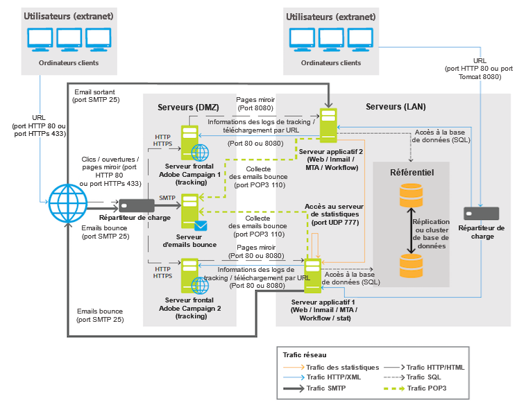

# Architecture générale{#general-architecture}

Un déploiement classique de la solution Adobe Campaign comprend les composants suivants :

* **Environnement client personnalisé**

  Interface graphique intuitive dans laquelle les utilisateurs peuvent communiquer et suivre les offres marketing, créer des campagnes, passer en revue et gérer toutes les activités, programmes et plans marketing, notamment les emails, les workflows et les landing pages, créer et gérer les profils des clients et définir les types d&#39;audiences.

* **Environnement de développement**

  Logiciel côté serveur qui exécute les campagnes marketing par le biais des canaux de communication sélectionnés, notamment e-mail, SMS, notification push, courrier, web ou social, en fonction des règles et des workflows définis dans l&#39;interface utilisateur.

* **Conteneurs de base de données**

  Reposant sur la technologie de base de données relationnelle, la base de données Adobe Campaign stocke toutes les informations sur les clients, les composants de campagne, les offres et les workflows, ainsi que les résultats de campagne dans des conteneurs de base de données client.

Adobe Campaign repose sur une architecture orientée service (SOA) composée de plusieurs modules fonctionnels. Ces modules peuvent être déployés sur une ou plusieurs machines, dans une ou plusieurs instances, afin de respecter les contraintes de tenue en charge, de disponibilité et d’isolation des services. Les configurations de déploiement possibles sont donc multiples, depuis une machine unique centralisant tous les services nécessaires, jusqu&#39;à des configurations comprenant de multiples serveurs dédiés, éventuellement sur des sites différents.

>[!NOTE]
>
>En tant que fournisseur de logiciels, nous spécifions des infrastructures matérielles et logicielles compatibles. Les recommandations matérielles données ici sont fournies à titre d’information uniquement et sont basées sur notre expérience. Adobe ne peut être tenu responsable des décisions prises en fonction de ces éléments. Cela dépendra également de vos règles et pratiques commerciales, ainsi que du degré de criticité et des niveaux de performance requis du projet.

>[!CAUTION]
>
>Sauf mention contraire explicite, l’installation, les mises à jour et la maintenance sur tous les composants d’une plateforme Adobe Campaign sont de la responsabilité des administrateurs des ordinateurs qui les hébergent. Cela inclut l’implémentation des conditions préalables pour les applications Adobe Campaign et la conformité à la [matrice de compatibilité](../../rn/using/compatibility-matrix.md) de Campaign entre les composants.

## Couche de présentation {#presentation-layer}

L&#39;accès à l&#39;application peut se faire de différentes manières, en fonction des besoins des utilisateurs : client riche, client léger et intégration via les API.

* **Client riche** : la principale interface utilisateur de l’application est un client riche. En d’autres termes, il s’agit d’une application native (Windows) qui communique avec le serveur d’applications Adobe Campaign uniquement via les protocoles Internet standard (SOAP, HTTP, etc.). Cette console offre une grande convivialité pour la productivité, utilise très peu de bande passante (grâce à l’utilisation d’un cache local) et est conçue pour offrir un déploiement facile. Cette console peut être déployée à partir d’un navigateur Internet et mise à jour automatiquement. En outre, elle ne nécessite aucune configuration réseau spécifique, car elle génère uniquement du trafic HTTP(S).
* **Client léger** : certaines parties de l’application sont directement accessibles via un simple navigateur web, par le biais d’une interface utilisateur en HTML, notamment le module de reporting, les phases de validation des diffusions, les fonctionnalités du module de Marketing Distribué (central/local), le monitoring de l’instance, etc. Ce mode de fonctionnement permet d’inclure des fonctions Adobe Campaign dans un intranet ou un extranet.
* **Intégration par les API** : dans certains cas, le système est directement piloté par d&#39;autres applications qui utilisent les API Web Services exposées par le biais du protocole SOAP.

## Couche de logique applicative {#logical-application-layer}

Adobe Campaign est une plateforme unique comprenant différentes applications qui se combinent pour créer une architecture ouverte et évolutive. La plateforme Adobe Campaign est écrite sur une couche d’application flexible. Elle est facilement configurable pour répondre aux besoins de votre entreprise. Cela permet de répondre aux besoins croissants de l’entreprise d’un point de vue fonctionnel et technique. L’architecture distribuée assure une évolutivité linéaire du système, capable de passer de milliers de messages à des millions.

Adobe Campaign repose sur différents processus exécutés côté serveur qui fonctionnent ensemble.

Les principaux processus sont les suivants :

**Serveur applicatif** (nlserver web)

Ce processus expose l’ensemble des fonctionnalités d’Adobe Campaign via les API de services web (SOAP - HTTP + XML). De plus, il peut générer dynamiquement les pages Web utilisées pour l’accès par HTML (rapports, formulaires Web, etc.). Pour ce faire, ce processus comprend un serveur JSP Apache Tomcat. Il s’agit du processus auquel la console se connecte.

**Moteur de workflow** (nlserver wfserver)

Il assure l&#39;exécution des processus de workflow définis dans l&#39;application.

Il prend également en charge les workflows techniques qui s&#39;exécutent périodiquement, et notamment les suivants :

* Tracking : récupération et consolidation des logs de tracking. Il permet de récupérer les logs du serveur de redirection et de créer les indicateurs agrégés utilisés par le module de reporting.
* Nettoyage : nettoyage de la base de données. Permet de purger les anciens enregistrements et d&#39;éviter une croissance exponentielle de la base de données.
* Billing : envoi automatique d&#39;un rapport d&#39;activité de la plateforme (taille de base, nombre d&#39;actions marketing, nombre de profils actifs etc.).

**Serveur de diffusion** (nlserver mta)

Adobe Campaign dispose d’une fonctionnalité native de diffusion d’e-mails. Ce processus fonctionne comme un agent de transfert d’e-mails SMTP (MTA). Il effectue une personnalisation « un à un » des messages et gère leur diffusion physique. Il fonctionne à l’aide des traitements de diffusion et gère les reprises automatiques. De plus, lorsque le tracking est activé, il remplace automatiquement les URL afin qu&#39;elles pointent vers le serveur de redirection.

Ce processus peut assurer la personnalisation et l&#39;envoi automatique vers un prestataire externe pour les diffusions de type SMS, Fax ou Courrier papier.

**Serveur de redirection** (nlserver webmdl)

Pour les e-mails, Adobe Campaign gère automatiquement le suivi des ouvertures et des clics (le suivi transactionnel au niveau du site web est une autre possibilité). Pour ce faire, les URL intégrées dans les e-mails sont réécrites afin de pointer vers ce module qui enregistre la transmission de l’utilisateur Internet avant de le rediriger vers l’URL requise.

Pour garantir une disponibilité maximale, ce processus est totalement indépendant de la base de données : les autres processus serveur communiquent uniquement avec elle à l&#39;aide d&#39;appels SOAP (HTTP, HTTP(S) et XML). Techniquement, cette fonctionnalité est implémentée dans un module d&#39;extension d&#39;un serveur HTTP (extension ISAPI dans IIS, ou module DSO Apache, etc.) et est disponible uniquement sous Windows.

D&#39;autres processus plus techniques sont également disponibles :

**Gestion des mails rebonds** (nlserver inMail)

Ce processus permet de récupérer automatiquement les e-mails des boîtes de réception configurées pour recevoir les messages rebonds renvoyés en cas d’échec de la diffusion. Ces messages sont ensuite soumis à un traitement selon des règles afin de déterminer les raisons de leur non-diffusion (destinataire inconnu, dépassement de quota, etc.) et pour mettre à jour le statut de la diffusion dans la base de données.

Toutes ces opérations sont entièrement automatiques et préconfigurées.

**Etat de diffusion des SMS** (nlserver sms)

Ce processus interroge à intervalles réguliers le routeur des messages SMS afin de collecter les états d&#39;avancement des diffusions et de mettre à jour la base de données.

**Ecriture des messages de logs** (nlserver syslogd)

Ce processus technique capture les messages du journal et les traces générés par les autres processus et les écrit sur le disque dur. De ce fait, de nombreuses informations sont disponibles pour le diagnostic en cas de problème.

**Ecriture des logs de tracking** (nlserver trackinglogd)

Ce processus assure l&#39;enregistrement sur disque des logs de tracking générés par le processus de redirection.

**Ecriture des événements entrants** (nlserver interactiond)

Ce processus assure l&#39;enregistrement sur disque des événements entrants, dans le cadre de l&#39;application Interaction.

**Surveillance des modules** (nlserver watchdog)

Ce processus technique joue le rôle d&#39;un processus principal qui entraîne les autres. Il les surveille également et les relance automatiquement en cas d&#39;incident, ce qui permet de maintenir un temps d&#39;activité du système.

**Serveur de statistiques** (nlserver stat)

Ce processus gère les statistiques sur le nombre de connexions, les messages envoyés pour chaque serveur de messagerie vers lequel les messages sont envoyés, ainsi que leurs limitations (nombre maximum de connexions simultanées, de messages par heure et/ou connexion). Il permet également de fédérer plusieurs instances ou machines si elles partagent les mêmes adresses IP publiques.

>[!NOTE]
>
>La liste exhaustive des modules Adobe Campaign est proposée dans [ce document](../../production/using/operating-principle.md).

## Couche de persistance {#persistence-layer}

La base de données est utilisée en tant que couche persistante et contient presque toutes les informations gérées par Adobe Campaign. Cela inclut les données fonctionnelles (profils, abonnements, contenu, etc.), les données techniques (traitement et journaux de diffusion, logs de tracking, etc.) et les données de travail (achats, prospects).

La fiabilité de la base de données est primordiale puisque la plupart des composants d&#39;Adobe Campaign doivent avoir accès à la base afin d&#39;accomplir leurs tâches (hormis le module de redirection).

La plateforme est prédéfinie avec un datamart axé sur le marketing. Elle peut également facilement utiliser un datamart et un schéma existants à l’aide de l’un des principaux systèmes de gestion de base de données relationnelle (SGBD). Toutes les données du datamart sont accessibles par la plateforme Adobe Campaign via des appels SQL d’Adobe Campaign vers la base de données. Adobe Campaign fournit également un ensemble complet d’outils ETL (extraction, transformation, chargement) pour importer et exporter des données dans et en dehors du système.
