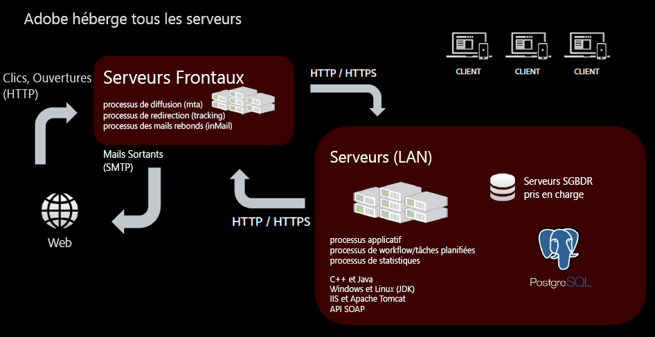
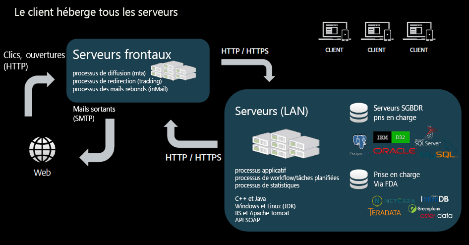
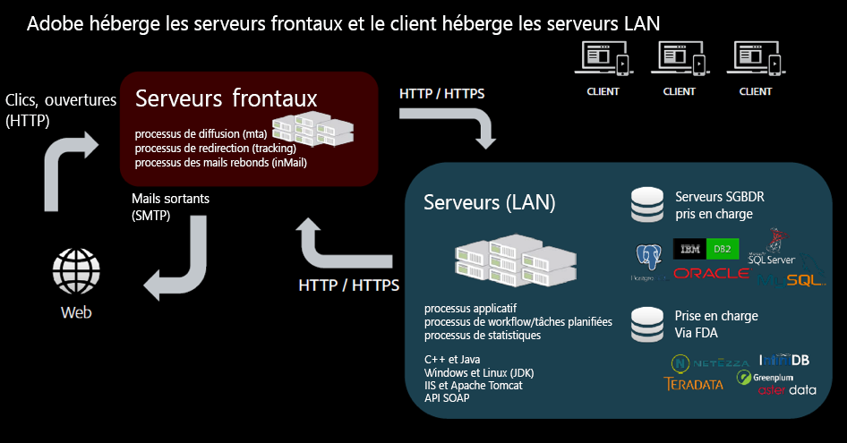

# Modèles d&#39;hébergement{#hosting-models}

Adobe Campaign propose trois modèles d’hébergement, ce qui offre la liberté de choisir le meilleur modèle ou les modèles qui répondent aux besoins de l’entreprise.

>[!NOTE]
>
>Pour les environnements hébergés par Adobe, les étapes principales d&#39;installation et de configuration ne peuvent être exécutées que par Adobe, comme la configuration du serveur et la personnalisation des fichiers de configuration d&#39;instance. Pour en savoir plus sur les principales différences entre les modes de déploiement, consultez [cette page](../../installation/using/capability-matrix.md).

## Managed Services / hébergés

Adobe Campaign peut être déployé en tant que Managed Service : tous les composants d’Adobe Campaign, y compris l’interface utilisateur, le moteur de gestion de l’exécution et la base de données Campaign du client, sont entièrement hébergés par Adobe. Cela inclut également l’exécution des emails, les pages miroir, le serveur de tracking et les composants web externes, tels que la page de désabonnement/le centre de préférences et les landing pages.

En tant que client hébergé, la plupart des étapes d&#39;installation et de configuration sont effectuées par Adobe. Vous pouvez accéder aux sections suivantes pour personnaliser votre mise en œuvre :

* Configurer les URL de suivi et de page miroir par marque. Pour les messages transactionnels, consultez [cette section](../../message-center/using/additional-configurations.md#configuring-multibranding).
* Installation de la console cliente : consultez [cette section](../../installation/using/installing-the-client-console.md).
* Pour en savoir plus sur les outils et les bonnes pratiques concernant la délivrabilité, consultez [la documentation détaillée](../../delivery/using/about-deliverability.md).
* Configuration des options de Campaign : consultez [cette section](../../installation/using/configuring-campaign-options.md).
* Configuration des connecteurs CRM : consultez [cette section](../../platform/using/crm-connectors.md).

## On-premise

Adobe Campaign peut être déployé on-premise : tous les composants d’Adobe Campaign, notamment l’interface utilisateur, le moteur de gestion de l’exécution et la base de données, résident sur site dans le centre de données du client. Dans ce modèle de déploiement, le client gère toutes les mises à jour et mises à niveau logicielles et matérielles. De plus, un administrateur de bases de données dédié doit réaliser des tâches de maintenance et d’optimisation afin d’assurer la gestion des instances Campaign.

En tant que client On-premise, avant de commencer à déployer Campaign Classic, familiarisez-vous avec les recommandations et prérequis suivants :

* Consultez la [matrice de compatibilité](../../rn/using/compatibility-matrix.md) qui répertorie toutes les versions des différents systèmes et composants pris en charge par Adobe Campaign.
* En fonction de votre environnement, consultez les [prérequis pour Windows](../../installation/using/prerequisites-of-campaign-installation-in-windows.md) et les [prérequis pour Linux](../../installation/using/prerequisites-of-campaign-installation-in-linux.md).
* Découvrez les recommandations relatives aux moteurs de bases de données [dans cette section](../../installation/using/database.md).
* Vérifiez que les couches d’accès requises pour la base de données sont installées sur votre serveur et accessibles depuis le compte Adobe Campaign. [En savoir plus](../../installation/using/application-server.md).
* Configurez vos réseaux. Certains processus doivent en effet communiquer avec d’autres ou accéder au réseau local et à Internet. Cela signifie que certains ports TCP doivent être ouverts pour ces processus. [En savoir plus](../../installation/using/network-configuration.md) sur la configuration réseau requise.
* Consultez la [Liste de contrôle relative à la sécurité et à la confidentialité Campaign](https://helpx.adobe.com/fr/campaign/kb/acc-security.html).
* Consultez les instructions générales afin d’estimer les besoins matériels pour le déploiement On-premise [dans cet article](https://helpx.adobe.com/fr/campaign/kb/hardware-sizing-guide.html).

## Hybride

Lorsqu’il est déployé en tant que modèle hybride, le logiciel de la solution Adobe Campaign réside dans l’environnement du site client, et la gestion de l’exécution est fournie en tant que service cloud par Adobe. L’instance marketing Adobe Campaign est installée à l’intérieur du pare-feu du client ou de la cliente. Par conséquent, les informations d’identification personnelle (PII) restent en interne et seules les données requises pour la personnalisation des e-mails sont envoyées au cloud pour l’exécution des e-mails. L’instance d’exécution, hébergée dans le cloud, reçoit les requêtes de diffusion d’e-mails à partir de l’instance On-premise. Cette instance personnalise tous les e-mails et les diffuse. Aucune donnée d’aucune sorte n’est stockée de manière permanente dans le cloud.

En tant que client hybride, la plupart des étapes d’installation et de configuration sont effectuées par Adobe. Vous pouvez accéder aux sections suivantes pour personnaliser votre implémentation :

* Configuration des messages transactionnels : consultez [cette section](../../message-center/using/transactional-messaging-architecture.md).
* Configurez les URL de suivi et de page miroir par marque. Pour les messages transactionnels, consultez [cette section](../../message-center/using/additional-configurations.md#configuring-multibranding).
* Installation de la console cliente : consultez [cette section](../../installation/using/installing-the-client-console.md).
* Installez les packages natifs : consultez [cette section](../../installation/using/installing-campaign-standard-packages.md).
* Délivrabilité : configuration des [règles MX](../../installation/using/email-deliverability.md#mx-configuration) et des [formats des emails](../../installation/using/email-deliverability.md#managing-email-formats). Pour en savoir plus sur les outils et les bonnes pratiques concernant la délivrabilité, consultez la [documentation détaillée](../../delivery/using/about-deliverability.md).
* Configuration des options de Campaign : consultez [cette section](../../installation/using/configuring-campaign-options.md).
* Configuration d&#39;une base de données externe (Federated Data Access) : consultez [cette section](../../installation/using/about-fda.md).
* Configuration des connecteurs CRM : consultez [cette section](../../platform/using/crm-connectors.md).
* Pour en savoir plus sur les principes de déploiement Mid-sourcing, consultez [cette section](../../installation/using/mid-sourcing-deployment.md).
