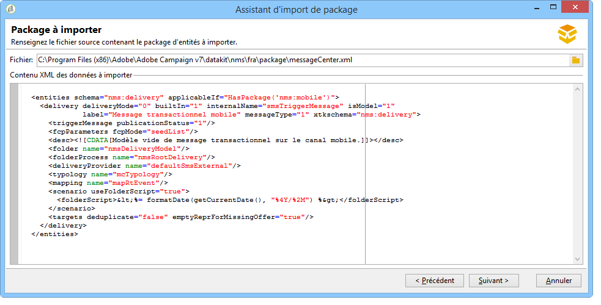

# Installation des packages natifs de Campaign Classic{#installing-campaign-standard-packages}


## À propos des packages natifs {#campaign-standard-packages}

Les packages natifs contiennent un ensemble de fonctionnalités qui peuvent être installées selon vos besoins et selon votre contrat. La liste complète des packages natifs de Campaign est disponible ci-dessous.

>[!CAUTION]
>
>Vous ne pouvez installer que les packages correspondant aux options mentionnées dans votre contrat de licence.
>
>L&#39;installation d&#39;un nouveau package peut avoir un impact sur toute votre plateforme : il doit être testé et validé avant le déploiement final.
>
>Une fois un package installé, vous ne pouvez pas le désinstaller.
>
>Si vous êtes client hébergé ou hybride, contactez Adobe pour déployer un nouveau package intégré.

Pour installer un package intégré :

1. Accédez à l’assistant d’import de package depuis le menu **[!UICONTROL Outils > Avancé > Import de package]** de la console cliente Adobe Campaign.
1. Sélectionnez **[!UICONTROL Installer un package standard]**.
1. Dans la liste de packages, vérifiez les packages que vous souhaitez installer.
   >[!NOTE]
   >
   >Lorsqu&#39;un package est grisé, cela signifie qu&#39;il est déjà installé ou qu&#39;il n&#39;est pas compatible avec votre instance. La compatibilité est détaillée dans le tableau ci-dessous.
1. Cliquez sur **[!UICONTROL Suivant]** puis **[!UICONTROL Démarrer]** pour commencer l&#39;installation du package.

   Une fois les packages installés, la barre de progression indique **100 %**. De plus, les logs de l&#39;installation contiennent le message suivant : **[!UICONTROL L&#39;installation des packages s&#39;est terminée avec succès]**.

1. **[!UICONTROL Fermez]** la fenêtre d&#39;installation.

Les packages sont à présent installés.

### Liste des packages prêts à l&#39;emploi {#list-of-standard-packages}

Le tableau ci-après répertorie tous les packages natifs de Campaign.

<table> 
 <thead> 
  <tr> 
   <th> Package </th> 
   <th> Description </th> 
   <th> Type d'instance </th>
  </tr> 
 </thead> 
 <tbody> 
  <tr> 
   <td> Diffusion<br /> </td> 
   <td> Surveille les diffusions et les éventuels problèmes rencontrés lors de l'envoi des messages. <a href="../../delivery/using/about-delivery-monitoring.md">En savoir plus</a><br /> </td> 
   <td> Tous</td> 
  </tr> 
  <tr> 
   <td> Campagnes marketing (Campaign)<br /> </td> 
   <td> Définit, optimise, exécute et analyse les campagnes de communication et de marketing. <a href="https://experienceleague.adobe.com/docs/campaign/campaign-v8/campaigns/campaigns.html?lang=fr" target="_blank">En savoir plus</a><br /> </td> 
   <td> Marketing</td>
  </tr> 
  <tr> 
   <td> Ressources marketing (MRM)<br /> </td> 
   <td> Contrôle les actions marketing en mode collaboratif en assurant la gestion et le suivi des tâches, des budgets et des ressources marketing. <a href="https://experienceleague.adobe.com/docs/campaign/automation/mrm/about-marketing-resource-management.html?lang=fr" target="_blank">En savoir plus</a> <br /> </td> 
   <td> Marketing</td> 
  </tr> 
  <tr> 
   <td> Moteur d'offres (Interaction)<br /> </td> 
   <td> Répond en temps réel lors d'une interaction avec un contact donné (un client ou une cible) en leur faisant une ou plusieurs offres adaptées.  Facultatif. <a href="../../interaction/using/interaction-and-offer-management.md#packages-configuration">En savoir plus</a> <br /> </td> 
   <td> Tous<br /> </td> 
  </tr> 
  <tr> 
   <td> Contrôle du moteur d'offres avec l'instance d'exécution. Facultatif.<br /> </td> 
   <td> Package à installer sur l'instance de pilotage pour le moteur d'offres (interaction). <a href="../../interaction/using/distributed-architectures.md#packages-configuration">En savoir plus</a> </td> 
   <td> Marketing<br /> </td>  
  </tr> 
  <tr> 
   <td> Moteur d'offre pour les instances d'exécution. Facultatif.<br /> </td> 
   <td> Package à installer sur les instances d'exécution pour le moteur d'offres (interaction). <a href="../../interaction/using/distributed-architectures.md">En savoir plus</a> </td> 
   <td> Mid, Exécution <br /> </td>  
  </tr> 
  <!--tr> 
   <td> Lead Management (Leads) (deprecated)<br /> </td> 
   <td> Simplifies the process of building and maintaining the entire leads management life cycle. <br /> </td> 
   <td> Yes<br /> </td> 
   <td> Optional, <a href="https://helpx.adobe.com/campaign/kb/deprecated-and-removed-features.html">Learn More</a> </td> 
  </tr--> 
  <tr> 
   <td> Réseaux sociaux (Social Marketing) <br /> </td> 
   <td> Synchroniser Adobe Campaign avec X (anciennement Twitter) et Facebook. <a href="../../social/using/about-social-marketing.md">En savoir plus</a> <br /> </td> 
   <td> Tous</td> 
  </tr> 
  <tr> 
   <td> Contrôle des messages transactionnels (Message Center - Pilotage)<br /> </td> 
   <td> Gère les messages de déclenchement générés par des événements déclenchés à partir des systèmes d'information. Facultatif. <a href="../../message-center/using/about-transactional-messaging.md">En savoir plus </a> <br /> </td> 
   <td> Marketing<br /> </td> 
  </tr> 
  <tr> 
   <td> Exécution des messages transactionnels (Message Center - Exécution) <br /> </td> 
   <td> Garantit une disponibilité accrue et une meilleure gestion de la charge. Facultatif. <a href="../../message-center/using/about-transactional-messaging.md">En savoir plus</a><br /> </td> 
   <td> Exécution<br /> </td>
  </tr> 
  <tr> 
   <td> Canal LINE<br /> </td> 
   <td> Envoie les diffusions à l’aide du canal LINE avec Adobe Campaign. Facultatif. Messagerie transactionnelle (package Message Center) obligatoire. <a href="../../delivery/using/line-channel.md">En savoir plus</a> <br /> </td> 
   <td> Tous<br /> </td> 
  </tr> 
  <tr> 
   <td> Canal courrier<br /> </td> 
   <td> Envoie les diffusions à l’aide du canal courrier avec Adobe Campaign. Facultatif. <a href="../../delivery/using/about-direct-mail-channel.md">En savoir plus</a><br /> </td> 
   <td> Tous<br /> </td>
  </tr> 
  <tr> 
   <td> Canal mobile (SMS) <br /> </td> 
   <td> Envoie les diffusions à l’aide du canal Mobile/SMS avec Adobe Campaign. Facultatif. <a href="../../delivery/using/sms-channel.md">En savoir plus</a> <br /> </td> 
   <td> Tous<br /> </td> 
  </tr> 
   <tr> 
   <td> Canal Téléphone<br /> </td> 
   <td> Envoie les diffusions à l'aide du canal téléphonique avec Adobe Campaign. Utilisé pour le centre d'appel. Facultatif. <a href="../../delivery/using/communication-channels.md">En savoir plus</a> <br /> </td> 
   <td> Tous<br /> </td> 
  </tr> 
  <tr> 
   <td> Canal applications mobiles<br /> </td> 
   <td> Utilise la plateforme Adobe Campaign pour envoyer des notifications personnalisées aux terminaux iOS et Android via des applications. Facultatif. <a href="../../delivery/using/about-mobile-app-channel.md">En savoir plus</a> <br /> </td> 
   <td> Tous<br /> </td> 
  </tr> 
  <tr> 
   <td> Gestion de contenu (Content Manager)<br /> </td> 
   <td> Crée des newsletters récurrentes ou un site web, puis valide et publie vos messages. <a href="../../delivery/using/about-content-management.md">En savoir plus</a> <br /> </td> 
   <td> </td>
  </tr> 
  <tr> 
   <td> Questionnaires en ligne (Survey Manager)<br /> </td> 
   <td> Crée et gère des formulaires en ligne pour ajouter ou modifier des informations de profil, s'abonner, se désabonner ou générer un formulaire d'inscription à un concours. Facultatif. <a href="../../surveys/using/about-surveys.md">En savoir plus </a> <br /> </td> 
   <td> Marketing<br /> </td> 
  </tr> 
  <tr> 
   <td> Marketing Analytics<br /> </td> 
   <td> Permet d'analyser et de mesurer les données, de calculer les statistiques, de simplifier et d'optimiser la création et le calcul de rapports. Vous pouvez également créer des rapports et des populations cibles. Facultatif. <a href="../../reporting/using/ac-cubes.md">En savoir plus</a><br /> </td> 
   <td> Marketing<br /> </td> 
  </tr> 
  <tr> 
   <td> Gestion de la réaction<br /> </td> 
   <td> Mesure le succès et la rentabilité des campagnes marketing ou des propositions d'offres pour tous les canaux de communication.  Facultatif. <a href="../../response/using/about-response-manager.md">En savoir plus </a> <br /> </td> 
   <td> Marketing<br /> </td> 
  </tr> 
  <tr> 
   <td> Accès aux données externes (Federated Data Access)<br /> </td> 
   <td> Propose l’option Federated Data Access (FDA) afin d’exploiter des informations stockées dans une ou plusieurs bases de données externes : vous pouvez accéder à des données externes sans modifier la structure des données d’Adobe Campaign.  Facultatif. <a href="https://experienceleague.adobe.com/docs/campaign/automation/workflows/advanced-management/accessing-an-external-database-fda.html?lang=fr" target="_blank">En savoir plus</a> <br /> </td> 
   <td> Tous<br /> </td> 
  </tr> 
  <tr> 
   <td> Optimisation des campagnes<br /> </td> 
   <td> Contrôle, filtre et surveille l'envoi des diffusions afin que les messages envoyés répondent le mieux aux besoins et aux attentes des clients, conformément aux politiques de communication de l'entreprise. Facultatif. <a href="https://experienceleague.adobe.com/docs/campaign/automation/campaign-optimization/campaign-typologies.html?lang=fr" target="_blank">En savoir plus </a> <br /> </td> 
   <td> Marketing<br /> </td> 
  </tr> 
  <tr> 
   <td> Supervision de la délivrabilité (Email Deliverability)<br /> </td> 
   <td> Mesure le succès de vos campagnes atteignant la boîte de réception de vos destinataires sans rebonds ou sans être marqués comme spam. Facultatif. <a href="../../delivery/using/about-deliverability.md">En savoir plus</a> <br /> </td> 
   <td> Tous </td> 
  </tr> 
  <tr> 
   <td> Gestion des coupons<br /> </td> 
   <td> Crée un ensemble de coupons à ajouter aux offres marketing à venir. Facultatif. <a href="https://experienceleague.adobe.com/docs/campaign/campaign-v8/send/personalize/personalized-coupons.html" target="_blank">En savoir plus </a> <br /> </td> 
   <td> Marketing<br /> </td> 
  </tr> 
  <tr> 
   <td> Inbox Rendering (IR)<br /> </td> 
   <td> Vous permet de prévisualiser le message envoyé dans les différents contextes dans lesquels il peut être reçu et de vérifier la compatibilité auprès des principaux ordinateurs de bureau et applications. Facultatif. <a href="../../delivery/using/inbox-rendering.md">En savoir plus</a><br /> </td> 
   <td> Marketing<br /> </td> 
  </tr> 
  <tr> 
   <td> Marketing central/local (Marketing distribué)<br /> </td> 
   <td> Met en œuvre les campagnes de coopération entre entités centrales (sièges sociaux, services marketing, etc.) et entités locales (magasins, agences régionales, etc.). Facultatif. <a href="https://experienceleague.adobe.com/docs/campaign/automation/distributed-marketing/about-distributed-marketing.html?lang=fr" target="_blank">En savoir plus</a><br /> </td> 
   <td> Marketing </td> 
  </tr> 
  <tr> 
   <td> Connecteurs CRM<br /> </td> 
   <td> Fournit divers connecteurs CRM pour lier votre plateforme Adobe Campaign à vos systèmes tiers.  <a href="../../platform/using/crm-connectors.md">En savoir plus</a> <br /> </td> 
   <td> Marketing</td> 
  </tr> 
  <tr> 
   <td> Connecteurs Web Analytics<br /> </td> 
   <td> Permet à Adobe Campaign et Adobe Analytics d'interagir par le biais du package des connecteurs Web Analytics. Non compatible avec la messagerie transactionnelle (package Message Center). <a href="../../integrations/using/gs-aa.md">En savoir plus</a><br /> </td> 
   <td> Marketing </td> 
  </tr> 
  <tr> 
   <td> Intégration AEM<br /> </td> 
   <td> Permet de gérer le contenu de vos diffusions email ainsi que vos formulaires directement dans Adobe Experience Manager afin de bénéficier des fonctionnalités d’édition de contenu d’AEM et des capacités de diffusion d’Adobe Campaign. <a href="../../integrations/using/about-adobe-experience-manager.md">En savoir plus</a> <br /> </td> 
   <td> Marketing</td> 
  </tr> 
  <tr> 
   <td> Intégration des Audiences partagées Adobe Experience Cloud<br /> </td> 
   <td> Vous permet d’échanger et de partager des audiences/segments avec les solutions et les applications Adobe Experience Cloud. Nécessite IMS. <a href="../../integrations/using/sharing-audiences-with-adobe-experience-cloud.md">En savoir plus</a> <br /> </td> 
   <td> Marketing<br /> </td> 
  </tr> 
  <tr> 
   <td> Intégration avec Adobe Experience Cloud<br /> </td> 
   <td> Permet d’importer et d’exporter des audiences/segments à partir de différentes solutions Adobe Experience Cloud dans Adobe Campaign. Facultatif. <a href="../../integrations/using/configuring-ims.md#installing-the-package">En savoir plus</a> </td> 
   <td> Marketing</td> 
  </tr> 
  <tr> 
   <td> Règlement sur la protection des informations personnelles<br /> </td> 
   <td> Contient des fonctionnalités supplémentaires pour vous aider à respecter la conformité en matière de données personnelles dans Campaign Classic. <a href="https://helpx.adobe.com/fr/campaign/kb/acc-privacy.html">En savoir plus</a> <br /> </td> 
   <td> Tous</td> 
  </tr> 
  <tr> 
   <td> Emission vers Mid-sourcing <br /> </td> 
   <td> Présente les étapes d'installation et de configuration d'un serveur de midsourcing ainsi que les étapes de déploiement d'une instance permettant à des tiers d'envoyer des messages en mode midsourcing. Facultatif. <a href="../../installation/using/mid-sourcing-server.md">En savoir plus</a> <br /> </td> 
   <td> Marketing </td> 
  </tr> 
  <tr> 
   <td> Plateforme de Mid-sourcing<br /> </td> 
   <td> Cette configuration présente une solution intermédiaire optimale entre le mode hébergé (ASP) et l’internalisation. Toute la partie concernant l’envoi des messages est déportée sur un serveur de "mid-sourcing", hébergé chez Adobe Campaign. Facultatif. <a href="../../installation/using/mid-sourcing-server.md">En savoir plus</a> <br /> </td> 
   <td> Mid-sourcing </td> 
  </tr> 
  <tr> 
   <td> Assistance AMP<br /> </td> 
   <td> Permet d’utiliser le nouveau format interactif AMP pour e-mail et d’envoyer des emails dynamiques. Facultatif. <a href="https://experienceleague.adobe.com/docs/campaign/campaign-v8/send/emails/defining-interactive-content.html?lang=fr" target="_blank">En savoir plus</a> <br /> </td> 
   <td> Tous </td> 
  </tr> 
  <tr> 
   <td> Connecteur ACS (obsolète)<br /> </td> 
   <td> Relie Adobe Campaign v7 et Adobe Campaign Standard. Il s'agit d'une fonctionnalité intégrée de Campaign v7 qui reproduit automatiquement les données vers Campaign Standard, associant le meilleur des deux applications. Facultatif.<br /> </td> 
   <td> Marketing </td> 
  </tr> 
 </tbody> 
</table>

### Package Message Center {#message-center-package}

Vous devez installer les canaux de diffusion (e-mail, canal mobile, canal des applications mobiles, LINE, etc.) avant d’installer la messagerie transactionnelle (package Message Center). Si vous avez démarré un projet Message Center réservé aux e-mails et que vous devez ajouter un nouveau canal par la suite, procédez comme suit :

1. Installez le nouveau canal, par exemple le **Canal mobile**, à l’aide de l’assistant d’import de package (**[!UICONTROL Outils > Avancé > Import de package > Package Adobe Campaign]**).
1. Importez le fichier (**[!UICONTROL Outils > Avancé > Importer un package > Fichier]**), puis sélectionnez :

   ```
   \datakit\nms\[Your language]\package\messageCenter.xml
   ```

1. Dans le **[!UICONTROL contenu des données XML à importer]**, conservez uniquement le modèle de diffusion Message Center correspondant au canal associé. Par exemple, si vous avez ajouté le **Canal mobile**, conservez uniquement l&#39;élément **Entités** correspondant au modèle **[!UICONTROL Message transactionnel mobile]** (smsTriggerMessage). Si vous avez ajouté le **Canal des applications mobiles**, conservez uniquement les modèles **Message transactionnel iOS** (iosTriggerMessage) et **Message transactionnel Android** (androidTriggerMessage).

   


### Configuration du canal [!DNL LINE]{#line-package}

Pour configurer le canal [!DNL LINE], vous devez d’abord installer le package [!DNL LINE].

Dans le cadre dʼune configuration de midsourcing, procédez comme suit :

* Installez le package [!DNL LINE] sur les instances Marketing et MID.

* Configurez le compte externe [!DNL LINE] sur lʼinstance mkt pour quʼil pointe vers lʼinstance MID en changeant le mode de diffusion. [En savoir plus](../../delivery/using/line-channel.md#configure-line-external)

* Configurez les informations dʼidentification [!DNL LINE] dans le compte externe sur l’instance MID.

>[!CAUTION]
>
>Les modèles de diffusion du Message Center pour le canal [!DNL LINE] ne seront pas disponibles si les packages Message Center sont installés avant [!DNL LINE].