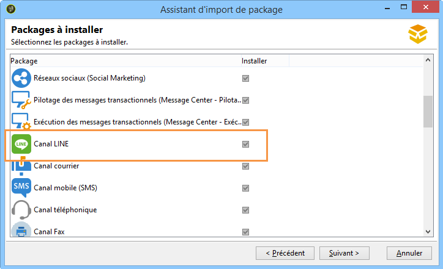

# Installation des packages standard de Campaign Classic{#installing-campaign-standard-packages}

## A propos des packages standard {#campaign-standard-packages}

Les packages sont un ensemble de fonctionnalités qui peuvent être installées en fonction de vos besoins. Ils vous permettront d’ajouter d’autres options à votre instance.

>[!CAUTION]
>
>Vous ne pouvez installer que les packages correspondant aux options mentionnées dans votre contrat de licence.
>
>Une fois un package installé, vous ne pouvez pas le désinstaller. L’installation d’un nouveau package peut avoir un impact sur toute votre plateforme : il doit être testé et validé avant le déploiement final.

Pour installer un package standard :

1. Accédez à l&#39;assistant d&#39;import de package depuis le menu **[!UICONTROL Outils > Avancé > Import de package...]** de la console cliente Adobe Campaign.
1. Sélectionnez **[!UICONTROL Installer un package standard]**.
1. Dans la liste qui s’affiche, vérifiez les packages que vous souhaitez installer.
   >[!NOTE]
   >
   >Si un package est grisé, vous ne pouvez pas l’installer. Cela signifie qu’il est déjà installé ou qu’il n’est pas compatible avec votre instance. Par exemple, vous ne pouvez pas installer le package de la **Plateforme de mid-soucing** sur une instance de marketing. Vous trouverez ces informations dans le tableau ci-dessous.
1. Cliquez sur **[!UICONTROL Suivant]** puis **[!UICONTROL Démarrer]** pour commencer l&#39;installation du package.

   Une fois les packages installés, la barre de progression indique **100 %**. De plus, les logs d&#39;installation contiennent le message suivant : **[!UICONTROL L&#39;installation des packages s&#39;est terminée avec succès]**.

1. **[!UICONTROL Fermez]** la fenêtre d&#39;installation.

Les packages sont à présent installés.

### Liste des packages prêts à l’emploi {#list-of-standard-packages}

Le tableau suivant répertorie tous les packages standard avec leur description, le type d’instance sur lequel ils peuvent être installés (Marketing, Mid, etc.) et des informations supplémentaires.

<table> 
 <thead> 
  <tr> 
   <th> Package </th> 
   <th> Description </th> 
   <th> Type d'instance </th> 
   <th> Plus d'infos </th> 
  </tr> 
 </thead> 
 <tbody> 
  <tr> 
   <td> Diffusion<br /> </td> 
   <td> Surveille les diffusions et les éventuels problèmes rencontrés lors de l’envoi des messages.<br /> </td> 
   <td> Tous</td> 
   <td> <a href="../../delivery/using/monitoring-a-delivery.md">En savoir plus</a></td> 
  </tr> 
  <tr> 
   <td> Campagnes marketing (Campaign)<br /> </td> 
   <td> Définit, optimise, exécute et analyse les campagnes de communication et de marketing.<br /> </td> 
   <td> Marketing</td> 
   <td> <a href="../../campaign/using/designing-marketing-campaigns.md">En savoir plus</a> </td> 
  </tr> 
  <tr> 
   <td> Ressources marketing (MRM)<br /> </td> 
   <td> Contrôle les actions marketing en mode collaboratif en assurant la gestion et le suivi des tâches, des budgets et des ressources marketing.<br /> </td> 
   <td> Marketing</td> 
   <td> <a href="../../campaign/using/about-marketing-resource-management.md">En savoir plus</a> </td> 
  </tr> 
  <tr> 
   <td> Moteur d’offres (interaction)<br /> </td> 
   <td> Répond en temps réel lors d’une interaction avec un contact donné (un client ou une cible) en leur faisant une ou plusieurs offres adaptées. <br /> </td> 
   <td> Tous<br /> </td> 
   <td> Facultatif, <a href="../../interaction/using/interaction-and-offer-management.md">En savoir plus</a></td> 
  </tr> 
  <tr> 
   <td> Contrôle du moteur d’offres avec l’instance d’exécution<br /> </td> 
   <td> </td> 
   <td> Marketing<br /> </td> 
   <td> Facultatif</td> 
  </tr> 
  <tr> 
   <td> Moteur d’offre pour les instances d’exécution<br /> </td> 
   <td> </td> 
   <td> Mid, Exécution <br /> </td> 
   <td> Facultatif</td> 
  </tr> 
  <!--tr> 
   <td> Lead Management (Leads) (deprecated)<br /> </td> 
   <td> Simplifies the process of building and maintaining the entire leads management life cycle. <br /> </td> 
   <td> Yes<br /> </td> 
   <td> Optional, <a href="https://helpx.adobe.com/campaign/kb/deprecated-and-removed-features.html">Learn More</a> </td> 
  </tr--> 
  <tr> 
   <td> Réseaux sociaux (marketing social) <br /> </td> 
   <td> Synchronise Adobe Campaign avec Twitter et Facebook.<br /> </td> 
   <td> Tous</td> 
   <td> <a href="../../social/using/about-social-marketing.md">En savoir plus</a> </td> 
  </tr> 
  <tr> 
   <td> Contrôle des messages transactionnels (Message Center - PIlotage)<br /> </td> 
   <td> Gère les messages de déclenchement générés par des événements déclenchés à partir des systèmes d’information.<br /> </td> 
   <td> Marketing<br /> </td> 
   <td> Facultatif, <a href="../../message-center/using/about-transactional-messaging.md">En savoir plus</a> </td> 
  </tr> 
  <tr> 
   <td> Exécution des messages transactionnels (Message Center - Exécution) <br /> </td> 
   <td> Garantit une disponibilité accrue et une meilleure gestion de la charge.<br /> </td> 
   <td> Exécution<br /> </td> 
   <td> Facultatif, <a href="../../message-center/using/about-transactional-messaging.md">En savoir plus</a> </td> 
  </tr> 
  <tr> 
   <td> Canal LINE<br /> </td> 
   <td> Envoie les diffusions à l’aide du canal LINE avec Adobe Campaign,<br /> </td> 
   <td> Tous<br /> </td> 
   <td> Facultatif, Message Center obligatoire</td> 
  </tr> 
  <tr> 
   <td> Canal courrier<br /> </td> 
   <td> Envoie les diffusions à l’aide du canal courrier avec Adobe Campaign.<br /> </td> 
   <td> Tous<br /> </td> 
   <td> Facultatif, <a href="../../delivery/using/about-direct-mail-channel.md">En savoir plus</a> </td> 
  </tr> 
  <tr> 
   <td> Canal mobile (SMS) <br /> </td> 
   <td> Envoie les diffusions à l’aide du canal Mobile/SMS avec Adobe Campaign.<br /> </td> 
   <td> Tous<br /> </td> 
   <td> Facultatif, <a href="../../delivery/using/sms-channel.md">En savoir plus</a> </td> 
  </tr> 
  <tr> 
   <td> Canal téléphonique<br /> </td> 
   <td> Envoie les diffusions à l’aide du canal téléphonique avec Adobe Campaign.<br /> </td> 
   <td> Tous<br /> </td> 
   <td> Facultatif</td> 
  </tr>
  <tr> 
   <td> Mobile App Channel<br /> </td> 
   <td> Utilise la plateforme Adobe Campaign pour envoyer des notifications personnalisées aux terminaux iOS et Android via des applications. <br /> </td> 
   <td> Tous<br /> </td> 
   <td> Facultatif, <a href="../../delivery/using/about-mobile-app-channel.md">En savoir plus</a> </td> 
  </tr> 
  <tr> 
   <td> Content Manager<br /> </td> 
   <td> Crée des newsletters récurrents ou un site web, puis valide et publie vos messages.<br /> </td> 
   <td> </td> 
   <td> <a href="../../delivery/using/about-content-management.md">En savoir plus</a> </td> 
  </tr> 
  <tr> 
   <td> Questionnaires en ligne (Survey Manager)<br /> </td> 
   <td> Crée et gère des questionnaires en ligne pour ajouter ou modifier des informations de profil, s’abonner, se désabonner ou un formulaire d’inscription à un concours.<br /> </td> 
   <td> Marketing<br /> </td> 
   <td> Facultatif, <a href="../../web/using/about-surveys.md">En savoir plus</a> </td> 
  </tr> 
  <tr> 
   <td> Marketing Analytics<br /> </td> 
   <td> Permet d’analyser et de mesurer les données, de calculer les statistiques, de simplifier et d’optimiser la création et le calcul de rapports. Vous pouvez également créer des rapports et des populations cibles. <br /> </td> 
   <td> Marketing<br /> </td> 
   <td> Facultatif, <a href="../../reporting/using/about-cubes.md">En savoir plus</a> </td> 
  </tr> 
  <tr> 
   <td> Gestion de la réaction<br /> </td> 
   <td> Mesure le succès et la rentabilité des campagnes marketing ou des propositions d’offres pour tous les canaux de communication.<br /> </td> 
   <td> Marketing<br /> </td> 
   <td> Facultatif, <a href="../../campaign/using/about-response-manager.md">En savoir plus</a> </td> 
  </tr> 
  <tr> 
   <td> Accès aux données externes (Federated Data Access)<br /> </td> 
   <td> Propose l’option Federated Data Access (FDA) afin d'exploiter des informations stockées dans une ou plusieurs bases de données externes : vous pouvez accéder à des données externes sans modifier la structure des données d'Adobe Campaign.<br /> </td> 
   <td> Tous<br /> </td> 
   <td> Facultatif, <a href="../../workflow/using/accessing-an-external-database--fda-.md">En savoir plus</a> </td> 
  </tr> 
  <tr> 
   <td> Optimisation des campagnes<br /> </td> 
   <td> Contrôle, filtre et surveille l'envoi des diffusions afin que les messages envoyés répondent le mieux aux besoins et aux attentes des clients, conformément aux politiques de communication de l'entreprise. <br /> </td> 
   <td> Marketing<br /> </td> 
   <td> Facultatif, <a href="../../campaign/using/about-campaign-typologies.md">En savoir plus</a> </td> 
  </tr> 
  <tr> 
   <td> Supervision de la délivrabilité (délivrabilité des emails)<br /> </td> 
   <td> Mesure le succès de vos campagnes atteignant la boîte de réception de vos destinataires sans rebonds ou sans être marqués comme spam.<br /> </td> 
   <td> Tous </td> 
   <td> Facultatif, <a href="https://docs.adobe.com/content/help/fr-FR/campaign-classic/using/sending-messages/deliverability-management/about-deliverability.html">En savoir plus</a> </td> 
  </tr> 
  <tr> 
   <td> Gestion des bons<br /> </td> 
   <td> Crée un ensemble de bons à ajouter aux offres marketing à venir.<br /> </td> 
   <td> Marketing<br /> </td> 
   <td> Facultatif, <a href="../../delivery/using/personalized-coupons.md">En savoir plus</a> </td> 
  </tr> 
  <tr> 
   <td> Inbox Rendering (IR)<br /> </td> 
   <td> Vous permet de prévisualiser le message envoyé dans les différents contextes dans lesquels il peut être reçu et de vérifier la compatibilité auprès des principaux ordinateurs de bureau et applications. Vous avez besoin d'un compte Litmus.<br /> </td> 
   <td> Marketing<br /> </td> 
   <td> Facultatif, <a href="../../delivery/using/inbox-rendering.md">En savoir plus</a> </td> 
  </tr> 
  <tr> 
   <td> Marketing central/local (Marketing distribué)<br /> </td> 
   <td> Met en œuvre des campagnes de coopération entre les entités centrales (siège social, départements marketing, etc.) et les entités locales (points de vente, agences régionales, etc.).<br /> </td> 
   <td> Marketing </td> 
   <td> Facultatif, <a href="../../campaign/using/about-distributed-marketing.md">En savoir plus</a> </td> 
  </tr> 
  <tr> 
   <td> Connecteurs CRM<br /> </td> 
   <td> Fournit divers connecteurs CRM pour lier votre plateforme Adobe Campaign à vos systèmes tiers.<br /> </td> 
   <td> Marketing</td> 
   <td> <a href="../../platform/using/crm-connectors.md">En savoir plus</a> </td> 
  </tr> 
  <tr> 
   <td> Connecteurs Web Analytics<br /> </td> 
   <td> Permet à Adobe Campaign et Adobe Analytics d’interagir par le biais du package des connecteurs Web Analytics.<br /> </td> 
   <td> Marketing </td> 
   <td> Non compatible avec les messages transactionnels, <a href="../../platform/using/adobe-analytics-data-connector.md">En savoir plus</a> </td> 
  </tr> 
  <tr> 
   <td> AEM Integration<br /> </td> 
   <td> Permet de gérer le contenu de vos diffusions email ainsi que vos formulaires directement dans Adobe Experience Manager afin de bénéficier des fonctionnalités d’édition de contenu d’AEM et des capacités de diffusion d’Adobe Campaign.<br /> </td> 
   <td> Marketing</td> 
   <td> <a href="../../integrations/using/about-adobe-experience-manager.md">En savoir plus</a> </td> 
  </tr> 
  <tr> 
   <td> Intégration des audiences partagées Adobe Marketing Cloud<br /> </td> 
   <td> Permet d’échanger et de partager des audiences/segments avec les solutions et services principaux d’Adobe Experience Cloud.<br /> </td> 
   <td> Marketing<br /> </td> 
   <td> Nécessite IMS, <a href="../../integrations/using/sharing-audiences-with-adobe-experience-cloud.md">En savoir plus</a> </td> 
  </tr> 
  <tr> 
   <td> Intégration avec Adobe Marketing Cloud<br /> </td> 
   <td> Permet d’importer et d’exporter des audiences/segments à partir de différentes solutions Adobe Marketing Cloud dans Adobe Campaign. </td> 
   <td> Marketing</td> 
   <td> Facultatif, <a href="../../integrations/using/configuring-ims.md#installing-the-package">En savoir plus</a> </td> 
  </tr> 
  <tr> 
   <td> Règlement sur la protection des informations personnelles<br /> </td> 
   <td> Contient des fonctionnalités supplémentaires pour vous aider à respecter la conformité en matière de données personnelles dans Campaign Classic.<br /> </td> 
   <td> Tous</td> 
   <td> <a href="https://helpx.adobe.com/fr/campaign/kb/acc-privacy.html">En savoir plus</a> </td> 
  </tr> 
  <tr> 
   <td> Emission vers Mid-sourcing <br /> </td> 
   <td> Présente les étapes d'installation et de configuration d'un serveur de mid-sourcing ainsi que les étapes de déploiement d'une instance permettant à des tiers d’envoyer des messages en mode mid-sourcing.<br /> </td> 
   <td> Marketing </td> 
   <td> Facultatif, <a href="../../installation/using/mid-sourcing-server.md">En savoir plus</a> </td> 
  </tr> 
  <tr> 
   <td> Plate-forme de Mid-sourcing<br /> </td> 
   <td> Cette configuration présente une solution intermédiaire optimale entre le mode hébergé (ASP) et l'internalisation. Toute la partie concernant l'envoi des messages est déportée sur un serveur de "mid-sourcing", hébergé chez Adobe Campaign.<br /> </td> 
   <td> Mid-sourcing </td> 
   <td> Facultatif, <a href="../../installation/using/mid-sourcing-server.md">En savoir plus</a> </td> 
  </tr> 
  <tr> 
   <td> ACS Connector<br /> </td> 
   <td> Relie Adobe Campaign v7 et Adobe Campaign Standard. Il s’agit d’une fonctionnalité intégrée de Campaign v7 qui reproduit automatiquement les données vers Campaign Standard, associant le meilleur des deux applications. <br /> </td> 
   <td> Marketing </td> 
   <td> Facultatif, <a href="../../integrations/using/acs-connector-principles-and-data-cycle.md">En savoir plus</a> </td> 
  </tr> 
 </tbody> 
</table>

### Package Message Center {#message-center-package}

L&#39;ajout d&#39;un canal de diffusion (Canal mobile, Mobile App Channel, etc.) doit être impérativement effectué avant l&#39;installation du package Message Center. Si vous avez démarré un projet Message Center sur le canal email, puis que vous décidez, au cours du projet, d&#39;ajouter un nouveau canal, vous devez suivre ces étapes :

1. Installez le canal souhaité, par exemple le **Canal mobile**, à l&#39;aide de l&#39;assistant d&#39;import de package (**[!UICONTROL Outils > Avancé > Import de package > Package Adobe Campaign]**).
1. Importez le fichier (**[!UICONTROL Outils > Avancé > Importer un package > Fichier]**), puis sélectionnez :

   ```
   \datakit\nms\[Your language]\package\messageCenter.xml
   ```

1. Dans la partie **[!UICONTROL Contenu XML des données à importer]**, conservez uniquement le modèle de diffusion Message Center correspondant au canal ajouté. Par exemple, si vous avez ajouté le **Canal mobile**, conservez uniquement l&#39;élément **entities** correspondant au modèle **[!UICONTROL Message transactionnel mobile]** (smsTriggerMessage). Si vous avez ajouté le canal **Mobile App Channel**, conservez uniquement les modèles **Message transactionnel iOS** (iosTriggerMessage) et **Message transactionnel Android** (androidTriggerMessage).

   

### Package LINE {#line-package}

Pour envoyer des diffusions à l&#39;aide du canal LINE avec Adobe Campaign, vous devez installer le package LINE.

L&#39;installation du package LINE est une installation standard détaillée dans la section [Import de package](../../platform/using/working-with-data-packages.md#importing-packages).



>[!CAUTION]
>
>Les modèles de diffusion du Message Center pour LINE ne seront pas disponibles si les packages Message Center sont installés avant LINE.
