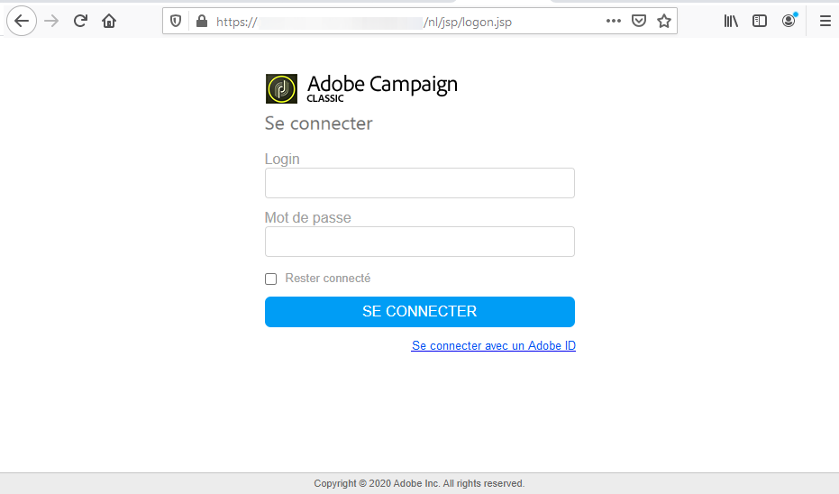

# Installer et mettre à jour la console cliente Campaign{#installing-the-client-console}


La console cliente Campaign est un client riche qui vous permet de vous connecter à votre ou vos serveur(s) applicatif(s) Campaign.

Avant de commencer l&#39;installation de la console cliente, vous devez effectuer les tâches suivantes :

* Vérifier la compatibilité de votre système et de vos outils avec Adobe Campaign dans la [matrice de compatibilité](../../rn/using/compatibility-matrix.md#ClientConsoleoperatingsystems)
* Obtenir l&#39;URL du serveur Campaign
* Obtenir vos informations d&#39;identification utilisateur
* Installez Microsoft Edge Webview2 sur votre système (à partir de la version de build 7.3 de Campaign Classic). [En savoir plus](#webview)

Le processus d’installation ou de mise à jour de la console cliente varie selon votre implémentation d’Adobe Campaign Classic.
Consultez les éléments détaillés ci-dessous pour connaître les processus requis pour votre implémentation.

 Découvrez comment installer et configurer le client Adobe Campaign dans une [vidéo](#video)

>[!CAUTION]
>
>La console cliente et le serveur applicatif Campaign doivent s’exécuter **sur la même version du produit**. Adobe recommande également d’utiliser le **même build du produit**. Découvrez comment vérifier les versions de votre serveur et de votre client Campaign dans [cette section](../../platform/using/launching-adobe-campaign.md#getting-your-campaign-version).

## Installation du runtime de Microsoft Edge Webview2 {#webview}

À partir de la version de build 7.3 de Campaign Classic, l’installation du runtime de Microsoft Edge Webview 2 est requise pour toute installation de console.

Web View est installé par défaut dans le cadre du système d’exploitation Windows 11. S’il n’est pas déjà présent sur votre système, la console de Campaign Classic Installer vous invitera à le télécharger à partir du [site web de Microsoft Developer](http://www.adobe.com/go/acc-ms-webview2-runtime-download_fr). Notez que le lien de téléchargement ne fonctionne pas dans le navigateur Internet Explorer 11, car Microsoft ne le prend plus en charge. Assurez-vous d’utiliser un autre navigateur pour accéder au lien.

## Implémentations hébergées par Adobe {#hosted-customers}

En tant que client hébergé, deux possibilités s’offrent à vous pour installer ou mettre à jour vos consoles clientes :

1. Adobe peut effectuer un déploiement direct. Une fois la console mise à jour, les utilisateurs sont invités à télécharger la dernière version de la console cliente dans une fenêtre pop-up.

1. Vous pouvez effectuer un téléchargement sur vos consoles clientes à partir de la [distribution logicielle](https://experience.adobe.com/#/downloads/content/software-distribution/en/campaign.html).

   **Les utilisateurs devront disposer d’un accès administrateur pour effectuer la mise à jour. Si les utilisateurs ne disposent pas de droits d’administration, un administrateur système devra effectuer un déploiement sur toutes les consoles clientes**.

## Implémentations hybride et On-premise {#hybrid-onprem-customers}

Afin de permettre aux utilisateurs Adobe Campaign de se connecter à l’instance que vous avez créée et paramétrée, ils doivent utiliser la console cliente.

### Mise à disposition de la console pour les utilisateurs {#make-console-available}

Lorsque l’ordinateur utilisé pour démarrer un serveur d’application Adobe Campaign (nlserver web) reçoit les connexions des utilisateurs à partir de la console cliente, vous pouvez le configurer afin de mettre à disposition le programme d’installation de la console Adobe Campaign à travers une interface HTML. Chaque fois qu’une nouvelle version de la console client est disponible, les utilisateurs sont invités à la télécharger lors du lancement de leur console client.

Pour ce faire, procédez comme suit :

1. Sélectionnez le package qui contient le programme d’installation de la console.

   Ce fichier est appelé setup-client-7.X.XXXX.exe pour la v7 ou setup-client-6.X.XXXX.exe pour la v6.1, où X correspond à la sous-version d’Adobe Campaign et XXXX au numéro de build.

1. Copiez et collez ce package dans le dossier d’installation Adobe Campaign (sur le serveur marketing pour les installations hybrides), sous /datakit/nl/eng/jsp.

1. Démarrez le serveur Adobe Campaign.


### Option Ne plus me poser cette question

Adobe recommande de ne pas sélectionner l’option **[!UICONTROL Ne plus me poser cette question]** pour que tous les utilisateurs soient informés de la disponibilité d’une nouvelle version de la console.  Si cette option est sélectionnée, l’utilisateur ne sera pas informé des nouvelles versions disponibles.

Si l’option **[!UICONTROL Ne plus poser cette question]** a été sélectionnée, vous pouvez réinitialiser cette invite. Seuls les administrateurs système qui maîtrisent l’édition du Registre Windows doivent apporter ces modifications :

1. Ouvrez l&#39;Editeur du Registre à l&#39;aide de la commande **regedit** dans le menu **[!UICONTROL Démarrer]** > Exécuter.

1. Recherchez le nœud et développez-le.

   ```
   \HKEY_CURRENT_USER\Software\Neolane\NL_6\nlclient
   ```

1. Supprimez l&#39;entrée **confAdvisedUpgrade** et fermez l&#39;Editeur du Registre.

>[!NOTE]
>
>Si vous appliquez une console mise à jour à une implémentation existante, les utilisateurs reçoivent automatiquement une invite de mise à jour de leur console client. Si vous implémentez Campaign pour la première fois, les utilisateurs devront télécharger la console. Consultez ci-dessous les détails des deux options

### Mettre à jour la console pour une implémentation existante{#update-the-client-console}

Une fois la console disponible dans le dossier du serveur Campaign, les utilisateurs sont invités à télécharger la dernière version de la console cliente dans une fenêtre pop-up.

**Les utilisateurs devront disposer d’un accès administrateur pour effectuer la mise à jour. Si les utilisateurs ne disposent pas de droits d’administration, un administrateur système devra effectuer un déploiement sur toutes les consoles clientes**.


### Télécharger la console pour une nouvelle implémentation{#download-the-client-console}

Les utilisateurs doivent maintenant télécharger et installer la console en procédant comme suit :

1. Ouvrez un navigateur web et téléchargez la console disponible à l’adresse suivante :

   `https://<your adobe campaign server>:<port number>/nl/jsp/logon.jsp`.

1. Dans la fenêtre d’identification, saisissez votre identifiant (login) et votre mot de passe.

   

   Au besoin, utilisez ceux du compte interne définis lors de la création de l’instance.

1. Cliquez sur le lien **[!UICONTROL Téléchargement]** proposé dans la page d’installation.
1. Téléchargez et enregistrez le fichier d’installation client.
1. Exécutez le fichier téléchargé sur un poste sous Windows : l&#39;installation démarre. Le chemin d&#39;installation par défaut de la console cliente est **$PROGRAMFILES$/Adobe/Adobe Campaign Classic vX Client**, où X correspond à 6 ou 7, selon votre version d&#39;Adobe Campaign.

### Créer la connexion - Nouveaux utilisateurs uniquement{#create-the-connection}

Une fois la console cliente installée, procédez comme suit pour créer la connexion au serveur applicatif :

1. Démarrez la console à partir du menu **[!UICONTROL Démarrer]** de Windows, dans le groupe de programmes **Adobe Campaign**.

1. Cliquez sur le lien situé dans le coin supérieur droit des champs d’informations d’identification pour accéder à la fenêtre de configuration de la connexion.

   

1. Cliquez sur le menu **[!UICONTROL Ajouter > Connexion]** et saisissez le libellé et l&#39;URL du serveur applicatif Adobe Campaign.

   

1. Définissez une connexion vers votre serveur applicatif Adobe Campaign à partir d&#39;une URL. Utilisez soit un DNS ou un alias de la machine, soit votre adresse IP.

   Par exemple, vous pouvez utiliser une URL de type [`https://<machine>.<domain>.com`](https://myserver.adobe.com).

1. Si Adobe IMS est configuré pour votre organisation, cochez l’option **[!UICONTROL Se connecter avec un Adobe ID.]**

1. Cliquez sur **[!UICONTROL OK]** pour enregistrer vos paramètres.

Vous pouvez ajouter autant de connexions que nécessaire pour vous connecter, par exemple, à vos environnements de test, d&#39;évaluation et de production.

>[!NOTE]
>
>Le bouton **[!UICONTROL Ajouter]** permet de créer des **[!UICONTROL dossiers]** dans lesquels vous pourrez classer vos différentes connexions par des opérations de glisser-déposer.

### Connexion à Adobe Campaign

Pour vous connecter à une instance existante, procédez comme suit :

1. Démarrez la console à partir du menu **[!UICONTROL Démarrer]** de Windows, dans le groupe de programmes **Adobe Campaign**.

1. Cliquez sur le lien situé dans le coin supérieur droit des champs d’informations d’identification pour accéder à la fenêtre de configuration de la connexion.

1. Sélectionnez l&#39;instance de Campaign à laquelle vous devez vous connecter.

1. Cliquez sur **[!UICONTROL Ok]**

1. Entrez vos informations de connexion utilisateur et cliquez sur **[!UICONTROL Se connecter]**.

>[!NOTE]
>
>Pour les versions de build 7.3 de Campaign Classic, la console cliente d’Adobe Campaign peut demander deux fois les identifiants du proxy lors de l’authentification du proxy. Cela est dû au fait que Microsoft Edge Webview2 n’enregistre pas les identifiants du proxy dans le magasin du cache/de mots de passe, contrairement à Internet Explorer.

**Rubriques connexes :**

* [Création d’une instance et connexion](../../installation/using/creating-an-instance-and-logging-on.md).
* [Matrice de compatibilité](https://helpx.adobe.com/fr/campaign/kb/compatibility-matrix.html)

## Tutoriel vidéo

Cette vidéo explique comment installer et configurer le client Adobe Campaign.

>[!VIDEO](https://video.tv.adobe.com/v/35124?quality=12)

D’autres vidéos pratiques sur Campaign Classic sont disponibles [ici](https://experienceleague.adobe.com/docs/campaign-classic-learn/tutorials/overview.html?lang=fr).
