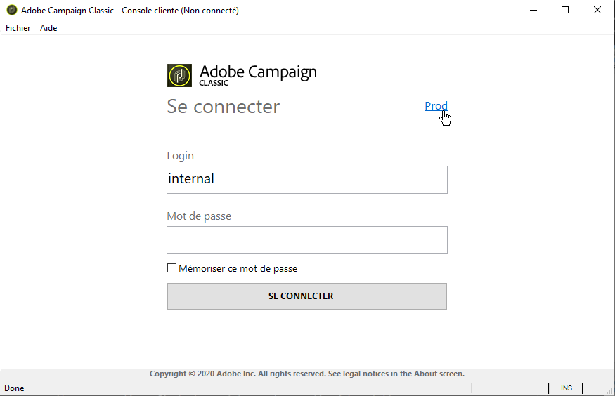

# Installation et mise à jour de la console cliente Campaign{#installing-the-client-console}


Campaign Client Console est un client riche qui vous permet de vous connecter à vos serveurs d’applications Campaign.

Avant de commencer, vous devez vérifier la [matrice de compatibilité](https://helpx.adobe.com/fr/campaign/kb/compatibility-matrix.html) Campaign, obtenir l’URL de votre serveur Campaign et les informations d’identification de l’utilisateur.

>[!CAUTION]
>
>La console cliente et le serveur applicatif Campaign doivent s’exécuter sur la même version de produit. Adobe recommande également d’utiliser la même version de produit.

 Découvrez comment installer et configurer le client Adobe Campaign dans une [vidéo](#video)

Le processus d’installation ou de mise à jour de la console cliente varie en fonction de votre implémentation de Adobe Campaign Classic.
Veuillez consulter les détails ci-dessous pour comprendre ce qui est requis pour votre mise en oeuvre.


## Implémentations hébergées par l&#39;Adobe {#hosted-customers}

Pour installer ou mettre à jour vos consoles client :

1. Adobe peut effectuer un déploiement direct. Une fois la console mise à jour, les utilisateurs sont invités à télécharger la dernière version de la console cliente dans une fenêtre contextuelle.

1. Vous pouvez télécharger sur vos consoles client à partir de [Software Distribution](https://experience.adobe.com/#/downloads/content/software-distribution/fr/campaign.html)

   **Les utilisateurs devront disposer d’un accès administrateur pour effectuer la mise à jour. Si les utilisateurs ne disposent pas de droits d’administration, un administrateur système devra effectuer un déploiement sur toutes les consoles client**


## Implémentations hybrides et entièrement sur site {#hybrid-onprem-customers}

Afin de permettre aux utilisateurs Adobe Campaign de se connecter à l&#39;instance que vous avez créée et paramétrée, ils doivent utiliser la console cliente.

### Mise à disposition de la console pour les utilisateurs {#make-console-available}

Lorsque la machine utilisée pour lancer un serveur applicatif Adobe Campaign (nlserver web) reçoit les connexions des utilisateurs par la console cliente, vous pouvez la configurer afin de mettre à disposition le programme d&#39;installation (setup) du client riche Adobe Campaign à travers une interface HTML. Chaque fois qu’une nouvelle version de la console client est disponible, les utilisateurs sont invités à la télécharger lors du lancement de leur console client.

Pour cela, vous devez :

1. Sélectionnez le package contenant le programme d&#39;installation de la console.

   Ce fichier s’appelle setup-client-7.X.XXXX.exe pour v7 ou setup-client-6.X.XXXX.exe pour v6.1, où X est la sous-version d’Adobe Campaign et XXXX est la compilation.   nombre.

1. Copiez et collez ce package dans le dossier d’installation Adobe Campaign (sur le serveur marketing pour les installations hybrides), sous /datakit/nl/eng/jsp.

1. Début du serveur Adobe Campaign.

>[!CAUTION]
>
>  L&#39;Adobe recommande de ne pas sélectionner l&#39;option **[!UICONTROL Ne plus poser cette question]** pour s&#39;assurer que tous les utilisateurs sont avertis lorsqu&#39;une nouvelle version de la console est disponible.  Si cette option est sélectionnée, l&#39;utilisateur ne sera pas informé des nouvelles versions disponibles.

Si **[!UICONTROL Ne plus poser cette question]** a été sélectionné, vous pouvez réinitialiser cette invite. Seuls les administrateurs système à l&#39;aise avec la modification du registre Windows doivent effectuer les modifications suivantes :

1. Ouvrez l&#39;Editeur du Registre à l&#39;aide de la commande **regedit** dans le menu **[!UICONTROL Démarrer]** > Exécuter.

1. Recherchez le nœud et développez-le.

   ```
   \HKEY_CURRENT_USER\Software\Neolane\NL_6\nlclient
   ```

1. Supprimez l&#39;entrée **confAdvisedUpgrade** et fermez l&#39;Editeur du Registre.

>[!NOTE]
>
>Si vous appliquez une console mise à jour à une implémentation existante, les utilisateurs reçoivent automatiquement une invite de mise à jour de la console client. Si vous implémentez Campaign pour la première fois, les utilisateurs devront télécharger la console. Consultez ci-dessous les détails des deux options

### Mettre à jour la console - implémentation existante{#update-the-client-console}

Une fois la console disponible dans le dossier du serveur Campaign, les utilisateurs sont invités à télécharger la dernière version de la console client dans une fenêtre contextuelle.

**Les utilisateurs devront disposer d’un accès administrateur pour effectuer la mise à jour. Si les utilisateurs ne disposent pas de droits d’administration, un administrateur système devra effectuer un déploiement sur toutes les consoles client**


### Téléchargez la console - nouvelle implémentation{#download-the-client-console}

Les utilisateurs doivent maintenant télécharger et installer la console en procédant comme suit :

1. Ouvrez un navigateur web et téléchargez la console disponible à l’adresse suivante :

   [`https://<your adobe campaign server>:<port number>/nl/jsp/logon.jsp`](https://myserver.adobe.com/nl/jsp/logon.jsp).

1. Dans la fenêtre d’identification, saisissez votre identifiant (login) et votre mot de passe.

   

   Au besoin, utilisez ceux du compte interne définis lors de la création de l’instance.

1. Cliquez sur le lien **[!UICONTROL Téléchargement]** proposé dans la page d’installation.
1. Téléchargez et enregistrez le fichier d’installation client.
1. Exécutez le fichier téléchargé sur un poste sous Windows : l’installation démarre. Le chemin d’installation par défaut de la console cliente est **$PROGRAMFILES$/Adobe/Adobe Campaign Classic vX Client**, où X correspond à 6 ou 7, selon votre version d’Adobe Campaign.

### Créer la connexion - Nouveaux utilisateurs seulement{#create-the-connection}

Une fois la console cliente installée, procédez comme suit pour créer la connexion au serveur applicatif :

1. Démarrez la console à partir du menu **[!UICONTROL Démarrer]** de Windows, dans le groupe de programmes **Adobe Campaign**.

1. Cliquez sur le lien situé dans le coin supérieur droit des champs d’informations d’identification pour accéder à la fenêtre de configuration de la connexion.

   

1. Cliquez sur le menu **[!UICONTROL Ajouter > Connexion]** et saisissez le libellé et l’URL du serveur applicatif Adobe Campaign.

   

1. Définissez une connexion vers votre serveur applicatif Adobe Campaign à partir d’une URL. Utilisez soit un DNS ou un alias de la machine, soit votre adresse IP.

   Par exemple, vous pouvez utiliser une URL de type [`https://<machine>.<domain>.com`](https://myserver.adobe.com).

1. Si Adobe IMS est configuré pour votre organisation, cochez l’option **[!UICONTROL Se connecter avec un Adobe ID.]**

1. Cliquez sur **[!UICONTROL OK]** pour enregistrer vos paramètres.

Vous pouvez ajouter autant de connexions que nécessaire pour vous connecter, par exemple, à vos environnements de test, d’évaluation et de production.

>[!NOTE]
>
>Le bouton **[!UICONTROL Ajouter]** permet de créer des **[!UICONTROL dossiers]** dans lesquels vous pourrez classer vos différentes connexions par des opérations de glisser-déposer.

### Connexion à Adobe Campaign

Pour vous connecter à une instance existante, procédez comme suit :

1. Démarrez la console à partir du menu **[!UICONTROL Démarrer]** de Windows, dans le groupe de programmes **Adobe Campaign**.

1. Cliquez sur le lien situé dans le coin supérieur droit des champs d’informations d’identification pour accéder à la fenêtre de configuration de la connexion.

1. Sélectionnez l’instance de Campaign à laquelle vous devez vous connecter.

1. Cliquez sur **[!UICONTROL Ok]**

1. Entrez vos informations de connexion utilisateur et cliquez sur **[!UICONTROL Se connecter]**.


**Rubriques connexes :**

* [Création d’une instance et connexion](../../installation/using/creating-an-instance-and-logging-on.md).
* [Matrice de compatibilité](https://helpx.adobe.com/campaign/kb/compatibility-matrix.html)

## Tutoriel vidéo

Cette vidéo explique comment installer et configurer le client Adobe Campaign.

>[!VIDEO](https://video.tv.adobe.com/v/35124?quality=12)

D’autres vidéos pratiques sur Campaign Classic sont disponibles [ici](https://experienceleague.adobe.com/docs/campaign-classic-learn/tutorials/overview.html?lang=fr).
