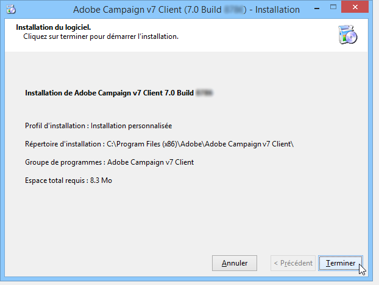

# Installation du serveur{#installing-the-server}


## Exécution du programme d&#39;installation {#executing-the-installation-program}

Pour une plateforme Windows 32 bits, procédez à une installation d&#39;Adobe Campaign 32 bits. Pour une plateforme Windows 64 bits, procédez à une installation d&#39;Adobe Campaign 64 bits.

Les étapes d&#39;installation du serveur Adobe Campaign sont les suivantes :

1. Exécutez le fichier **setup.exe**.

   

1. Sélectionnez le type d&#39;installation.

   

   Plusieurs types d&#39;installation sont proposés :

   * **[!UICONTROL Installation d&#39;un serveur applicatif]** : installation du serveur applicatif Adobe Campaign et de la console cliente.
   * **[!UICONTROL Installation minimale (Réseau)]** : installation d&#39;un poste client depuis le réseau. Seules quelques DLL seront installées sur la machine, si besoin, et tous les autres composants nécessaires seront directement utilisés sur le disque réseau.
   * **[!UICONTROL Installation d&#39;un poste client]** : installation des composants nécessaires pour l&#39;utilisation de la console cliente Adobe Campaign.
   * **[!UICONTROL Installation personnalisée]** : l&#39;utilisateur choisit les éléments à installer.

   Sélectionnez une installation de type **Installation d&#39;un serveur applicatif**, et validez les différentes étapes, comme ci-dessous :

   

1. Sélectionnez le répertoire d&#39;installation :

   

1. Cliquez sur **[!UICONTROL Terminer]** pour lancer l&#39;installation :

   

   La barre de progression permet de suivre l&#39;avancement de l&#39;installation :

   

   A la fin de l&#39;installation, un message vous en confirme le bon déroulement :

   

   >[!NOTE]
   >
   >Une fois l&#39;installation du serveur terminée, un redémarrage du serveur est requis pour éviter tout problème de réseau.

   Une fois l&#39;installation terminée, démarrez Adobe Campaign pour créer les fichiers de configuration. Pour plus d&#39;informations, consultez la section [Premier démarrage du serveur](#first-start-up-of-the-server).

## Test sommaire de l&#39;installation {#summary-installation-testing}

Vous pouvez procéder à un test initial de l&#39;installation à l&#39;aide de la commande suivante :

```
nlserver pdump
```

Lorsqu&#39;Adobe Campaign n&#39;est pas démarré, la réponse est :

```
No task
```

## Premier démarrage du serveur {#first-start-up-of-the-server}

Une fois le test d&#39;installation réalisé, ouvrez l&#39;invite de commande depuis le menu **[!UICONTROL Démarrer > Programmes > Adobe Campaign]** et saisissez la commande suivante :

```
nlserver web
```

Les fichiers situés dans le répertoire d&#39;installation sont utilisés pour la configuration des modules du serveur Adobe Campaign.

Les informations affichées sont alors les suivantes :

```
15:30:12 >   Application server for Adobe Campaign Classic (7.X YY.R build XXX@SHA1) of DD/MM/YYYY
15:30:12 >   Web server start (pid=664, tid=4188)...
15:30:12 >   Creation of server configuration file '[INSTALL]bin..confserverConf.xml' server via '[INSTALL]bin..conffraserverConf.xml.sample
15:30:12 >   Creation of server configuration file '[INSTALL]bin..confconfig-default.xml' server via '[INSTALL]bin..confmodelsconfig-default.xml
15:30:12 >   Server started
15:30:12 >   Stop requested (pid=664)
15:30:12 >   Web server stop (pid=664, tid=4188)...
```

Saisissez la combinaison **Ctr+C** pour arrêter le processus, puis la commande suivante :

```
nlserver start web
```

Les informations affichées sont alors les suivantes :

```
12:17:21 >   Application server for Adobe Campaign Classic (7.X YY.R build XXX@SHA1) of DD/MM/YYYY
12:17:21 >   Start of the 'web@default' ('nlserver web -tracefile:web@default -instance:default -detach -tomcat -autorepair') task in a new process 
12:17:21 >   Application server for Adobe Campaign Classic (7.X YY.R build XXX@SHA1) of DD/MM/YYYY
12:17:21 >   Web server start (pid=29188, tid=-1224824320)...
12:17:21 >   Generation of configuration changes '[INSTALL]bin..confserverConf.xml.diff' between '[INSTALL]bin..confserverConf.xml' and '[INSTALL]bin..conffraserverConf.xml.sample'
12:17:22 >   Tomcat started
12:17:22 >   Server started
```

Pour l&#39;arrêter, saisissez :

```
nlserver stop web
```

Les informations affichées sont alors les suivantes :

```
12:18:31 >   Application server for Adobe Campaign Classic (7.X YY.R build XXX@SHA1) of DD/MM/YYYY
12:18:31 >   Stop requested for 'web@default' ('nlserver web -tracefile:web@default -instance:default -detach -tomcat -autorepair', pid=29188, tid=-1224824320)...
12:18:31 >   Stop requested (pid=29188)
12:18:31 >   Web server stopped (pid=29188, tid=-1224824320)...
```

## Mot de passe de l&#39;identifiant internal {#password-for-the-internal-identifier}

Le serveur Adobe Campaign définit un identifiant (ou &#39;login&#39;) technique nommé **internal** qui possède tous les droits, sur toutes les instances. Après une installation récente, cet identifiant n&#39;a pas de mot de passe. Il est obligatoire d&#39;en définir un.

En savoir plus dans [cette section](../../installation/using/configuring-campaign-server.md#internal-identifier).

## Démarrage des services Adobe Campaign {#starting-adobe-campaign-services}

Pour lancer les services Adobe Campaign, démarrez le service Adobe Campaign à partir du gestionnaire des services, ou saisissez la ligne de commande suivante (en ayant les droits suffisants) :

```
net start nlserver6
```

Si vous avez besoin d&#39;arrêter les processus Adobe Campaign par la suite, saisissez la commande :

```
net stop nlserver6
```

## Installation de LibreOffice {#installing-libreoffice}

Téléchargez la suite LibreOffice et suivez la procédure dʼinstallation standard.

Ajoutez la variable dʼenvironnement suivante :

```
OOO_BASIS_INSTALL_DIR="C:\Program Files (x86)\LibreOffice 6\"
```
