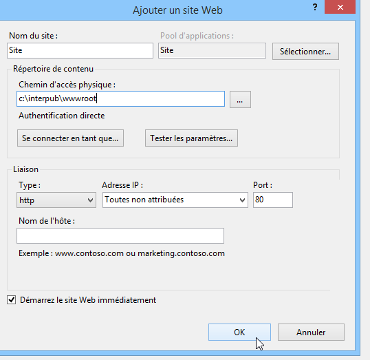
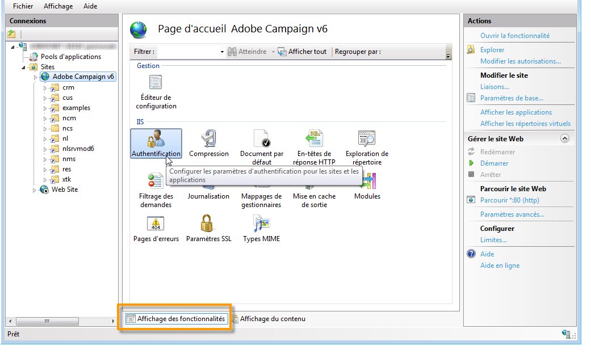
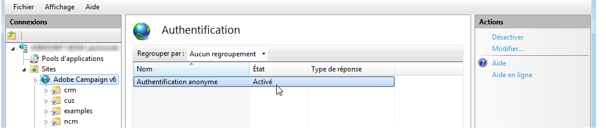

# Intégration à un serveur web pour Windows {#integration-into-a-web-server-for-windows}

Adobe Campaign inclut Apache Tomcat pour agir comme point d&#39;entrée dans le code du serveur applicatif via HTTP (et SOAP).

Vous pouvez utiliser ce Tomcat intégré pour servir des requêtes HTTP.

Dans ce cas :

* le port d’écoute par défaut est 8080. Pour savoir comment le modifier, consultez [cette section](../../installation/using/configure-tomcat.md).
* Vos consoles clientes se connectent alors en utilisant une URL de type ```https:// `<computer>`:8080```.

Cependant, pour des raisons de sécurité et d&#39;administration, il est conseillé d&#39;utiliser un véritable serveur Web comme point d&#39;entrée principal pour le trafic HTTP lorsque la machine qui fait tourner Adobe Campaign est exposée sur Internet et que vous voulez donner un accès à la console depuis l&#39;extérieur de votre réseau.

Un serveur Web permet également d&#39;assurer la confidentialité des données avec le protocole HTTPS.

De même, vous devez utiliser un serveur Web lorsque vous souhaitez utiliser les fonctionnalités de tracking, disponibles seulement en tant que module d&#39;extension d&#39;un serveur Web.

## Configurer le serveur web IIS {#configuring-the-iis-web-server}

La procédure de configuration d’un serveur web IIS Microsoft est essentiellement graphique. Cela implique l’utilisation d’un site web pour accéder aux ressources du serveur Adobe Campaign : fichiers Java (.jsp), feuilles de style (.css, .xsl), images (.png), la DLL ISAPI pour la redirection, etc.


### Étapes de configuration {#configuration-steps}

Pour intégrer Adobe Campaign au serveur web Microsoft IIS, procédez comme suit :

1. Ouvrez Microsoft IIS.
1. Créez et paramétrez le site (Adobe Campaign, par exemple) en fonction des contraintes de votre réseau (port TCP de connexion, host DNS, adresse IP).

   Vous devez au moins spécifier le nom du site et le chemin d&#39;accès au répertoire virtuel. Le chemin d’accès au répertoire du site web n’étant pas utilisé, vous pouvez utiliser le répertoire suivant.

   ```
   C:\inetpub\wwwroot
   ```

   

1. Un script **VBS** vous permet de configurer automatiquement les ressources utilisées par le serveur Adobe Campaign sur le répertoire virtuel que nous venons de créer. Pour le lancer, double-cliquez sur le fichier **is_neolane_setup.vbs** situé dans le dossier`[INSTALL]\conf`, où `[INSTALL]` est le chemin d’accès au dossier d’installation d’Adobe Campaign.

   >[!NOTE]
   >
   >Vous devez vous connecter en tant qu’administrateur ou administratrice pour exécuter le script VBS ou exécuter le script en tant qu’administrateur ou administratrice.

   Cliquez sur **[!UICONTROL OK]** si le serveur Web fait office de serveur de redirection pour le tracking, dans le cas contraire cliquez sur **[!UICONTROL Cancel]**.

   Lorsque plusieurs sites sont déjà paramétrés sur le serveur Web, une page intermédiaire est affichée afin de préciser sur quel site Web doit s&#39;appliquer l&#39;installation : saisissez le numéro associé au site puis cliquez sur **[!UICONTROL OK]**.

1. Dans l’onglet **[!UICONTROL Affichage du contenu]**, vérifiez que la configuration du site web est bien paramétrée avec les ressources Adobe Campaign :

   Si l’arborescence n’est pas affichée, redémarrez Microsoft IIS.

### Gestion des droits {#managing-rights}

Vous devez ensuite régler les accès de sécurité pour l&#39;exécution de la DLL ISAPI et l&#39;utilisation des ressources du répertoire d&#39;installation Adobe Campaign.

Pour cela, les étapes sont les suivantes :

1. Sélectionnez l&#39;onglet **[!UICONTROL Affichage des fonctionnalités]** et double-cliquez sur l&#39;icône **Authentification**.

   

1. Vérifiez, dans l&#39;onglet **Sécurité de répertoire** du site web, que l&#39;accès anonyme est activé. Si nécessaire, cliquez sur le lien **[!UICONTROL Editer]** pour modifier les paramètres.

   

### Lancement du serveur Web et test de la configuration {#launching-the-web-server-and-testing-the-configuration}

Vous devez tester la validité de la configuration.

Pour cela, respectez la procédure suivante :

1. Redémarrez le serveur Microsoft IIS à l’aide de la ligne de commande **iisreset**.

1. Démarrez le service Adobe Campaign, puis assurez-vous qu&#39;il est en cours d&#39;exécution.

1. Testez le bon fonctionnement du module de tracking depuis un navigateur Web via l&#39;URL suivante :

   ```
   https://<computer>/r/test
   ```

   Le navigateur doit afficher la réponse suivante :

   ```
   <redir status='OK' date='YYYY/MM/DD HH:MM:SS' build='XXXX' host='myserver.mydomain.com' localHost='localhost'/>
   ```

Pour vérifier la présence du module de redirection, lancez la ligne de commande suivante :

```
nlserver pdump
```

Elle doit renvoyer les informations suivantes :

```sql
HH:MM:SS >   Application server for Adobe Campaign Classic (7.X YY.R build XXX@SHA1) of DD/MM/YYYY
webmdl@default (1644) - 18.2 Mo
```

Vous pouvez également vous assurer que la DLL ISAPI est bien chargée.

Pour cela, les étapes sont les suivantes :

1. Editez les filtres ISAPI pour le site Adobe Campaign en cliquant sur l&#39;icône **[!UICONTROL Mappages de gestionnaires]**.
1. Vérifiez ensuite le contenu du filtre ISAPI.


## Modifier la limite de la taille des fichiers téléchargeables {#changing-the-upload-file-size-limit}

Lors de la configuration du serveur Web IIS, une limite (environ 28 Mo) est automatiquement définie sur la taille des fichiers qu&#39;il est possible de télécharger via le serveur.

Cela peut avoir un impact dans Adobe Campaign, notamment si vous souhaitez télécharger des fichiers dont la taille est supérieure à cette limite.

Par exemple, si vous utilisez une activité de type **Chargement (fichier)** dans un workflow pour importer un fichier de 50 Mo, une erreur empêchera le workflow d&#39;être correctement exécuté.

Vous devez, dans ce cas, augmenter cette limite.

Pour plus d’informations sur cette option de Microsoft IIS, consultez la section « Procédure » de la [documentation Microsoft](https://learn.microsoft.com/fr-fr/iis/configuration/system.webServer/security/requestFiltering/requestLimits/){target="_blank"}.

