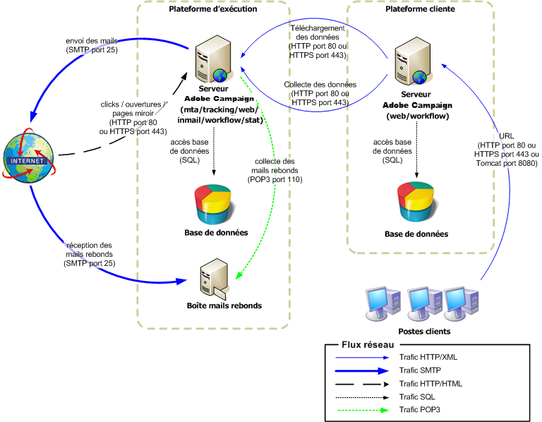

# Déploiement Mid-sourcing{#mid-sourcing-deployment}

Cette configuration présente une solution intermédiaire optimale entre le mode hébergé (ASP) et l&#39;internalisation. Toute la partie concernant l&#39;envoi des messages est déportée sur un serveur de &quot;mid-sourcing&quot;, hébergé chez Adobe Campaign.

>[!NOTE]
>
>Pour mettre en place un déploiement en Mid-sourcing, vous devez acquérir l&#39;option correspondante. Vérifiez votre contrat de licence.

La communication générale entre les serveurs et les processus est réalisée conformément au schéma suivant :

* Les modules de diffusion et de gestion des mails rebonds sont désactivés sur l&#39;instance.
* L&#39;application est configurée pour déléguer les envois des messages à un serveur de mid-sourcing distant via des appels SOAP (sur HTTP ou HTTPS).

## Caractéristiques {#features}

### Avantages {#advantages}

* Configuration du serveur beaucoup plus simple : il n&#39;est pas nécessaire pour le client de configurer les modules communiquant avec l&#39;extérieur (mta et inMail).
* Bande passante limitée : l&#39;envoi des emails étant effectué par le serveur de mid-sourcing, il suffit de prévoir un débit nécessaire à l&#39;envoi des données de personnalisation au serveur de mid-sourcing.
* La haute disponibilité n&#39;est plus nécessaire : la problématique est reportée sur le serveur de mid-sourcing (redirection, pages miroir, serveurs de diffusion, etc.).
* La base de données ne sort pas de l&#39;entreprise : seules les données nécessaires à l&#39;assemblage des messages sont envoyées au serveur de mid-sourcing (éventuellement en HTTPS).
* Ce type de déploiement peut être une solution pour les architectures à gros volumes (beaucoup de destinataires en base), avec un débit d&#39;envoi élevé.

### Inconvénients {#disadvantages}

* Un léger délai dans la visualisation des informations de diffusion des messages et du reporting lié à la remontée de ces informations depuis la base de mid-sourcing.
* Les questionnaires et les formulaires web restent localisés sur la plateforme cliente.

### Matériel recommandé {#recommended-equipment}

* Serveur applicatif : processeur quad-core à 2 GHz, 4 Go de mémoire, disque en RAID 1 Soft 80 Go SATA.
* Serveur de base de données : processeurs bi-quad core 3 GHz, 4 Go de mémoire ou plus, disque en RAID 10 hardware SAS 15.000tr/min, le nombre dépendant de la taille et de la performance attendue de la base de données.

>[!NOTE]
>
>La redirection est complètement découplée du mid-sourcing, mais en général le serveur de tracking sera mutualisé avec les serveurs de mid-sourcing.

## Etapes d&#39;installation et de configuration {#installation-and-configuration-steps-}

### Prérequis {#prerequisites}

* JDK sur le serveur applicatif.
* Accès à un serveur de base de données sur le serveur applicatif.
* Configuration du firewall pour l&#39;ouverture du port HTTP (80) ou HTTPS (443) vers le serveur de mid-sourcing.

### Installer et configurer (déploiement mid-sourcing) {#installing-and-configuring--mid-sourcing-deployment-}

Reportez-vous au serveur [de](../../installation/using/mid-sourcing-server.md)sources intermédiaires.
