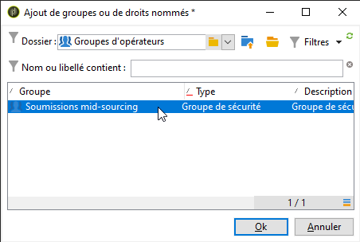

# Serveur de mid-sourcing{#mid-sourcing-server}


Cette section présente les étapes d&#39;installation et de configuration d&#39;un serveur de mid-sourcing ainsi que les étapes de déploiement d&#39;une instance permettant à des tiers de soumettre des messages en mode **mid-sourcing**.

L&#39;architecture « mid-sourcing » est présentée dans la section [Déploiement Mid-sourcing](../../installation/using/mid-sourcing-deployment.md).

L&#39;installation d&#39;un serveur de mid-sourcing est identique à celle d&#39;une instance classique (se référer à la configuration standard). Il s&#39;agit d&#39;une instance autonome avec sa propre base de données, sur laquelle il est possible de lancer des diffusions. Elle contient simplement une configuration supplémentaire permettant à des instances distantes de lui déléguer des envois à effectuer en mode mid-sourcing.

>[!CAUTION]
>
>Une fois le serveur de mid-sourcing configuré et les [workflows de synchronisation](https://experienceleague.adobe.com/docs/campaign/automation/workflows/introduction/wf-type/technical-workflows.html?lang=fr){target="_blank"} exécutés pour la première fois, veillez à ne pas mettre à jour le nom interne des comptes externes de mid-sourcing.

## Etapes d&#39;installation et de configuration d&#39;une instance {#steps-for-installing-and-configuring-an-instance}

### Prérequis relatifs à l&#39;installation et à la configuration d&#39;une instance {#prerequisites-for-installing-and-configuring-an-instance}

* JDK sur le serveur applicatif.
* Accès à un serveur de base de données sur le serveur applicatif.
* Configuration du firewall pour l&#39;ouverture du port HTTP (80) ou HTTPS (443) vers le serveur de mid-sourcing.

La procédure ci-dessous présente une configuration utilisant un seul serveur de mid-sourcing. Il est également possible de faire appel en parallèle à plusieurs serveurs de mid-sourcing, ainsi que de configurer l&#39;envoi de certains messages en mode normal (pour les notifications de workflow, par exemple).

### Installer et configurer le serveur applicatif pour un déploiement en mid-sourcing {#installing-and-configuring-the-application-server-for-mid-sourcing-deployment}

La procédure d&#39;installation reprend les étapes d&#39;une installation pour une instance mono-machine. Pour plus d&#39;informations, consultez la section [Installer et configurer (mono-machine)](../../installation/using/standalone-deployment.md#installing-and-configuring--single-machine-).

Toutefois, vous devez appliquer les spécificités suivantes :

* A l&#39;étape **5**, vous devez désactiver les modules **mta** (diffusion) et **inMail** (mails rebonds). Au contraire, le module **wfserver** (workflow) doit rester activé.

  ```
  <?xml version='1.0'?>
  <serverconf>  
    <shared>    
      <!-- add lang="eng" to dataStore to force English for the instance -->    
      <dataStore hosts="console.campaign.net*">      
        <mapping logical="*" physical="default"/>    
      </dataStore>  </shared>  
      <mta autoStart="false"/>  
      <wfserver autoStart="true"/>  
      <inMail autoStart="false"/>  
      <sms autoStart="false"/>  
      <listProtect autoStart="false"/>
  </serverconf>
  ```

  Pour plus d’informations à ce sujet, consultez [cette section](../../installation/using/configuring-campaign-server.md#enabling-processes).

* Les étapes **6**,**9** et **10** ne sont pas nécessaires.
* Lors des étapes **12** et **13**, vous devez indiquer le port 8080 dans l’URL de connexion (car la console communique directement avec Tomcat sans passer par le serveur web). L’URL devient `http://console.campaign.net:8080`. À l’étape **13**, sélectionnez le package **[!UICONTROL Emission vers Mid-Sourcing]**, en complément des packages à installer.

  

  >[!CAUTION]
  >
  >Le routage par défaut des diffusions techniques est automatiquement remplacé par le routage e-mail via midsourcing.

### Installer et configurer le serveur de mid-sourcing {#installing-and-configuring-the-mid-sourcing-server}

À partir de la console client, recherchez le compte **Routage e-mail en mid-sourcing** (dans le dossier **/Administration/Comptes externes/**). Renseignez les paramètres **URL du serveur**, **compte**, **mot de passe** et **URL de page miroir** avec les informations fournies par le fournisseur hébergeant le serveur de mid-sourcing. Tester la connexion.

>[!NOTE]
>
>L&#39;option **Emission vers Mid-sourcing** crée deux workflows **Mid-sourcing**. Il s&#39;agit d&#39;un traitement, planifié par défaut toutes les heures et 20 minutes, qui effectue la collecte des informations de diffusion sur le serveur de mid-sourcing.

## Déploiement d&#39;un serveur de mid-sourcing {#deploying-a-mid-sourcing-server}

1. Installation du serveur applicatif :

   >[!CAUTION]
   >
   >Si vous installez un serveur de mid-sourcing et que vous souhaitez installer des modules Adobe Campaign supplémentaires, il est déconseillé de choisir le module Campaign. Préférez le module Delivery.

   Suivez la même procédure que pour un déploiement standard en sélectionnant uniquement l&#39;option **[!UICONTROL Plateforme de Mid-sourcing]**.

   

1. Configuration de la réception du mid-sourcing :

   Définissez le mot de passe du compte d&#39;envoi : dans le dossier **/Mid-sourcing/Gestion des accès/Opérateurs/**, l&#39;opérateur **mid** est utilisé par l&#39;instance distante pour les envois en mode mid-sourcing. Vous devez définir un mot de passe pour cet opérateur et le donner à l&#39;administrateur de l&#39;instance d&#39;envoi.

   L&#39;option **Plateforme de Mid-sourcing** crée les dossiers par défaut dans lesquels seront stockées les diffusions soumises et l&#39;opérateur par défaut pour effectuer les soumissions.

## Multiplexage du serveur de mid-sourcing {#multiplexing-the-mid-sourcing-server}

>[!CAUTION]
>
>Le multiplexage n&#39;est pris en charge que pour les environnements on-premise.

Il est possible de mutualiser une instance de mid-sourcing pour plusieurs instances de soumission. Chaque instance pouvant effectuer des soumissions sera associée à un opérateur dans la base de mid-sourcing. Pour créer un second compte sur le serveur de mid-sourcing :

1. Créez un dossier sous le nœud **[!UICONTROL Mid-sourcing > Diffusions]** qui sera associé au compte mid-sourcing par défaut (par exemple : prod).
1. Créez un dossier sous le nœud **[!UICONTROL Mid-sourcing > Diffusions]** qui aura le même nom que le compte (par exemple : recette).

   

1. Créez un nouveau compte depuis le noeud **[!UICONTROL Mid-sourcing > Gestion des accès > Opérateurs]**.

   

1. Dans l&#39;onglet **[!UICONTROL Droits d&#39;accès]**, attribuez à cet opérateur les droits du groupe **Soumissions mid-sourcing**. Ce droit d&#39;accès est accessible sous **[!UICONTROL Mid-sourcing > Gestion des accès > Groupes d&#39;opérateurs]**.

   

1. Sélectionnez l’option **[!UICONTROL Restreindre aux données présentes dans les sous-dossiers de]** et séléctionnez le dossier Diffusions pour restreindre l’accès de cet opérateur au répertoire de diffusions mid-sourcing.

   

1. Redémarrez le module web à l’aide de la commande suivante : ** web**.

Vous devez modifier le paramétrage du serveur de mid-sourcing à partir du fichier serverConf.xml. La ligne suivante doit être ajoutée dans la section &quot;Gestion des affinités avec les adresses IP&quot;, sous la ligne existante :

```
<IPAffinity IPMask="" localDomain="" name=""/>
```

L&#39;attribut &#39;@name&#39; doit respecter les règles suivantes :

**&#39;nom_de_l&#39;opérateur_du_compte_marketing&#39;.&#39;nom_de_l&#39;affinité&#39;.&#39;groupe_d&#39;affinité&#39;**

&#39;nom_du_compte_de_l&#39;opérateur_marketing&#39; correspond au nom interne du compte de l&#39;opérateur mid-sourcing déclaré dans l&#39;instance mid-sourcing.

&#39;nom_de_l&#39;affinité&#39; correspond au nom arbitraire donné à l&#39;affinité. Ce nom doit être unique. Les caractères autorisés sont `[a-z]``[A-Z]``[0-9]`. Le but est de déclarer un groupe d&#39;adresses IP publiques.

&#39;groupe_d&#39;affinité&#39; est lié à la sous-affinité déclarée dans le mapping de ciblage utilisé dans chacune des diffusions. La dernière partie incluant le « . » est ignorée en l&#39;absence de sous-affinité. Les caractères autorisés sont `[a-z]``[A-Z]``[0-9]`.

Vous devez arrêter et redémarrer le serveur pour que cette modification soit prise en compte.

## Configuration du tracking sur un serveur de mid-sourcing {#configuring-tracking-on-a-mid-sourcing-server}

**Paramétrage du serveur de mid-sourcing**

1. Positionnez-vous au niveau des opérateurs et sélectionnez l&#39;opérateur **[!UICONTROL mid]**.
1. Dans l&#39;onglet **[!UICONTROL Serveurs frontaux]** complétez les paramètres de connexion au serveur de tracking.

   Pour créer une instance de tracking, indiquez l&#39;URL du serveur de tracking, le mot de passe du compte internal du serveur de tracking, ainsi que le nom de l&#39;instance, son mot de passe et les masques DNS qui lui sont associés.

   

1. Lorsque vous avez complété les paramètres de connexion, cliquez sur **[!UICONTROL Valider le paramétrage]**.
1. Si besoin est, définissez l&#39;emplacement où seront stockées les images contenues dans les diffusions. Pour cela, choisissez un des modes de publication disponible dans la liste déroulante.

   

   Si vous choisissez l&#39;option **[!UICONTROL Serveur(s) de tracking]**, les images seront forcément copiées sur le serveur de mid-sourcing.

**Paramétrage de la plateforme cliente**

1. Positionnez-vous sur le compte externe de routage en mid-sourcing.
1. Dans l&#39;onglet **[!UICONTROL Mid-Sourcing]**, indiquez les paramètres de connexion au serveur de mid-sourcing.

   

1. Validez votre paramétrage en cliquant sur **[!UICONTROL Tester la connexion]**.
1. Déclarez l&#39;instance de tracking référencée sur le serveur de mid-sourcing :

   Cliquez sur le lien **[!UICONTROL Utiliser cette plateforme comme proxy pour accéder aux serveurs de tracking]**,

   Indiquez le nom de l&#39;instance de tracking, puis validez la connexion avec le serveur de tracking.

   

Si la diffusion de messages doit être gérée par plusieurs serveurs de mid-sourcing, sélectionnez l&#39;option **[!UICONTROL Routage avec alternance des comptes mid-sourcing utilisés]** et indiquez les différents serveurs.


