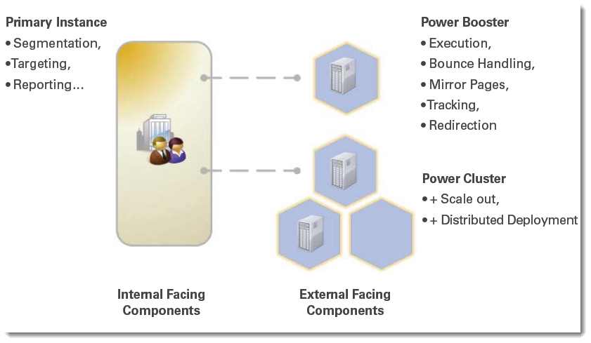

# Power Booster et Power Cluster{#power-booster-and-power-cluster}

## Vue d&#39;ensemble {#overview}

Adobe Campaign fournit deux séries d&#39;options architecturales pré-packagées permettant de dimensionner votre déploiement :

* **Power Booster**

  Cette option fournit la prise en charge d&#39;une instance d&#39;exécution supplémentaire découplée de l&#39;instance applicative Adobe Campaign principale. Les instances d&#39;exécution dédiées peuvent être hébergées à distance ou par un tiers. Lorsqu’il est implémenté, l’exécution des e-mails, le tracking, les pages miroir et les messages bounce sont gérés indépendamment des fonctions de l’application centrale.

* **Power Cluster**

  Cette option fournit une prise en charge de 2 à N instances d&#39;exécution en cluster découplées de l&#39;instance d&#39;application Adobe Campaign principale par rapport à une application donnée. Les clusters peuvent être hébergés à distance, dans des déploiements distribués et par des tiers. Outre les avantages de l’isolation des processus, l’option Adobe Campaign Power Cluster permet la redondance et des stratégies d’évolutivité à l’aide de matériel standard pour une évolution simplifiée du SLA ou des performances.

## Applications éligibles {#eligible-applications}

Les options Power Booster et Power Cluster peuvent être exploitées par les applications suivantes :

* Campagne
* Diffusion
* Message Center

## Matrice de recommandations architecturales {#matrix-of-architectural-recommendations}

<table> 
 <tbody> 
  <tr> 
   <td> </td> 
   <td> <strong>Architecture standard</strong>  </td> 
   <td> <strong>Power Booster</strong>  </td> 
   <td> <strong>Power Cluster</strong>  </td> 
  </tr> 
  <tr> 
   <td> Campagnes e-mail et interactions sortantes  </td> 
   <td> Jusqu'à environ 30 millions d'emails par mois  </td> 
   <td> 30-100 millions d'emails par mois  </td> 
   <td> Au-delà de 100 millions d'emails par mois  </td> 
  </tr> 
  <tr> 
   <td> Messages transactionnels  </td> 
   <td> 50 000 par heure par serveur d’exécution  </td> 
   <td> 50 000 par heure par serveur d’exécution  </td> 
   <td> 50 000 par heure par serveur d’exécution  </td> 
  </tr> 
  <tr> 
   <td> Disponibilité  </td> 
   <td> Celle de la base principale  </td> 
   <td> 24/7 sauf pour maintenance et
arrêts de l'instance d'exécution  </td> 
   <td> Service 24/7/365 possible  </td> 
  </tr> 
  <tr> 
   <td> Sécurité  </td> 
   <td> Datamart est potentiellement accessible depuis l'internet public  </td> 
   <td> Datamart isolé des composants frontaux
exposés sur l'internet public  </td> 
   <td> Datamart isolé des composants frontaux
exposés sur l'internet public  </td> 
  </tr> 
  <tr> 
   <td> Modèle de déploiement  </td> 
   <td> Tout sur site (peut être on premise ou bien dans le cloud)  </td> 
   <td> Fonctions marketing on premise avec une exécution dans le cloud possible  </td> 
   <td> Fonctions marketing on premise avec une exécution dans le cloud possible ; exécution dans de multiples géographies possible  </td> 
  </tr> 
 </tbody> 
</table>

## Recommandations {#recommendations}

* Une instance d&#39;exécution doit être dédiée à un service. Vous ne pouvez pas installer un package pour un service auquel vous n&#39;êtes pas abonné. Par exemple, si vous avez souscrit à l&#39;option **Power Booster** pour le service **Message Center**, vous ne pouvez installer que le package **[!UICONTROL Exécution des messages transactionnels]** sur l&#39;instance d&#39;exécution dédiée. Veuillez vérifier votre contrat de licence.
* Dans la mesure où les instances dédiées (ou clusters) sont des instances Adobe Campaign, les recommandations sont les mêmes que pour une instance principale. Voir à ce sujet [ce document](../../production/using/foreword.md).
* Pour dimensionner correctement l&#39;instance d&#39;un point de vue base de données/composants matériels, nous vous invitons à vous rapprocher des services professionnels d&#39;Adobe Campaign.
