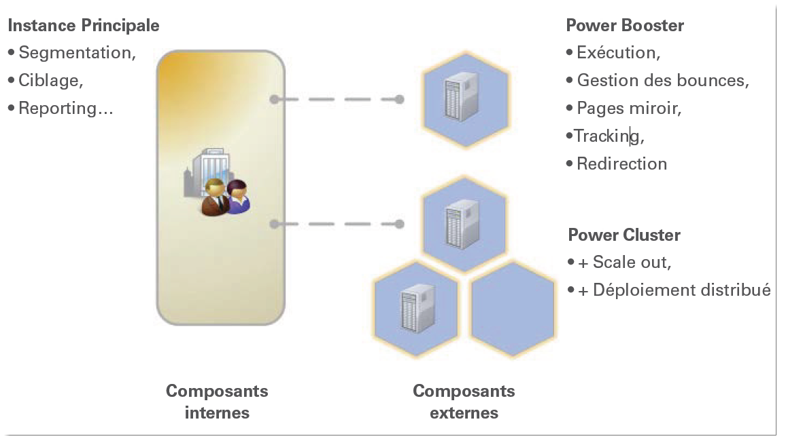

# Power Booster et Power Cluster{#power-booster-and-power-cluster}

## Vue d&#39;ensemble {#overview}

Adobe Campaign fournit deux séries d&#39;options architecturales pré-packagées permettant de dimensionner votre déploiement :

* **Power Booster**

   Cette option fournit un support pour une instance d&#39;exécution supplémentaire découplée de l&#39;instance applicative Adobe Campaign principale en rapport avec une application donnée. Une instance dédiée peut être hébergée hors site ou bien par un prestataire tiers. Lorsqu&#39;elle est mise en oeuvre, l&#39;exécution email, le tracking, les pages miroir et les messages « bounce » sont pris en charge indépendamment des fonctionnalités de l&#39;application centrale.

* **Power Cluster**

   Cette option fournit un support pour 2 à N instances d&#39;exécution en configuration clusterisée découplées de l&#39;instance applicative Adobe Campaign principale et ceci en rapport avec une application donnée. Des clusters peuvent être hébergés hors site, dans des déploiements distribués ou bien par des prestataires tiers. En plus des bénéfices d&#39;isolation des processus, l&#39;option Adobe Campaign Power Cluster permet la redondance ainsi que des stratégies « scale out » à base de matériel banalisé pour une évolution simplifiée du niveau de service ou de performance.

## Applications éligibles {#eligible-applications}

Les options Power Booster et Power Cluster peuvent être exploitées par les applications suivantes :

* Campagne
* Diffusion
* Message Center

## Matrice de recommandations architecturales {#matrix-of-architectural-recommendations}

<table> 
 <tbody> 
  <tr> 
   <td> </td> 
   <td> <strong>Architecture standard</strong>  </td> 
   <td> <strong>Power Booster</strong>  </td> 
   <td> <strong>Power Cluster</strong>  </td> 
  </tr> 
  <tr> 
   <td> Campagnes e-mail et interactions sortantes  </td> 
   <td> Jusqu'à environ 30 millions d'emails par mois  </td> 
   <td> 30-100 millions d'emails par mois  </td> 
   <td> Au-delà de 100 millions d'emails par mois  </td> 
  </tr> 
  <tr> 
   <td> Messages transactionnels  </td> 
   <td> 50 000 par heure par serveur d’exécution  </td> 
   <td> 50 000 par heure par serveur d’exécution  </td> 
   <td> 50 000 par heure par serveur d’exécution  </td> 
  </tr> 
  <tr> 
   <td> Disponibilité  </td> 
   <td> Celle de la base principale  </td> 
   <td> 24/7 sauf pour maintenance et
arrêts de l'instance d'exécution  </td> 
   <td> Service 24/7/365 possible  </td> 
  </tr> 
  <tr> 
   <td> Sécurité  </td> 
   <td> Datamart est potentiellement accessible depuis l'internet public  </td> 
   <td> Datamart isolé des composants frontaux
exposés sur l'internet public  </td> 
   <td> Datamart isolé des composants frontaux
exposés sur l'internet public  </td> 
  </tr> 
  <tr> 
   <td> Modèle de déploiement  </td> 
   <td> Tout sur site (peut être on premise ou bien dans le cloud)  </td> 
   <td> Fonctions marketing on premise avec une exécution dans le cloud possible  </td> 
   <td> Fonctions marketing on premise avec une exécution dans le cloud possible ; exécution dans de multiples géographies possible  </td> 
  </tr> 
 </tbody> 
</table>

## Recommandations      {#recommendations}

* Une instance d&#39;exécution doit être dédiée à un service. Vous ne pouvez pas installer un package correspondant à un service auquel vous n&#39;avez pas souscrit. Par exemple, si vous avez souscrit à l&#39;option **Power Booster** pour le service **Message Center**, vous ne pouvez installer que le package **[!UICONTROL Exécution des messages transactionnels]** sur l&#39;instance d&#39;exécution dédiée. Vérifiez votre contrat de licence.
* Dans la mesure où les instances dédiées (ou clusters) sont des instances Adobe Campaign, les recommandations sont les mêmes que pour une instance principale. Voir à ce sujet [ce document](../../production/using/foreword.md).
* Pour dimensionner correctement l&#39;instance d&#39;un point de vue base de données/composants matériels, nous vous invitons à vous rapprocher des services professionnels d&#39;Adobe Campaign.
