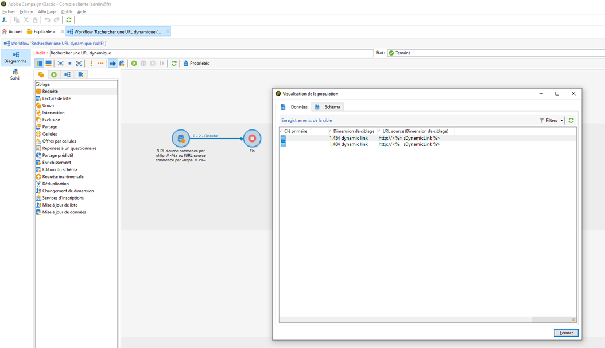
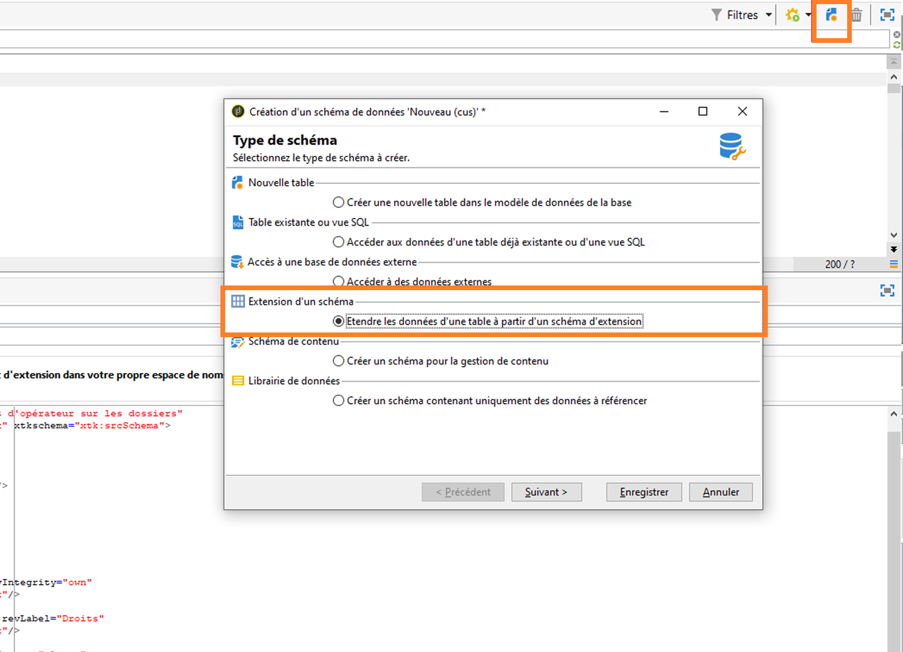

# Personnalisation et confidentialité {#privacy}

## Personnalisation des URL {#url-personalization}

Lorsque vous ajoutez des liens personnalisés à votre contenu, évitez toujours toute personnalisation dans la partie du nom d&#39;hôte de l&#39;URL afin d&#39;éviter des failles de sécurité potentielles. Les exemples suivants ne doivent jamais être utilisés dans tous les attributs d’URL &lt;`a href="">` ou `` :

* `<%= url >`
* `https://<%= url >`
* `https://<%= domain >/path`
* `https://<%= sub-domain >.domain.tld/path`
* `https://sub.domain<%= main domain %>/path`

### Recommandation

Pour valider et vous assurer que vous n’utilisez pas les éléments ci-dessus, exécutez une requête sur la table des URL de tracking à l’aide du [requêteur générique de Campaign](../../platform/using/steps-to-create-a-query.md) ou créez un workflow avec des critères de filtre dans l’[activité de requête](../../workflow/using/query.md).

Exemple :

1. Créez un workflow et ajoutez une activité **Requête**. [En savoir plus](../../workflow/using/query.md).

1. Ouvrez l’activité **Requête** et créez un filtre sur le tableau `nmsTrackingUrl` comme suit :

   `source URL starts with http://<% or source URL starts with https://<%`

1. Exécutez le workflow et vérifiez s’il y a des résultats.

1. Si c’est le cas, ouvrez la transition sortante pour afficher la liste des URL.

   


### Signature d&#39;URL

Pour améliorer la sécurité, un mécanisme de signature pour les liens de tracking dans les e-mails été ajouté. Cette fonctionnalité est disponible à partir des versions 19.1.4 (9032@3a9dc9c) et 20.2 et est activée par défaut.

>[!NOTE]
>
>Lorsqu’un(e) utilisateur(utilisatrice) clique sur une URL signée incorrecte, cette erreur est renvoyée : `Requested URL '…' was not found.`

En outre, vous pouvez utiliser une amélioration pour désactiver les URL générées dans les versions précédentes. Cette fonctionnalité est désactivée par défaut. Vous pouvez contacter l&#39;[Assistance clientèle](https://helpx.adobe.com/fr/enterprise/admin-guide.html/enterprise/using/support-for-experience-cloud.ug.html) pour activer cette fonctionnalité.

Si vous exécutez la version 19.1.4, vous pouvez rencontrer des problèmes avec les diffusions des notifications push qui utilisent des liens de tracking ou celles qui utilisent des balises d’ancrage. Si tel est le cas, nous vous recommandons de désactiver la signature d&#39;URL.

En tant que client(e) hébergé(e) par Campaign, Managed Cloud Services ou hybride, vous devez contacter l’[Assistance clientèle](https://helpx.adobe.com/fr/enterprise/using/support-for-experience-cloud.html) pour désactiver la signature d’URL.

Si vous exécutez Campaign dans une architecture hybride, avant d’activer la signature d’URL, vérifiez que l’instance de mid-sourcing hébergée a été mise à niveau de la manière suivante :

* Commencez par l’instance de marketing On-premise.
* Ensuite, effectuez la mise à niveau vers la même version que celle de l’instance marketing On-premise ou vers une version légèrement supérieure.

Dans le cas contraire, certains des problèmes suivants peuvent se produire :

* Avant la mise à niveau de l&#39;instance de mid-sourcing, les URL sont envoyées sans signature via cette instance.
* Une fois l&#39;instance de mid-sourcing mise à niveau et la signature d&#39;URL activée sur les deux instances, les URL précédemment envoyées sans signature sont rejetées. Cela est dû au fait qu&#39;une signature est demandée par les fichiers de tracking fournis par l&#39;instance marketing.

Pour désactiver les URL qui ont été générées dans les builds précédents, procédez comme suit sur tous les serveurs Campaign en même temps :

1. Dans le fichier de configuration du serveur (`serverConf.xml`), définissez l’option **blockRedirectForUnsignedTrackingLink** sur **vrai**.
1. Redémarrez le service `nlserver` .
1. Sur le serveur `tracking`, redémarrez le serveur `web` (apache2 sur Debian, httpd sur CentOS/RedHat et IIS sous Windows).

Pour activer la signature d&#39;URL, procédez comme suit sur tous les serveurs Campaign en même temps :

1. Dans le fichier de configuration du serveur (`serverConf.xml`), définissez l’option **signEmailLinks** sur **vrai**.
1. Redémarrez le service **nlserver**.
1. Sur le serveur `tracking`, redémarrez le serveur `web` (apache2 sur Debian, httpd sur CentOS/RedHat et IIS sous Windows).

## Restriction des données

Vous devez vous assurer que les mots de passe chiffrés ne sont pas accessibles par un(e) utilisateur(utilisatrice) authentifié(e) disposant de faibles privilèges. Pour cela, vous devez restreindre l’accès aux champs de mots de passe uniquement ou à l’entité entière (une version >= 8770 est requise).

Cette restriction vous permet de supprimer les champs de mots de passe. Le compte externe reste toutefois accessible par tous les utilisateurs dans l’interface. [En savoir plus](../../configuration/using/restricting-pii-view.md).

Pour ce faire, suivez les étapes ci-après :

1. Accédez au dossier **[!UICONTROL Administration]** > **[!UICONTROL Configuration]** > **[!UICONTROL Schémas de données]** de l’explorateur Campaign.

1. Créez un schéma de données sous la forme d’une **[!UICONTROL extension d’un schéma]**.

   

1. Sélectionnez **[!UICONTROL Compte externe]** (extAccount).

1. Dans le dernier écran de l’assistant, modifiez le nouveau « srcSchema » afin de restreindre l’accès à tous les champs de mot de passe :

   Vous pouvez remplacer l&#39;élément principal (`<element name="extAccount" ... >`) par :

   ```sql
   <element name="extAccount">
       <attribute accessibleIf="$(loginId) = 0 or $(login) = 'admin'" name="password"/>
       <attribute accessibleIf="$(loginId) = 0 or $(login) = 'admin'" name="clientSecret"/>
   
       <element name="s3Account">
           <attribute accessibleIf="$(loginId) = 0 or $(login) = 'admin'" name="awsSecret"/>
       </element>
       <element name="wapPush">
           <attribute accessibleIf="$(loginId) = 0 or $(login) = 'admin'" name="password"/>
           <attribute accessibleIf="$(loginId) = 0 or $(login) = 'admin'" name="clientSecret"/>
       </element>
       <element name="mms">
           <attribute accessibleIf="$(loginId) = 0 or $(login) = 'admin'" name="password"/>
           <attribute accessibleIf="$(loginId) = 0 or $(login) = 'admin'" name="clientSecret"/>
       </element>
   </element>
   ```

   Le srcSchema étendu peut ressembler à ceci :

   ```sql
   <srcSchema _cs="External Accounts (cus)" created="2017-05-12 07:53:49.691Z" createdBy-id="0"
               desc="Definition of external accounts (Email, SMS...) used by the modules"
               entitySchema="xtk:srcSchema" extendedSchema="nms:extAccount" img="" label="External Accounts"
               labelSingular="External account" lastModified="2017-05-12 08:33:49.365Z"
               mappingType="sql" md5="E9BB0CD6A4375F500027C86EA854E101" modifiedBy-id="0"
               name="extAccount" namespace="cus" xtkschema="xtk:srcSchema">
       <createdBy _cs="Administrator (admin)"/>
       <modifiedBy _cs="Administrator (admin)"/>
       <element name="extAccount">
           <attribute accessibleIf="$(loginId) = 0 or $(login) = 'admin'" name="password"/>
           <attribute accessibleIf="$(loginId) = 0 or $(login) = 'admin'" name="clientSecret"/>
   
           <element name="s3Account">
               <attribute accessibleIf="$(loginId) = 0 or $(login) = 'admin'" name="awsSecret"/>
           </element>
           <element name="wapPush">
               <attribute accessibleIf="$(loginId) = 0 or $(login) = 'admin'" name="password"/>
               <attribute accessibleIf="$(loginId) = 0 or $(login) = 'admin'" name="clientSecret"/>
           </element>
           <element name="mms">
               <attribute accessibleIf="$(loginId) = 0 or $(login) = 'admin'" name="password"/>
               <attribute accessibleIf="$(loginId) = 0 or $(login) = 'admin'" name="clientSecret"/>
           </element>
       </element>
   </srcSchema>    
   ```

   >[!NOTE]
   >
   >Vous pouvez remplacer `$(loginId) = 0 or $(login) = 'admin'` par `hasNamedRight('admin')` pour permettre à tous les utilisateurs disposant de droits d’administration de voir ces mots de passe.

## Protéger les pages contenant des informations personnelles

Nous conseillons fortement aux utilisateur(utilisatrice)s On-premise de protéger les pages pouvant contenir des informations personnelles (PI), telles que les pages miroir, les applications web, etc.

Cette procédure est destinée à empêcher l’indexation de ces pages et à éviter ainsi un risque de sécurité potentiel. Voici quelques articles utiles :

* [https://developers.google.com/search/reference/robots_txt](https://developers.google.com/search/reference/robots_txt)
* [https://developers.google.com/search/reference/robots_meta_tag](https://developers.google.com/search/reference/robots_meta_tag)

Pour protéger vos pages, procédez comme suit :

1. Ajoutez un fichier `robots.txt` à la racine de votre serveur web (Apache ou IIS). Voici le contenu du fichier :

   ```sql
   # Make changes for all web spiders
   User-agent:
   *Disallow: /
   ```

   Pour IIS, reportez-vous à [cette page](https://docs.microsoft.com/en-us/iis/extensions/iis-search-engine-optimization-toolkit/managing-robotstxt-and-sitemap-files).

   Pour Apache, vous pouvez placer le fichier dans **/var/www/robots.txt** (Debian).

1. Il arrive que l’ajout d’un fichier **robots.txt** ne soit pas suffisant en termes de sécurité. Par exemple, si un autre site web contient un lien vers votre page, il peut apparaître dans un résultat de recherche.

   Outre le fichier **robots.txt**, il est conseillé d’ajouter un en-tête **X-Robots-Tag**. Vous pouvez le faire dans Apache ou IIS, ainsi que dans le fichier de configuration **serverConf.xml**.

   Pour plus d’informations, reportez-vous à [cet article](https://developers.google.com/search/reference/robots_meta_tag).


## Demandes d’accès à des informations personnelles

Reportez-vous à [cette page](../../platform/using/privacy-management.md) pour obtenir des informations générales sur la gestion de la protection des données et les étapes de son implémentation dans Adobe Campaign. Vous trouverez également des bonnes pratiques, ainsi qu’une vue d’ensemble du processus utilisateur et des acteurs impliqués.
