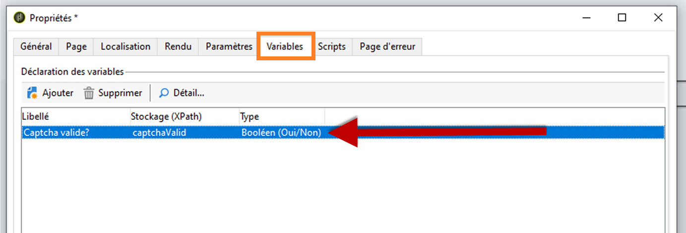
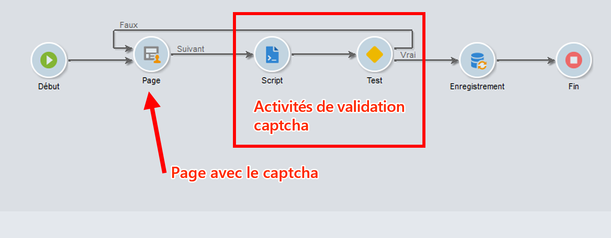
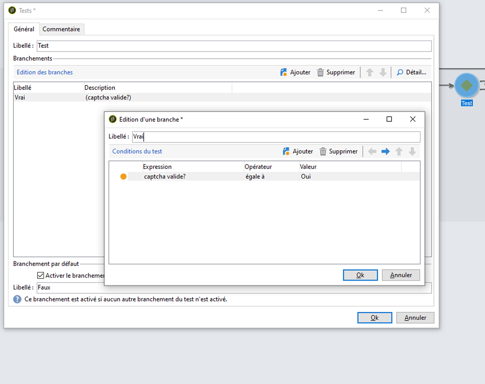
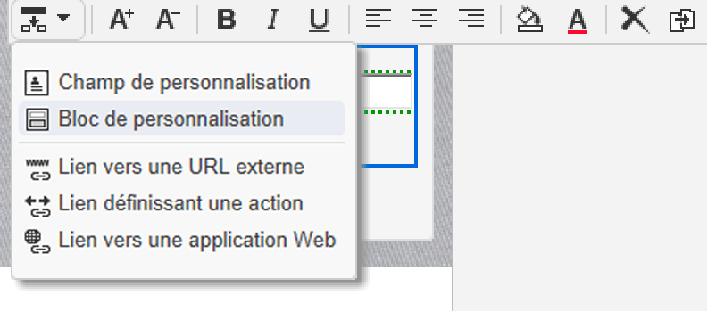
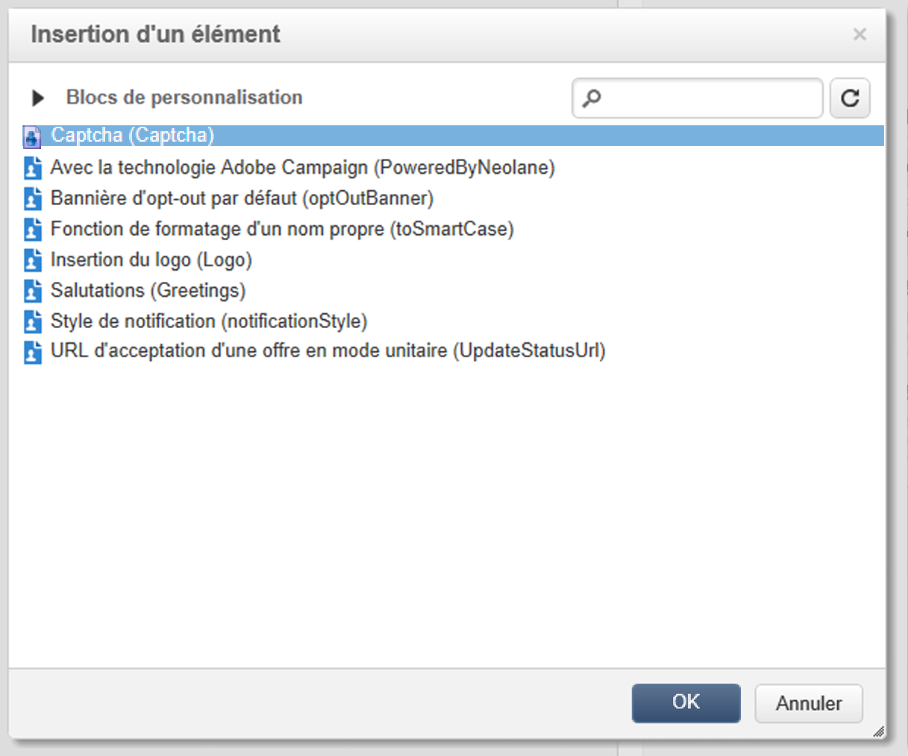
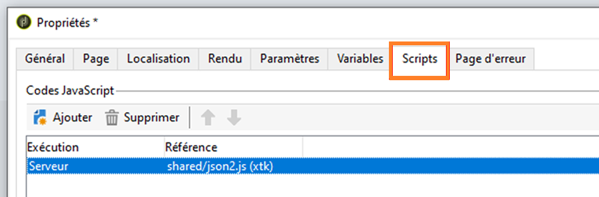

# Instructions relatives aux scripts et au codage {#scripting-coding-guidelines}


## Scripts

Pour plus d’informations, reportez-vous à la [documentation JSAPI Campaign](https://experienceleague.adobe.com/developer/campaign-api/api/index.html?lang=fr).

Si vous écrivez un script à l’aide d’un workflow, d’applications web ou de jssp, suivez ces bonnes pratiques :

* Évitez autant que possible d’utiliser des instructions SQL.

* Si besoin est, utilisez des fonctions (instruction prepare) paramétrables au lieu de la concaténation de chaîne.

  Mauvaise pratique :

  ```
  sqlGetInt( "select iRecipientId from NmsRecipient where sEmail ='" + request.getParameter('email') +  "'  limit 1" )
  ```

  Bonne pratique :

  ```
  sqlGetInt( "select iRecipientId from NmsRecipient where sEmail = $(sz) limit 1", request.getParameter('email'));
  ```

  >[!IMPORTANT]
  >
  >sqlSelect ne prend pas en charge cette fonctionnalité. Vous devez donc utiliser la fonction de requête de la classe DBEngine :

  ```
  var cnx = application.getConnection()
  var stmt = cnx.query("SELECT sFirstName, sLastName FROM NmsRecipient where sEmail = $(sz)", request.getParameter('email'))
  for each(var row in stmt) logInfo(row[0] + " : " + row[1])
  cnx.dispose()
  ```

Pour éviter les injections SQL, les fonctions SQL doivent être ajoutées à la liste autorisée à utiliser dans Adobe Campaign. Une fois qu’elles ont été ajoutées à la liste autorisée, vos opérateurs peuvent les voir dans l’éditeur d’expression. Reportez-vous à [cette page](../../configuration/using/adding-additional-sql-functions.md).

>[!IMPORTANT]
>
>Si vous utilisez un build antérieur au build 8140, l’option **XtkPassUnknownSQLFunctionsToRDBMS** peut être définie sur « 1 ». Si vous souhaitez protéger votre base de données, supprimez cette option (ou définissez-la sur « 0 »).

Si vous utilisez des saisies utilisateur pour créer des filtres dans des requêtes ou des instructions SQL, vous devez toujours les placer dans une séquence d’échappement (reportez-vous à la [documentation JSAPI Campaign](https://experienceleague.adobe.com/developer/campaign-api/api/index.html?lang=fr) - Protection des données : fonctions d’échappement). Ces fonctions sont les suivantes :

* NL.XML.escape(data)
* NL.SQL.escape(data)
* NL.JS.escape(data)
* NL.XML.escapeAttribute(data)

## Sécurisation de votre nouveau modèle de données

### Base de dossiers

Reportez-vous aux pages suivantes :

* [Propriétés d’accès aux dossiers](../../platform/using/access-management.md)
* [Dossier lié](../../configuration/using/configuration.md#linked-folder)

### Droits nommés

En plus du modèle de sécurité basé sur les dossiers, vous pouvez utiliser des droits nommés pour limiter les actions des opérateurs :

* Vous pouvez ajouter des filtres système (sysFilter) pour empêcher tout accès en lecture/écriture à vos données (reportez-vous à [cette page](../../configuration/using/filtering-schemas.md)).

  ```
  <sysFilter name="writeAccess">    
      <condition enabledIf="hasNamedRight('myNewRole')=false" expr="FALSE"/>  
  </sysFilter>
  ```

* Vous pouvez également protéger certaines actions (méthode SOAP) définies dans les schémas. Il vous suffit de définir l’attribut d’accès avec le droit nommé correspondant comme valeur.

  ```
  <method name="grantVIPAccess" access="myNewRole">
      <parameters>
  ...
      </parameters>
  </method>
  ```

  Pour plus d’informations à ce sujet, consultez [cette page](../../configuration/using/implementing-soap-methods.md).

>[!IMPORTANT]
>
>Vous pouvez utiliser des droits nommés dans le nœud command d’un navtree. Il offre une meilleure expérience client, mais ne fournit aucune protection (utilisez uniquement le côté client pour les masquer/les désactiver). Vous devez utiliser l’attribut access.

### Table d’Overflow

Si vous devez protéger des données confidentielles (partie d’un schéma) en fonction du niveau d’accès des opérateurs, ne les masquez pas dans la définition du formulaire (conditions enabledIf/visibleIf).

L’entité entière est chargée par l’écran. Vous pouvez également les afficher dans la définition de colonne. Pour ce faire, vous devez créer une table d’Overflow. Reportez-vous à [cette page](../../configuration/using/examples-of-schemas-edition.md#overflow-table).

## Ajout de captchas dans les applications web

Il est recommandé d’ajouter un captcha dans les landing pages/pages d’inscription publiques. Il est cependant relativement difficile de le faire dans les pages du DCE (Digital Content Editor). Nous allons vous expliquer dans cette section comment ajouter un captcha v5 ou un reCAPTCHA Google.

La méthode générale pour ajouter un captcha dans le DCE consiste à créer un bloc de personnalisation pour l’inclure facilement dans le contenu de la page. Vous devrez ajouter une activité **Script** et une activité **Test**.

### Bloc de personnalisation

1. Accédez à **[!UICONTROL Ressources]** > **[!UICONTROL Gestion de campagne]** > **[!UICONTROL Blocs de personnalisation]** et créez un bloc de personnalisation.

1. Utilisez le type de contenu **[!UICONTROL Application web]** et cochez l’option **[!UICONTROL Afficher dans les menus de personnalisation]**.

   Pour plus d’informations, consultez [cette page](../../delivery/using/personalization-blocks.md).

   Voici un exemple de **Captcha Campaign** :

   ```javascript
   <%
   var captchaID = CaptchaIDGen();
   %>
   &width=200&height=50&minWordSize=8&maxWordSize=8"/>
   <input id="captchaValue" name="captchaValue" <%= String(ctx.vars.captchaValid) === "false" ? class="ui-state-error" : "" %>>
   <input type="hidden" name="captchaID" value="<%=captchaID%>"/>
   <%
   if( serverForm.isInputErroneous("captchaValue") ) {
   %>
   <script type="text/javascript"> 
   $("#captchaValue").addClass("ui-state-error")
   </script>
   <%
   }
   %>
   ```

   * Les lignes 1 à 6 génèrent toutes les entrées requises.
   * La ligne 7 et les lignes suivantes jusqu’à la dernière gèrent les erreurs.
   * La ligne 4 permet de changer la taille du cadre gris du captcha (width/height) et la longueur du mot généré (minWordSize/maxWordSize).
   * Avant d’utiliser un reCAPTCHA Google, vous devez vous enregistrer sur Google et créer un site reCAPTCHA.

     `<div class="g-recaptcha" data-sitekey="YOUR_SITE_KEY"></div>`

   Vous devriez être en mesure de désactiver le bouton de validation, mais comme il n’existe pas de bouton/lien standard, il est préférable de le faire dans le code HTML. Pour savoir comment effectuer cela, consultez [cette page](https://developers.google.com/recaptcha/).

### Mise à jour de votre application web

1. Accédez aux propriétés de votre application web pour ajouter une variable booléenne nommée **captchaValid**.

   

1. Entre la dernière page et l’activité **[!UICONTROL Enregistrement]**, ajoutez une activité **[!UICONTROL Script]** et une activité **[!UICONTROL Test]**.

   Reliez la branche **[!UICONTROL Vrai]** à l’activité **[!UICONTROL Enregistrement]** et l’autre extrémité de la branche à la page qui contiendra le captcha.

   

1. Modifiez la condition de la branche Vrai avec `"[vars/captchaValid]"` est égal à Vrai.

   

1. Modifiez l’activité **[!UICONTROL Script]**. Le contenu dépendra du moteur de captcha choisi.

1. Enfin, vous pouvez ajouter votre bloc personnalisé à la page. Voir à ce propos [cette page](../../web/using/editing-content.md).

   

   

>[!IMPORTANT]
>
>Pour l’intégration de reCAPTCHA, vous devez ajouter un script JavaScript côté client dans le code HTML (dans `<head>...</head>`) :
>
>`<script src="https://www.google.com/recaptcha/api.js" async defer></script>`

### Captcha Campaign

```javascript
var captchaID = request.getParameter("captchaID");
var captchaValue = request.getParameter("captchaValue");
  
if( !CaptchaValidate(captchaID, captchaValue) ) {
  serverForm.logInputError("captchaValue",
                           "The characters you typed for the captcha must match the image ones.",
                           "captchaValue")
  ctx.vars.captchaValid = false
}
else
  ctx.vars.captchaValid = true
```

Ligne 6 : vous pouvez mettre n’importe quel type de message d’erreur.

### Google reCaptcha

Reportez-vous à la [documentation officielle](https://developers.google.com/recaptcha/docs/verify).

```javascript
ctx.vars.captchaValid = false
var gReCaptchaResponse = request.getParameter("g-recaptcha-response");
  
// Call reCaptcha API to validate it
var req = new HttpClientRequest("https://www.google.com/recaptcha/api/siteverify")
req.method = "POST"
req.header["Content-Type"] = "application/x-www-form-urlencoded"
req.body = "secret=YOUR_SECRET_HERE&response=" + encodeURIComponent(gReCaptchaResponse)
req.execute()
var response = req.response
if( response.code == 200 ) {
  captchaRes = JSON.parse(response.body.toString(response.codePage));
  ctx.vars.captchaValid = captchaRes.success
}
  
if( ctx.vars.captchaValid == false ) {
  serverForm.logInputError("reCaptcha",
                           "Please validate the captcha",
                           "reCaptcha")
  logInfo("reCaptcha not validated")
}
```

Pour utiliser JSON.parse, vous devez inclure « shared/json2.js » à votre webApp :



Depuis le build 8797, pour utiliser l’URL de l’API de vérification, vous devez l’ajouter à la liste autorisée dans le fichier serverConf en l’ajoutant dans le nœud urlPermission :

`<url dnsSuffix="www.google.com" urlRegEx="https://www.google.com/recaptcha/api/siteverify"/>`
