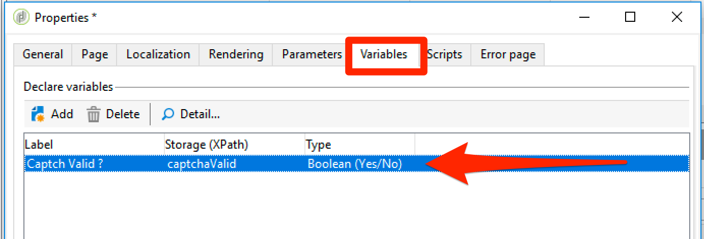
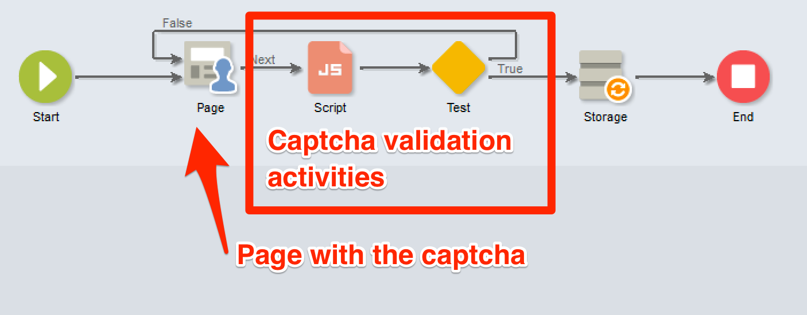
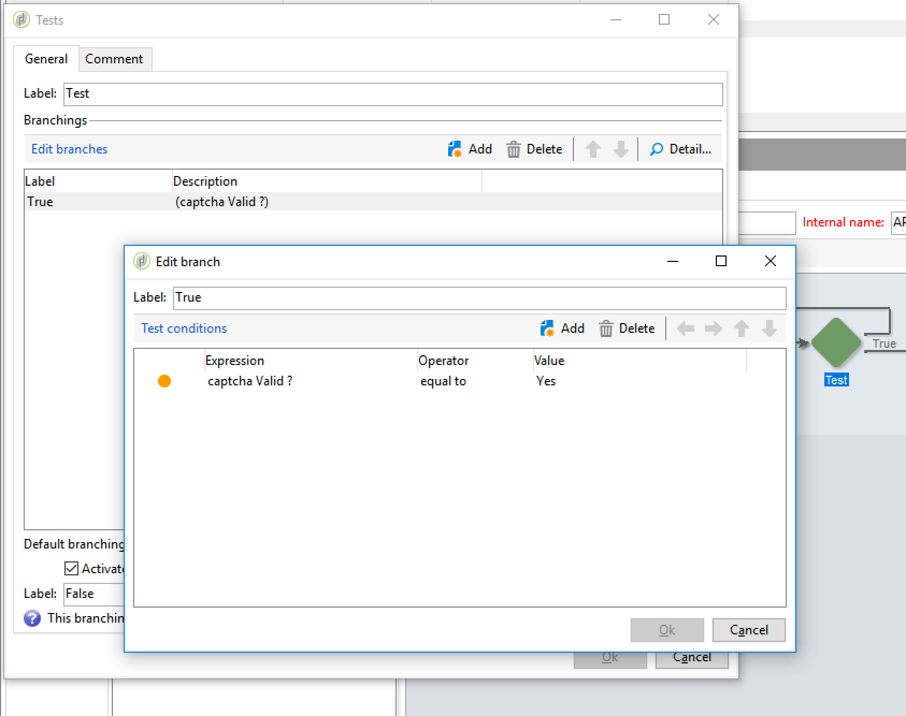
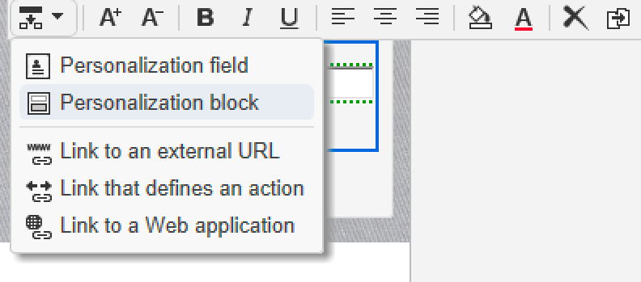
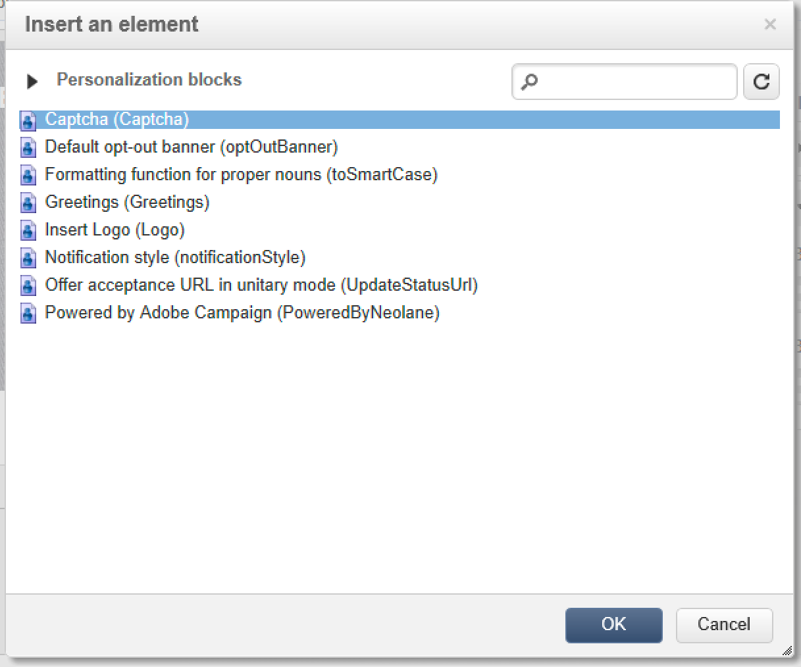
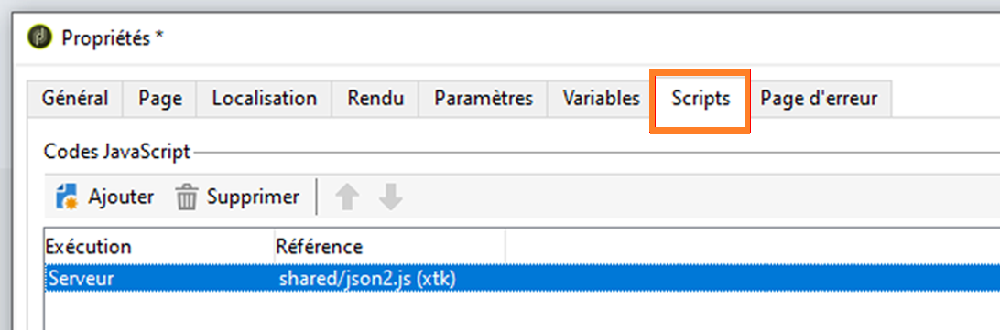

<?xml version="1.0" encoding="UTF-8"?>
<xliff xmlns="urn:oasis:names:tc:xliff:document:1.2" xmlns:okp="okapi-framework:xliff-extensions" xmlns:its="http://www.w3.org/2005/11/its" xmlns:itsxlf="http://www.w3.org/ns/its-xliff/" version="1.2" its:version="2.0">
<file original="help/installation/using/scripting-coding-guidelines.md.mdsc" source-language="en-US" target-language="en-XX" datatype="x-text/markdown">
<body>
<trans-unit id="tu6" xml:space="preserve">
<source xml:lang="en-US">https://experienceleague.adobe.com/fr/tools/campaign-api</source>
<target xml:lang="en-XX">https://experienceleague.adobe.com/fr/tools/campaign-api</target>
</trans-unit>
<trans-unit id="tu18" xml:space="preserve">
<source xml:lang="en-US">https://experienceleague.adobe.com/fr/tools/campaign-api</source>
<target xml:lang="en-XX">https://experienceleague.adobe.com/fr/tools/campaign-api</target>
</trans-unit>
<trans-unit id="tu45" xml:space="preserve">
<source xml:lang="en-US">https://experienceleague.adobe.com/docs/campaign/campaign-v8/send/personalize/personalization-blocks.html?lang=fr</source>
<target xml:lang="en-XX">https://experienceleague.adobe.com/fr/docs/campaign/campaign-v8/send/personalize/personalization-blocks.html?lang=fr</target>
</trans-unit>
<trans-unit id="tu53" xml:space="preserve">
<source xml:lang="en-US">https://developers.google.com/recaptcha/</source>
<target xml:lang="en-XX">https://developers.google.com/recaptcha/</target>
</trans-unit>
<trans-unit id="tu73" xml:space="preserve">
<source xml:lang="en-US">https://developers.google.com/recaptcha/docs/verify</source>
<target xml:lang="en-XX">https://developers.google.com/recaptcha/docs/verify</target>
</trans-unit>
<trans-unit id="tu1" restype="x-YAML_METADATA_HEADER_VALUE" xml:space="preserve">
<source xml:lang="en-US">Scripting and coding guidelines</source>
<target xml:lang="en-XX">Instructions relatives aux scripts et au codage</target>
</trans-unit>
<trans-unit id="tu2" restype="x-YAML_METADATA_HEADER_VALUE" xml:space="preserve">
<source xml:lang="en-US">Learn more about the guidelines to follow when developing in Adobe Campaign (workflows, Javascript, JSSP, etc.)</source>
<target xml:lang="en-XX">En savoir plus sur les instructions de développement dans Adobe Campaign (workflows, JavaScript, JSSP, etc.).</target>
</trans-unit>
<trans-unit id="tu3" xml:space="preserve">
<source xml:lang="en-US">Scripting and coding guidelines</source>
<target xml:lang="en-XX">Instructions relatives aux scripts et au codage</target>
</trans-unit>
<trans-unit id="tu4" xml:space="preserve">
<source xml:lang="en-US">Scripting</source>
<target xml:lang="en-XX">Scripts</target>
</trans-unit>
<trans-unit id="tu5" xml:space="preserve">
<source xml:lang="en-US">For more details, refer to <ph id="1" ctype="x-LINK">&lbrack;</ph>Campaign JSAPI documentation<ph id="2" ctype="x-LINK">[#$tu6]</ph>.</source>
<target xml:lang="en-XX">Pour plus d’informations, reportez-vous à la <ph id="1" ctype="x-LINK">&lbrack;</ph>documentation JSAPI Campaign<ph id="2" ctype="x-LINK">[#$tu6]</ph>.</target>
</trans-unit>
<trans-unit id="tu7" xml:space="preserve">
<source xml:lang="en-US">If you script using workflow, web applications, jssp, follow these best practices:</source>
<target xml:lang="en-XX">Si vous écrivez un script à l’aide d’un workflow, d’applications web ou de jssp, suivez ces bonnes pratiques :</target>
</trans-unit>
<trans-unit id="tu8" xml:space="preserve">
<source xml:lang="en-US">Try to avoid using SQL statements as much as you can.</source>
<target xml:lang="en-XX">Évitez autant que possible d’utiliser des instructions SQL.</target>
</trans-unit>
<trans-unit id="tu9" xml:space="preserve">
<source xml:lang="en-US">If you need to, use parameterized (prepare statement) functions instead of string concatenation.</source>
<target xml:lang="en-XX">Si besoin est, utilisez des fonctions (instruction prepare) paramétrables au lieu de la concaténation de chaîne.</target>
</trans-unit>
<trans-unit id="tu10" xml:space="preserve">
<source xml:lang="en-US">Bad practice:</source>
<target xml:lang="en-XX">Mauvaise pratique :</target>
</trans-unit>
<trans-unit id="tu11" xml:space="preserve">
<source xml:lang="en-US">Good practice:</source>
<target xml:lang="en-XX">Bonne pratique :</target>
</trans-unit>
<trans-unit id="tu12" xml:space="preserve">
<source xml:lang="en-US"><ph id="1" ctype="x-regxph" equiv-text="&lbrack;!IMPORTANT">[!IMPORTANT]</ph></source>
<target xml:lang="en-XX"><ph id="1" ctype="x-regxph" equiv-text="&lbrack;!IMPORTANT">[!IMPORTANT]</ph></target>
</trans-unit>
<trans-unit id="tu13" xml:space="preserve">
<source xml:lang="en-US">sqlSelect doesn't support this feature, so you have to use the query function of DBEngine class:</source>
<target xml:lang="en-XX">sqlSelect ne prend pas en charge cette fonctionnalité. Vous devez donc utiliser la fonction de requête de la classe DBEngine :</target>
</trans-unit>
<trans-unit id="tu14" xml:space="preserve">
<source xml:lang="en-US">To avoid SQL injections, SQL functions must be added to the allowlist to be used in Adobe Campaign. Once they are added to the allowlist, they become visible to your operators in the expression editor. Refer to <ph id="1" ctype="x-LINK">[</ph>this page<ph id="2" ctype="x-LINK">](../../configuration/using/adding-additional-sql-functions.md)</ph>.</source>
<target xml:lang="en-XX">Pour éviter les injections SQL, les fonctions SQL doivent être ajoutées à la liste autorisée à utiliser dans Adobe Campaign. Une fois qu’elles ont été ajoutées à la liste autorisée, vos opérateurs peuvent les voir dans l’éditeur d’expression. Reportez-vous à <ph id="1" ctype="x-LINK">[</ph>cette page<ph id="2" ctype="x-LINK">](../../configuration/using/adding-additional-sql-functions.md)</ph>.</target>
</trans-unit>
<trans-unit id="tu15" xml:space="preserve">
<source xml:lang="en-US"><ph id="1" ctype="x-regxph" equiv-text="&lbrack;!IMPORTANT">[!IMPORTANT]</ph></source>
<target xml:lang="en-XX"><ph id="1" ctype="x-regxph" equiv-text="&lbrack;!IMPORTANT">[!IMPORTANT]</ph></target>
</trans-unit>
<trans-unit id="tu16" xml:space="preserve">
<source xml:lang="en-US">If you are using a build that is older than 8140, the <ph id="1" ctype="x-STRONG_EMPHASIS">**</ph>XtkPassUnknownSQLFunctionsToRDBMS<ph id="2" ctype="x-STRONG_EMPHASIS">**</ph> option might be set to '1'. If you want to secure your database, delete this option (or set it to '0').</source>
<target xml:lang="en-XX">Si vous utilisez un build antérieur au build 8140, l’option <ph id="1" ctype="x-STRONG_EMPHASIS">**</ph>XtkPassUnknownSQLFunctionsToRDBMS<ph id="2" ctype="x-STRONG_EMPHASIS">**</ph> peut être définie sur « 1 ». Si vous souhaitez protéger votre base de données, supprimez cette option (ou définissez-la sur « 0 »).</target>
</trans-unit>
<trans-unit id="tu17" xml:space="preserve">
<source xml:lang="en-US">If you are using user input to build filters in queries or SQL statements, you always have to escape them (refer to <ph id="1" ctype="x-LINK">&lbrack;</ph>Campaign JSAPI documentation<ph id="2" ctype="x-LINK">[#$tu18]</ph> - Data protection: escaping functions). These functions are:</source>
<target xml:lang="en-XX">Si vous utilisez des saisies d’utilisateur ou d’utilisatrice pour créer des filtres dans des requêtes ou des instructions SQL, vous devez toujours les placer dans une séquence d’échappement (consultez la <ph id="1" ctype="x-LINK">&lbrack;</ph>documentation JSAPI Campaign<ph id="2" ctype="x-LINK">[#$tu18]</ph> - Protection des données : fonctions d’échappement). Ces fonctions sont les suivantes :</target>
</trans-unit>
<trans-unit id="tu19" xml:space="preserve">
<source xml:lang="en-US">NL.XML.escape(data)</source>
<target xml:lang="en-XX">NL.XML.escape(data)</target>
</trans-unit>
<trans-unit id="tu20" xml:space="preserve">
<source xml:lang="en-US">NL.SQL.escape(data)</source>
<target xml:lang="en-XX">NL.SQL.escape(data)</target>
</trans-unit>
<trans-unit id="tu21" xml:space="preserve">
<source xml:lang="en-US">NL.JS.escape(data)</source>
<target xml:lang="en-XX">NL.JS.escape(data)</target>
</trans-unit>
<trans-unit id="tu22" xml:space="preserve">
<source xml:lang="en-US">NL.XML.escapeAttribute(data)</source>
<target xml:lang="en-XX">NL.XML.escapeAttribute(data)</target>
</trans-unit>
<trans-unit id="tu23" xml:space="preserve">
<source xml:lang="en-US">Securing your new data model</source>
<target xml:lang="en-XX">Sécurisation de votre nouveau modèle de données</target>
</trans-unit>
<trans-unit id="tu24" xml:space="preserve">
<source xml:lang="en-US">Folder base</source>
<target xml:lang="en-XX">Base de dossiers</target>
</trans-unit>
<trans-unit id="tu25" xml:space="preserve">
<source xml:lang="en-US">Refer to these pages:</source>
<target xml:lang="en-XX">Reportez-vous aux pages suivantes :</target>
</trans-unit>
<trans-unit id="tu26" xml:space="preserve">
<source xml:lang="en-US">Folder access properties</source>
<target xml:lang="en-XX">Propriétés d’accès aux dossiers</target>
</trans-unit>
<trans-unit id="tu27" xml:space="preserve">
<source xml:lang="en-US">Linked folder</source>
<target xml:lang="en-XX">Dossier lié</target>
</trans-unit>
<trans-unit id="tu28" xml:space="preserve">
<source xml:lang="en-US">Named rights</source>
<target xml:lang="en-XX">Droits nommés</target>
</trans-unit>
<trans-unit id="tu29" xml:space="preserve">
<source xml:lang="en-US">In addition to the folder-based security model, you can use named rights to limit operator actions:</source>
<target xml:lang="en-XX">En plus du modèle de sécurité basé sur les dossiers, vous pouvez utiliser des droits nommés pour limiter les actions des opérateurs :</target>
</trans-unit>
<trans-unit id="tu30" xml:space="preserve">
<source xml:lang="en-US">You can add some system filters (sysFilter) to prevent reading/writing to your data (see <ph id="1" ctype="x-LINK">[</ph>this page<ph id="2" ctype="x-LINK">](../../configuration/using/filtering-schemas.md)</ph>).</source>
<target xml:lang="en-XX">Vous pouvez ajouter des filtres système (sysFilter) pour empêcher tout accès en lecture/écriture à vos données (reportez-vous à <ph id="1" ctype="x-LINK">[</ph>cette page<ph id="2" ctype="x-LINK">](../../configuration/using/filtering-schemas.md)</ph>).</target>
</trans-unit>
<trans-unit id="tu31" xml:space="preserve">
<source xml:lang="en-US">You can also protect some actions (SOAP method) defined in schemas. Just set the access attribute with the corresponding named right as the value.</source>
<target xml:lang="en-XX">Vous pouvez également protéger certaines actions (méthode SOAP) définies dans les schémas. Il vous suffit de définir l’attribut d’accès avec le droit nommé correspondant comme valeur.</target>
</trans-unit>
<trans-unit id="tu32" xml:space="preserve">
<source xml:lang="en-US">For more on this, refer to <ph id="1" ctype="x-LINK">[</ph>this page<ph id="2" ctype="x-LINK">](../../configuration/using/implementing-soap-methods.md)</ph>.</source>
<target xml:lang="en-XX">Pour plus d’informations, consultez <ph id="1" ctype="x-LINK">[</ph>cette page<ph id="2" ctype="x-LINK">](../../configuration/using/implementing-soap-methods.md)</ph>.</target>
</trans-unit>
<trans-unit id="tu33" xml:space="preserve">
<source xml:lang="en-US"><ph id="1" ctype="x-regxph" equiv-text="&lbrack;!IMPORTANT">[!IMPORTANT]</ph></source>
<target xml:lang="en-XX"><ph id="1" ctype="x-regxph" equiv-text="&lbrack;!IMPORTANT">[!IMPORTANT]</ph></target>
</trans-unit>
<trans-unit id="tu34" xml:space="preserve">
<source xml:lang="en-US">You can use named rights in the command node in a navtree. It gives a better user experience but doesn't provide any protection (use only client side to hide / disable them). You have to use the access attribute.</source>
<target xml:lang="en-XX">Vous pouvez utiliser des droits nommés dans le nœud command d’un navtree. Il offre une meilleure expérience client, mais ne fournit aucune protection (utilisez uniquement le côté client pour les masquer/les désactiver). Vous devez utiliser l’attribut access.</target>
</trans-unit>
<trans-unit id="tu35" xml:space="preserve">
<source xml:lang="en-US">Overflow table</source>
<target xml:lang="en-XX">Table d’Overflow</target>
</trans-unit>
<trans-unit id="tu36" xml:space="preserve">
<source xml:lang="en-US">If you need to protect confidential data (part of a schema) depending on the operator access level, do not hide them in the form definition (enabledIf/visibleIf conditions).</source>
<target xml:lang="en-XX">Si vous devez protéger des données confidentielles (partie d’un schéma) en fonction du niveau d’accès des opérateurs, ne les masquez pas dans la définition du formulaire (conditions enabledIf/visibleIf).</target>
</trans-unit>
<trans-unit id="tu37" xml:space="preserve">
<source xml:lang="en-US">The full entity is loaded by the screen, you can also display them in column definition. To do this, you have to create an overflow table. Refer <ph id="1" ctype="x-LINK">[</ph>this page<ph id="2" ctype="x-LINK">](../../configuration/using/examples-of-schemas-edition.md#overflow-table)</ph>.</source>
<target xml:lang="en-XX">L’entité entière est chargée par l’écran. Vous pouvez également les afficher dans la définition de colonne. Pour ce faire, vous devez créer une table d’Overflow. Reportez-vous à <ph id="1" ctype="x-LINK">[</ph>cette page<ph id="2" ctype="x-LINK">](../../configuration/using/examples-of-schemas-edition.md#overflow-table)</ph>.</target>
</trans-unit>
<trans-unit id="tu38" xml:space="preserve">
<source xml:lang="en-US">Adding captchas in web applications</source>
<target xml:lang="en-XX">Ajout de captchas dans les applications web</target>
</trans-unit>
<trans-unit id="tu39" xml:space="preserve">
<source xml:lang="en-US">It is a good practice to add a captcha in public landing pages/subscription pages. Unfortunately, adding a captcha in DCE (Digital Content Editor) pages is not easy. We will show you how to add a v5 captcha or a Google reCAPTCHA.</source>
<target xml:lang="en-XX">Il est recommandé d’ajouter un captcha dans les pages de destination/pages d’inscription publiques. Il est cependant relativement difficile de le faire dans les pages du DCE (Digital Content Editor). Nous allons vous expliquer comment ajouter un captcha v5 ou un reCAPTCHA Google.</target>
</trans-unit>
<trans-unit id="tu40" xml:space="preserve">
<source xml:lang="en-US">The general way to add a captcha in the DCE is to create a personalization block to include it easily within the page content. You will have to add a <ph id="1" ctype="x-STRONG_EMPHASIS">**</ph>Script<ph id="2" ctype="x-STRONG_EMPHASIS">**</ph> activity and a <ph id="3" ctype="x-STRONG_EMPHASIS">**</ph>Test<ph id="4" ctype="x-STRONG_EMPHASIS">**</ph>.</source>
<target xml:lang="en-XX">La méthode générale pour ajouter un captcha dans le DCE consiste à créer un bloc de personnalisation pour l’inclure facilement dans le contenu de la page. Vous devrez ajouter une activité <ph id="1" ctype="x-STRONG_EMPHASIS">**</ph>Script<ph id="2" ctype="x-STRONG_EMPHASIS">**</ph> et une activité <ph id="3" ctype="x-STRONG_EMPHASIS">**</ph>Test<ph id="4" ctype="x-STRONG_EMPHASIS">**</ph>.</target>
</trans-unit>
<trans-unit id="tu41" xml:space="preserve">
<source xml:lang="en-US">Personalization block</source>
<target xml:lang="en-XX">Bloc de personnalisation</target>
</trans-unit>
<trans-unit id="tu42" xml:space="preserve">
<source xml:lang="en-US">Go to <ph id="1" ctype="x-STRONG_EMPHASIS">**[!UICONTROL </ph>Resources<ph id="3" ctype="x-LINK_REF">]**</ph> > <ph id="5" ctype="x-STRONG_EMPHASIS">**[!UICONTROL </ph>Campaign Management<ph id="7" ctype="x-LINK_REF">]**</ph> > <ph id="9" ctype="x-STRONG_EMPHASIS">**[!UICONTROL </ph>Personalization blocks<ph id="11" ctype="x-LINK_REF">]**</ph> and create a new one.</source>
<target xml:lang="en-XX">Accédez à <ph id="1" ctype="x-STRONG_EMPHASIS">**[!UICONTROL </ph>Ressources<ph id="3" ctype="x-LINK_REF">]**</ph> > <ph id="5" ctype="x-STRONG_EMPHASIS">**[!UICONTROL </ph>Gestion de campagne<ph id="7" ctype="x-LINK_REF">]**</ph> > <ph id="9" ctype="x-STRONG_EMPHASIS">**[!UICONTROL </ph>Blocs de personnalisation<ph id="11" ctype="x-LINK_REF">]**</ph> et créez un bloc de personnalisation.</target>
</trans-unit>
<trans-unit id="tu43" xml:space="preserve">
<source xml:lang="en-US">Use the <ph id="1" ctype="x-STRONG_EMPHASIS">**[!UICONTROL </ph>Web application<ph id="3" ctype="x-LINK_REF">]**</ph> content type and check <ph id="5" ctype="x-STRONG_EMPHASIS">**[!UICONTROL </ph>Visible in the customization menus<ph id="7" ctype="x-LINK_REF">]**</ph>.</source>
<target xml:lang="en-XX">Utilisez le type de contenu <ph id="1" ctype="x-STRONG_EMPHASIS">**[!UICONTROL </ph>Application web<ph id="3" ctype="x-LINK_REF">]**</ph> et cochez l’option <ph id="5" ctype="x-STRONG_EMPHASIS">**[!UICONTROL </ph>Afficher dans les menus de personnalisation<ph id="7" ctype="x-LINK_REF">]**</ph>.</target>
</trans-unit>
<trans-unit id="tu44" xml:space="preserve">
<source xml:lang="en-US">For more information, refer to the <ph id="1" ctype="x-LINK">&lbrack;</ph>Campaign v8 documentation<ph id="2" ctype="x-LINK">[#$tu45]{target="_blank"}</ph>.</source>
<target xml:lang="en-XX">Pour plus d’informations, consultez la <ph id="1" ctype="x-LINK">&lbrack;</ph>documentation de Campaign v8<ph id="2" ctype="x-LINK">[#$tu45]{target="_blank"}</ph>.</target>
</trans-unit>
<trans-unit id="tu46" xml:space="preserve">
<source xml:lang="en-US">Here is an example of a <ph id="1" ctype="x-STRONG_EMPHASIS">**</ph>Campaign captcha<ph id="2" ctype="x-STRONG_EMPHASIS">**</ph>:</source>
<target xml:lang="en-XX">Voici un exemple de <ph id="1" ctype="x-STRONG_EMPHASIS">**</ph>Captcha Campaign<ph id="2" ctype="x-STRONG_EMPHASIS">**</ph> :</target>
</trans-unit>
<trans-unit id="tu47" xml:space="preserve">
<source xml:lang="en-US">Lines 1 to 6 generate all needed inputs.</source>
<target xml:lang="en-XX">Les lignes 1 à 6 génèrent toutes les entrées requises.</target>
</trans-unit>
<trans-unit id="tu48" xml:space="preserve">
<source xml:lang="en-US">Lines 7 to the end handle errors.</source>
<target xml:lang="en-XX">La ligne 7 et les lignes suivantes jusqu’à la dernière gèrent les erreurs.</target>
</trans-unit>
<trans-unit id="tu49" xml:space="preserve">
<source xml:lang="en-US">Line 4 allows you to change captcha gray box size (width/height) and the length of generated word (minWordSize/maxWordSize).</source>
<target xml:lang="en-XX">La ligne 4 permet de changer la taille du cadre gris du captcha (width/height) et la longueur du mot généré (minWordSize/maxWordSize).</target>
</trans-unit>
<trans-unit id="tu50" xml:space="preserve">
<source xml:lang="en-US">Before using Google reCAPTCHA, you must register on Google and create a new reCAPTCHA site.</source>
<target xml:lang="en-XX">Avant d’utiliser un reCAPTCHA Google, vous devez vous enregistrer sur Google et créer un site reCAPTCHA.</target>
</trans-unit>
<trans-unit id="tu51" xml:space="preserve">
<source xml:lang="en-US"><ph id="1" ctype="x-CODE">`&lt;div class="g-recaptcha" data-sitekey="YOUR_SITE_KEY">&lt;/div>`</ph></source>
<target xml:lang="en-XX"><ph id="1" ctype="x-CODE">`&lt;div class="g-recaptcha" data-sitekey="YOUR_SITE_KEY">&lt;/div>`</ph></target>
</trans-unit>
<trans-unit id="tu52" xml:space="preserve">
<source xml:lang="en-US">You should be able to disable the validation button, but as we don't have any standard button/link, it's better to do it in the HTML itself. To learn how to do it, refer to <ph id="1" ctype="x-LINK">&lbrack;</ph>this page<ph id="2" ctype="x-LINK">[#$tu53]</ph>.</source>
<target xml:lang="en-XX">Vous devriez être en mesure de désactiver le bouton de validation, mais comme il n’existe pas de bouton/lien standard, il est préférable de le faire dans le code HTML. Pour savoir comment effectuer cela, consultez <ph id="1" ctype="x-LINK">&lbrack;</ph>cette page<ph id="2" ctype="x-LINK">[#$tu53]</ph>.</target>
</trans-unit>
<trans-unit id="tu54" xml:space="preserve">
<source xml:lang="en-US">Updating your web application</source>
<target xml:lang="en-XX">Mise à jour de votre application web</target>
</trans-unit>
<trans-unit id="tu55" xml:space="preserve">
<source xml:lang="en-US">Access the properties of your web application to add a boolean variable named <ph id="1" ctype="x-STRONG_EMPHASIS">**</ph>captchaValid<ph id="2" ctype="x-STRONG_EMPHASIS">**</ph>.</source>
<target xml:lang="en-XX">Accédez aux propriétés de votre application web pour ajouter une variable booléenne nommée <ph id="1" ctype="x-STRONG_EMPHASIS">**</ph>captchaValid<ph id="2" ctype="x-STRONG_EMPHASIS">**</ph>.</target>
</trans-unit>
<trans-unit id="tu56" xml:space="preserve">
<source xml:lang="en-US"><ph id="1" ctype="x-IMAGE"></ph></source>
<target xml:lang="en-XX"><ph id="1" ctype="x-IMAGE"></ph></target>
</trans-unit>
<trans-unit id="tu57" xml:space="preserve">
<source xml:lang="en-US">Between the last page and the <ph id="1" ctype="x-STRONG_EMPHASIS">**[!UICONTROL </ph>Storage<ph id="3" ctype="x-LINK_REF">]**</ph> activity, add a <ph id="5" ctype="x-STRONG_EMPHASIS">**[!UICONTROL </ph>Script<ph id="7" ctype="x-LINK_REF">]**</ph> and a <ph id="9" ctype="x-STRONG_EMPHASIS">**[!UICONTROL </ph>Test<ph id="11" ctype="x-LINK_REF">]**</ph>.</source>
<target xml:lang="en-XX">Entre la dernière page et l’activité <ph id="1" ctype="x-STRONG_EMPHASIS">**[!UICONTROL </ph>Enregistrement<ph id="3" ctype="x-LINK_REF">]**</ph>, ajoutez une activité <ph id="5" ctype="x-STRONG_EMPHASIS">**[!UICONTROL </ph>Script<ph id="7" ctype="x-LINK_REF">]**</ph> et une activité <ph id="9" ctype="x-STRONG_EMPHASIS">**[!UICONTROL </ph>Test<ph id="11" ctype="x-LINK_REF">]**</ph>.</target>
</trans-unit>
<trans-unit id="tu58" xml:space="preserve">
<source xml:lang="en-US">Plug the branch <ph id="1" ctype="x-STRONG_EMPHASIS">**[!UICONTROL </ph>True<ph id="3" ctype="x-LINK_REF">]**</ph> to the <ph id="5" ctype="x-STRONG_EMPHASIS">**[!UICONTROL </ph>Storage<ph id="7" ctype="x-LINK_REF">]**</ph> and the other one to the page which will have the captcha.</source>
<target xml:lang="en-XX">Reliez la branche <ph id="1" ctype="x-STRONG_EMPHASIS">**[!UICONTROL </ph>Vrai<ph id="3" ctype="x-LINK_REF">]**</ph> à l’activité <ph id="5" ctype="x-STRONG_EMPHASIS">**[!UICONTROL </ph>Enregistrement<ph id="7" ctype="x-LINK_REF">]**</ph> et l’autre extrémité de la branche à la page qui contiendra le captcha.</target>
</trans-unit>
<trans-unit id="tu59" xml:space="preserve">
<source xml:lang="en-US"><ph id="1" ctype="x-IMAGE"></ph></source>
<target xml:lang="en-XX"><ph id="1" ctype="x-IMAGE"></ph></target>
</trans-unit>
<trans-unit id="tu60" xml:space="preserve">
<source xml:lang="en-US">Edit the condition of the branch True with <ph id="1" ctype="x-CODE">`"[vars/captchaValid]"`</ph> equals True.</source>
<target xml:lang="en-XX">Modifiez la condition de la branche Vrai avec <ph id="1" ctype="x-CODE">`"[vars/captchaValid]"`</ph> est égal à Vrai.</target>
</trans-unit>
<trans-unit id="tu61" xml:space="preserve">
<source xml:lang="en-US"><ph id="1" ctype="x-IMAGE"></ph></source>
<target xml:lang="en-XX"><ph id="1" ctype="x-IMAGE"></ph></target>
</trans-unit>
<trans-unit id="tu62" xml:space="preserve">
<source xml:lang="en-US">Edit the <ph id="1" ctype="x-STRONG_EMPHASIS">**[!UICONTROL </ph>Script<ph id="3" ctype="x-LINK_REF">]**</ph> activity. The content will depend on the chosen captcha engine.</source>
<target xml:lang="en-XX">Modifiez l’activité <ph id="1" ctype="x-STRONG_EMPHASIS">**[!UICONTROL </ph>Script<ph id="3" ctype="x-LINK_REF">]**</ph>. Le contenu dépendra du moteur de captcha choisi.</target>
</trans-unit>
<trans-unit id="tu63" xml:space="preserve">
<source xml:lang="en-US">Finally, you can add your personalized block in the page: refer to <ph id="1" ctype="x-LINK">[</ph>this page<ph id="2" ctype="x-LINK">](../../web/using/editing-content.md)</ph>.</source>
<target xml:lang="en-XX">Enfin, vous pouvez ajouter votre bloc personnalisé à la page. Voir à ce propos <ph id="1" ctype="x-LINK">[</ph>cette page<ph id="2" ctype="x-LINK">](../../web/using/editing-content.md)</ph>.</target>
</trans-unit>
<trans-unit id="tu64" xml:space="preserve">
<source xml:lang="en-US"><ph id="1" ctype="x-IMAGE"></ph></source>
<target xml:lang="en-XX"><ph id="1" ctype="x-IMAGE"></ph></target>
</trans-unit>
<trans-unit id="tu65" xml:space="preserve">
<source xml:lang="en-US"><ph id="1" ctype="x-IMAGE"></ph></source>
<target xml:lang="en-XX"><ph id="1" ctype="x-IMAGE"></ph></target>
</trans-unit>
<trans-unit id="tu66" xml:space="preserve">
<source xml:lang="en-US"><ph id="1" ctype="x-regxph" equiv-text="&lbrack;!IMPORTANT">[!IMPORTANT]</ph></source>
<target xml:lang="en-XX"><ph id="1" ctype="x-regxph" equiv-text="&lbrack;!IMPORTANT">[!IMPORTANT]</ph></target>
</trans-unit>
<trans-unit id="tu67" xml:space="preserve">
<source xml:lang="en-US">For reCAPTCHA integration, you have to add client-side JavaScript in the HTML (in <ph id="1" ctype="x-CODE">`&lt;head>...&lt;/head>`</ph>):</source>
<target xml:lang="en-XX">Pour l’intégration de reCAPTCHA, vous devez ajouter un script JavaScript côté client dans le code HTML (dans <ph id="1" ctype="x-CODE">`&lt;head>...&lt;/head>`</ph>) :</target>
</trans-unit>
<trans-unit id="tu68" xml:space="preserve">
<source xml:lang="en-US"><ph id="1" ctype="x-CODE">`&lt;script src="https://www.google.com/recaptcha/api.js" async defer>&lt;/script>`</ph></source>
<target xml:lang="en-XX"><ph id="1" ctype="x-CODE">`&lt;script src="https://www.google.com/recaptcha/api.js" async defer>&lt;/script>`</ph></target>
</trans-unit>
<trans-unit id="tu69" xml:space="preserve">
<source xml:lang="en-US">Campaign captcha</source>
<target xml:lang="en-XX">Captcha Campaign</target>
</trans-unit>
<trans-unit id="tu70" xml:space="preserve">
<source xml:lang="en-US">Line 6: you can put any kind of error message.</source>
<target xml:lang="en-XX">Ligne 6 : vous pouvez mettre n’importe quel type de message d’erreur.</target>
</trans-unit>
<trans-unit id="tu71" xml:space="preserve">
<source xml:lang="en-US">Google recaptcha</source>
<target xml:lang="en-XX">Google reCaptcha</target>
</trans-unit>
<trans-unit id="tu72" xml:space="preserve">
<source xml:lang="en-US">Please refer to the <ph id="1" ctype="x-LINK">&lbrack;</ph>official documentation<ph id="2" ctype="x-LINK">[#$tu73]</ph>.</source>
<target xml:lang="en-XX">Reportez-vous à la <ph id="1" ctype="x-LINK">&lbrack;</ph>documentation officielle<ph id="2" ctype="x-LINK">[#$tu73]</ph>.</target>
</trans-unit>
<trans-unit id="tu74" xml:space="preserve">
<source xml:lang="en-US">To use JSON.parse you have to include "shared/json2.js" in your webApp:</source>
<target xml:lang="en-XX">Pour utiliser JSON.parse, vous devez inclure « shared/json2.js » à votre webApp :</target>
</trans-unit>
<trans-unit id="tu75" xml:space="preserve">
<source xml:lang="en-US"><ph id="1" ctype="x-IMAGE"></ph></source>
<target xml:lang="en-XX"><ph id="1" ctype="x-IMAGE"></ph></target>
</trans-unit>
<trans-unit id="tu76" xml:space="preserve">
<source xml:lang="en-US">Since build 8797, in order to use the verification API URL, you have to add it to the allowlist in the serverConf file by adding in urlPermission node:</source>
<target xml:lang="en-XX">Depuis le build 8797, pour utiliser l’URL de l’API de vérification, vous devez l’ajouter à la liste autorisée dans le fichier serverConf en l’ajoutant dans le nœud urlPermission :</target>
</trans-unit>
<trans-unit id="tu77" xml:space="preserve">
<source xml:lang="en-US"><ph id="1" ctype="x-CODE">`&lt;url dnsSuffix="www.google.com" urlRegEx="https://www.google.com/recaptcha/api/siteverify"/>`</ph></source>
<target xml:lang="en-XX"><ph id="1" ctype="x-CODE">`&lt;url dnsSuffix="www.google.com" urlRegEx="https://www.google.com/recaptcha/api/siteverify"/>`</ph></target>
</trans-unit>
</body>
</file>
</xliff>