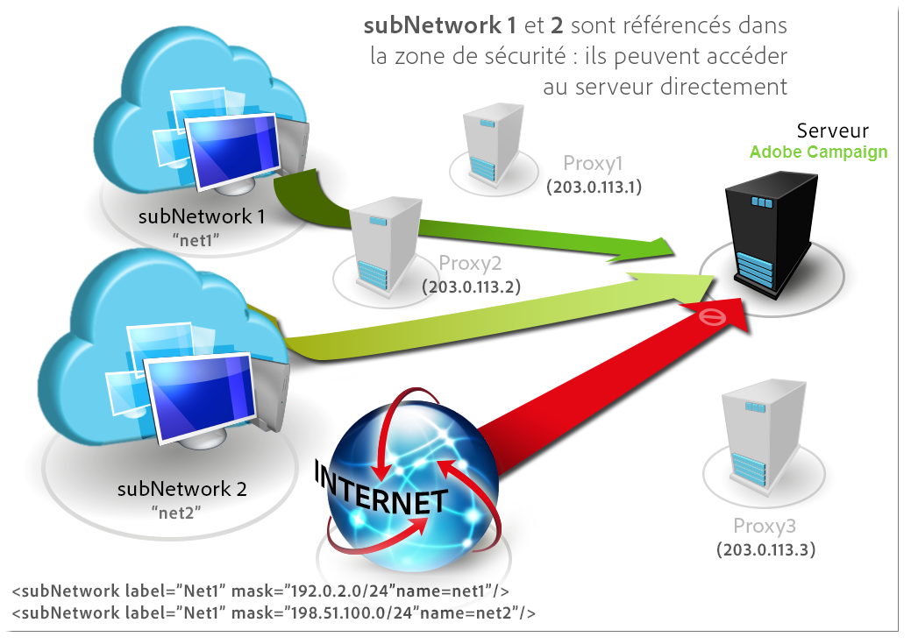
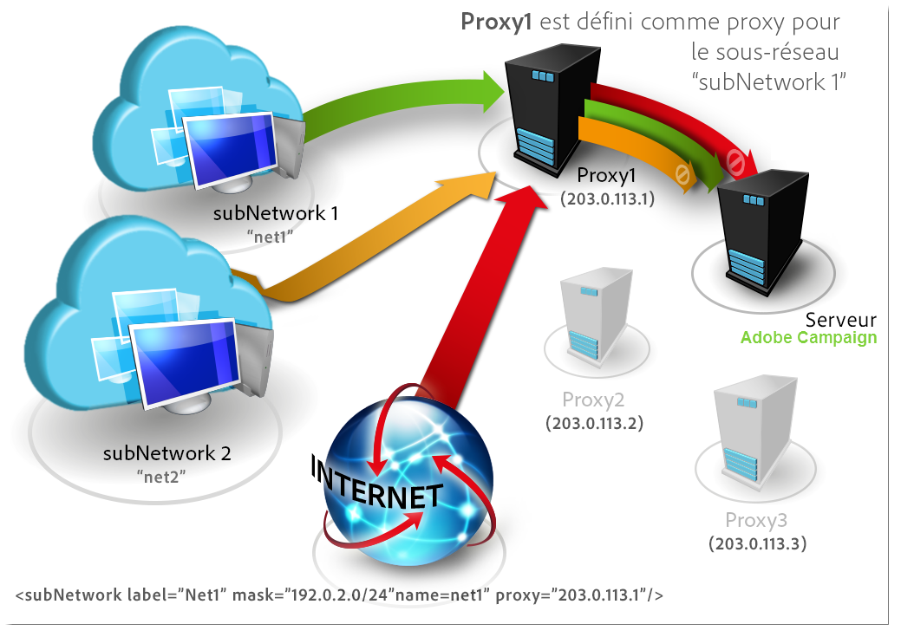
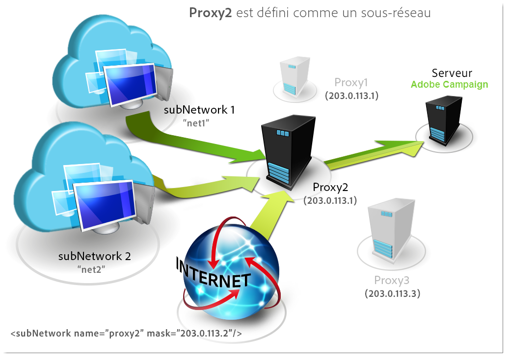
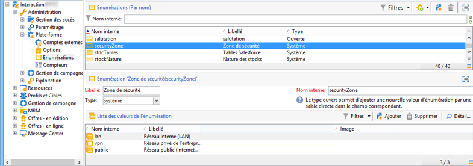
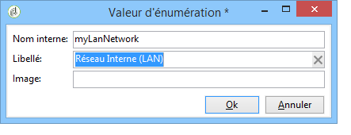
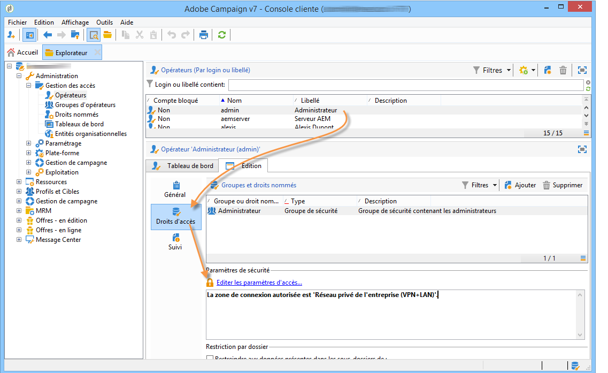
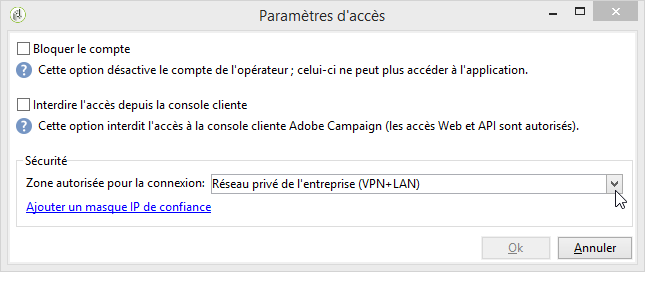

# Définir des zones de sécurité (On-Premise){#defining-security-zones}


Chaque opérateur doit être associé à une zone pour se connecter à une instance et l’adresse IP de l’opérateur doit faire partie des adresses ou des plages d’adresses définies dans la zone de sécurité. La configuration des zones de sécurité est effectuée dans le fichier de configuration du serveur Adobe Campaign.

Un opérateur est lié à une zone de sécurité à partir de son profil dans la console, accessible dans le nœud **[!UICONTROL Administration > Gestion des accès > Opérateurs]**. [En savoir plus](#linking-a-security-zone-to-an-operator).

>[!NOTE]
>
>Cette procédure est limitée aux déploiements **On-Premise**.
>
>En tant que client **hébergé**, si vous pouvez accéder au [Panneau de contrôle Campaign](https://experienceleague.adobe.com/docs/control-panel/using/control-panel-home.html?lang=fr), vous pouvez utiliser l’interface en libre-service de la zone de sécurité. [En savoir plus](https://experienceleague.adobe.com/docs/control-panel/using/instances-settings/ip-allow-listing-instance-access.html?lang=fr)
>
>Les autres clients **hybrides/hébergés** doivent contacter l’équipe d’assistance d’Adobe pour ajouter une adresse IP à la liste autorisée.
>

## Création de zones de sécurité {#creating-security-zones}

Une zone est définie par :

* une ou plusieurs plages d&#39;adresses IP (IPv4 et IPv6)
* un nom technique associé à chaque plage d’adresses IP

Les zones de sécurité sont imbriquées. Chaque définition d’une nouvelle zone à l’intérieur d’une autre réduit donc le nombre d’opérateurs pouvant s’y connecter tout en augmentant les droits attribués à chaque opérateur.

Les zones peuvent être définies lors de la configuration du serveur dans le fichier **serverConf.xml**. Tous les paramètres disponibles dans **serverConf.xml** sont répertoriés dans [cette section](../../installation/using/the-server-configuration-file.md).

Chaque zone définit des droits, comme par exemple :

* Connexion en HTTP plutôt qu&#39;HTTPS
* Affichage des erreurs (pile d&#39;erreurs Java, JavaScript, C++...)
* Prévisualisation des rapports et des webApps
* Authentification par login / password
* Connexion en mode non-sécurisé

>[!NOTE]
>
>**Chaque opérateur doit être associé à une zone.** Si l&#39;adresse IP de l&#39;opérateur appartient à la plage définie par la zone, l&#39;opérateur peut donc se connecter à l&#39;instance.\
>Il se peut que l&#39;adresse IP de l&#39;opérateur soit définie dans plusieurs zones. Dans ce cas, l&#39;opérateur reçoit **l&#39;union** des droits disponibles pour chacune des zones.

Le fichier **serverConf.xml** livré d&#39;usine contient trois zones : **public, vpn et lan**.

>[!NOTE]
>
>**La configuration livrée d&#39;usine est sécurisée.** Cependant, avant une migration depuis une version antérieure d&#39;Adobe Campaign, il peut être nécessaire de réduire temporairement la sécurité afin de migrer et de valider les nouvelles règles.

Exemple d&#39;une définition de zone dans le fichier **serverConf.xml** :

```
<securityZone allowDebug="false" allowHTTP="false" label="Public Network" name="public">
<subNetwork label="All addresses" mask="*" name="all"/>

<securityZone allowDebug="true" allowHTTP="false" label="Private Network (VPN)"
              name="vpn" showErrors="true">

  <securityZone allowDebug="true" allowEmptyPassword="true" allowHTTP="true"
                allowUserPassword="false" label="Private Network (LAN)" name="lan"
                sessionTokenOnly="true" showErrors="true">
    <subNetwork label="Lan 1" mask="192.168.0.0/16" name="lan1"/>
    <subNetwork label="Lan 2" mask="172.16.0.0/12" name="lan2"/>
    <subNetwork label="Lan 3" mask="10.0.0.0/8" name="lan3"/>
    <subNetwork label="Localhost" mask="127.0.0.1/16" name="locahost"/>
    <subNetwork label="Lan (IPv6)" mask="fc00::/7" name="lan6"/>
    <subNetwork label="Localhost (IPv6)" mask="::1/128" name="localhost6"/>
  </securityZone>

</securityZone>
</securityZone>
```

L&#39;ensemble des droits définissant une zone sont les suivants :

* **allowDebug** : permet à une webApp d&#39;être exécutée en mode &quot;debug&quot;
* **allowEmptyPassword** : autorise une connexion à une instance sans mot de passe
* **allowHTTP** : une session peut être créée sans utiliser le protocole HTTPS
* **allowUserPassword** : le jeton de session peut être de la forme « `<login>/<password>` »
* **sessionTokenOnly** : le jeton de sécurité n&#39;est pas nécessaire dans l&#39;URL de connexion
* **showErrors** : les erreurs côté serveur sont remontées et affichées

>[!IMPORTANT]
>
>Dans la définition d&#39;une zone, chaque attribut recevant la valeur **true** réduit la sécurité.

Dans le cas de Message Center, quand il y a plusieurs instances d&#39;exécution, vous devez créer une zone de sécurité supplémentaire avec l&#39;attribut **sessionTokenOnly** défini sur **true**, dans laquelle seules les adresses IP nécessaires doivent être ajoutées. Le paramétrage des instances est présenté dans [ce document](../../message-center/using/configuring-instances.md).

## Bonnes pratiques pour les zones de sécurité {#best-practices-for-security-zones}

Dans la définition de la zone de sécurité **lan**, il est possible de rajouter un masque d&#39;adresse IP définissant un accès technique. Cet ajout permettra d&#39;accéder à toutes les instances hébergées sur le serveur.

```
<securityZone allowDebug="true" allowEmptyPassword="false" allowHTTP="true"
                    allowUserPassword="false" label="Private Network (LAN)" name="lan"
                    sessionTokenOnly="true" showErrors="true">
        <subNetwork label="Lan 1" mask="192.168.0.0/16" name="lan1"/>
        <subNetwork label="Lan 2" mask="172.16.0.0/12" name="lan2"/>
        <subNetwork label="Lan 3" mask="10.0.0.0/8" name="lan3"/>
        <subNetwork label="Localhost" mask="127.0.0.1/16" name="locahost"/>
        <subNetwork label="Lan (IPv6)" mask="fc00::/7" name="lan6"/>
        <subNetwork label="Localhost (IPv6)" mask="::1/128" name="localhost6"/>
  
        <!-- Customer internal IPs -->
        <subNetwork id="internalNetwork" mask="a.b.c.d/xx"/>

      </securityZone>
```

Il est recommandé de définir des plages d&#39;adresses IP directement dans le fichier de configuration dédié à l&#39;instance pour les opérateurs accédant uniquement à une instance particulière.

Dans le fichier **`config-<instance>.xml`** :

```
  <securityZone name="public">
   ...
    <securityZone name="vpn">
      <subNetwork id="cus1" mask="a.b.c.d/xx"/>
```

## Sous-réseaux et proxys dans une zone de sécurité {#sub-networks-and-proxies-in-a-security-zone}

Le paramètre **proxy** peut être utilisé dans un élément **subNetwork** afin de définir l&#39;utilisation d&#39;un proxy dans une zone de sécurité.

Lorsqu&#39;un proxy est référencé et qu&#39;une connexion entre via ce proxy (visible via l&#39;en-tête HTTP X-Forwarded-For), la zone vérifiée est celle des clients du proxy et non celle du proxy.

>[!IMPORTANT]
>
>Si un proxy est configuré et qu&#39;il est possible de passer outre ce dernier (ou s&#39;il n&#39;existe pas), l&#39;adresse IP qui sera testée pourra être falsifiée.
>
>De plus, les relais sont désormais gérés comme des proxys. Vous devez donc ajouter l&#39;adresse IP 127.0.0.1 à la liste des proxys dans votre paramétrage des zones de sécurité.
>
>Par exemple: &quot; `<subnetwork label="Lan 1" mask="192.168.0.0/16" name="lan1" proxy="127.0.0.1,10.100.2.135" />`&quot;.

Plusieurs cas peuvent exister :

* Un sous-réseau est directement référencé dans la zone de sécurité et aucun proxy n&#39;est configuré : les utilisateurs du sous-réseau peuvent se connecter directement au serveur Adobe Campaign.

  

* Un proxy est défini pour un sous-réseau dans la zone de sécurité : les utilisateurs provenant de ce sous-réseau peuvent accéder au serveur Adobe Campaign en passant par ce proxy.

  

* Un proxy est inclus dans un sous-réseau de la zone de sécurité : les utilisateurs passant par ce proxy, indépendamment de leur provenance, peuvent accéder au serveur Adobe Campaign.

  

Les adresses IP des serveurs proxy susceptibles d’accéder au serveur Adobe Campaign doivent être saisies dans le sous-réseau **`<subnetwork>`** concerné et le sous-réseau de premier niveau **`<subnetwork name="all"/>`**. Par exemple, ici pour un proxy dont l’adresse IP est 10.131.146.102 :

```
<securityZone allowDebug="false" allowHTTP="false" label="Public Network" 
                      name="public">
    <subNetwork label="All addresses" mask="*" name="all"
                      proxy="10.131.146.102,127.0.0.1, ::1"/>

    <securityZone allowDebug="true" allowHTTP="false" label="Private Network (VPN)" 
                      name="vpn" showErrors="true">
        <securityZone allowDebug="true" allowEmptyPassword="false" allowHTTP="true" 
                      allowUserPassword="false" label="Private Network (LAN)" 
                      name="lan" sessionTokenOnly="true" showErrors="true">
            <subNetwork label="Lan proxy" mask="10.131.193.182" name="lan3" 
                      proxy="10.131.146.102,127.0.0.1, ::1"/>
            <subNetwork label="Lan 1" mask="192.168.0.0/16" name="lan1" 
                      proxy="127.0.0.1, ::1"/>

        </securityZone>
    </securityZone>
</securityZone>
```

## Liaison d’une zone de sécurité à un opérateur {#linking-a-security-zone-to-an-operator}

Une fois les zones définies, chaque opérateur doit être associé à l&#39;une d&#39;entre elles pour pouvoir se connecter à une instance et l&#39;adresse IP de l&#39;opérateur doit faire partie des adresses ou des plages d&#39;adresses référencées dans la zone.

La configuration technique des zones est effectuée dans le fichier de configuration du serveur Campaign : **serverConf.xml**.

Au préalable, vous devez configurer l&#39;énumération d&#39;usine **[!UICONTROL Zone de sécurité]** pour associer un libellé au nom interne de la zone défini dans le fichier **serverConf.xml**.

Ce paramétrage est effectué dans l&#39;explorateur Campaign :

1. Cliquez sur le nœud **[!UICONTROL Administration > Plateforme > Enumérations]**.
1. Sélectionnez l&#39;énumération système **[!UICONTROL Zone de sécurité (securityZone)]**.

   

1. Pour chaque zone de sécurité définie dans le fichier de configuration du serveur, cliquez sur le bouton **[!UICONTROL Ajouter]**.
1. Dans le champ **[!UICONTROL Nom interne]**, saisissez le nom de la zone définie dans le fichier **serverConf.xml**. Il correspond à l’attribut **@name** de l’élément `<securityzone>`. Dans le champ **Libellé**, rentrez le libellé associé au nom interne.

   

1. Cliquez sur OK et enregistrez les modifications.

Une fois les zones définies et l&#39;énumération **[!UICONTROL Zone de sécurité]** configurée, vous devez associer chaque opérateur à une zone :

1. Cliquez sur le nœud **[!UICONTROL Administration > Gestion des accès > Opérateurs]**.
1. Sélectionnez l&#39;opérateur auquel vous voulez associer une zone de sécurité et cliquez sur l&#39;onglet **[!UICONTROL Edition]**.
1. Dans l&#39;onglet **[!UICONTROL Droits d&#39;accès]**, cliquez sur le lien **[!UICONTROL Editer les paramètres d&#39;accès...]**.

   

1. Sélectionnez une zone dans la liste déroulante **[!UICONTROL Zone autorisée pour la connexion]**

   

1. Cliquez sur **[!UICONTROL OK]** et enregistrez les modifications pour appliquer ces modifications.


## Recommandations

* Assurez-vous que le proxy inverse n’est pas autorisé dans subNetwork. Si c’est le cas, l’**ensemble** du trafic est détecté comme provenant de cette adresse IP locale et est donc considéré comme digne de confiance.

* Limitez l’utilisation de sessionTokenOnly=&quot;true&quot; :

   * Avertissement : si cet attribut est défini sur true, l’opérateur peut être exposé à une **attaque CRSF**.
   * De plus, le cookie sessionToken n’étant pas défini avec un flag httpOnly, certains codes JavaScript côté client peuvent le lire.
   * L’utilisation de Message Center avec plusieurs instances d’exécution requiert toutefois l’activation de l’option sessionTokenOnly : créez une nouvelle zone de sécurité avec l’option sessionTokenOnly définie sur « true » et ajoutez **uniquement les adresses IP nécessaires** à cette zone.

* Si possible, définissez les attributs allowHTTP et showErrors sur la valeur false (pas pour localhost) et vérifiez-les.

   * allowHTTP = &quot;false&quot; : force les opérateurs à utiliser le protocole HTTPS.
   * showErrors = &quot;false&quot; : masque les erreurs techniques (y compris celles de SQL). Cet attribut empêche l’affichage d’un trop grand nombre d’informations, mais il limite la possibilité des spécialistes marketing de corriger les erreurs (sans demander d’informations supplémentaires à un administrateur).

* Définissez allowDebug sur true uniquement sur les adresses IP utilisées par les utilisateurs marketing/administrateurs qui doivent créer (ou plutôt prévisualiser) des questionnaires, webApps et rapports. Ce flag permet d’afficher les règles de relais et de les déboguer pour ces adresses IP.

   * Lorsque allowDebug est défini sur false, la sortie est la suivante :

     ```
     <redir status='OK' date='...' sourceIP='...'/>
     ```

   * Lorsque allowDebug est défini sur true, la sortie est la suivante :

     ```
     <redir status='OK' date='...' build='...' OR version='...' sha1='...' instance='...' sourceIP='...' host='...' localHost='...'/>
     ```

* Ne définissez jamais les attributs allowEmptyPassword, allowUserPassword et allowSQLInjection sur true. Ils ne servent qu’à faciliter la migration de la v5 vers la v6.0 :

   * L’attribut **allowEmptyPassword** permet aux opérateurs de disposer d’un mot de passe vide. Si c’est votre cas, demandez à tous les opérateurs de définir un mot de passe avec un délai. Une fois ce délai passé, définissez cet attribut sur la valeur false.

   * L’attribut **allowUserPassword** permet aux opérateurs d’envoyer leurs identifiants en tant que paramètres (afin qu’ils puissent être connectés par Apache/IIS/un proxy). Cette fonctionnalité était auparavant utilisée pour simplifier l’utilisation de l’API. Vous pouvez vérifier dans votre « livre de recettes » (ou dans les spécifications) si des applications tierces utilisent cet attribut. Si c’est le cas, vous devez demander à ces tiers de changer la façon dont ils utilisent notre API et supprimer cette fonctionnalité dès que possible.

   * L’attribut **allowSQLInjection** permet à l’utilisateur d’effectuer des injections SQL en utilisant une ancienne syntaxe. Cet attribut doit être défini sur false. Vous pouvez utiliser /nl/jsp/ping.jsp?zones=true pour vérifier la configuration de votre zone de sécurité. Cette page affiche le statut actif des mesures de sécurité (calculé avec ces flags de sécurité) pour l’adresse IP actuelle.

* Cookie HttpOnly/useSecurityToken : reportez-vous au flag **sessionTokenOnly**.

* Limitez le nombre d’adresses IP ajoutées à la liste autorisée : dans les zones de sécurité, nous avons ajouté les 3 plages pour les réseaux privés dans la configuration d’usine. Il est peu probable que vous utilisiez toutes ces adresses IP. Ne gardez par conséquent que celles qui vous sont nécessaires.

* Mettez à jour l’opérateur interne/webApp pour qu’il soit accessible uniquement dans localhost.
