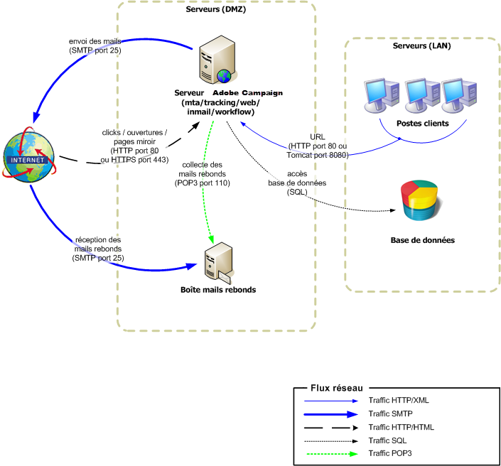
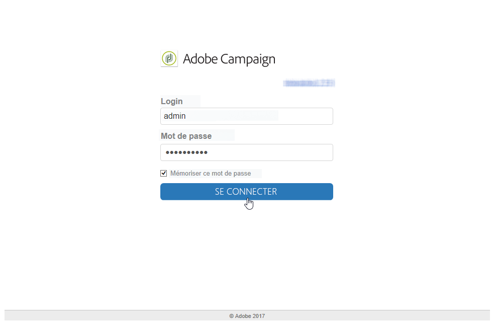
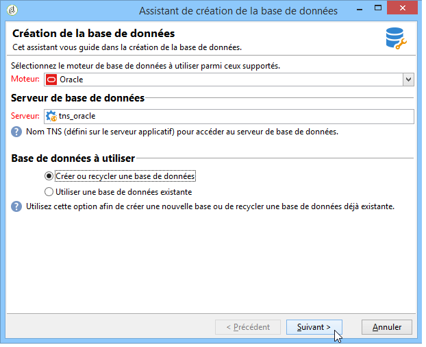
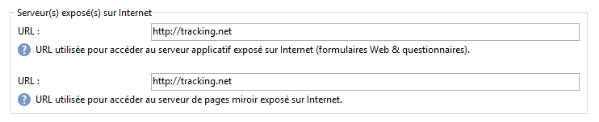

# Déploiement Stand-alone{#standalone-deployment}


Cette configuration regroupe tous les composants sur une seule machine :

* processus applicatif (web),
* processus de diffusion (mta),
* processus de redirection (tracking),
* processus de workflow et tâches planifiées (wfserver),
* processus des mails rebonds (inMail),
* processus de statistiques (stat).

La communication générale entre les processus est réalisée conformément au schéma suivant :



Ce type de configuration est parfaitement adapté lorsque les listes gérées contiennent moins de 100 000 destinataires, et avec, par exemple, les couches logicielles suivantes :

* Linux,
* Apache,
* PostgreSQL,
* Qmail.

Lorsque le volume s&#39;accroît, une variante de cette architecture déporte le serveur de base de données sur une autre machine, pour de meilleures performances.

>[!NOTE]
>
>Un serveur de base de données préexistant peut être utilisé, sous réserve qu&#39;il dispose de ressources suffisantes.

## Fonctionnalités {#features}

### Avantages {#advantages}

* Totalement stand-alone et coût de configuration faible (aucune licence payante si l&#39;on utilise les composants logiciels, tous Open Source, listés ci-dessus).
* Installation et configuration réseau simplifiées.

### Inconvénients {#disadvantages}

* Une machine critique en cas d&#39;incident.
* Débit limité pendant les diffusions des messages (selon notre expérience, de l&#39;ordre de quelques dizaines de milliers de mails par heure).
* Ralentissement possible de l&#39;application pendant les diffusions.
* Le serveur applicatif doit être accessible depuis l&#39;extérieur (en étant placé dans la DMZ, par exemple), puisqu&#39;il accueille le serveur de redirection.

## Etapes d&#39;installation et de configuration {#installation-and-configuration-steps}

### Conditions préalables requises {#prerequisites}

* JDK,
* Serveur Web (IIS, Apache),
* Accès à un serveur de base de données,
* Boîte pour les mails rebonds accessible en POP3,
* Création de deux alias DNS :

   * un premier alias exposé au grand public pour le tracking et pointant vers la machine sur son IP publique ;
   * un deuxième alias exposé aux utilisateurs métier pour l&#39;accès console et pointant vers la même machine.

* Configuration du pare-feu pour l&#39;ouverture des ports SMTP (25), DNS (53), HTTP (80), HTTPS (443), SQL (1521 pour Oracle, 5432 pour PostgreSQL, etc.) . Voir à ce propos [Configuration du réseau](../../installation/using/network-configuration.md).

Dans les exemples présentés ci-dessous, les paramètres de l&#39;instance sont les suivants :

* Nom de l&#39;instance : **demo**
* Masque DNS : **console.campaign.net&#42;** (uniquement pour la connexion des consoles clientes et pour les rapports)
* Base de données : **campaign:demo@dbsrv**

### Installer et configurer (mono-machine) {#installing-and-configuring--single-machine-}

Les étapes sont les suivantes :

1. Respectez la procédure d&#39;installation du serveur Adobe Campaign : package **nlserver** sous Linux ou **setup.exe** sous Windows.

   Voir à ce propos [Prérequis pour l&#39;installation de Campaign sous Linux](../../installation/using/prerequisites-of-campaign-installation-in-linux.md) (Linux) et [Prérequis pour l&#39;installation de Campaign sous Windows](../../installation/using/prerequisites-of-campaign-installation-in-windows.md) (Windows).

1. Une fois l&#39;installation du serveur Adobe Campaign terminée, démarrez le serveur applicatif (web) avec la commande **nlserver web -tomcat** (le module web permet de lancer Tomcat en mode serveur web autonome en écoute sur le port 8080) et vérifiez que Tomcat démarre correctement :

   ```
   12:08:18 >   Application server for Adobe Campaign Classic (7.X YY.R build XXX@SHA1) of DD/MM/YYYY
   12:08:18 >   Starting Web server module (pid=28505, tid=-1225184768)...
   12:08:18 >   Tomcat started
   12:08:18 >   Server started
   ```

   >[!NOTE]
   >
   >La première exécution du module Web permet de créer les fichiers **config-default.xml** et **serverConf.xml** dans le répertoire **conf**, sous le répertoire d’installation. Tous les paramètres disponibles dans le fichier **serverConf.xml** sont répertoriés dans cette [section](../../installation/using/the-server-configuration-file.md).

   Appuyez sur **Ctrl+C** pour arrêter le serveur.

   Voir à ce propos les sections suivantes :

   * Pour Linux : [Premier démarrage du serveur](../../installation/using/installing-packages-with-linux.md#first-start-up-of-the-server),
   * Pour Windows : [Premier démarrage du serveur](../../installation/using/installing-the-server.md#first-start-up-of-the-server).

1. Changez le mot de passe **internal** à partir de la commande :

   ```
   nlserver config -internalpassword
   ```

   Pour plus d’informations à ce sujet, consultez [cette section](../../installation/using/configuring-campaign-server.md#internal-identifier).

1. Créez l’instance de **démonstration** avec les masques DNS pour le suivi (ici, **tracking.campaign.net**) et l’accès aux consoles client (ici, **console.campaign.net**). Vous avez le choix entre les deux méthodes suivantes :

   * Créer l&#39;instance via la console :

     

     Voir à ce sujet la section [Création d’une instance et connexion](../../installation/using/creating-an-instance-and-logging-on.md).

     ou

   * Créer l&#39;instance en ligne de commande :

     ```
     nlserver config -addinstance:demo/tracking.campaign.net*,console.campaign.net*
     ```

     Voir à ce sujet la section [Création d’une instance](../../installation/using/command-lines.md#creating-an-instance).

1. Modifiez le fichier **config-demo.xml** (créé à l’étape précédente avec le fichier **config-default.xml**) et assurez-vous que les processus **mta** (diffusion), **wfserver** (workflows), **inMail** (mails rebonds) et **stat** (statistiques) sont activés. Configurez ensuite l’adresse du serveur de statistiques :

   ```
   <?xml version='1.0'?>
   <serverconf>  
     <shared>    
       <!-- add lang="eng" to dataStore to force English for the instance -->    
       <dataStore hosts="tracking.campaign.net*,console.campaign.net*">      
         <mapping logical="*" physical="default"/>    
       </dataStore>  </shared>  
       <mta autoStart="true" statServerAddress="localhost"/>
       <wfserver autoStart="true"/>  
       <inMail autoStart="true"/>  
       <sms autoStart="false"/>  
       <listProtect autoStart="false"/>
   </serverconf>
   ```

   Pour plus d’informations à ce sujet, consultez [cette section](../../installation/using/configuring-campaign-server.md#enabling-processes).

1. Editez le fichier **serverConf.xml** et renseignez le domaine de diffusion puis indiquez les adresses IP (ou host) des serveurs DNS utilisés pour répondre aux requêtes DNS de type MX par le module MTA.

   ```
   <dnsConfig localDomain="campaign.com" nameServers="192.0.0.1, 192.0.0.2"/>
   ```

   >[!NOTE]
   >
   >Le paramètre **nameServers** n&#39;est utile que sous Windows.

   Pour en savoir plus, consultez [Paramétrage du serveur Campaign](../../installation/using/configuring-campaign-server.md).

1. Copiez le programme de configuration de la console client **setup-client-7.XXX.exe** dans le dossier **/datakit/nl/eng/jsp**. [En savoir plus](../../installation/using/client-console-availability-for-windows.md).

1. Suivez la procédure d&#39;intégration du serveur Web (IIS, Apache) décrite dans les sections suivantes :

   * Pour Linux : [Intégration à un serveur web pour Linux](../../installation/using/integration-into-a-web-server-for-linux.md)
   * Pour Windows : [Intégration à un serveur web pour Windows](../../installation/using/integration-into-a-web-server-for-windows.md)

1. Démarrez le site web et testez la redirection à partir de l&#39;URL : https://tracking.campaign.net/r/test.

   Le navigateur doit afficher le message suivant :

   ```
   <redir status="OK" date="AAAA/MM/JJ HH:MM:SS" build="XXXX" host="tracking.campaign.net" localHost="localhost"/>
   ```

   Voir à ce propos les sections suivantes :

   * Pour Linux : [Lancement du serveur Web et test de la configuration](../../installation/using/integration-into-a-web-server-for-linux.md#launching-the-web-server-and-testing-the-configuration)
   * Pour Windows : [](../../installation/using/integration-into-a-web-server-for-windows.md#launching-the-web-server-and-testing-the-configuration)Lancement du serveur Web et test de la configuration

1. Démarrez le serveur Adobe Campaign (**net start nlserver6** sous Windows, **/etc/init.d/nlserver6 start** sous Linux) et lancez à nouveau la commande **nlserver pdump** afin de vérifier la présence de tous les modules actifs.

   >[!NOTE]
   >
   >À compter de la version 20.1, nous vous recommandons d’utiliser plutôt la commande suivante (pour Linux) : **systemctl start nlserver**

   ```
   12:09:54 >   Application server for Adobe Campaign Classic (7.X YY.R build XXX@SHA1) of DD/MM/YYYY
   syslogd@default (7611) - 9.2 MB
   stat@demo (5988) - 1.5 MB
   inMail@demo (7830) - 11.9 MB
   watchdog (27369) - 3.1 MB
   mta@demo (7831) - 15.6 MB
   wfserver@demo (7832) - 11.5 MB
   web@default (28671) - 40.5 MB
   ```

   Cette commande permet aussi de connaître la version et le numéro de build du serveur Adobe Campaign installé sur la machine.

1. Testez le module **nlserver web** à partir de l&#39;URL : https://console.campaign.net/nl/jsp/logon.jsp.

   Cette URL permet d’accéder à la page de téléchargement du programme d’installation client.

   Saisissez le nom d’utilisateur **interne** et son mot de passe associé à partir de la page de contrôle d’accès. [En savoir plus](../../installation/using/client-console-availability-for-windows.md).

   

1. Lancez la console cliente Adobe Campaign (récupérée à partir de la page de téléchargement de l’étape précédente ou lancée directement sur le serveur pour une installation Windows), spécifiez l’URL de connexion du serveur https://console.campaign.net et connectez-vous avec l’identifiant (login) **internal**.

   Consultez [cette page](../../installation/using/creating-an-instance-and-logging-on.md) et [cette section](../../installation/using/configuring-campaign-server.md#internal-identifier).

   L&#39;assistant de création de base de données s&#39;affiche lors de la première connexion :

   

   Suivez les étapes de l&#39;assistant et créez la base de données associée à l&#39;instance de connexion.

   Pour plus d’informations, consultez la section [Création et configuration de la base de données](../../installation/using/creating-and-configuring-the-database.md).

   Une fois la création de la base de données terminée, vous devez vous déconnecter.

1. Connectez-vous à nouveau à la console cliente avec l&#39;identifiant **admin** sans mot de passe et lancez l&#39;assistant de déploiement (menu **[!UICONTROL Outils > Avancé]**) pour finaliser la configuration de l&#39;instance.

   Pour plus d’informations, consultez la section [Déploiement d’une instance](../../installation/using/deploying-an-instance.md).

   Les paramètres principaux à renseigner sont les suivants :

   * Envoi d&#39;email : les adresses expéditeur, de réponse et la boîte d&#39;erreur pour les mails rebonds.
   * Tracking : renseignez l&#39;URL externe utilisée pour la redirection et l&#39;URL interne puis cliquez sur **Enregistrement auprès du ou des serveurs de tracking** et validez sur l&#39;instance **demo** du serveur de tracking.

     Pour en savoir plus, consultez [Paramétrage du tracking](../../installation/using/deploying-an-instance.md#tracking-configuration).

     

     Le serveur Adobe Campaign étant le serveur applicatif et de redirection, l&#39;URL interne utilisée pour la collecte des logs de tracking et le transfert des URL est une connexion interne directe sur Tomcat (https://localhost:8080).

   * Gestion des mails rebonds : renseignez les paramètres de gestion des mails rebonds (ne pas tenir compte de la section **Mails rebonds non traités**).
   * Accès depuis Internet : renseignez les deux URL d&#39;accès pour les rapports ou les formulaires Web et les pages miroir.

     
