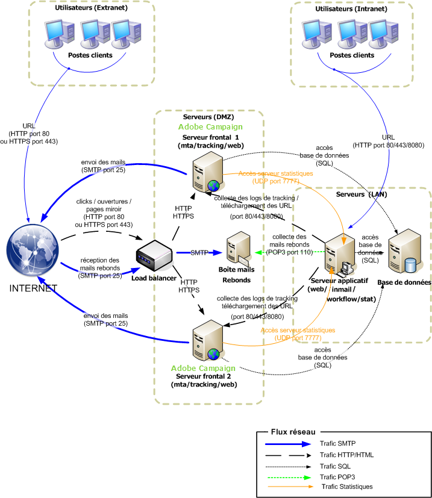
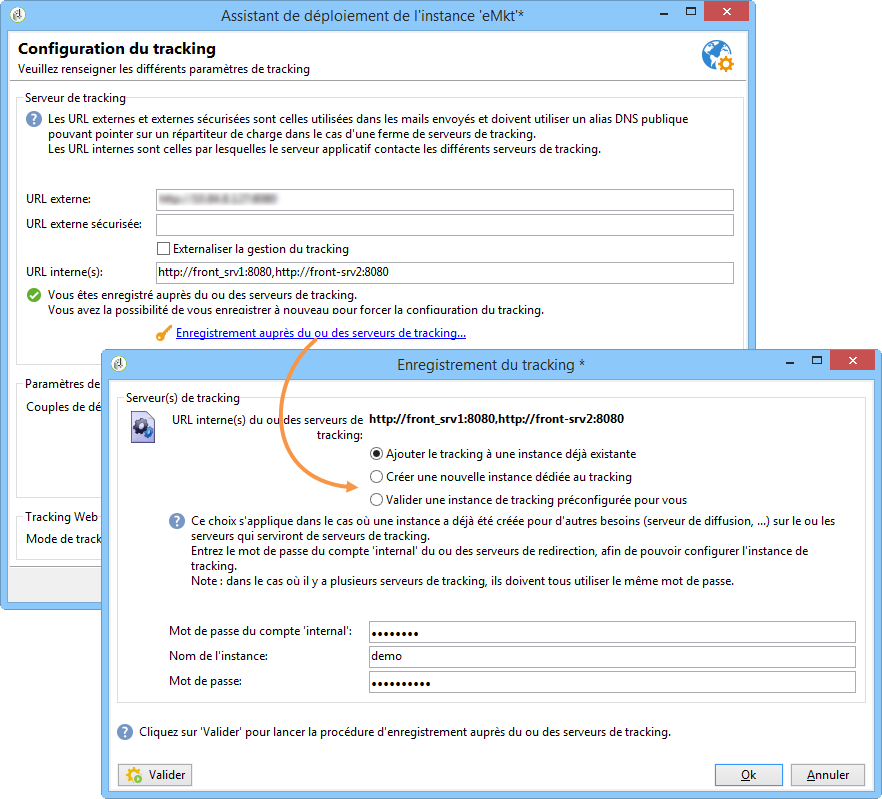

# Déploiement Standard{#standard-deployment}

Pour cette configuration, trois machines sont nécessaires :

* Un serveur applicatif situé dans le LAN, qui sert les utilisateurs (préparation des diffusions, reporting, etc.),
* Deux machines frontales situées en DMZ derrière un répartiteur de charge.

Les deux machines dans la DMZ prennent en charge le tracking, la gestion des pages miroir et l&#39;envoi des mails, et sont mises en redondance afin d&#39;obtenir une haute disponibilité.

Le serveur applicatif situé dans le LAN sert les utilisateurs et effectue tous les traitements récurrents (moteur de workflow). Ainsi, en cas de pic de charge sur les frontaux, les utilisateurs métier ne sont pas impactés.

Le serveur de base de données peut être une machine déjà existante (ou une nouvelle machine) distincte de ces trois machines. Il est toutefois possible de cumuler les fonctions de serveur applicatif dans le LAN et de serveur de base de données sur la même machine. Ceci suppose cependant qu&#39;elle fonctionne sur un système d&#39;exploitation supporté par Adobe Campaign (Linux ou Windows).

La communication générale entre les serveurs et les processus est réalisée conformément au schéma suivant :



Ce type de configuration peut faire face à un grand nombre de profils de destinataires (de 500 000 à 1 000 000), le serveur de base de données étant le principal facteur de limite (ainsi que la bande passante disponible).

## Caractéristiques {#features}

### Avantages {#advantages}

* Possibilité de basculer tous les processus sur une seule machine en cas de problème matériel sur l&#39;une des deux machines.
* Meilleures performances globales, puisque les MTA et la redirection derrière un répartiteur de charge peuvent être déployés sur les deux machines. Avec deux MTA actifs et assez de bande passante, on peut obtenir des taux de diffusion d&#39;environ 100 000 mails par heure.

## Etapes d&#39;installation et de configuration {#installation-and-configuration-steps}

### Prérequis {#prerequisites}

* JDK sur les trois machines,
* Serveur Web (IIS, Apache) sur les deux frontaux,
* Accès à un serveur de base de données sur les trois machines,
* Boîte pour les mails rebonds accessible en POP3,
* Création de deux alias DNS :

   * un premier alias exposé au grand public pour le tracking et pointant vers le répartiteur de charge sur une adresse IP virtuelle (VIP) qui est ensuite distribuée sur les deux serveurs frontaux,
   * un deuxième alias exposé aux utilisateurs métiers pour l&#39;accès console et pointant vers serveur applicatif.

* Pare-feu configuré pour ouvrir les ports STMP (25), DNS (53), HTTP (80), HTTPS (443), SQL (1521 pour Oracle, 5432 pour PostgreSQL, etc.). Pour plus d&#39;informations, reportez-vous à la section Accès [aux](../../installation/using/network-configuration.md#database-access)bases de données.

### Installation du serveur applicatif {#installing-the-application-server}

Suivez les étapes pour installer une instance autonome depuis le serveur d’applications Adobe Campaign jusqu’à la création de la base de données (étape 12). Reportez-vous à [Installation et configuration (machine unique)](#installing-and-configuring--single-machine-).

La machine n&#39;étant pas un serveur de tracking, ne pas tenir compte de l&#39;intégration du serveur Web.

Dans les exemples présentés ci-dessous, les paramètres de l&#39;instance sont les suivants :

* Nom de l&#39;instance : **demo**
* DNS mask: **console.campaign.net*** (only for client console connections and for reports)
* Langue : française
* Database: **campaign:demo@dbsrv**

### Installation des deux serveurs frontaux {#installing-the-two-frontal-servers}

La procédure d&#39;installation et de paramétrage est identique sur les deux machines.

Les étapes sont les suivantes :

1. Installez le serveur Adobe Campaign.

   Pour plus d&#39;informations, reportez-vous aux [Conditions préalables à l&#39;installation de Campaign sous Linux](../../installation/using/prerequisites-of-campaign-installation-in-linux.md) (Linux) et [Conditions préalables à l&#39;installation de Campaign sous Windows](../../installation/using/prerequisites-of-campaign-installation-in-windows.md) (Windows).

1. Suivez la procédure d&#39;intégration du serveur Web (IIS, Apache) décrite dans les sections suivantes :

   * Pour Linux : [Intégration à un serveur Web pour Linux](../../installation/using/integration-into-a-web-server-for-linux.md)
   * Pour Windows : [Intégration à un serveur Web pour Windows](../../installation/using/integration-into-a-web-server-for-windows.md)

1. Créez l&#39;instance nommée **demo**. Pour cela, deux méthodes sont possibles :

   * Créer l&#39;instance via la console :

      

      Pour plus d’informations, reportez-vous à la section [Création d’une instance et connexion](../../installation/using/creating-an-instance-and-logging-on.md).

      or

   * Créer l&#39;instance en ligne de commande :

      ```
      nlserver config -addinstance:demo/tracking.campaign.net*
      ```

      For more on this, refer to [Creating an instance](../../installation/using/command-lines.md#creating-an-instance).
   Le nom de l&#39;instance est le même que le celui du serveur applicatif.

   La connexion au serveur avec le module **nlserver web** (pages miroir, désinscription) s&#39;effectuera à partir de l&#39;URL du répartiteur de charge (tracking.campaign.net).

1. Remplacez le mot de passe **internal** par celui du serveur applicatif.

   For more on this, refer to [Internal identifier](../../installation/using/campaign-server-configuration.md#internal-identifier).

1. Rattachez la base de données sur l&#39;instance :

   ```
   nlserver config -setdblogin:PostgreSQL:campaign:demo@dbsrv -instance:demo
   ```

1. In the **config-default.xml** and **config-demo.xml** files, enable the **web**, **trackinglogd** and **mta** modules.

   For more on this, refer to [Enabling processes](../../installation/using/campaign-server-configuration.md#enabling-processes).

1. Edit the **serverConf.xml** file and populate:

   * la configuration DNS du module MTA :

      ```
      <dnsConfig localDomain="campaign.com" nameServers="192.0.0.1, 192.0.0.2"/>
      ```

      >[!NOTE]
      >
      >Le paramètre **nameServers** n&#39;est utile que sous Windows.

      For more on this, refer to [Delivery settings](../../installation/using/campaign-server-configuration.md#delivery-settings).

   * les serveurs de tracking redondants dans les paramètres de la redirection :

      ```
      <spareServer enabledIf="$(hostname)!='front_srv1'" id="1" url="https://front_srv1:8080"/>
      <spareServer enabledIf="$(hostname)!='front_srv2'" id="2" url="https://front_srv2:8080"/>
      ```

      For more on this, refer to [Redundant tracking](../../installation/using/configuring-campaign-server.md#redundant-tracking).

1. Démarrez le site web et testez la redirection à partir de l&#39;URL : [https://tracking.campaign.net/r/test](https://tracking.campaign.net/r/test)

   Le navigateur doit afficher les messages suivants (en fonction de l&#39;URL redirigée par le répartiteur de charge) :

   ```
   <redir status="OK" date="AAAA/MM/JJ HH:MM:SS" build="XXXX" host="tracking.campaign.net" localHost="front_srv1"/>
   ```

   or

   ```
   <redir status="OK" date="AAAA/MM/JJ HH:MM:SS" build="XXXX" host="tracking.campaign.net" localHost="front_srv2"/>
   ```

   Voir à ce propos les sections suivantes :

   * For Linux: [Launching the Web server and testing the configuration](../../installation/using/integration-into-a-web-server-for-linux.md#launching-the-web-server-and-testing-the-configuration)
   * For Windows: [Launching the Web server and testing the configuration](../../installation/using/integration-into-a-web-server-for-windows.md#launching-the-web-server-and-testing-the-configuration)

1. Démarrer le serveur Adobe Campaign.
1. Connectez-vous avec une console cliente Adobe Campaign avec l&#39;identifiant (login) **admin** sans mot de passe et lancez l&#39;assistant de déploiement.

   Pour plus d’informations, voir [Déploiement d’une instance](../../installation/using/deploying-an-instance.md).

   Le paramétrage est identique à celui d&#39;une instance mono-machine à l&#39;exception de la configuration du module de tracking.

1. Renseignez l&#39;URL externe (celle du répartiteur de charge) utilisée pour la redirection et les URL internes des deux serveurs frontaux.

   For more on this, refer to [Tracking configuration](../../installation/using/deploying-an-instance.md#tracking-configuration).

   

   >[!NOTE]
   >
   >On utilise l&#39;instance déjà existante des deux serveurs de tracking créés précédemment en utilisant le mot de passe du login **internal**.

