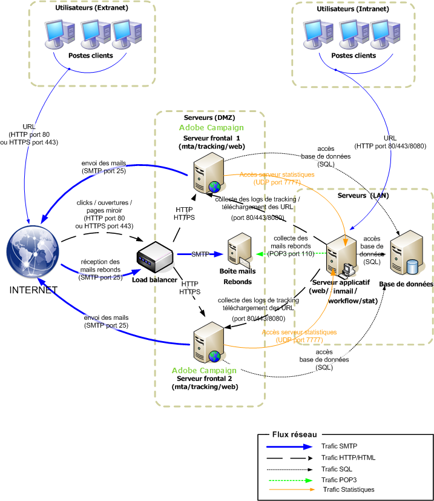
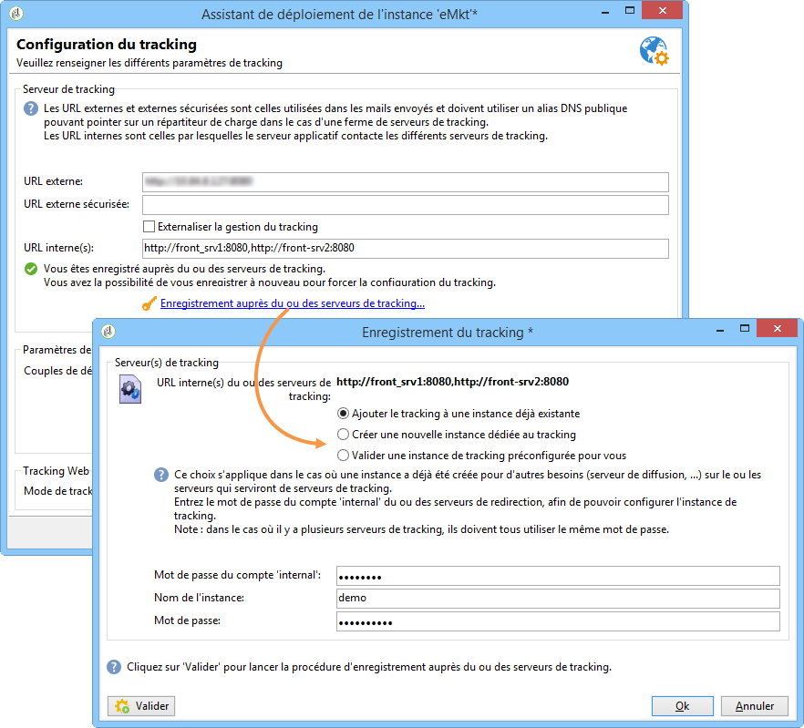

# Déploiement Standard{#standard-deployment}


Pour cette configuration, trois machines sont nécessaires :

* Un serveur applicatif situé dans le LAN, qui sert les utilisateurs (préparation des diffusions, reporting, etc.),
* Deux machines frontales situées en DMZ derrière un répartiteur de charge.

Les deux machines dans la DMZ prennent en charge le tracking, la gestion des pages miroir et l&#39;envoi des mails, et sont mises en redondance afin d&#39;obtenir une haute disponibilité.

Le serveur applicatif du réseau local sert les utilisateurs finaux et exécute tous les processus récurrents (moteur de workflow). Ainsi, lorsque les charges maximales sont atteintes sur les serveurs frontaux, les utilisateurs de l’application ne sont pas affectés.

Le serveur de base de données peut être hébergé sur un ordinateur distinct de ces trois serveurs. Dans le cas contraire, le serveur applicatif et le serveur de base de données doivent partager le même ordinateur sur le LAN, à condition que le système d&#39;exploitation soit pris en charge par Adobe Campaign (Linux ou Windows).

La communication générale entre les serveurs et les processus est réalisée conformément au schéma suivant :



Ce type de configuration peut faire face à un grand nombre de profils de destinataires (de 500 000 à 1 000 000), le serveur de base de données étant le principal facteur de limite (ainsi que la bande passante disponible).

## Fonctionnalités {#features}

### Avantages {#advantages}

* Possibilité de basculer tous les processus sur une seule machine en cas de problème matériel sur l&#39;une des deux machines.
* Meilleures performances globales, puisque les fonctions MTA et de redirection peuvent être déployées sur les deux ordinateurs derrière une répartition de charge. Avec deux MTA actifs et une bande passante suffisante, il est possible d&#39;atteindre des taux de diffusion de l&#39;ordre de 100 000 mails par heure.

## Etapes d&#39;installation et de configuration {#installation-and-configuration-steps}

### Conditions préalables {#prerequisites}

* JDK sur les trois machines,
* Serveur Web (IIS, Apache) sur les deux frontaux,
* Accès à un serveur de base de données sur les trois machines,
* Boîte pour les mails rebonds accessible en POP3,
* Création de deux alias DNS :

   * un premier alias exposé au grand public pour le tracking et pointant vers le répartiteur de charge sur une adresse IP virtuelle (VIP) qui est ensuite distribuée sur les deux serveurs frontaux,
   * un deuxième alias exposé aux utilisateurs métiers pour l&#39;accès console et pointant vers serveur applicatif.

* Pare-feu configuré pour ouvrir STMP (25), DNS (53), HTTP (80), HTTPS (443), SQL (1521 pour Oracle, 5432 pour PostgreSQL, etc.) les ports. Voir à ce sujet la section [Accès à la base de données](../../installation/using/network-configuration.md#database-access).

### Installation du serveur applicatif {#installing-the-application-server}

Respectez les étapes d&#39;installation d&#39;une instance mono-machine à partir du serveur applicatif Adobe Campaign jusqu&#39;à la création de la base de données (étape 12). Voir [Installer et configurer (mono-machine)](../../installation/using/standalone-deployment.md#installing-and-configuring--single-machine-).

La machine n&#39;étant pas un serveur de tracking, ne pas tenir compte de l&#39;intégration du serveur Web.

Dans les exemples présentés ci-dessous, les paramètres de l&#39;instance sont les suivants :

* Nom de l&#39;instance : **demo**
* Masque DNS : **console.campaign.net&#42;** (uniquement pour la connexion des consoles clientes et pour les rapports)
* Langue : française
* Base : **campaign:demo@dbsrv**

### Installation des deux serveurs frontaux {#installing-the-two-frontal-servers}

La procédure d&#39;installation et de paramétrage est identique sur les deux machines.

Les étapes sont les suivantes :

1. Installez le serveur Adobe Campaign.

   Voir à ce propos [Prérequis pour l&#39;installation de Campaign sous Linux](../../installation/using/prerequisites-of-campaign-installation-in-linux.md) (Linux) et [Prérequis pour l&#39;installation de Campaign sous Windows](../../installation/using/prerequisites-of-campaign-installation-in-windows.md) (Windows).

1. Suivez la procédure d&#39;intégration du serveur Web (IIS, Apache) décrite dans les sections suivantes :

   * Pour Linux : [Intégration à un serveur web pour Linux](../../installation/using/integration-into-a-web-server-for-linux.md)
   * Pour Windows : [Intégration à un serveur web pour Windows](../../installation/using/integration-into-a-web-server-for-windows.md)

1. Créez l’instance **demo**. Vous avez le choix entre les deux méthodes suivantes :

   * Créer l&#39;instance via la console :

     

     Voir à ce sujet la section [Création d’une instance et connexion](../../installation/using/creating-an-instance-and-logging-on.md).

     ou

   * Créer l&#39;instance en ligne de commande :

     ```
     nlserver config -addinstance:demo/tracking.campaign.net*
     ```

     Voir à ce sujet la section [Création d’une instance](../../installation/using/command-lines.md#creating-an-instance).

   Le nom de l&#39;instance est le même que le celui du serveur applicatif.

   La connexion au serveur avec le module **nlserver web** (pages miroir, désinscription) s&#39;effectuera à partir de l&#39;URL du répartiteur de charge (tracking.campaign.net).

1. Remplacez le mot de passe **internal** par celui du serveur applicatif.

   Pour plus d’informations à ce sujet, consultez [cette section](../../installation/using/configuring-campaign-server.md#internal-identifier).

1. Rattachez la base de données sur l&#39;instance :

   ```
   nlserver config -setdblogin:PostgreSQL:campaign:demo@dbsrv -instance:demo
   ```

1. A partir des fichiers **config-default.xml** et **config-demo.xml**, activez les modules **web**, **trackinglogd** et **mta**.

   Pour plus d’informations à ce sujet, consultez [cette section](../../installation/using/configuring-campaign-server.md#enabling-processes).

1. Editez le fichier **serverConf.xml** et renseignez :

   * la configuration DNS du module MTA :

     ```
     <dnsConfig localDomain="campaign.com" nameServers="192.0.0.1, 192.0.0.2"/>
     ```

     >[!NOTE]
     >
     >Le paramètre **nameServers** n&#39;est utile que sous Windows.

     Voir à ce sujet la section [Paramètres de diffusion](configure-delivery-settings.md).

   * les serveurs de tracking redondants dans les paramètres de la redirection :

     ```
     <spareServer enabledIf="$(hostname)!='front_srv1'" id="1" url="https://front_srv1:8080"/>
     <spareServer enabledIf="$(hostname)!='front_srv2'" id="2" url="https://front_srv2:8080"/>
     ```

     Voir à ce sujet la section [Tracking redondant](configuring-campaign-server.md#redundant-tracking).

1. Démarrez le site web et testez la redirection à partir de l&#39;URL : [https://tracking.campaign.net/r/test](https://tracking.campaign.net/r/test)

   Le navigateur doit afficher les messages suivants (en fonction de l&#39;URL redirigée par le répartiteur de charge) :

   ```
   <redir status="OK" date="AAAA/MM/JJ HH:MM:SS" build="XXXX" host="tracking.campaign.net" localHost="front_srv1"/>
   ```

   ou

   ```
   <redir status="OK" date="AAAA/MM/JJ HH:MM:SS" build="XXXX" host="tracking.campaign.net" localHost="front_srv2"/>
   ```

   Voir à ce propos les sections suivantes :

   * Pour Linux : [Lancement du serveur Web et test de la configuration](../../installation/using/integration-into-a-web-server-for-linux.md#launching-the-web-server-and-testing-the-configuration)
   * Pour Windows : [](../../installation/using/integration-into-a-web-server-for-windows.md#launching-the-web-server-and-testing-the-configuration)Lancement du serveur Web et test de la configuration

1. Démarrer le serveur Adobe Campaign.
1. Connectez-vous avec une console cliente Adobe Campaign avec l&#39;identifiant (login) **admin** sans mot de passe et lancez l&#39;assistant de déploiement.

   Voir à ce sujet la section [Déploiement d’une instance](../../installation/using/deploying-an-instance.md).

   Le paramétrage est identique à celui d&#39;une instance mono-machine à l&#39;exception de la configuration du module de tracking.

1. Renseignez l&#39;URL externe (celle du répartiteur de charge) utilisée pour la redirection et les URL internes des deux serveurs frontaux.

   Pour en savoir plus, consultez [Paramétrage du tracking](../../installation/using/deploying-an-instance.md#tracking-configuration).

   

   >[!NOTE]
   >
   >On utilise l&#39;instance déjà existante des deux serveurs de tracking créés précédemment en utilisant le mot de passe du login **internal**.
