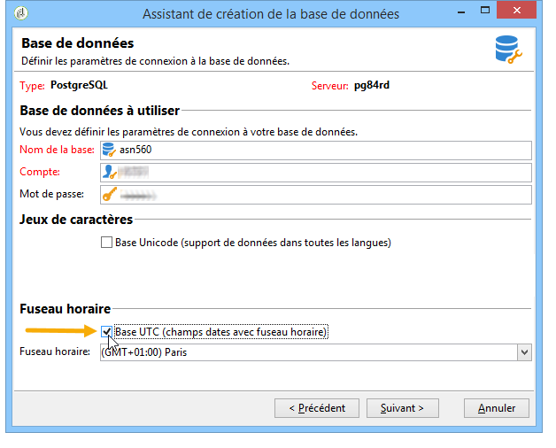
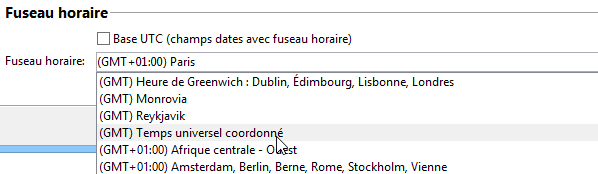

# Gestion des fuseaux horaires{#time-zone-management}

## Principe de fonctionnement {#operating-principle}

Adobe Campaign permet d&#39;exprimer les dates en tenant compte de leur fuseau horaire : les utilisateurs internationaux peuvent ainsi collaborer à travers le monde sur différents fuseaux horaires. Chacun des pays utilisant la même instance peut gérer l&#39;exécution des campagnes, le tracking, l&#39;historisation, etc., en fonction de l&#39;heure locale.

Afin de permettre cette utilisation de la plateforme Adobe Campaign à l&#39;échelle internationale, toutes les dates utilisées par le système doivent pouvoir être associées à un fuseau horaire. Ainsi, une date dont le fuseau horaire est connu peut être exportée dans n&#39;importe quel autre fuseau horaire, ou indépendamment de tout fuseau horaire.

Adobe Campaign permet de stocker des dates/heures au format UTC (temps universel coordonné). Lorsque des données sont exposées, elles sont converties en date/heure locale de l&#39;opérateur. La conversion est effectuée automatiquement lorsque la base de données est paramétrée au format UTC (voir la section [Configuration](#configuration)). Si la base de données n&#39;est pas paramétrée au format UTC, les informations relatives aux fuseaux horaires des dates de la plateforme sont stockées dans une option.

Les principales fonctionnalités de la plateforme concernées par la gestion des fuseaux horaires sont : les imports/exports de données, la gestion des opérateurs et les Workflows. La **notion d&#39;héritage** est disponible pour les imports/exports ou les Workflows. Par défaut, ils sont paramétrés sur le fuseau horaire du serveur de base de données, mais il est possible de redéfinir de nouveaux fuseaux horaires pour un workflow et même pour une seule activité.

Les **opérateurs** peuvent agir sur les fuseaux horaires lors du **paramétrage d&#39;une diffusion** et en particulier définir le fuseau horaire dans lequel la diffusion va être exécutée.

>[!IMPORTANT]
>
>Si la base de données ne gère pas le multi-fuseaux horaires, alors pour toutes les manipulations de filtrage de données, les requêtes SQL doivent être exécutées dans le fuseau horaire du serveur de base de données.

Chaque opérateur Adobe Campaign est associé à un fuseau horaire : cette information est paramétrée dans son profil. Voir à ce sujet [ce document](../../platform/using/access-management.md).

Lorsque la plateforme Adobe Campaign ne nécessite pas la gestion des fuseaux horaires, il est possible de conserver un mode de stockage au format local, avec un fuseau horaire spécifique associé.

## Recommandations       {#recommendations}

Les fuseaux horaires recouvrent plusieurs réalités : le terme peut désigner un décalage constant par rapport à la date UTC, ou les horaires d&#39;une région qui peut changer d&#39;heure deux fois dans l&#39;année (heure d&#39;hiver/heure d&#39;été).

Par exemple, en postgreSQL, la commande **SET TIME ZONE &#39;Europe/Paris&#39;;** tiendra compte des heures d&#39;été et d&#39;hiver : la date sera exprimée en GMT+1 ou GMT+2 selon la période de l&#39;année.

Par contre, si l&#39;on utilise commande **SET TIME ZONE 0200;**, le décalage sera toujours GMT+2.

## Configuration  {#configuration}

Le mode de stockage des dates et heures est choisi lors de la création de la base de données (voir la section [Création d&#39;une nouvelle instance](#creating-a-new-instance)). En cas de migration, les heures liées aux dates sont converties en dates et heures locales (voir la section [Migration](#migration)).

D&#39;un point de vue technique, les informations de type **Date+heure** peuvent être stockées dans la base de données selon deux modes différents :

1. Format TIMESTAMP WITH TIMEZONE : le moteur de base de données stocke les dates en UTC. Chaque session ouverte aura un fuseau horaire associé et les dates seront converties en fonction de ce fuseau horaire.
1. Format local + fuseau horaire local : toutes les dates sont stockées au format local (pas de gestion des décalages horaires) et un fuseau horaire unique leur est associé. Le fuseau horaire est stocké dans l&#39;option **WdbcTimeZone** de l&#39;instance Adobe Campaign et peut être modifié à partir du menu **[!UICONTROL Administration > Plateforme > Options]** de l&#39;arborescence.

>[!IMPORTANT]
>
>Notez que cette modification peut entraîner des problèmes de cohérence des données et de synchronisation.

### Création d&#39;une nouvelle instance {#creating-a-new-instance}

Afin de permettre à plusieurs utilisateurs internationaux de collaborer sur une même instance, vous devez configurer les fuseaux horaires (timezone) lors de la création de l&#39;instance pour gérer les décalages horaires entre les pays. Pour cela, lors de la création de l&#39;instance, sélectionnez le mode de gestion des dates et heures dans la section **[!UICONTROL Fuseau horaire]** de l&#39;étape de configuration de la base de données.

Cochez l&#39;option **[!UICONTROL Base UTC (champs dates avec fuseau horaire)]** pour stocker toutes les données comportant des dates et heures au format UTC (champs SQL et champs XML).

>[!IMPORTANT]
>
>Dans le cas d&#39;**Oracle**, il faut que les fichiers de fuseaux horaires (.dat) des couches clientes Oracle soient compatibles avec les fichiers de fuseaux horaires installés sur le serveur.

Si la base n&#39;est pas UTC, vous pouvez sélectionner le fuseau horaire parmi ceux proposés dans la liste déroulante. Vous pouvez également utiliser le fuseau horaire du serveur ou sélectionner l&#39;option Temps universel coordonné (GMT).

Lorsque l&#39;option **[!UICONTROL Base UTC (champs dates avec fuseau horaire)]** est sélectionnée, les champs SQL sont stockés au format TIMESTAMP WITH TIMEZONE.

Dans le cas contraire, ils sont stockés au format local et vous devez sélectionner le fuseau horaire à appliquer à la base de données.

### Migration {#migration}

Lors d&#39;une migration d&#39;une version antérieure (sans gestion des fuseaux horaires), vous devez définir le mode de stockage des dates dans la base de données.

Afin de garantir la compatibilité avec les outils externes accédant à la base de données Adobe Campaign, les champs SQL de type **Date+heure** restent par défaut stockés au format local.

Les champs XML qui contiennent des dates sont désormais stockés en UTC. Lors de son chargement, si un champ n&#39;est pas en UTC, il y est automatiquement converti. Pour cela, Adobe Campaign utilisera le fuseau horaire du serveur. Ainsi, tous les champs XML seront progressivement convertis au format UTC.

Pour utiliser une instance existante, ajoutez l&#39;option **WdbcTimeZone** et saisissez le fuseau horaire de l&#39;instance.

>[!IMPORTANT]
>
>Vous devez veiller à paramétrer la bonne valeur pour l&#39;option WdbcTimeZone : toute modification ultérieure pourrait provoquer des incohérences.

Exemple de valeurs possibles :

* Europe/Paris,
* Europe/London,
* America/New_York, etc.

   Ces valeurs sont extraites de la base de données tz (Olson). Pour plus d&#39;informations, voir la page [https://en.wikipedia.org/wiki/List_of_tz_database_time_zones](https://en.wikipedia.org/wiki/List_of_tz_database_time_zones).
