# Prise en main du connecteur ACS{#acs-connector-gs}

Le connecteur ACS relie Adobe Campaign v7 et Adobe Campaign Standard.Il s&#39;agit d&#39;une fonctionnalité intégrée de Campaign v7 qui reproduit automatiquement les données vers Campaign Standard, associant le meilleur des deux applications. Campaign v7 contient des outils avancés pour gérer la base de données marketing principale.La réplication de données depuis Campaign v7 permet à Campaign Standard de tirer profit de données enrichies dans un environnement convivial.

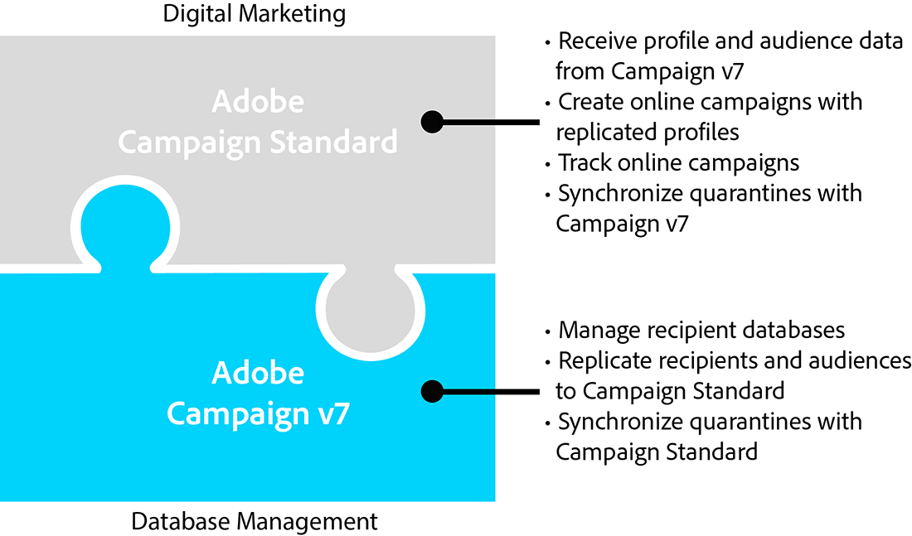

Grâce au connecteur ACS, les spécialistes du marketing digital continuent à utiliser Campaign Standard pour concevoir, cibler et exécuter des campagnes, tandis que Campaign v7 s’adresse aux profils orientés données tels que les spécialistes du marketing de base de données.

>[!IMPORTANT]
>
>Le connecteur ACS est disponible uniquement dans le cadre de l’offre Adobe Campaign Prime.Pour plus d’informations sur l’obtention d’une licence Adobe Campaign Prime, contactez votre gestionnaire de compte.
>
>Le connecteur ACS est disponible uniquement pour les architectures hébergées et hybrides.Il n’est pas disponible pour les installations entièrement sur site.
>
>Pour utiliser cette fonctionnalité, vous devez vous connecter à Campaign à l’aide d’un Adobe ID (IMS).Consultez [Connexion via un Adobe ID](../../integrations/using/about-adobe-id.md).

Ce document présente les fonctionnalités du connecteur ACS.Les sections ci-dessous fournissent des informations sur la réplication des données par la fonctionnalité, ainsi que des instructions concernant l’utilisation des profils répliqués.

* [Processus](#process) : vue d’ensemble du connecteur ACS et de la gestion de la réplication des données.
* [Implémentation](#implementation) : vue d’ensemble de la prise en main du connecteur ACS et instructions pour la réplication de données de base et avancées.
* [Synchronisation de profils](../../integrations/using/synchronizing-profiles.md) : instructions pour la réplication de profils et la création de diffusions avec ces derniers.
* [Synchronisation d’audiences](../../integrations/using/synchronizing-audiences.md) : instructions pour le ciblage d’une liste de destinataires dans Campaign v7 et la réplication de la liste vers Campaign Standard sous forme d’audience.
* [Synchronisation d’applications web](../../integrations/using/synchronizing-web-applications.md) : instructions pour la liaison d’applications web de Campaign v7 à Campaign Standard.
* [Résolution des problèmes liés au connecteur ACS](../../integrations/using/troubleshooting-the-acs-connector.md) : validation des réponses aux problèmes courants.

>[!NOTE]
>
>Le connecteur ACS est fourni avec Campaign v7 dans le cadre d’un contrat de licence. Pour utiliser le connecteur ACS, vérifiez que vous pouvez basculer entre Campaign v7 et Campaign Standard. Si vous ne connaissez pas votre version et les fonctionnalités qui y sont incluses, contactez votre administrateur.

## Processus {#process}

### Réplication des données {#data-replication}

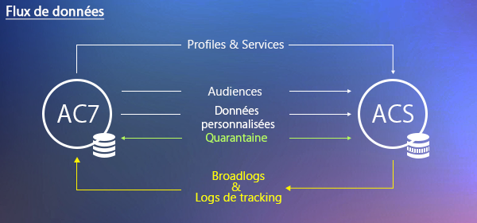

Le connecteur ACS réplique les éléments suivants de façon périodique de Campaign v7 vers Campaign Standard :

* **Destinataires**
* **Abonnements**
* **Services**
* **Landing pages**

Par défaut, la réplication périodique du connecteur ACS a lieu toutes les 15 minutes. La durée de la réplication périodique peut être ajustée en fonction de vos besoins.Contactez votre consultant ou consultante si des modifications sont nécessaires.

La réplication de données des personnes destinataires, des abonnements, des services et des pages de destination est incrémentale, ce qui signifie que seules les nouvelles personnes destinataires et les modifications apportées aux personnes destinataires existantes sont répliquées de Campaign v7 vers Campaign Standard.Cependant, la réplication d’une audience se fait dans une seule instance.Vous pouvez créer une audience dans Campaign v7 et la répliquer une fois vers Campaign Standard.La réplication est immédiate et ne peut pas être configurée pour des mises à jour régulières.Pour plus d’informations, voir [Synchronisation des audiences](../../integrations/using/synchronizing-audiences.md).

>[!NOTE]
>
>Faites preuve de patience lors de la réplication initiale d’une base de données volumineuse, car le processus peut prendre plusieurs heures.Les réplications suivantes sont plus rapides, car incrémentales.

Le connecteur ACS réplique les éléments suivants de façon périodique de Campaign Standard vers Campaign v7 :

* **[!UICONTROL Identifiants des diffusions]**
* **[!UICONTROL BroadLogs des emails]**
* **[!UICONTROL Logs de tracking des emails]**

La réplication des logs des emails et des identifiants des diffusions permet d’accéder à l’historique des diffusions et aux données de tracking des destinataires v7 depuis Campaign v7.

>[!IMPORTANT]
>
>Seuls les logs de tracking et les broadLogs des emails sont répliqués de Campaign Standard vers Campaign v7.

### Synchronisation des données {#data-synchronization}

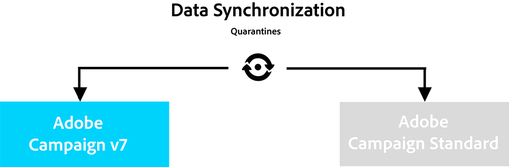

Le connecteur ACS synchronise les quarantaines entre Campaign v7 et Campaign Standard.

Par exemple, un profil qui a été répliqué de Campaign v7 vers Campaign Standard contient une adresse e-mail.Si l’adresse e-mail est mise en quarantaine par Campaign Standard, les données sont transmises à Campaign v7 lors de la synchronisation suivante.Pour plus d’informations sur les quarantaines, consultez les sections [Gestion des quarantaines](../../delivery/using/delivery-failures-quarantine.md) et [Quarantaines Campaign Standard](https://experienceleague.adobe.com/docs/campaign-standard/using/testing-and-sending/monitoring-messages/understanding-quarantine-management.html?lang=fr).

### Utilisation de profils répliqués {#using-replicated-profiles}

Les profils répliqués peuvent être utilisés par Campaign Standard et Campaign v7 pour les workflows de ciblage des campagnes marketing.

Pour savoir comment envoyer une diffusion dans Campaign Standard à l’aide de profils répliqués, voir [Synchronisation des profils](../../integrations/using/synchronizing-profiles.md). Des instructions supplémentaires sont fournies pour le partage des données de désabonnement entre Campaign v7 et Campaign Standard.

### Limites {#limitations}

Les profils répliqués sont prêts à l’emploi pour les diffusions, mais présentent certaines limites dans Campaign Standard.Passez en revue les éléments ci-dessous pour savoir comment les gérer au mieux.

* **Profils en lecture seule dans Campaign Standard** : les profils répliqués sont en lecture seule dans Campaign Standard.Vous pouvez toutefois modifier les personnes destinataires dans Campaign v7 ; les modifications sont mises à jour automatiquement dans Campaign Standard par le connecteur ACS.
* **Profils créés dans Campaign Standard** : le connecteur ACS réplique les données des personnes destinataires dans un sens, de Campaign v7 vers Campaign Standard.Par conséquent, les profils issus de Campaign Standard ne sont pas répliqués dans Campaign v7.
* **Données des personnes destinataires de base dans Campaign Standard** : le connecteur ACS réplique les données des personnes destinataires adaptées à Campaign Standard.Elles incluent le nom, l’adresse, l’adresse e-mail, le numéro de téléphone mobile, le numéro de téléphone personnel et d’autres coordonnées utiles des personnes destinataires.Si d’autres champs de personne destinataire et tables de ciblage personnalisées disponibles dans Campaign v7 sont essentiels à votre workflow, veuillez contacter votre consultant ou consultante.
* **Import des profils mis en quarantaine** : des listes de profils qui ne souhaitent pas être contactés peuvent être importées dans Campaign v7 ou Campaign Standard en tant que profils mis en quarantaine.Le statut des profils est inclus dans la synchronisation des quarantaines entre les applications et ces profils ne sont pas utilisés dans les diffusions.
* **Désinscription à un service dans Campaign Standard** : le choix de se désinscrire d’une diffusion n’est pas synchronisé de Campaign Standard vers Campaign v7.Vous pouvez toutefois configurer une diffusion Campaign Standard pour rediriger son lien de désinscription vers Campaign v7.Le profil d’une personne destinataire qui clique sur le lien de désinscription est mis à jour dans Campaign v7 et les données sont répliquées vers Campaign Standard.Consultez la section [Modification du lien de désinscription](../../integrations/using/synchronizing-profiles.md#changing-the-unsubscription-link).
* Seuls les logs de tracking et les broadLogs des e-mails sont répliqués de Campaign Standard vers Campaign v7.

### Facturation {#billing}

L’application choisie pour envoyer les diffusions, Campaign v7 ou Campaign Standard, n’a aucune incidence sur la facturation.Les informations de facturation sont réconciliées entre Campaign v7 et Campaign Standard.Par conséquent, si vous envoyez des diffusions à une même personne destinataire à l’aide des deux applications, elle est toujours comptabilisée comme un seul profil actif.

## Mise en œuvre {#implementation}

Il existe deux types de mises en œuvre du connecteur ACS.Elles sont toujours effectuées par l’équipe de conseil d’Adobe Campaign.

>[!IMPORTANT]
>
>Cette section est destinée aux utilisateurs experts uniquement. Elle a pour but de leur donner une vue générale de la mise en œuvre et de ses principales étapes.
>
>N’essayez en aucun cas d’effectuer ces mises en œuvre par vous-même.Elles doivent être réalisées exclusivement par les consultantes et consultants Adobe Campaign.

La **mise en œuvre de base** vous permet de répliquer les personnes destinataires (champs d’usine), les services, les abonnements, les applications web et les audiences.Il s’agit d’une réplication unidirectionnelle de Campaign v7 vers Campaign Standard.

La **mise en œuvre avancée** permet des cas d’utilisation plus complexes, si vous disposez de champs de destinataire supplémentaires ou de tables de destinataires personnalisées (table des transactions), par exemple. Voir [Mise en œuvre avancée](#advanced-implementation).

### Installation du package {#installing-the-package}

Pour pouvoir utiliser cette fonctionnalité, le package **[!UICONTROL Connecteur ACS]** doit être installé.Cette étape est toujours effectuée par l’administrateur ou l’administratrice technique ou le consultant ou la consultante Adobe.

Tous les éléments techniques liés au connecteur ACS sont disponibles dans le nœud **[!UICONTROL Administration > Connecteur ACS]** de l’explorateur.

### Workflows techniques et de réplication {#technical-and-replication-workflows}

Après l’installation du package, deux workflows techniques sont disponibles dans **[!UICONTROL Administration > Connecteur ACS > Traitement]**.

>[!IMPORTANT]
>
>N’essayez jamais de modifier ces workflows.Ils ne doivent jamais être en erreur ou interrompus.Si cela se produit, contactez votre consultant ou consultante Adobe Campaign.

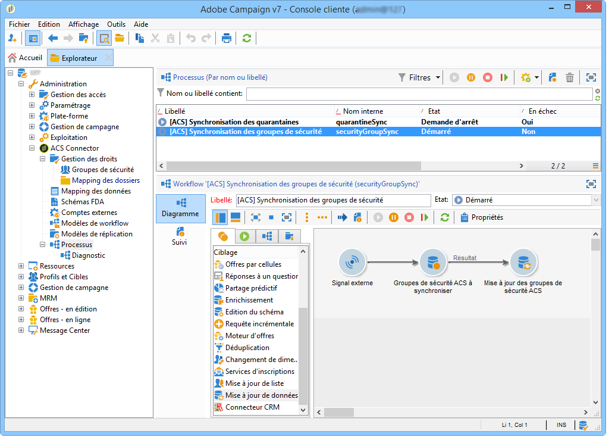

* **[!UICONTROL `[ACS] Quarantine synchronization`]** (quarantineSync) : ce processus synchronise toutes les informations de quarantaine. Toutes les nouvelles mises en quarantaine dans Campaign v7 sont répliquées dans Campaign Standard. Toutes les nouvelles mises en quarantaine de Campaign Standard sont répliquées dans Campaign v7. Cela garantit que toutes les règles d’exclusion sont synchronisées entre Campaign v7 et Campaign Standard.
* **[!UICONTROL `[ACS] Security group synchronization`]** (securityGroupSync) : ce processus est utilisé pour la conversion des droits. Voir [Conversion des droits](#rights-conversion).

Les workflows de réplication ci-dessous sont disponibles en tant que modèles « prêts à l’emploi ».Ils doivent être mis en œuvre par votre consultant ou consultante Adobe Campaign.

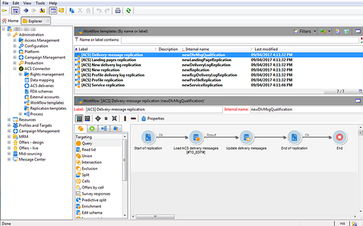

* **[!UICONTROL `[ACS] Profile replication`]** (newProfileReplication) : ce processus incrémentiel reproduit les destinataires dans Campaign Standard. Par défaut, il reproduit tous les champs du destinataire prêts à l’emploi. Voir [Champs du destinataire par défaut](#default-recipient-fields).
* **[!UICONTROL `[ACS] Service replication`]** (newServiceReplication) : ce processus incrémentiel reproduit les services sélectionnés dans Campaign Standard. Voir le cas d’utilisation [Synchronisation des applications Web](../../integrations/using/synchronizing-web-applications.md).
* **[!UICONTROL `[ACS] Landing pages replication`]** (newLandingPageReplication) : ce processus incrémentiel reproduit les applications Web sélectionnées dans Campaign Standard. Les applications Web de Campaign v7 apparaissent comme des landing pages dans Campaign Standard. Voir le cas d’utilisation [Synchronisation des applications Web](../../integrations/using/synchronizing-web-applications.md).
* **[!UICONTROL `[ACS] New replication`]** (newReplication) : ce workflow incrémental est un exemple qui peut être utilisé pour répliquer une table personnalisée. Voir [Mise en œuvre avancée](#advanced-implementation).
* **[!UICONTROL `[ACS] Delivery-message replication`]** (newDlvMsgQualification) : ce workflow incrémental réplique les messages de diffusion de Campaign Standard vers Campaign v7.
* **[!UICONTROL `[ACS] Profile delivery log replication`]** (newRcpDeliveryLogReplication) : ce workflow incrémentiel reproduit les ID de diffusion, les broadLogs et les logs de tracking des emails de Campaign Standard vers Campaign v7. Il ne prend en compte que les diffusions envoyées de Campaign Standard aux profils qui font partie de la table nms:recipients de Campaign v7.

  >[!NOTE]
  >
  > Si des instances Campaign Classic et Campaign Standard sont utilisées pour envoyer des e-mails avec des URL trackées, un problème lié à des tagID d’URL en double peut se produire pendant la synchronisation. Pour éviter cela, mettez à jour l&#39;activité **Mise à jour des URL de tracking** (writerTrackingUrls) dans le workflow et ajoutez le préfixe « ACS » à l&#39;expression source @tagId.

* **[!UICONTROL `[ACS] New delivery log replication`]** (newRcpDeliveryLogReplication) : ce workflow incrémentiel reproduit les ID de diffusion, les broadLogs et les logs de tracking des emails de Campaign Standard vers Campaign v7. Il ne prend en compte que les livraisons envoyées de Campaign Standard aux profils qui font partie d’une table spécifique (autre que nms:recipients) de Campaign v7.

### Champs de destinataire par défaut {#default-recipient-fields}

Les champs supplémentaires et les tables personnalisées (table des transactions, par exemple) ne sont pas répliqués par défaut.Une configuration avancée est nécessaire.Voir [Mise en œuvre avancée](#advanced-implementation).

Vous trouverez ci-dessous la liste des champs de personne destinataire répliqués dans le cadre d’une mise en œuvre de base.Voici les champs d’usine :

<table> 
 <tbody> 
  <tr> 
   <td> <strong>Libellé</strong>  </td> 
   <td> <strong>Nom interne</strong>  </td> 
  </tr> 
  <tr> 
   <td> Source Id  </td> 
   <td> @sourceId  </td> 
  </tr> 
  <tr> 
   <td> Date de création  </td> 
   <td> @created  </td> 
  </tr> 
  <tr> 
   <td> Date de modification  </td> 
   <td> @lastModified  </td> 
  </tr> 
  <tr> 
   <td> Email  </td> 
   <td> @email  </td> 
  </tr> 
  <tr> 
   <td> Last name  </td> 
   <td> @lastName  </td> 
  </tr> 
  <tr> 
   <td> First name  </td> 
   <td> @firstName  </td> 
  </tr> 
  <tr> 
   <td> Middle name  </td> 
   <td> @middleName  </td> 
  </tr> 
  <tr> 
   <td> Mobile  </td> 
   <td> @mobilePhone  </td> 
  </tr> 
  <tr> 
   <td> Date de naissance  </td> 
   <td> @birthDate  </td> 
  </tr> 
  <tr> 
   <td> Genre  </td> 
   <td> @gender  </td> 
  </tr> 
  <tr> 
   <td> Civilité  </td> 
   <td> @salutation  </td> 
  </tr> 
  <tr> 
   <td> No longer contact (by any channel)  </td> 
   <td> @blackList  </td> 
  </tr> 
  <tr> 
   <td> No longer contact by email  </td> 
   <td> @blackListEmail  </td> 
  </tr> 
  <tr> 
   <td> No longer contact by SMS  </td> 
   <td> @blackListMobile  </td> 
  </tr> 
  <tr> 
   <td> Phone  </td> 
   <td> @phone  </td> 
  </tr> 
  <tr> 
   <td> Fax  </td> 
   <td> @fax  </td> 
  </tr> 
  <tr> 
   <td> Adresse 1 (appartement)  </td> 
   <td> [location/@address1]  </td> 
  </tr> 
  <tr> 
   <td> Adresse 2  </td> 
   <td> [location/@address2]  </td> 
  </tr> 
  <tr> 
   <td> Adresse 3 (numéro et rue)  </td> 
   <td> [location/@address3]  </td> 
  </tr> 
  <tr> 
   <td> Adresse 4 (lieu-dit)  </td> 
   <td> [location/@address4]  </td> 
  </tr> 
  <tr> 
   <td> Code Postal  </td> 
   <td> [location/@zipCode]  </td> 
  </tr> 
  <tr> 
   <td> Ville  </td> 
   <td> [location/@city]  </td> 
  </tr> 
  <tr> 
   <td> Code état/province  </td> 
   <td> [location/@stateCode]  </td> 
  </tr> 
  <tr> 
   <td> Code pays  </td> 
   <td> [location/@countryCode]  </td> 
  </tr> 
 </tbody> 
</table>

### Conversion des droits {#rights-conversion}

Les droits sont gérés différemment dans Campaign v7 et Campaign Standard.Dans Campaign v7, la gestion des droits est basée sur les dossiers, alors que dans Campaign Standard, elle repose sur l’accès aux entités (entités organisationnelles/géographiques).Un utilisateur ou une utilisatrice Campaign Standard appartient au groupe de sécurité qui contient le contexte de restriction.Par conséquent, le système de droits de Campaign v7 doit être converti pour correspondre à celui de Campaign Standard.Plusieurs méthodes de conversion des droits sont possibles.Vous trouverez ci-dessous un exemple de mise en œuvre.

1. Dans **[!UICONTROL Administration > Connecteur ACS > Gestion des droits > Groupes de sécurité]**, utilisez le bouton **[!UICONTROL Synchroniser]** pour récupérer tous les groupes de sécurité de Campaign Standard.Les groupes Campaign Standard prêts à l’emploi sont exclus.

   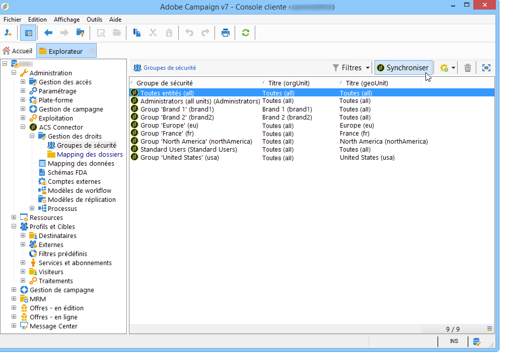

1. Si la gestion des droits est basée sur les dossiers, accédez à **[!UICONTROL Administration > Connecteur ACS > Gestion des droits > Mapping des dossiers]**, puis associez chaque dossier nécessaire à un groupe de sécurité.

   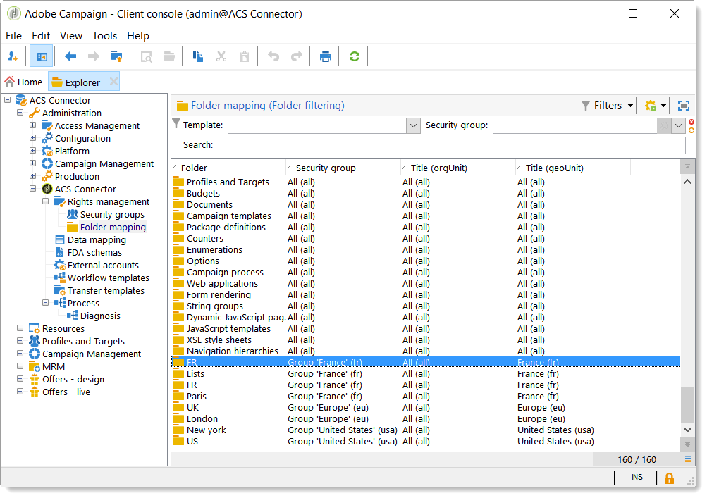

1. Les workflows de réplication utiliseront ensuite ces informations et ajouteront les entités géographiques/organisationnelles correspondantes à chaque objet à répliquer.

### Mise en œuvre avancée {#advanced-implementation}

Cette section décrit certaines des possibilités offertes par la mise en œuvre avancée.

>[!IMPORTANT]
>
>Ces informations ne peuvent être utilisées qu’à titre indicatif.Contactez votre consultant ou consultante Adobe Campaign pour la mise en œuvre.

La mise en œuvre avancée ajoute des workflows de réplication personnalisés selon les besoins du client ou de la cliente.Voici quelques exemples :

* Réplication des diffusions
* Réplication des opérations
* Réplication des programmes
* Réplication des membres des adresses de contrôle
* Réplication transactionnelle
* etc.

**Réplication des champs étendus sur les destinataires**

Avec la mise en œuvre de base, les champs de personne destinataire d’usine sont répliqués.Pour répliquer les champs personnalisés que vous avez ajoutés au schéma de personne destinataire, vous devez les identifier.

1. Dans **[!UICONTROL Administration > Connecteur ACS > Mapping des données]**, créez un mapping de ciblage sur la table **[!UICONTROL nms:recipient]**.

   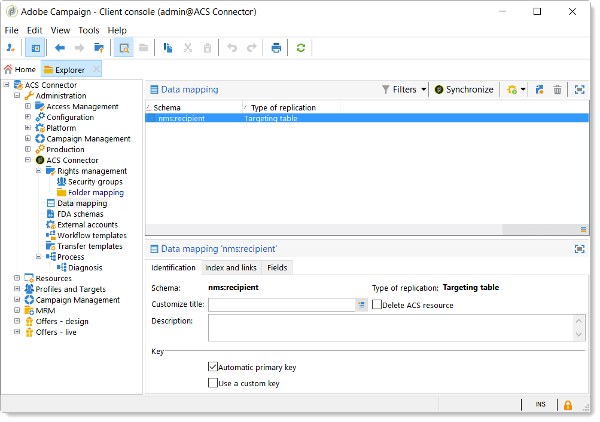

1. Sélectionnez les champs supplémentaires que vous souhaitez répliquer et d’autres informations nécessaires (index, liens, clés d’identification).

   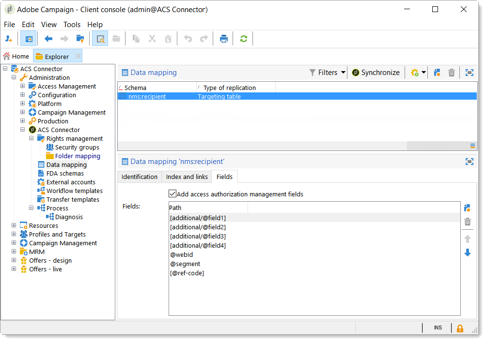

1. Ouvrez le workflow de réplication dédié aux profils (et non le modèle). Modifiez les activités **[!UICONTROL Requête]** et **[!UICONTROL Mise à jour de données]** pour inclure ces champs. Voir [Workflows techniques et de réplication](#technical-and-replication-workflows).

   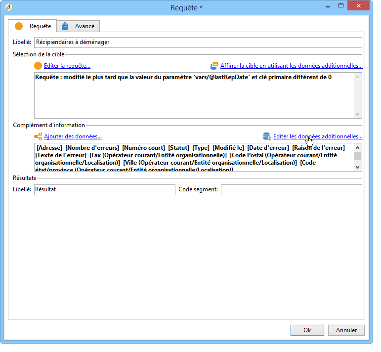

   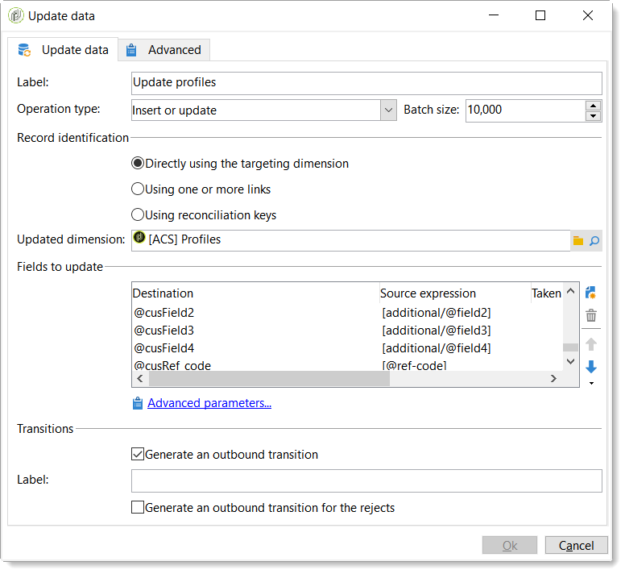

**Réplication des tables personnalisées de profils**

Avec le mise en œuvre de base, la table des personnes destinataires d’usine est répliquée.Si vous avez ajouté des tables personnalisées de personnes destinataires, voici comment les identifier.

1. Dans **[!UICONTROL Administration > Connecteur ACS > Mapping des données]**, créez un mapping de ciblage sur la table personnalisée des profils.

   

1. Définissez les données d’identification, l’index, les liens et les champs que vous souhaitez répliquer.

   

1. Si la gestion des droits est basée sur les dossiers, accédez à **[!UICONTROL Administration > Connecteur ACS > Gestion des droits > Mapping des dossiers]**, puis définissez un groupe de sécurité pour les dossiers associés à vos tables personnalisées. Voir [Conversion des droits](#rights-conversion).
1. Utilisez le workflow **[!UICONTROL Nouvelle réplication]** (pas le modèle, mais l’instance de workflow proprement dite) pour inclure la table personnalisée et les champs à répliquer. Voir [Workflows techniques et de réplication](#technical-and-replication-workflows).
