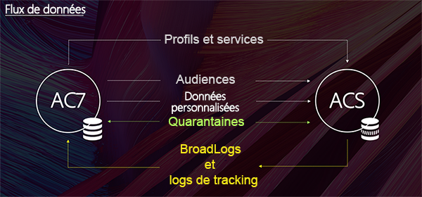

# Prise en main du connecteur ACS{#acs-connector-gs}

ACS Connector relie Adobe Campaign v7 à Adobe Campaign Standard. Il s’agit d’une fonctionnalité intégrée dans Campaign v7 qui réplique automatiquement les données vers Campaign Standard, rassemblant ainsi les meilleures fonctionnalités des deux applications. Campaign v7 contient des outils avancés pour gérer la base marketing principale. La réplication des données depuis Campaign v7 permet à Campaign Standard d’exploiter les données complètes dans un environnement convivial.

Grâce à ACS Connector, les spécialistes du marketing digital continuent à utiliser Campaign Standard pour concevoir, cibler et exécuter des campagnes, tandis que Campaign v7 s&#39;adresse aux utilisateurs orientés données tels que les spécialistes du marketing de base de données.

>[!IMPORTANT]
>
>ACS Connector est disponible uniquement dans le cadre de l&#39;offre Adobe Campaign Prime. Pour plus d&#39;informations sur l&#39;obtention d&#39;une licence Adobe Campaign Prime, contactez votre gestionnaire de compte.
>
>ACS Connector est disponible uniquement pour les architectures hébergées et hybrides. Il n’est pas disponible pour les installations on-premise complètes.
>
>Pour utiliser cette fonctionnalité, vous devez vous connecter à Campaign à l&#39;aide d&#39;un Adobe ID (IMS). Pour plus d&#39;informations, consultez la section [Connexion via un Adobe ID](../../integrations/using/about-adobe-id.md).

Ce document présente la fonctionnalité ACS Connector. Les sections ci-dessous fournissent des informations sur la réplication des données par la fonctionnalité, ainsi que des instructions concernant l’utilisation des profils répliqués.

* [Processus](#process) : vue d’ensemble d’ACS Connector et de la gestion de la réplication des données.
* [Implémentation](#implementation) : vue d’ensemble de la prise en main d’ACS Connector et instructions pour la réplication de données de base et avancées.
* [Synchronisation de profils](../../integrations/using/synchronizing-profiles.md) : instructions pour la réplication de profils et la création de diffusions avec ces derniers.
* [Synchronisation d’audiences](../../integrations/using/synchronizing-audiences.md) : instructions pour le ciblage d’une liste de destinataires dans Campaign v7 et la réplication de la liste vers Campaign Standard sous forme d’audience.
* [Synchronisation d’applications web](../../integrations/using/synchronizing-web-applications.md) : instructions pour la liaison d’applications web de Campaign v7 à Campaign Standard.
* [Résolution des problèmes liés au connecteur ACS](../../integrations/using/troubleshooting-the-acs-connector.md) : validation des réponses aux problèmes courants.

>[!NOTE]
>
>ACS Connector est fourni avec Campaign v7 dans le cadre d’un contrat de licence. Pour utiliser ACS Connector, vérifiez que vous pouvez basculer entre Campaign v7 et Campaign Standard. Si vous ne connaissez pas votre version et les fonctionnalités qui y sont incluses, contactez votre administrateur.

## Processus {#process}

### Réplication des données {#data-replication}

ACS Connector réplique les éléments suivants de façon périodique de Campaign v7 vers Campaign Standard :

* **Destinataires**
* **Abonnements**
* **Services**
* **Landing pages**

Par défaut, la réplication périodique d’ACS Connector a lieu toutes les 15 minutes. Cette fréquence peut être ajustée pour répondre à vos besoins. Si des modifications sont nécessaires, contactez votre consultant.

La réplication des données des destinataires, des abonnements, des services et des landing pages est incrémentale, ce qui signifie que seuls les nouveaux destinataires et les modifications apportées aux destinataires existants sont répliqués de Campaign v7 vers Campaign Standard. Cependant, la réplication d’une audience a lieu dans une seule instance. Vous pouvez créer une audience dans Campaign v7 et la répliquer une fois vers Campaign Standard. La réplication est immédiate et ne peut pas être configurée pour des mises à jour régulières. Pour plus d’informations, voir [Synchronisation des audiences](../../integrations/using/synchronizing-audiences.md).

>[!NOTE]
>
>Soyez patient lors de la réplication initiale d’une base de données volumineuse, car le processus peut prendre plusieurs heures. Les réplications suivantes sont plus rapides car incrémentales.

ACS Connector réplique les éléments suivants de façon périodique de Campaign Standard vers Campaign v7 :

* **[!UICONTROL Identifiants des diffusions]**
* **[!UICONTROL BroadLogs des emails]**
* **[!UICONTROL Logs de tracking des emails]**

La réplication des logs des emails et des identifiants des diffusions permet d’accéder à l’historique des diffusions et aux données de tracking des destinataires v7 depuis Campaign v7.

>[!IMPORTANT]
>
>Seuls les logs de tracking et les broadLogs des emails sont répliqués de Campaign Standard vers Campaign v7.

### Synchronisation des données {#data-synchronization}

ACS Connector synchronise les quarantaines entre Campaign v7 et Campaign Standard.

Par exemple, un profil ayant été répliqué de Campaign v7 vers Campaign Standard contient une adresse e-mail. Si celle-ci est mise en quarantaine par Campaign Standard, ces informations sont transmises à Campaign v7 lors de la synchronisation suivante. Pour plus d’informations sur les quarantaines, consultez les sections [Gestion des quarantaines](../../delivery/using/understanding-quarantine-management.md) et [Quarantaines Campaign Standard](https://experienceleague.adobe.com/docs/campaign-standard/using/testing-and-sending/monitoring-messages/understanding-quarantine-management.html?lang=fr).

### Utilisation de profils répliqués {#using-replicated-profiles}

Les profils répliqués peuvent être utilisés par Campaign Standard et Campaign v7 pour les workflows de ciblage des campagnes marketing.

Pour savoir comment envoyer une diffusion dans Campaign Standard à l’aide de profils répliqués, voir [Synchronisation des profils](../../integrations/using/synchronizing-profiles.md). Des instructions supplémentaires sont fournies pour le partage des données de désabonnement entre Campaign v7 et Campaign Standard.

### Limites {#limitations}

Les profils répliqués sont prêts à l&#39;emploi pour les diffusions, mais présentent certaines limites dans Campaign Standard. Passez en revue les points suivants pour apprendre à gérer ces limites au mieux.

* **Profils en lecture seule dans Campaign Standard** : les profils répliqués sont en lecture seule dans Campaign Standard. Vous pouvez toutefois éditer les destinataires dans Campaign v7 ; les modifications sont mises à jour automatiquement dans Campaign Standard par ACS Connector.
* **Profils créés dans Campaign Standard** : ACS Connector réplique les données des destinataires dans un sens, de Campaign v7 vers Campaign Standard. Par conséquent, les profils issus de Campaign Standard ne sont pas répliqués dans Campaign v7.
* **Données de destinataire de base pour Campaign Standard** : ACS Connector réplique les données des destinataires adaptées à Campaign Standard. Elles comprennent le nom, l&#39;adresse, l&#39;adresse email, le numéro de téléphone mobile, le numéro de téléphone personnel et d&#39;autres coordonnées utiles. Si d&#39;autres champs de destinataire et des tables de ciblage personnalisées de Campaign v7 sont essentiels pour votre workflow, veuillez contacter votre consultant.
* **Import des profils mis en quarantaine** : des listes de profils qui ne souhaitent pas être contactés peuvent être importées dans Campaign v7 ou Campaign Standard en tant que profils mis en quarantaine. Le statut des profils est inclus dans la synchronisation des quarantaines entre les applications et ces profils ne sont pas utilisés dans les diffusions.
* **Désinscription à un service dans Campaign Standard** : le choix de se désinscrire d’une diffusion n&#39;est pas synchronisé de Campaign Standard vers Campaign v7. Vous pouvez toutefois configurer une diffusion Campaign Standard pour rediriger son lien de désinscription vers Campaign v7. Le profil d&#39;un destinataire qui clique sur le lien de désinscription est mis à jour dans Campaign v7 et les données sont répliquées vers Campaign Standard. Consultez la section [Modification du lien de désinscription](../../integrations/using/synchronizing-profiles.md#changing-the-unsubscription-link).
* Seuls les logs de tracking et les broadLogs des e-mails sont répliqués de Campaign Standard vers Campaign v7.

### Facturation {#billing}

L’application choisie (Campaign v7 ou Campaign Standard) pour envoyer les diffusions n’a aucune incidence sur la facturation. Les informations de facturation sont réconciliées entre Campaign v7 et Campaign Standard. Par conséquent, si vous envoyez des diffusions à un même destinataire à l’aide des deux applications, il est toujours comptabilisé comme un seul profil actif.

## Mise en œuvre {#implementation}

Il existe deux types de mises en œuvre d&#39;ACS Connector, qui sont toujours effectuées par l&#39;équipe Consulting d&#39;Adobe Campaign.

>[!IMPORTANT]
>
>Cette section est destinée aux utilisateurs experts uniquement. Elle a pour but de leur donner une vue générale de la mise en œuvre et de ses principales étapes.
>
>N&#39;essayez en aucun cas d&#39;effectuer ces mises en œuvre par vous-même. Celles-ci doivent être réalisées exclusivement par les consultants Adobe Campaign.

La **mise en œuvre de base** vous permet de répliquer les destinataires (champs d&#39;usine), les services, les abonnements, les applications web et les audiences. Il s&#39;agit d&#39;une réplication unidirectionnelle de Campaign v7 vers Campaign Standard.

La **mise en œuvre avancée** permet des cas d’utilisation plus complexes, si vous disposez de champs de destinataire supplémentaires ou de tables de destinataires personnalisées (table des transactions), par exemple. Voir [Mise en œuvre avancée](#advanced-implementation).

### Installation du package {#installing-the-package}

Pour permettre l’utilisation de cette fonctionnalité, le package **[!UICONTROL ACS Connector]** doit être installé. Cette étape est toujours effectuée par l’administrateur technique ou le consultant Adobe.

Tous les éléments techniques liés à ACS Connector sont disponibles dans le nœud **[!UICONTROL Administration > ACS Connector]** de l’explorateur.

### Workflows techniques et de réplication {#technical-and-replication-workflows}

Après l’installation du package, deux workflows techniques sont disponibles dans **[!UICONTROL Administration > ACS Connector > Traitement]**.

>[!IMPORTANT]
>
>Ne tentez jamais de modifier ces workflows. Ils ne doivent jamais être en erreur ou en pause. Si ce type de situation se produit, veuillez contacter votre consultant Adobe Campaign.

* **[!UICONTROL `[ACS] Quarantine synchronization`]** (quarantineSync) : ce processus synchronise toutes les informations de quarantaine. Toutes les nouvelles mises en quarantaine dans Campaign v7 sont répliquées dans Campaign Standard. Toutes les nouvelles mises en quarantaine de Campaign Standard sont répliquées dans Campaign v7. Cela garantit que toutes les règles d’exclusion sont synchronisées entre Campaign v7 et Campaign Standard.
* **[!UICONTROL `[ACS] Security group synchronization`]** (securityGroupSync) : ce processus est utilisé pour la conversion des droits. Voir [Conversion des droits](#rights-conversion).

Les workflows de réplication ci-dessous sont disponibles en tant que modèles « prêts à l&#39;emploi ». Ils doivent être mis en œuvre par votre consultant Adobe Campaign.

* **[!UICONTROL `[ACS] Profile replication`]** (newProfileReplication) : ce processus incrémentiel reproduit les destinataires dans Campaign Standard. Par défaut, il reproduit tous les champs du destinataire prêts à l’emploi. Voir [Champs du destinataire par défaut](#default-recipient-fields).
* **[!UICONTROL `[ACS] Service replication`]** (newServiceReplication) : ce processus incrémentiel reproduit les services sélectionnés dans Campaign Standard. Voir le cas d’utilisation [Synchronisation des applications Web](../../integrations/using/synchronizing-web-applications.md).
* **[!UICONTROL `[ACS] Landing pages replication`]** (newLandingPageReplication) : ce processus incrémentiel reproduit les applications Web sélectionnées dans Campaign Standard. Les applications Web de Campaign v7 apparaissent comme des landing pages dans Campaign Standard. Voir le cas d’utilisation [Synchronisation des applications Web](../../integrations/using/synchronizing-web-applications.md).
* **[!UICONTROL `[ACS] New replication`]** (newReplication) : ce workflow incrémental est un exemple qui peut être utilisé pour répliquer une table personnalisée. Voir [Mise en œuvre avancée](#advanced-implementation).
* **[!UICONTROL `[ACS] Delivery-message replication`]** (newDlvMsgQualification) : ce workflow incrémental réplique les messages de diffusion de Campaign Standard vers Campaign v7.
* **[!UICONTROL `[ACS] Profile delivery log replication`]** (newRcpDeliveryLogReplication) : ce processus incrémentiel reproduit les ID de diffusion, les broadLogs et les logs de tracking des emails de Campaign Standard vers Campaign v7. Il ne prend en compte que les diffusions envoyées de Campaign Standard aux profils qui font partie de la table nms:recipients de Campaign v7.

  >[!NOTE]
  >
  > Si des instances Campaign Classic et Campaign Standard sont utilisées pour envoyer des e-mails avec des URL trackées, un problème lié à des tagID d’URL en double peut se produire pendant la synchronisation. Pour éviter cela, mettez à jour l&#39;activité **Mise à jour des URL de tracking** (writerTrackingUrls) dans le workflow et ajoutez le préfixe « ACS » à l&#39;expression source @tagId.

* **[!UICONTROL `[ACS] New delivery log replication`]** (newRcpDeliveryLogReplication) : ce processus incrémentiel reproduit les ID de diffusion, les broadLogs et les logs de tracking des emails de Campaign Standard vers Campaign v7. Il ne prend en compte que les livraisons envoyées de Campaign Standard aux profils qui font partie d’une table spécifique (autre que nms:recipients) de Campaign v7.

### Champs de destinataire par défaut {#default-recipient-fields}

Les champs supplémentaires et les tables personnalisées (table des transactions, par exemple) ne sont pas répliqués par défaut. Une configuration avancée est nécessaire. Voir [Mise en œuvre avancée](#advanced-implementation).

Vous trouverez ci-dessous la liste des champs de destinataire répliqués dans le cadre d’une mise en œuvre de base. Il s’agit des champs d’usine :

<table> 
 <tbody> 
  <tr> 
   <td> <strong>Libellé</strong>  </td> 
   <td> <strong>Nom interne</strong>  </td> 
  </tr> 
  <tr> 
   <td> Source Id  </td> 
   <td> @sourceId  </td> 
  </tr> 
  <tr> 
   <td> Date de création  </td> 
   <td> @created  </td> 
  </tr> 
  <tr> 
   <td> Date de modification  </td> 
   <td> @lastModified  </td> 
  </tr> 
  <tr> 
   <td> Email  </td> 
   <td> @email  </td> 
  </tr> 
  <tr> 
   <td> Last name  </td> 
   <td> @lastName  </td> 
  </tr> 
  <tr> 
   <td> First name  </td> 
   <td> @firstName  </td> 
  </tr> 
  <tr> 
   <td> Middle name  </td> 
   <td> @middleName  </td> 
  </tr> 
  <tr> 
   <td> Mobile  </td> 
   <td> @mobilePhone  </td> 
  </tr> 
  <tr> 
   <td> Date de naissance  </td> 
   <td> @birthDate  </td> 
  </tr> 
  <tr> 
   <td> Genre  </td> 
   <td> @gender  </td> 
  </tr> 
  <tr> 
   <td> Civilité  </td> 
   <td> @salutation  </td> 
  </tr> 
  <tr> 
   <td> No longer contact (by any channel)  </td> 
   <td> @blackList  </td> 
  </tr> 
  <tr> 
   <td> No longer contact by email  </td> 
   <td> @blackListEmail  </td> 
  </tr> 
  <tr> 
   <td> No longer contact by SMS  </td> 
   <td> @blackListMobile  </td> 
  </tr> 
  <tr> 
   <td> Phone  </td> 
   <td> @phone  </td> 
  </tr> 
  <tr> 
   <td> Fax  </td> 
   <td> @fax  </td> 
  </tr> 
  <tr> 
   <td> Adresse 1 (appartement)  </td> 
   <td> [location/@address1]  </td> 
  </tr> 
  <tr> 
   <td> Adresse 2  </td> 
   <td> [location/@address2]  </td> 
  </tr> 
  <tr> 
   <td> Adresse 3 (numéro et rue)  </td> 
   <td> [location/@address3]  </td> 
  </tr> 
  <tr> 
   <td> Adresse 4 (lieu-dit)  </td> 
   <td> [location/@address4]  </td> 
  </tr> 
  <tr> 
   <td> Code Postal  </td> 
   <td> [location/@zipCode]  </td> 
  </tr> 
  <tr> 
   <td> Ville  </td> 
   <td> [location/@city]  </td> 
  </tr> 
  <tr> 
   <td> Code état/province  </td> 
   <td> [location/@stateCode]  </td> 
  </tr> 
  <tr> 
   <td> Code pays  </td> 
   <td> [location/@countryCode]  </td> 
  </tr> 
 </tbody> 
</table>

### Conversion des droits {#rights-conversion}

Les droits sont gérés différemment dans Campaign v7 et dans Campaign Standard. Dans Campaign v7, la gestion des droits est basée sur les dossiers, tandis que dans Campaign Standard, elle repose sur l&#39;accès aux entités (entités organisationnelles/géographiques). Un utilisateur de Campaign Standard appartient au groupe de sécurité qui contient le contexte des restrictions. Le système des droits de Campaign v7 doit donc être converti pour correspondre à celui de Campaign Standard. La conversion des droits peut se faire de plusieurs façons. Vous trouverez ci-dessous un exemple de mise en œuvre.

1. Dans **[!UICONTROL Administration > ACS Connector > Gestion des droits > Groupes de sécurité]**, utilisez le bouton **[!UICONTROL Synchroniser]** pour récupérer tous les groupes de sécurité de Campaign Standard. Les groupes d&#39;usine de Campaign Standard sont exclus.

   

1. Si la gestion des droits est basée sur les dossiers, accédez à **[!UICONTROL Administration > ACS Connector > Gestion des droits > Mapping des dossiers]**, puis associez chaque dossier nécessaire à un groupe de sécurité.

   

1. Les workflows de réplication utiliseront ensuite ces informations et ajouteront les entités géographiques/organisationnelles correspondantes à chaque objet à répliquer.

### Mise en œuvre avancée {#advanced-implementation}

Cette section décrit certaines des possibilités offertes par la mise en œuvre avancée.

>[!IMPORTANT]
>
>Ces informations ne sont que des indications générales. Contactez votre consultant Adobe Campaign pour la mise en œuvre.

La mise en œuvre avancée ajoute des workflows de réplication personnalisés selon les besoins du client. Voici quelques exemples :

* Réplication des diffusions
* Réplication des opérations
* Réplication des programmes
* Réplication des membres des adresses de contrôle
* Réplication transactionnelle
* etc.

**Réplication des champs étendus sur les destinataires**

Les champs de destinataire d’usine sont répliqués dans le cadre de la mise en œuvre de base. Pour répliquer les champs personnalisés que vous avez ajoutés au schéma de destinataire, il faut les identifier.

1. Dans **[!UICONTROL Administration > ACS Connector > Mapping des données]**, créez un mapping de ciblage sur la table **[!UICONTROL nms:recipient]**.

   

1. Sélectionnez les champs supplémentaires que vous souhaitez répliquer et d’autres informations nécessaires (index, liens, clés d’identification).

   

1. Ouvrez le workflow de réplication dédié aux profils (et non le modèle). Modifiez les activités **[!UICONTROL Requête]** et **[!UICONTROL Mise à jour de données]** pour inclure ces champs. Voir [Workflows techniques et de réplication](#technical-and-replication-workflows).

   

   

**Réplication des tables personnalisées de profils**

La table des destinataires d’usine est répliquée dans le cadre de la mise en œuvre de base. Si vous avez ajouté des tables personnalisées de destinataires, voici comment les identifier.

1. Dans **[!UICONTROL Administration > ACS Connector > Mapping des données]**, créez un mapping de ciblage sur la table personnalisée des profils.

   

1. Définissez les données d’identification, l’index, les liens et les champs que vous souhaitez répliquer.

   

1. Si la gestion des droits est basée sur les dossiers, accédez à **[!UICONTROL Administration > ACS Connector > Gestion des droits > Mapping des dossiers]**, puis définissez un groupe de sécurité pour les dossiers associés à vos tables personnalisées. Voir [Conversion des droits](#rights-conversion).
1. Utilisez le workflow **[!UICONTROL Nouvelle réplication]** (et non le modèle) pour inclure la table personnalisée et les champs à répliquer. Voir [Workflows techniques et de réplication](#technical-and-replication-workflows).
