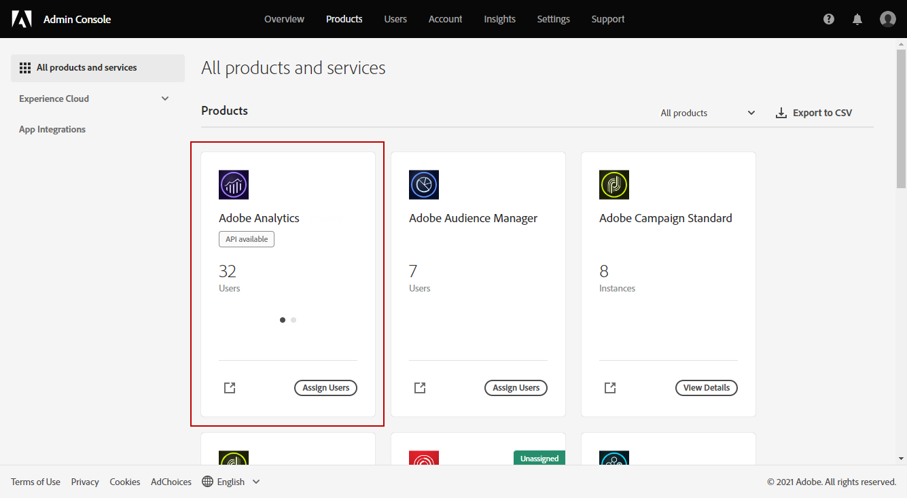
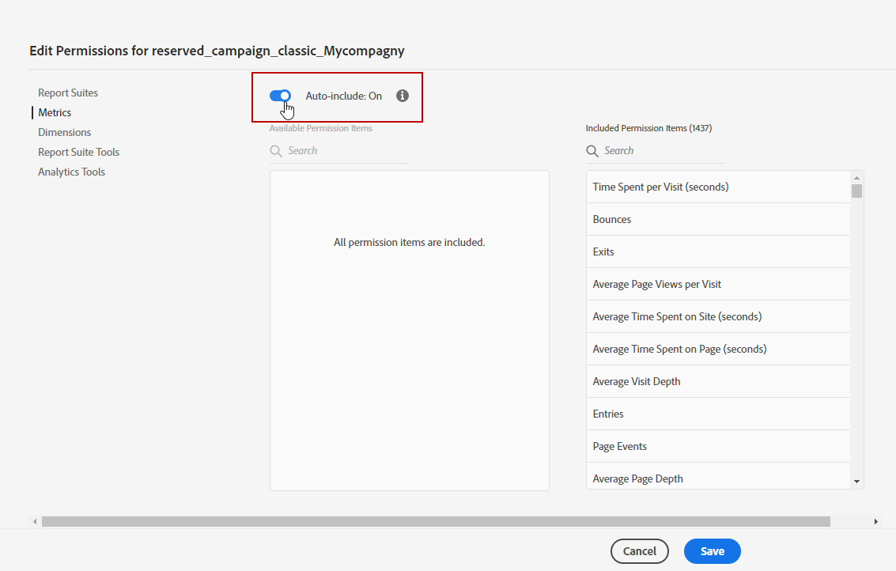

# Approvisionnement du connecteur Adobe Analytics {#adobe-analytics-connector-provisioning}

>[!CAUTION]
>
> Ces étapes ne doivent être effectuées que par des implémentations hybrides et On-premise.
>
>Pour les implémentations hébergées et Managed Services de Campaign, veuillez contacter [l’assistance clientèle d’Adobe](https://helpx.adobe.com/fr/enterprise/admin-guide.html/enterprise/using/support-for-experience-cloud.ug.html).

L’intégration entre l’authentification d’Adobe Campaign Classic et d’Adobe Analytics prend en charge Adobe Identity Management Service (IMS) :

* Si vous gérez un compte externe migré, vous devez mettre en œuvre Adobe IMS et vous connecter à Adobe Campaign via un Adobe ID.

  L’utilisateur ou l’utilisatrice qui se connecte via Adobe ID IMS doit être propriétaire du compte **Connecteur de données** dans Adobe Analytics et disposer d’un ensemble d’autorisations pour le **Profil de produit** mentionné [ci-dessous](#analytics-product-profile).

Le problème était que la personne propriétaire du connecteur de données ne correspondait pas à la personne connectée à Campaign et qui tentait l’intégration à Analytics.

* Si vous implémentez un nouveau connecteur, la mise en œuvre d’Adobe IMS est facultative. En l’absence d&#39;un utilisateur Adobe ID, Adobe Campaign utilisera un utilisateur technique pour se synchroniser avec Adobe Analytics.

Pour que cette intégration fonctionne, vous devez créer un profil produit Adobe Analytics qui sera utilisé exclusivement pour le connecteur Analytics. Vous devez ensuite créer un projet Developer Console.

>[!AVAILABILITY]
>
> Les informations d’identification de compte de service (JWT) étant abandonnées par Adobe, les intégrations de Campaign aux solutions et aux applications Adobe doivent désormais utiliser des informations d’identification OAuth serveur à serveur. 
>
> * Si vous avez implémenté des intégrations entrantes pour Campaign, vous devez migrer votre compte technique comme décrit dans [cette documentation](https://developer.adobe.com/developer-console/docs/guides/authentication/ServerToServerAuthentication/migration/#_blank). Les [informations d’identification de compte de service (JWT)](oauth-technical-account.md) existantes continueront de fonctionner jusqu’au 27 janvier 2025. 
>
> * Si vous avez implémenté des intégrations sortantes, telles qu’une intégration Campaign-Analytics ou une intégration Experience Cloud Triggers, celles-ci continueront de fonctionner jusqu’au 27 janvier 2025. Toutefois, avant cette date, vous devez mettre à niveau votre environnement Campaign vers la version 7.4.1 et migrer votre compte technique vers OAuth.

## Création d’un profil produit Adobe Analytics {#analytics-product-profile}

Le profil produit détermine le niveau d’accès d’un utilisateur à vos différents composants Analytics.

Si vous disposez déjà d’un profil produit Analytics, vous devez tout de même créer un profil produit Adobe Analytics qui sera utilisé exclusivement pour le connecteur Analytics. Cela permet de s’assurer que votre profil produit est défini avec les autorisations appropriées pour cette intégration.

Pour en savoir plus sur les profils produit, consultez la [documentation relative à Admin Console](https://helpx.adobe.com/fr/enterprise/admin-guide.html).

1. Dans [Admin Console](https://adminconsole.adobe.com/), sélectionnez votre **[!UICONTROL Produit]** Adobe Analytics.

   

1. Cliquez sur **[!UICONTROL Nouveau profil]**.

   

1. Ajoutez un **[!UICONTROL Nom de profil produit]**. Nous vous suggérons d’utiliser la syntaxe suivante : `reserved_campaign_classic_<Company Name>`. Cliquez ensuite sur **[!UICONTROL Suivant]**.

   Ce **[!UICONTROL Profil produit]** doit être utilisé exclusivement pour le connecteur Analytics, ceci afin d’éviter les erreurs de configuration incorrecte.

1. Ouvrez le **[!UICONTROL Profil produit]** que vous venez de créer et sélectionnez l’onglet **[!UICONTROL Autorisations]**.

   

1. Configurez les différentes fonctionnalités en cliquant sur **[!UICONTROL Modifier]**, puis sélectionnez les autorisations à attribuer à votre **[!UICONTROL Profil produit]** en cliquant sur l’icône représentant un plus (+).

   Pour en savoir plus sur la gestion des autorisations, consultez la [documentation relative à Admin Console](https://helpx.adobe.com/fr/enterprise/using/manage-permissions-and-roles.html).

1. Pour la fonctionnalité **[!UICONTROL Suites de rapports]**, ajoutez les **[!UICONTROL Suites de rapports]** dont vous aurez besoin ultérieurement.

   Si vous ne disposez d’aucune suite de rapports, vous pouvez en créer une en suivant [cette procédure](../../integrations/using/gs-aa.md).

   

1. Pour la fonctionnalité **[!UICONTROL Mesures]**, ajoutez les **[!UICONTROL Mesures]** que vous devrez configurer ultérieurement.

   Si nécessaire, vous pouvez activer l’option Inclusion automatique, qui ajoute chaque élément d’autorisation dans la liste incluse et ajoute automatiquement de nouveaux éléments d’autorisation.

   

1. Pour les fonctionnalités liées aux **[!UICONTROL Dimensions]**, ajoutez les **[!UICONTROL Dimensions]** nécessaires pour la configuration ultérieure.

   Assurez-vous que les Dimensions sélectionnées correspondent à celles à configurer dans le compte externe et coïncident avec le nombre d’eVars correspondant d’Adobe Analytics.

1. Pour la fonctionnalité **[!UICONTROL Outils de suites de rapports]**, ajoutez les autorisations suivantes :

   * **[!UICONTROL Gestion des suites de rapports]**
   * **[!UICONTROL Variables de conversion]**
   * **[!UICONTROL Événements de succès]**
   * **[!UICONTROL Rapport Data Warehouse personnalisé]**
   * **[!UICONTROL Gestionnaire des sources de données]**
   * **[!UICONTROL Classifications]**

1. Pour la fonctionnalité **[!UICONTROL Outils Analytics]**, ajoutez les autorisations suivantes :

   * **[!UICONTROL Gestionnaire de code - Services web]**
   * **[!UICONTROL Logs - Services web]**
   * **[!UICONTROL Services web]**
   * **[!UICONTROL Accès aux services web]**
   * **[!UICONTROL Création de mesure calculée]**
   * **[!UICONTROL Création de segment]**

Votre profil produit est désormais configuré. Vous devez ensuite créer le projet OAuth.

## Créer un projet OAuth {#create-adobe-io}

Pour poursuivre la configuration de votre connecteur Adobe Analytics, accédez à Adobe Developer Console et créez votre projet OAuth serveur à serveur.

Consultez [cette page](oauth-technical-account.md#oauth-service) pour accéder à la documentation détaillée.

## Configuration et utilisation {#adobe-analytics-connector-usage}

Découvrez comment utiliser Adobe Campaign et Adobe Analytics dans la [Documentation d’Adobe Campaign v8](https://experienceleague.adobe.com/fr/docs/campaign/campaign-v8/connect/ac-aa){target="_blank"}.