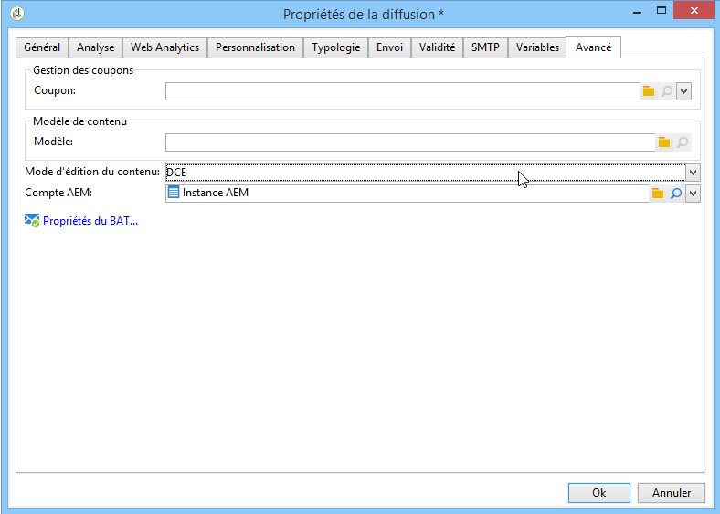

# Configuration de l’accès à Assets{#configuring-access-to-assets}

Cette section décrit les étapes de configuration nécessaires dans Adobe Campaign pour utiliser les fonctionnalités d’intégration avec Assets core service ou la bibliothèque Adobe Experience Manager Assets (AEM Assets).

>[!CAUTION]
>
>Ces intégrations sont concurrentes. Lisez attentivement les informations suivantes avant de procéder à toute configuration.

* Intégration avec **Experience Cloud Assets** : cette intégration vous permet d’insérer des images à partir de votre bibliothèque Adobe Experience Cloud. Cette intégration doit être configurée en installant le package intégré **[!UICONTROL Intégration avec Adobe Experience Cloud]** dans Adobe Campaign.
* Intégration avec **AEM Assets** : cette intégration vous permet d’insérer des images à partir de votre bibliothèque Adobe Experience Manager Assets. Cette intégration doit être configurée en installant le package natif **[!UICONTROL Intégration AEM]** dans Adobe Campaign. Notez que cette intégration n’est plus disponible à partir d’Adobe Experience Manager 6.4.

>[!NOTE]
>
>Si les deux packages (**[!UICONTROL Intégration AEM]** et **[!UICONTROL Intégration avec Adobe Experience Cloud]**) sont installés, seules les ressources disponibles dans la bibliothèque Adobe Experience Cloud peuvent être utilisées.

## Intégration avec Experience Cloud Assets {#integrating-with-experience-cloud-assets}

Afin de pouvoir utiliser l&#39;intégration entre Adobe Campaign et Experience Cloud Assets, les éléments suivants sont requis :

* une organisation Adobe Experience Cloud
* le mode d&#39;authentification IMS Adobe activé

Pour activer la connexion entre Adobe Campaign et Adobe Experience Cloud, configurez la connexion via IMS (service de connexion Adobe ID). Cette configuration est décrite dans le document [Connexion via un Adobe ID](../../integrations/using/about-adobe-id.md). Elle comprend notamment :

* l’installation du package **[!UICONTROL Intégration avec Adobe Experience Cloud]**.
* la configuration d&#39;un compte externe Adobe Experience Cloud.

>[!NOTE]
>
>Les fonctionnalités liées à cette intégration sont uniquement disponibles pour les utilisateurs connectés avec leur Adobe ID via IMS.

## Intégration avec AEM Assets {#integrating-with-aem-assets}

>[!CAUTION]
>
>Cette fonctionnalité a été désactivée à partir d’Adobe Experience Manager 6.4. [En savoir plus](https://experienceleague.adobe.com/docs/experience-manager-64/release-notes/deprecated-removed-features.html?lang=en#removed-features)

Pour intégrer AEM Assets avec Adobe Campaign, vous devez tout d&#39;abord configurer l&#39;intégration entre Adobe Experience Manager et Adobe Campaign. Cette configuration comprend notamment :

* l&#39;installation du package intégré **[!UICONTROL AEM Integration]**.
* la configuration d&#39;un compte externe spécifique à Adobe Experience Manager.

Découvrez comment intégrer Adobe Campaign et Adobe Experience Manager dans la [documentation détaillée](../../integrations/using/about-adobe-experience-manager.md).

Une fois cette intégration configurée, vous pouvez configurer un nouveau modèle de diffusion dans Adobe Campaign afin d&#39;utiliser la bibliothèque AEM Assets. Pour cela, procédez comme suit :

1. Créez un modèle de diffusion ou dupliquez un modèle existant. Pour plus d&#39;informations sur les modèles de diffusion, consultez [cette page](../../delivery/using/about-templates.md).
1. Editez les **Propriétés** de ce modèle.
1. Dans l&#39;onglet **[!UICONTROL Avancé]**, définissez le **[!UICONTROL Mode d&#39;édition du contenu]** sur **DCE**.
1. Sélectionnez le **[!UICONTROL Compte AEM]** externe que vous devez utiliser pour accéder à la bibliothèque AEM Assets.

   

Lorsque vous insérez des images dans le contenu d&#39;une diffusion d&#39;après ce modèle, l&#39;option **[!UICONTROL Sélectionner une ressource partagée]** permettra de parcourir les images de la bibliothèque AEM Assets. En savoir plus dans [cette section](../../integrations/using/inserting-a-shared-asset.md).

>[!NOTE]
>
>Si le package **[!UICONTROL Intégration avec Adobe Experience Cloud]** est également installé sur votre instance Adobe Campaign, vous ne pourrez utiliser que les ressources disponibles dans la bibliothèque Adobe Experience Cloud. Pour accéder également aux ressources de votre bibliothèque AEM Assets, vous devez synchroniser AEM Assets et Adobe Experience Cloud. Les ressources d’AEM Assets seront alors également disponibles dans la bibliothèque Adobe Experience Cloud. Dans ce cas, il n&#39;est pas nécessaire de créer un modèle de diffusion spécifique.
