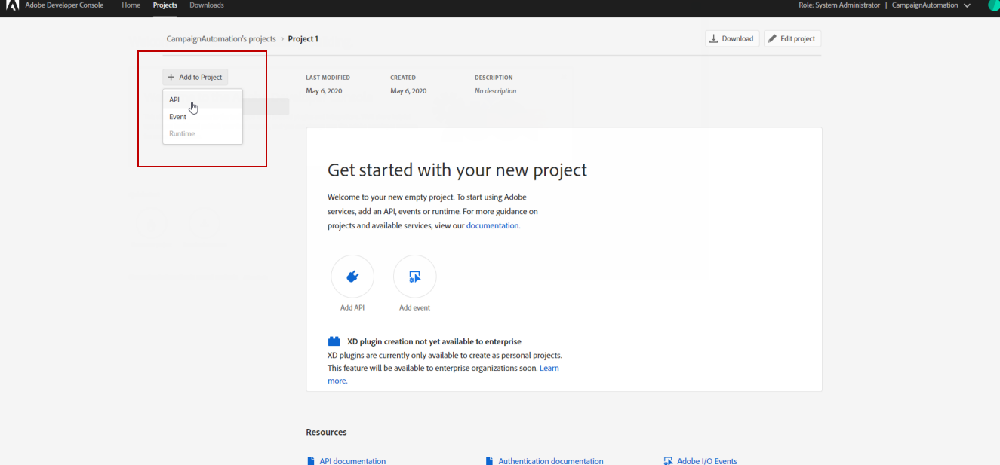

# Configuration des E/S d&#39;Adobe pour les déclencheurs Adobe Experience Cloud {#configuring-adobe-io}

Les configurations préalables requises sont les suivantes :

* Adobe Campaign Classic construit ACC-19.1.9 ou ACC-20.2.1 et versions ultérieures.
* un IMSOrgID valide.
* a Accès des développeurs à l&#39;organisation IMS. Vous devez demander les privilèges d&#39;administrateur système de l&#39;organisation IMS pour suivre la procédure décrite dans cette [page](https://helpx.adobe.com/ca/enterprise/admin-guide.html/ca/enterprise/using/manage-developers.ug.html) afin de fournir cet accès à tous les Profils de produits.

## Étape 1 : Créer/mettre à jour un projet d&#39;E/S Adobe {#creating-adobe-io-project}

1. Accédez à l&#39;E/S de l&#39;Adobe et connectez-vous avec le droit Administrateur système pour IMSorg.

   >[!NOTE]
   >
   > Assurez-vous d’être connecté au portail IMSorg approprié.

1. Extrayez l’ID client d’intégration existant du fichier de configuration de l’instance ims/authIMSTAClientId. Un attribut non existant ou vide indique que l’ID client n’est pas configuré.

   >[!NOTE]
   >
   >Si votre ID de client est vide, vous pouvez directement **[!UICONTROL créer un nouveau projet]** dans les E/S d’Adobe.

1. Vous devez maintenant identifier le projet existant à l’aide de l’ID client extrait. Recherchez des projets existants avec le même ID client que celui extrait à l’étape précédente.

   

1. Sélectionnez **[!UICONTROL + Ajouter au projet]** et choisissez **[!UICONTROL API]**.

   

1. Dans la fenêtre **[!UICONTROL Ajouter une API]**, sélectionnez **[!UICONTROL Adobe Analytics]**.

   

1. Sélectionnez **[!UICONTROL Service Account (JWT)]** comme type d’authentification.

   

1. Si l’ID client est vide, sélectionnez **[!UICONTROL Générer une paire]** de clés pour créer une paire de clés publique et privée.

   

1. Téléchargez votre clé publique et cliquez sur **[!UICONTROL Suivant]**.

   

1. Sélectionnez le profil de produit appelé **Analytics-&lt; Nom de l’entreprise >** et cliquez sur **[!UICONTROL Enregistrer l’API]** configurée.

   

1. Dans votre projet, sélectionnez Compte **[!UICONTROL de service (JWT)]** et copiez les informations suivantes :
   * **[!UICONTROL Identifiant du client]**
   * **[!UICONTROL Secret client]**
   * **[!UICONTROL ID de compte technique]**
   * **[!UICONTROL Identifiant de l&#39;organisation]**

   

## Étape 2 : Ajouter les informations d’identification du projet dans Adobe Campaign {#add-credentials-campaign}

Pour ajouter les informations d’identification du projet dans Adobe Campaign, exécutez la commande suivante en tant qu’utilisateur néolane sur tous les conteneurs de l’instance Adobe Campaign pour insérer les informations d’identification du compte **** technique dans le fichier de configuration de l’instance.

```
nlserver config -instance:<instance name> -setimsjwtauth:Organization_Id/Client_Id/Technical_Account_ID[/Client_Secret[/Base64_encoded_Private_Key]]
```

>[!NOTE]
>
>Vous devez coder la clé privée au format base64 UTF-8. N&#39;oubliez pas de supprimer la nouvelle ligne de la clé avant de la coder, à l&#39;exception de la clé privée. La clé privée doit être la même que celle utilisée pour créer l’intégration.

## Étape 3 : Mise à jour de la balise en pipeline {#update-pipelined-tag}

Pour mettre à jour [!DNL pipelined] la balise, vous devez mettre à jour le type d’authentification vers le projet d’E/S d’Adobe dans le fichier de configuration **config-&lt; nom-instance >.xml** comme suit :

```
<pipelined ... authType="imsJwtToken"  ... />
```

>[!NOTE]
>
>Si vous utilisez l’ancienne version de Triggers Integration à l’aide de jetons JWT hérités, vous devez également ajouter l’API d’E/S d’Adobe pour [!DNL Adobe Analytics] les détails de la première étape afin de migrer automatiquement vers la nouvelle authentification Triggers.
