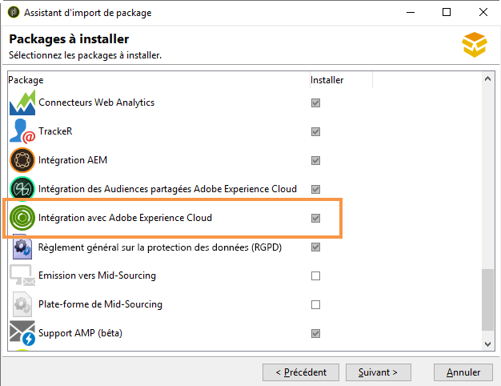
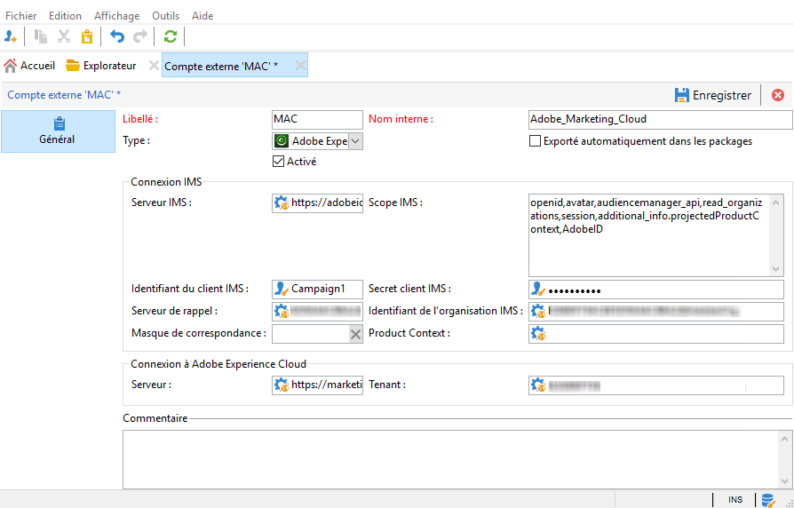

# Paramétrer IMS{#configuring-ims}

>[!IMPORTANT]
>
>L’implémentation d’Adobe IMS est strictement réservée aux administrateurs techniques d’Adobe. Contactez votre chargé de compte Adobe pour démarrer le processus de mise en œuvre.

## Conditions préalables requises {#prerequisites}

Pour utiliser l&#39;intégration avec l&#39;IMS, les éléments suivants sont requis :

* Vous devez disposer d’un nom et d’un identifiant de l’organisation Adobe Experience Cloud. Pour trouver l’identifiant de votre organisation, reportez-vous à [cette page](https://experienceleague.adobe.com/docs/core-services/interface/administration/organizations.html?lang=fr){_blank}.
* Vous devez ajouter des utilisateurs dans Experience Cloud. Pour en savoir plus, reportez-vous à [cette page](https://experienceleague.adobe.com/docs/core-services/interface/administration/admin-getting-started.html?lang=fr){_blank}.

>[!NOTE]
>
>Veuillez vous assurer que vos utilisateurs sont associés à des groupes Adobe Experience Cloud qui seront synchronisés avec Adobe Campaign. [En savoir plus](#configuring-the-external-account).

## Mettre à jour la console {#updating-the-console}

Pour utiliser cette fonctionnalité, vous devez impérativement installer la version la plus récente de la console.

## Installer le package {#installing-the-package}

Vous devez installer le pack intégré **[!UICONTROL Intégration à Adobe Experience Cloud]**. L’installation d’un pack d’intégration est identique à l’installation d’un pack standard, qui est détaillée dans [cette page](../../installation/using/installing-campaign-standard-packages.md).

## Configurer le compte externe {#configuring-the-external-account}

Configurez le compte externe **Adobe Experience Cloud** dans **[!UICONTROL Administration > Plateforme > Comptes externes]**.

>[!CAUTION]
>
>Ce paramétrage est réservé à l&#39;administrateur technique.

Renseignez les informations suivantes :

* les informations de connexion au serveur IMS utilisé (identifiant et secret). Ces informations sont fournies par le support Adobe. Pour plus d&#39;informations, consultez la [FAQ Adobe Experience Cloud](https://experienceleague.adobe.com/docs/core-services/interface/manage-users-and-products/faq.html?lang=fr).

  L&#39;adresse du **[!UICONTROL Serveur de rappel]** (callback server) doit être indiquée en **https**. Ce champ correspond à l&#39;URL d&#39;accès à votre instance Adobe Campaign.

* Identifiant de l’organisation : pour trouver l’identifiant de votre organisation, reportez-vous à [cette page](https://experienceleague.adobe.com/docs/core-services/interface/administration/organizations.html?lang=fr){_blank}.
* Le masque de correspondance : ce champ permet de définir la syntaxe qui permettra la synchronisation des noms de configuration dans Enterprise Dashboard avec les groupes d’Adobe Campaign. Si vous utilisez la syntaxe « Campaign - tenant_id - (&#42;) », le groupe de sécurité créé dans Adobe Campaign sera associé au nom de configuration « Campaign - tenant_id - internal_name » dans Enterprise Dashboard.

  >[!CAUTION]
  >
  >Le masque de correspondance est indispensable au bon fonctionnement de la connexion via l&#39;Adobe ID.

* les informations de connexion à Adobe Experience Cloud, notamment le nom du tenant Adobe Experience Cloud.
