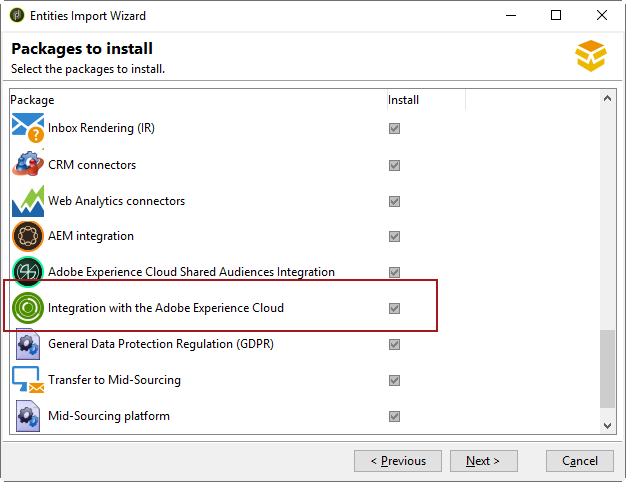
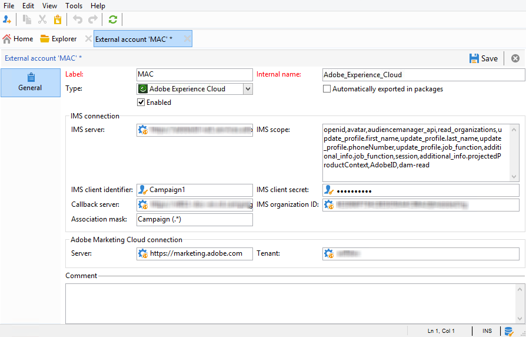

# Paramétrer IMS{#configuring-ims}

>[!IMPORTANT]
>
>En tant qu’utilisateur ou utilisatrice de Campaign hébergé ou des services gérés, votre implémentation d’Adobe IMS appartient à Adobe. Les étapes décrites ci-dessous s’appliquent uniquement aux clientes et clients sur site et hybrides.
> L’implémentation d’Adobe IMS ne doit être effectuée que par les administrateurs et administratrices techniques d’Adobe. Contactez votre représentant ou représentante Adobe pour démarrer le processus d’implémentation.

## Conditions préalables {#prerequisites}

* Vous devez disposer d’un nom et d’un identifiant de l’organisation Adobe Experience Cloud. Pour trouver l’identifiant de votre organisation, reportez-vous à [cette page](https://experienceleague.adobe.com/docs/core-services/interface/administration/organizations.html?lang=fr){_blank}.
* Vous devez ajouter des utilisateurs dans Experience Cloud. Voir à ce propos [cette page](https://experienceleague.adobe.com/docs/core-services/interface/administration/admin-getting-started.html?lang=fr){_blank}.

>[!NOTE]
>
>Veuillez vous assurer que vos utilisateurs sont associés à des groupes Adobe Experience Cloud qui seront synchronisés avec Adobe Campaign. [En savoir plus](#configuring-the-external-account).

## Mettre à jour la console {#updating-the-console}

Pour utiliser cette fonctionnalité, vous devez impérativement installer la version la plus récente de la console cliente.

## Installer le package {#installing-the-package}

Vous devez installer le pack intégré **[!UICONTROL Intégration à Adobe Experience Cloud]**. L’installation d’un pack d’intégration est identique à l’installation d’un pack standard, qui est détaillée dans [cette page](../../installation/using/installing-campaign-standard-packages.md).

## Configurer le compte externe {#configuring-the-external-account}

Configurez le compte externe **Adobe Experience Cloud** dans **[!UICONTROL Administration > Plateforme > Comptes externes]**.

Renseignez les informations suivantes :

* Informations de connexion au serveur IMS utilisé (ID et secret). Ces informations sont fournies par l’équipe Assistance clientèle d’Adobe. Pour plus d’informations, voir les [Questions fréquentes à l’intention des administrateurs et administratrices Adobe Experience Cloud](https://experienceleague.adobe.com/docs/core-services/interface/manage-users-and-products/faq.html?lang=fr).

  L’adresse du **[!UICONTROL serveur de rappel]** doit être indiquée en **https**.Ce champ correspond à l’URL d’accès à votre instance Adobe Campaign.

* ID d’organisation : pour trouver l’identifiant de votre organisation, reportez-vous à [cette page](https://experienceleague.adobe.com/docs/core-services/interface/administration/organizations.html?lang=fr){_blank}.

* Masque de correspondance : ce champ vous permet de définir la syntaxe qui permettra de synchroniser les noms de configuration dans le tableau de bord Enterprise avec les groupes dans Adobe Campaign.Si vous utilisez la syntaxe « Campaign - tenant_id - (.&#42;) », le groupe de sécurité créé dans Adobe Campaign sera associé au nom de configuration « Campaign - tenant_id - internal_name » dans le tableau de bord Enterprise.

* Informations de connexion à Adobe Experience Cloud, c’est-à-dire le nom du client Adobe Experience Cloud.
