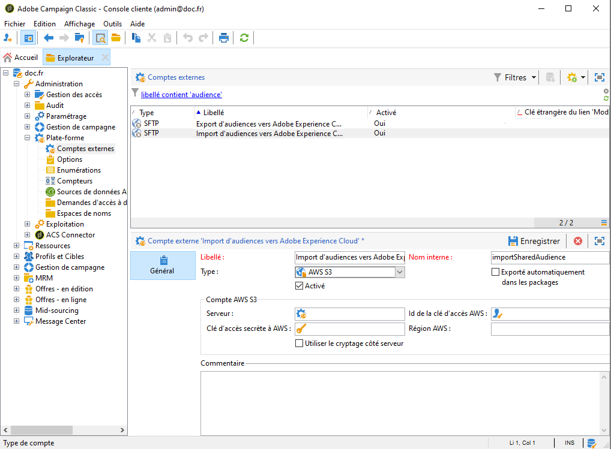

# Configuration de l&#39;intégration des audiences partagées dans Adobe Campaign{#configuring-shared-audiences-integration-in-adobe-campaign}

Après l&#39;envoi de cette demande, Adobe met en service l&#39;intégration et vous contacte pour vous fournir des informations afin de terminer la configuration :

1. [Étape 1 : Configuration ou vérification des comptes externes dans Adobe Campaign ](#step-1--configure-or-check-the-external-accounts-in-adobe-campaign)
1. [Etape 2 : configuration de la source de données](#step-2--configure-the-data-source)
1. [Étape 3 : Configuration du serveur de tracking Campaign ](#step-3--configure-campaign-tracking-server)
1. [Étape 4 : Configuration du service d&#39;identification des visiteurs](#step-4--configure-the-visitor-id-service)

>[!IMPORTANT]
>
>Si vous utilisez le domaine demdex et que vous suivez la syntaxe **ftp-out.demdex.com** pour le compte externe d’importation et **ftp-in.demdex.com** pour le compte externe d’exportation, vous devez adapter votre mise en oeuvre en conséquence et passer au connecteur Amazon Simple Enregistrement Service (S3) pour importer ou exporter des données. Pour plus d&#39;informations sur la configuration de vos comptes externes avec Amazon S3, consultez cette [section](../../integrations/using/configuring-shared-audiences-integration-in-adobe-campaign.md#step-1--configure-or-check-the-external-accounts-in-adobe-campaign).

## Étape 1 : Configuration ou vérification des comptes externes dans Adobe Campaign       {#step-1--configure-or-check-the-external-accounts-in-adobe-campaign}

Nous devons tout d&#39;abord configurer ou vérifier les comptes externes d&#39;Adobe Campaign en procédant comme suit :

1. Cliquez sur l&#39;icône **[!UICONTROL Explorateur]**.
1. Accédez à **[!UICONTROL Administration > Plate-forme > Comptes externes]**. Les comptes SFTP mentionnés doivent avoir été configurés par Adobe. De plus, les informations nécessaires ont dû vous être communiquées.

   * **[!UICONTROL importSharedAudience]**: compte dédié à l’importation d’audiences.
   * **[!UICONTROL exportSharedAudience]**: compte dédié à l’exportation d’audiences.

   

1. Sélectionnez les audiences **[!UICONTROL d’exportation vers le compte externe Adobe Marketing Cloud]** .

1. Dans la liste déroulante **[!UICONTROL Type]** , sélectionnez **[!UICONTROL AWS S3]**.

1. Indiquez les informations suivantes :

   * **[!UICONTROL L’]** URL du serveur de compte AWS S3 de votre serveur doit être renseignée comme suit :

      ```
      <S3bucket name>.s3.amazonaws.com/<s3object path>
      ```

   * **[!UICONTROL ID]** de clé d&#39;accès AWS Pour savoir où trouver votre ID de clé d&#39;accès AWS, consultez cette [page](https://docs.aws.amazon.com/general/latest/gr/aws-sec-cred-types.html#access-keys-and-secret-access-keys) .

   * **[!UICONTROL Clé d&#39;accès secrète à AWS]** Pour savoir où trouver votre clé d&#39;accès secret à AWS, consultez cette [page](https://aws.amazon.com/fr/blogs/security/wheres-my-secret-access-key/).

   * **[!UICONTROL Région]** AWS Pour en savoir plus sur la région AWS, consultez cette [page](https://aws.amazon.com/fr/about-aws/global-infrastructure/regions_az/).
   

1. Cliquez sur **[!UICONTROL Enregistrer]** et configurez les audiences **[!UICONTROL d’importation à partir du compte externe Adobe Marketing Cloud]** comme indiqué dans les étapes précédentes.

Vos comptes externes sont maintenant configurés.

## Etape 2 : configuration de la source de données {#step-2--configure-the-data-source}

La source de données **Destinataires - Id Visiteur** est créée dans Audience Manager. Il s&#39;agit d&#39;une source de données d&#39;usine configurée par défaut pour le Visitor ID. Les segments créés à partir de Campaign font partie de cette source de données.

Pour configurer la source de données **[!UICONTROL Destinataires - Id Visiteur]** :

1. Depuis le nœud **[!UICONTROL Explorateur]**, sélectionnez **[!UICONTROL Administration > Plate-forme > AMC Data sources]**.
1. Sélectionnez **[!UICONTROL Destinataire - Id Visiteur]**.
1. Saisissez le **[!UICONTROL Data Source ID]** et le **[!UICONTROL AAM Destination ID]** fournis par Adobe.

   

## Étape 3 : Configuration du serveur de tracking Campaign      {#step-3--configure-campaign-tracking-server}

Pour la configuration de l&#39;intégration avec People Core service ou Audience Manager, il faut également configurer le serveur de tracking Campaign.

Vérifiez que le serveur de tracking Campaign est enregistré sur le domaine (CNAME). Vous trouverez des informations supplémentaires sur la délégation des noms de domaine dans [cet article](https://helpx.adobe.com/fr/campaign/kb/domain-name-delegation.html).

## Étape 4 : Configuration du service d&#39;identification des visiteurs {#step-4--configure-the-visitor-id-service}

Si le service d&#39;identification des visiteurs (Visitor ID) n&#39;a jamais été configuré dans vos propriétés/sites web, reportez-vous à ce [document](https://docs.adobe.com/content/help/fr-FR/id-service/using/implementation/setup-aam-analytics.html) ou cette [vidéo](https://helpx.adobe.com/fr/marketing-cloud/how-to/email-marketing.html#step-two) pour découvrir comment configurer ce service .

La configuration et la mise en service sont terminées. L&#39;intégration peut être maintenant utilisée pour importer et exporter des audiences ou des segments.
