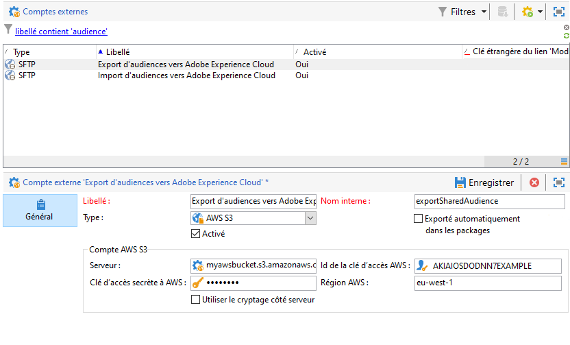

# Configuration de l&#39;intégration des audiences partagées dans Adobe Campaign{#configuring-shared-audiences-integration-in-adobe-campaign}

Après l&#39;envoi de cette demande, Adobe met en service l&#39;intégration et vous contacte pour vous fournir des informations afin de terminer la configuration :

1. [Étape 1 : Configuration ou vérification des comptes externes dans Adobe Campaign ](#step-1--configure-or-check-the-external-accounts-in-adobe-campaign)
1. [Etape 2 : configuration de la source de données](#step-2--configure-the-data-source)
1. [Étape 3 : Configuration du serveur de tracking Campaign ](#step-3--configure-campaign-tracking-server)
1. [Étape 4 : Configuration du service d&#39;identification des visiteurs](#step-4--configure-the-visitor-id-service)

## Étape 1 : Configuration ou vérification des comptes externes dans Adobe Campaign   {#step-1--configure-or-check-the-external-accounts-in-adobe-campaign}

Nous devons tout d&#39;abord configurer ou vérifier les comptes externes d&#39;Adobe Campaign en procédant comme suit :

1. Cliquez sur l&#39;icône **[!UICONTROL Explorateur]**.
1. Accédez à **[!UICONTROL Administration > Plate-forme > Comptes externes]**. Les comptes SFTP mentionnés doivent avoir été configurés par Adobe. De plus, les informations nécessaires ont dû vous être communiquées.

   * **[!UICONTROL importSharedAudience : compte SFTP dédié à l&#39;import d&#39;audiences.]**
   * **[!UICONTROL exportSharedAudience : compte SFTP dédié à l&#39;export d&#39;audiences.]**
   

1. Renseignez le champ **[!UICONTROL Serveur]** : utilisez le domaine **ftp-out.demdex.com** pour le compte externe d&#39;import et le domaine **ftp-in.demdex.com** pour celui d&#39;export.

   Souvenez-vous qu&#39;un export depuis Campaign est un import pour Audience Manager ou People core service.

   >[!NOTE]
   >
   >Si vous utilisez S3, saisissez votre serveur **[!UICONTROL de compte]** AWS S3 en respectant la syntaxe suivante :\
   `<S3bucket name>.s3.amazonaws.com/<s3object path>`\
   For more information on how to configure your S3 account, refer to this [page](../../platform/using/external-accounts.md#amazon-simple-storage-service--s3--external-account).

   

1. Indiquez le **[!UICONTROL Compte]** et le **[!UICONTROL Mot de passe]** fournis par Adobe.

Vos comptes externes sont maintenant configurés.

## Etape 2 : configuration de la source de données {#step-2--configure-the-data-source}

La source de données **Destinataires - Id Visiteur** est créée dans Audience Manager. Il s&#39;agit d&#39;une source de données d&#39;usine configurée par défaut pour le Visitor ID. Les segments créés à partir de Campaign font partie de cette source de données.

Pour configurer la source de données **[!UICONTROL Destinataires - Id Visiteur]** :

1. Depuis le nœud **[!UICONTROL Explorateur]**, sélectionnez **[!UICONTROL Administration > Plate-forme > AMC Data sources]**.
1. Sélectionnez **[!UICONTROL Destinataire - Id Visiteur]**.
1. Saisissez le **[!UICONTROL Data Source ID]** et le **[!UICONTROL AAM Destination ID]** fournis par Adobe.

   

## Étape 3 : Configuration du serveur de tracking Campaign   {#step-3--configure-campaign-tracking-server}

Pour la configuration de l&#39;intégration avec People Core service ou Audience Manager, il faut également configurer le serveur de tracking Campaign.

Vérifiez que le serveur de tracking Campaign est enregistré sur le domaine (CNAME). Vous trouverez des informations supplémentaires sur la délégation des noms de domaine dans [cet article](https://helpx.adobe.com/campaign/kb/domain-name-delegation.html).

## Étape 4 : Configuration du service d&#39;identification des visiteurs {#step-4--configure-the-visitor-id-service}

Si le service d&#39;identification des visiteurs (Visitor ID) n&#39;a jamais été configuré dans vos propriétés/sites web, reportez-vous à ce [document](https://marketing.adobe.com/resources/help/en_US/mcvid/mcvid-setup-aam-analytics.html) ou cette [vidéo](https://helpx.adobe.com/marketing-cloud/how-to/email-marketing.html#step-two) pour découvrir comment configurer ce service .

La configuration et la mise en service sont terminées. L&#39;intégration peut être maintenant utilisée pour importer et exporter des audiences ou des segments.
