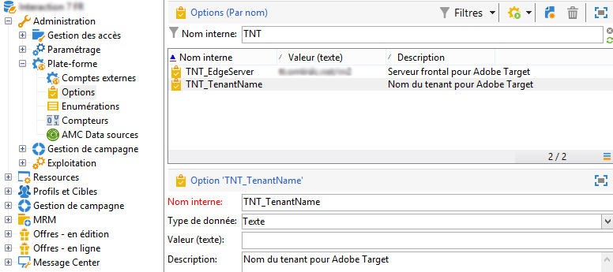

# Configuration de l’intégration à Adobe Target{#configuring-the-integration-with-adobe-target}

>[!CAUTION]
>
> Si vous êtes client hébergé ou hybride, contactez votre représentant Adobe pour configurer cette intégration. Les étapes ci-dessous s’appliquent uniquement aux clients on-premise.

Cette intégration requiert les éléments suivants :

* des organisations Adobe Experience Cloud et Adobe Target
* un &quot;rawbox&quot; Adobe Target défini afin d&#39;établir la connexion avec Adobe Campaign

Pour configurer cette intégration dans Adobe Campaign, procédez comme suit :

1. Installez le package intégré **[!UICONTROL Intégration à Adobe Experience Cloud]**. [En savoir plus](../../platform/using/working-with-data-packages.md#importing-packages)

   Ce package vous donne accès aux ressources partagées via le gestionnaire de ressources numériques.

1. Activez la connexion via IMS (service de connexion Adobe ID) pour utiliser des images partagées via Adobe Experience Cloud dans vos e-mails. [En savoir plus](../../integrations/using/about-adobe-id.md)
1. Accédez à **[!UICONTROL Administration > Plateforme > Options]** pour configurer les options de serveur et d’organisation (client) pour Adobe Target :

   

   * **[!UICONTROL TNT_EdgeServer]** : serveur Adobe Target utilisé pour l&#39;intégration. Cette option est déjà renseignée par défaut. Cette valeur correspond au **[!UICONTROL Server Domain]** Adobe Target, suivie de la valeur **/m2**. Par exemple : **tt.omtrdc.net/m2**.
   * **[!UICONTROL TNT_TenantName]** : nom de l&#39;organisation Adobe Target. Cette valeur correspond au nom du **[!UICONTROL Client]** Adobe Target.

>[!CAUTION]
>
>Pour les architectures hybrides et hébergées, ces options doivent être définies sur tous les serveurs, y compris le [serveur de midsourcing](../../installation/using/mid-sourcing-server.md) et l&#39;[instance d&#39;exécution](../../message-center/using/configuring-instances.md#execution-instance).